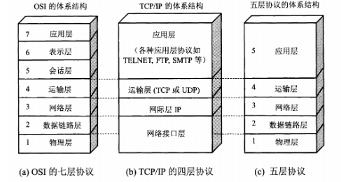

# 计算机网络

#### OSI，TCP/IP，五层协议的体系结构，以及各层协议

###### 每一层的协议如下：

> 物理层：RJ45、CLOCK、IEEE802.3 （中继器，集线器）
> 数据链路：PPP、FR、HDLC、VLAN、MAC （网桥，交换机）
> 网络层：IP、ICMP、IGMP、ARP、RARP、OSPF、IPX、RIP、IGRP、 （路由器）
> 传输层：TCP、UDP、SPX
> 会话层：NFS、SQL、NETBIOS、RPC
> 表示层：JPEG、MPEG、ASII
> 应用层：FTP、DNS、Telnet、SMTP、HTTP、WWW、NFS

###### 每一层的作用如下：

> 物理层：通过媒介传输比特,确定机械及电气规范（比特Bit）
> 数据链路层：将比特组装成帧和点到点的传递（帧Frame）
> 网络层：负责数据包从源到宿的传递和网际互连（包PackeT）
> 传输层：提供端到端的可靠报文传递和错误恢复（段Segment）
> 会话层：建立、管理和终止会话（会话协议数据单元SPDU）
> 表示层：对数据进行翻译、加密和压缩（表示协议数据单元PPDU）
> 应用层：允许访问OSI环境的手段（应用协议数据单元APDU）

#### TCP三次握手和四次挥手的全过程

###### **三次握手：**

> ​	第一次握手：客户端发送syn包(syn=x)到服务器，并进入SYN_SEND状态，等待服务器确认；
> ​	第二次握手：服务器收到syn包，必须确认客户的SYN（ack=x+1），同时自己也发送一个SYN包（syn=y），即SYN+ACK包，此时服务器进入SYN_RECV状态；
> ​	第三次握手：客户端收到服务器的SYN＋ACK包，向服务器发送确认包ACK(ack=y+1)，此包发送完毕，客户端和服务器进入ESTABLISHED状态，完成三次握手。
> 握手过程中传送的**包里不包含数据**，三次握手完毕后，客户端与服务器才正式开始传送数据。理想状态下，TCP连接一旦建立，在通信双方中的任何一方主动关闭连接之前，TCP 连接都将被一直保持下去。

###### **四次挥手**：

> 与建立连接的“三次握手”类似，断开一个TCP连接则需要“四次握手”。
> 	第一次挥手：主动关闭方发送一个FIN，用来关闭主动方到被动关闭方的数据传送，也就是主动关闭方告诉被动关闭方：我已经不 会再给你发数据了(当然，在fin包之前发送出去的数据，如果没有收到对应的ack确认报文，主动关闭方依然会重发这些数据)，但是，此时主动关闭方还可 以接受数据。
> 	第二次挥手：被动关闭方收到FIN包后，发送一个ACK给对方，确认序号为收到序号+1（与SYN相同，一个FIN占用一个序号）。
> 	第三次挥手：被动关闭方发送一个FIN，用来关闭被动关闭方到主动关闭方的数据传送，也就是告诉主动关闭方，我的数据也发送完了，不会再给你发数据了。
> 第四次挥手：主动关闭方收到FIN后，发送一个ACK给被动关闭方，确认序号为收到序号+1，至此，完成四次挥手。

###### **总结：**

> **三次握手：**客户端发送请求等待服务器端确认；服务器端收到请求同时发送请求给客户端，等待客户端回应；客户端收到服务器端的请求，向服务器端发送确认包，发送完毕，客户端和服务器端进入ESTABLISHED状态

#### TCP的三次握手过程？为什么会采用三次握手，若采用二次握手可以吗？

> ​	TCP的三次握手过程：主机A向B发送连接请求；主机B对收到的主机A的报文段进行确认；主机A再次对主机B的确认进行确认。
>
> ​	采用三次握手是为了防止失效的连接请求报文段突然又传送到主机B，因而产生错误。失效的连接请求报文段是指：主机A发出的连接请求没有收到主机B的确认，于是经过一段时间后，主机A又重新向主机B发送连接请求，且建立成功，顺序完成数据传输。考虑这样一种特殊情况，主机A第一次发送的连接请求并没有丢失，而是因为网络节点导致延迟达到主机B，主机B以为是主机A又发起的新连接，于是主机B同意连接，并向主机A发回确认，但是此时主机A根本不会理会，主机B就一直在等待主机A发送数据，导致主机B的资源浪费。
> 采用两次握手不行，原因就是上面说的失效的连接请求的特殊情况。

#### DNS域名系统，简单描述其工作原理。

​	当DNS客户机需要在程序中使用名称时，它会查询DNS服务器来解析该名称。客户机发送的每条查询信息包括三条信息：包括：指定的DNS域名，指定的查询类型，DNS域名的指定类别。基于**UDP服务**，**端口53**. 该应用一般不直接为用户使用，而是为其他应用服务，如HTTP，SMTP等在其中需要完成主机名到IP地址的转换。

#### http和https的区别

> HTTP：超文本传输协议、明文、80端口、不安全
>
> HTTPS：ca证书、ssl加密传输、443端口、安全、HTTPS连接缓存不如HTTP高效

#### HTTP的基本优化

​	带宽、延迟（浏览器阻塞、DNS查询、建立连接）

#### HTTP1.0和HTTP1.1的一些区别

​	缓存处理、带宽优化及网络连接的使用、错误通知的管理、host头处理、长连接

#### SPDY：HTTP1.x的优化

​	降低延迟、请求优先级、header压缩、基于https的加密协议传输、服务器推送

#### HTTP2.0和HTTP1.X相比

​	新的二进制格式、多路复用、header压缩、服务器推送

#### http请求方法有哪些？

- GET
- POST
- HEAD
- PUT
- DELETE
- ...

#### GET和POST的区别

> GET参数通过URL传递，POST放在Request body中。
>
> GET在浏览器回退时是无害的，而POST会再次提交请求。
>
> GET产生的URL地址可以被Bookmark，而POST不可以。
>
> GET请求会被浏览器主动cache，而POST不会，除非手动设置。
>
> GET请求只能进行url编码，而POST支持多种编码方式。
>
> GET请求参数会被完整保留在浏览器历史记录里，而POST中的参数不会被保留。
>
> GET请求在URL中传送的参数是有长度限制的，而POST没有。
>
> 对参数的数据类型，GET只接受ASCII字符，而POST没有限制。
>
> GET比POST更不安全，因为参数直接暴露在URL上，所以不能用来传递敏感信息。
>
> GET产生一个TCP数据包；POST产生两个TCP数据包。

#### XSS（跨站脚本）攻击

​	发生在目标用户的浏览器层面上的，当渲染DOM树的过程成发生了不在预期内执行的JS代码时，就发生了XSS攻击。大多数XSS攻击的主要方式是嵌入一段远程或者第三方域上的JS代码

- 一旦在DOM解析过程成出现不在预期内的改变（JS代码执行或样式大量变化时），就可能发生XSS攻击
- XSS分为反射型XSS，存储型XSS和DOM XSS
- 反射型XSS是在将XSS代码放在URL中，将参数提交到服务器。服务器解析后响应，在响应结果中存在XSS代码，最终通过浏览器解析执行。
- 存储型XSS是将XSS代码存储到服务端（数据库、内存、文件系统等），在下次请求同一个页面时就不需要带上XSS代码了，而是从服务器读取。
- DOM XSS的发生主要是在JS中使用eval造成的，所以应当避免使用eval语句。
- XSS危害有盗取用户cookie，通过JS或CSS改变样式，DDos造成正常用户无法得到服务器响应。
- XSS代码的预防主要通过对数据解码，再过滤掉危险标签、属性和事件等。

