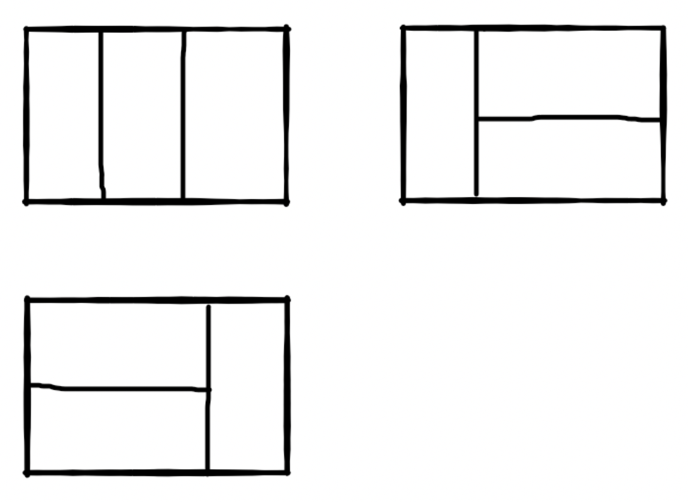

## 算法笔记-剑指offer

#### 1.构建乘积数组

##### 题目描述

给定一个数组A[0,1,...,n-1],请构建一个数组B[0,1,...,n-1],其中B中的元素B[i]=A[0]*A[1]*...*A[i-1]*A[i+1]*...*A[n-1]。不能使用除法。（注意：规定B[0] = A[1] * A[2] * ... * A[n-1]，B[n-1] = A[0] * A[1] * ... * A[n-2];）

##### 代码实现

```php
<?php

function multiply($numbers)
{
    $count = count($numbers);
    $arr = array();
    for ($i = 0; $i < $count; $i++) {
        $temp = 1;
        for ($j = 0; $j < $count; $j++) {
            if ($i != $j) {
                $temp *= $numbers[$j]; 
            }
        }
        $arr[$i] = $temp;
    }
    return $arr;
}
```

#### 2.不用加减乘除做加法

##### 题目描述

写一个函数，求两个整数之和，要求在函数体内不得使用+、-、*、/四则运算符号。

##### 代码实现1

```php
<?php
function Add($num1, $num2)
{
    return array_sum(array(num1, num2));
}
```

##### 代码实现2

```php
<?php

function Add($num1, $num2)
{
    if($num1 == 0) return $num2;
    if($num2 == 0) return $num1;
    return Add($num1 ^ $num2, ($num1 & $num2) << 1);
}
```

##### 思路

转化成二进制进行计算，演示相关过程如下：

```
num1=2,num2=3
---
第一次：
2^3 : 0000 0010 ^ 0000 0011 = 0000 0001 = 1
2&3 : 0000 0010 & 0000 0011 = 0000 0010 = 2
2<<1: 0000 0010 << 1 = 0000 0100 = 4
第二次：
1和4进入
1^4 : 0000 0001 ^ 0000 0100 = 0000 0101 = 5
1&4 : 0000 0001 & 0000 0100 = 0000 0000 = 0
0<<1: 0000 0000 << 1 = 0000 0000 = 0
第三次：
5和0进入
返回5
```

###### 位运算符

| 例子           | 名称                | 结果                                                     |
| :------------- | :------------------ | :------------------------------------------------------- |
| **`$a & $b`**  | And（按位与）       | 将把 $a 和 $b 中都为 1 的位设为 1。                      |
| **`$a | $b`**  | Or（按位或）        | 将把 $a 和 $b 中任何一个为 1 的位设为 1。                |
| **`$a ^ $b`**  | Xor（按位异或）     | 将把 $a 和 $b 中一个为 1 另一个为 0 的位设为 1。         |
| **`~ $a`**     | Not（按位取反）     | 将 $a 中为 0 的位设为 1，反之亦然。                      |
| **`$a << $b`** | Shift left（左移）  | 将 $a 中的位向左移动 $b 次（每一次移动都表示“乘以 2”）。 |
| **`$a >> $b`** | Shift right（右移） | 将 $a 中的位向右移动 $b 次（每一次移动都表示“除以 2”）。 |

#### 3.二叉树的深度

##### 题目描述

输入一棵二叉树，求该树的深度。从根结点到叶结点依次经过的结点（含根、叶结点）形成树的一条路径，最长路径的长度为树的深度。

##### 代码实现

```php
<?php

/*class TreeNode{
    var $val;
    var $left = NULL;
    var $right = NULL;
    function __construct($val){
        $this->val = $val;
    }
}*/
function TreeDepth($pRoot)
{
    if($pRoot == null) return 0;
    $left = TreeDepth($pRoot->left);
    $right = TreeDepth($pRoot->right);
    return $left > $right ? $left + 1 : $right +1;
}
```

#### 4.二叉树的镜像

##### 题目描述

操作给定的二叉树，将其变换为源二叉树的镜像。

##### 输入描述

```
二叉树的镜像定义：源二叉树 
    	    8
    	   /  \
    	  6   10
    	 / \  / \
    	5  7 9 11
    	镜像二叉树
    	    8
    	   /  \
    	  10   6
    	 / \  / \
    	11 9 7  5
```

##### 代码实现

```php
<?php

/*class TreeNode{
    var $val;
    var $left = NULL;
    var $right = NULL;
    function __construct($val){
        $this->val = $val;
    }
}*/
function Mirror(&$root)
{
    if(!$root)return;
    $temp1 = $temp2 = NULL;
    if($root->left){
        $temp1 = Mirror($root->left);
    }
    if($root->right){
        $temp2 = Mirror($root->right);
    }
    $root->left = $temp2;
    $root->right = $temp1;
    return $root;
}
```

#### 5.变态跳台阶

##### 题目描述

一只青蛙一次可以跳上1级台阶，也可以跳上2级……它也可以跳上n级。求该青蛙跳上一个n级的台阶总共有多少种跳法。

##### 代码实现

```php
<?php

function jumpFloorII($number)
{
    if($number == 1) return 1;
    return pow(2,($number - 1));
}
```

#### 6.用两个栈实现队列

##### 题目描述

用两个栈来实现一个队列，完成队列的Push和Pop操作。 队列中的元素为int类型。

##### 代码实现

```php
<?php

$queue = array();
function mypush($node)
{
    global $queue;
    return array_push($queue,$node);
}
function mypop()
{
    global $queue;
    return array_shift($queue);
}
```

#### 7.旋转数组的最小数字

##### 题目描述

把一个数组最开始的若干个元素搬到数组的末尾，我们称之为数组的旋转。
输入一个非递减排序的数组的一个旋转，输出旋转数组的最小元素。
例如数组[3,4,5,1,2]为[1,2,3,4,5]的一个旋转，该数组的最小值为1。
NOTE：给出的所有元素都大于0，若数组大小为0，请返回0。

##### 代码实现

示例1：

```php
function minNumberInRotateArray($rotateArray)
{
    if(empty($rotateArray)) return 0;
    return min($rotateArray);
}
```

示例2：二分法

```php
function minNumberInRotateArray($rotateArray)
{
	$count = count($rotateArray);
    if($count == 0) return 0;
    if ($count == 1) return $rotateArray[0];
    $left = 0;
    $right = count($rotateArray) - 1;
    while ($rotateArray[$left] >= $rotateArray[$right]) {
    	if ($right - $left == 1) {
    		$mid = $right;
    		break;
    	}
    	$mid = floor(($left + $right) / 2);
    	if ($rotateArray[$mid] > $rotateArray[$right]) {
    		$left = $mid;
    	} elseif ($rotateArray[$mid] == $rotateArray[$right]) {
    		--$right;
    	} else {
    		$right = $mid;
    	}
    }
    return $rotateArray[$mid];
}
```

#### 8.斐波那契数列

##### 题目描述

大家都知道斐波那契数列，现在要求输入一个整数n，请你输出斐波那契数列的第n项（从0开始，第0项为0，第1项是1）。

n<=39

##### 代码实现

示例1：

```php
function Fibonacci($n)
{
    if ($n == 0 || $n == 1) return $n;
    $pre = 0;
    $next = 1;
    $res = 0;
    for ($i = 2; $i <= $n; $i++) {
        $res = $pre + $next;
        $pre = $next;
        $next = $res;
    }
    return $res;
}
```

示例2：递归

```php
<?php

function Fibonacci($n)
{
    if ($n == 0 || $n == 1) return $n;
    return Fibonacci($n - 1) + Fibonacci($n + 1);
}
```

##### 思路

指的是这样一个数列：0、1、1、2、3、5、8、13、21、34、……在数学上，斐波那契数列以如下被以递推的方法定义：*F*(0)=0，*F*(1)=1, *F*(n)=*F*(n - 1)+*F*(n - 2)（*n* ≥ 3，*n* ∈ N*）

#### 9.求1+2+3+...+n

##### 题目描述

求1+2+3+...+n，要求不能使用乘除法、for、while、if、else、switch、case等关键字及条件判断语句（A?B:C）。

##### 代码实现

```php
function Sum_Solution($n)
{
    $n > 1 && $n += Sum_Solution($n-1);
    return $n;
}
```

##### 思路

由题可知：sum=n(n+1)/2，由于不能使用循环和乘除，所以使用递归实现

#### 10.跳台阶

##### 题目描述

一只青蛙一次可以跳上1级台阶，也可以跳上2级。求该青蛙跳上一个n级的台阶总共有多少种跳法（先后次序不同算不同的结果）

##### 代码实现

示例1（递归）：

```php
function jumpFloor($number)
{
    if ($number === 1 || $number === 2) return $number;
    $sum = jumpFloor($number - 1) + jumpFloor($number - 2);
    return $sum;
}
```

示例2：

```php
function jumpFloor($number)
{
    if ($number === 1 || $number === 2) return $number;
    $pre = 1;
    $next = 2;
    for ($i = 3; $i <= $number; $i++) {
    	$sum = $pre + $next;
    	$pre = $next;
    	$next = $sum;
    }
    return $sum;
}
```

##### 思路

由题意可知此题和斐波那契数列解法相同

#### 11.矩形覆盖

##### 题目描述

我们可以用2 * 1的小矩形横着或者竖着去覆盖更大的矩形。请问用n个2 * 1的小矩形无重叠地覆盖一个2 * n的大矩形，总共有多少种方法？

比如n=3时，2 * 3的矩形块有3种覆盖方法：



##### 代码实现

示例1（递归）：

```php
function rectCover($number)
{
    if ($number === 0 || $number === 1 || $number === 2) return $number;
    $sum = jumpFloor($number - 1) + jumpFloor($number - 2);
    return $sum;
}
```

示例2：

```php
function rectCover($number)
{
    if ($number === 0 || $number === 1 || $number === 2) return $number;
    $pre = 1;
    $next = 2;
    for ($i = 3; $i <= $number; $i++) {
    	$sum = $pre + $next;
    	$pre = $next;
    	$next = $sum;
    }
    return $sum;
}
```

##### 思路

> n：	 1	2	3	4
>
> 方法：1	2	3	5

可以发现此题也是斐波那契数列的解法

#### 12.二进制中1的个数

##### 题目描述

输入一个整数，输出该数32位二进制表示中1的个数。其中负数用补码表示。

##### 代码实现

示例1：

```javascript
function NumberOf1(n)
{
    let flag = 1;
    let count = 0;
    while(flag){
        if (flag & n) {
            count++;
        }
        flag <<= 1;
    }
    return count
}
```

示例2：

```php
<?php

function NumberOf1($n)
{
    $count = 0;
  	// 如果n小于0，php、python等需要做特殊处理
    if ($n < 0) {
        $n = $n & 0xffffffff;
    }
    while ($n != 0) {
        $count++;
        $n = $n & ($n - 1);
    }
    return $count;
}
```

```javascript
function NumberOf1(n)
{
    let count = 0;
    while (n != 0) {
        count++;
        n = n & (n-1);
    }
    return count;
}
```

##### 思路

如果一个整数不为0，那么这个整数至少有一位是1。如果我们把这个整数减1，那么原来处在整数最右边的1就会变为0，原来在1后面的所有的0都会变成1(如果最右边的1后面还有0的话)。其余所有位将不会受到影响。
如：一个二进制数1100，从右边数起第三位是处于最右边的一个1。减去1后，第三位变成0，它后面的两位0变成了1，而前面的1保持不变，因此得到的结果是1011.我们发现减1的结果是把最右边的一个1开始的所有位都取反了。这个时候如果我们再把原来的整数和减去1之后的结果做`按位与`运算，从原来整数最右边一个1那一位开始所有位都会变成0。如1100&1011=1000.也就是说，把一个整数减去1，再和原整数做`按位与`运算，会把该整数最右边一个1变成0.那么一个整数的二进制有多少个1，就可以进行多少次这样的操作。

##### 知识点

进制转化

```
你以十进制的数除以你所要转换的进制数,把每次除得的余数记在旁边,所得的商数继续除以进制数,直到余数为0时止.
十进制转八进制：
100/8=12...(余数为4); 
12/8=1.....(余数为4); 
1/8=0......(余数为1); 
结果：144
十进制转十六进制: 
100/16=6....(余数为4); 
6/16=0......(余数为6); 
结果：64; 
十进制转二进制: 
100/2=50....(余数为0); 
50/2=25.....(余数为0); 
25/2=12.....(余数为1); 
12/2=6......(余数为0); 
6/2=3.......(余数为0); 
3/2=1.......(余数为1); 
1/2=0.......(余数为1); 
结果：1100100; 
```

位运算符知识

[计算机组成原理](计算机组成原理.md)

#### 13.数值的整数次方

##### 题目描述

给定一个double类型的浮点数base和int类型的整数exponent。求base的exponent次方。

保证base和exponent不同时为0

##### 代码实现

```php
function Power($base, $exponent)
{
    if ($exponent == 0) return 1;
    if ($base == 0) return 0;
    return pow($base, $exponent);
}
```

#### 14.左旋转字符串

##### 题目描述

汇编语言中有一种移位指令叫做循环左移（ROL），现在有个简单的任务，就是用字符串模拟这个指令的运算结果。对于一个给定的字符序列S，请你把其循环左移K位后的序列输出。例如，字符序列S=”abcXYZdef”,要求输出循环左移3位后的结果，即“XYZdefabc”。是不是很简单？OK，搞定它！

##### 代码实现

```php
// php
function LeftRotateString($str, $n)
{
    if(strlen($str) == 0) return $str;
    $str1 = substr($str,0,$n);
    $str2 = substr($str,$n);
    return $str2.$str1;
}
```

```javascript
// js
function LeftRotateString(str, n)
{
    if(!str || str.length === 0) return '';
    let num = n % str.length;
    return str.substr(num) + str.substr(0,num);
}
```

#### 15.反转链表

##### 题目描述

输入一个链表，反转链表后，输出新链表的表头。

##### 代码实现

```php
<?php
/*class ListNode{
    var $val;
    var $next = NULL;
    function __construct($x){
        $this->val = $x;
    }
}*/
function ReverseList($pHead)
{
    $head = null;
    while ($pHead) {
        $tmp = $pHead->next;
        $pHead->next = $head;
        $head = $pHead;
        $pHead = $tmp;
    }
    return $head;
}
```

#### 16.平衡二叉树

##### 题目描述

输入一棵二叉树，判断该二叉树是否是平衡二叉树。

在这里，我们只需要考虑其平衡性，不需要考虑其是不是排序二叉树

**平衡二叉树**（Balanced Binary Tree），具有以下性质：它是一棵空树或它的左右两个子树的高度差的绝对值不超过1，并且左右两个子树都是一棵平衡二叉树。

**示例1**

输入

```
{1,2,3,4,5,6,7}
```

返回值

```
true
```

##### 代码实现

```php

```

#### 重建二叉树

##### 题目描述

输入某二叉树的前序遍历和中序遍历的结果，请重建出该二叉树。假设输入的前序遍历和中序遍历的结果中都不含重复的数字。例如输入前序遍历序列{1,2,4,7,3,5,6,8}和中序遍历序列{4,7,2,1,5,3,8,6}，则重建二叉树并返回。

##### 代码实现

```php

```

##### 思路

二叉树的三种遍历方式

- **先序：**考察到一个节点后，即刻输出该节点的值，并继续遍历其左右子树。(根左右)
- **中序：**考察到一个节点后，将其暂存，遍历完左子树后，再输出该节点的值，然后遍历右子树。(左根右)
- **后序：**考察到一个节点后，将其暂存，遍历完左右子树后，再输出该节点的值。(左右根)

#### 1.二维数组中的查找

**题目描述**

在一个二维数组中（每个一维数组的长度相同），每一行都按照从左到右递增的顺序排序，每一列都按照从上到下递增的顺序排序。请完成一个函数，输入这样的一个二维数组和一个整数，判断数组中是否含有该整数。

**代码实现**

```php
<?php
function Find($target, $array)
{
    foreach($array as $key => $val){
        if(in_array($target, $val)){
            return "true";
        }
    }
    return "false";
}
while(fscanf(STDIN,"%d,%s",$target,$arr) == 2){
    eval('$array='.$arr.';');
    echo Find($target,$array)."\n";
}
```

#### 2.替换空格

**题目描述**

> 请实现一个函数，将一个字符串中的每个空格替换成“%20”。例如，当字符串为We Are Happy.则经过替换之后的字符串为We%20Are%20Happy

**代码实现**

```php
<?php
function replaceSpace($str)
{
    return str_replace(" ", "%20", $str);
}
```

#### 3.从头到尾打印链表

**题目描述**

> 输入一个链表，按链表从尾到头的顺序返回一个ArrayList。

**代码实现**

php版

```php
<?php

/*class ListNode{
    var $val;
    var $next = NULL;
    function __construct($x){
        $this->val = $x;
    }
}*/
function printListFromTailToHead($head)
{
    $arr = [];
    $current = $head;
    while($current !== null){
        $arr[] = $current->val;
        $current = $current->next;
    }
    return array_reverse($arr);
}
```

python版

```python
# -*- coding:utf-8 -*-
# class ListNode:
#     def __init__(self, x):
#         self.val = x
#         self.next = None

class Solution:
    # 返回从尾部到头部的列表值序列，例如[1,2,3]
    def printListFromTailToHead(self, listNode):
        list = []
        head = listNode
        while head:
            list.insert(0, head.val)
            head = head.next
        return list
```

