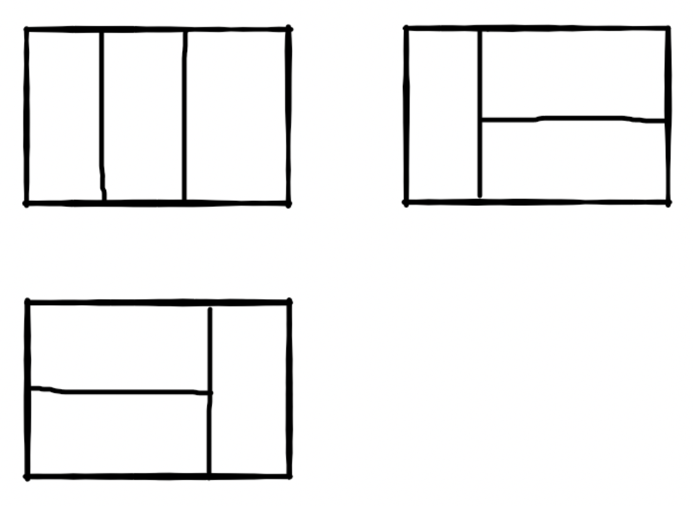

# 算法 - 剑指offer

## 数据结构

### 链表

#### [简单] 从尾到头打印链表

##### 描述

输入一个链表的头节点，按链表从尾到头的顺序返回每个节点的值（用数组返回）。

如输入{1,2,3}的链表如下图:


返回一个数组为 [3,2,1]

0 <= 链表长度 <= 1000

##### 示例

输入：

```
// 输入
{1,2,3}
//返回值
[3,2,1]

// 输入
{67,0,24,58}
// 返回
[58,24,0,67]
```

##### 解题思路

先遍历链表一次存入数组中，再倒序处理数组

##### 代码实现

```go
// 定义节点
type ListNode struct {
	Val int
	Next *ListNode
}

/**
 * 从尾到头打印链表
 *
 * @param head ListNode类
 * @return int整型一维数组
 */
func printListFromTailToHead(head *ListNode) []int {
	ret := make([]int, 0)
	
	// 遍历链表
	tmp := make([]int, 0)
	for head != nil {
		tmp = append(tmp, head.Val)
		head = head.Next
	}

	// 遍历数组，倒序处理
	tmpLen := len(tmp) - 1
	for tmpLen >= 0 {
		ret = append(ret, tmp[tmpLen])
		tmpLen--
	}

	return ret
}
```

#### [简单] 链表中倒数最后k个结点

##### 描述

输入一个链表，输出一个链表，该输出链表包含原链表中从倒数第k个结点至尾节点的全部节点。

如果该链表长度小于k，请返回一个长度为 0 的链表。

##### 示例

```go
// 输入
{1,2,3,4,5}, 1 

// 返回
{5} 
```

##### 代码实现

**方法一：**

1. 先遍历统计链表长度，记为 n；
2. 设置一个指针走 (n-k) 步，即可找到链表倒数第 k个节点。

```go
/**
 * 链表中倒数最后k个结点
 *
 * @param pHead ListNode类
 * @param k int整型
 * @return ListNode类
 */
func FindKthToTail(pHead *ListNode,  k int) *ListNode {
	current, res := pHead, pHead
    n := 0
    for current != nil {
			current = current.Next
			n++
		}
    if (k > n) {
        return nil
    }
		// current 指针先走 k 步
    for i := 1; i <= (n - k); i++ {
			res = res.Next
		}
		return res
}
```

**方法二（快慢指针）：**

初始化： 当前指针 current 、后指针 prev ，双指针都指向头节点 head 
构建双指针距离： current 指针先向前走 k 步（结束后，双指针 current 和 prev 间相距 k 步）
双指针共同移动： 循环中，current 和 prev 每轮都向前走一步，直至 current 走过链表 尾节点 时跳出（跳出后， prev 与尾节点距离为 k-1，即 prev 指向倒数第 k 个节点）。
返回值： 返回 prev 即可。

```go
/**
 * 链表中倒数最后k个结点
 *
 * @param pHead ListNode类
 * @param k int整型
 * @return ListNode类
 */
func FindKthToTail(pHead *ListNode,  k int) *ListNode {
	// 边界值
	if pHead == nil || k <= 0 {
		return nil
	}

	current, prev := pHead, pHead

	// current 指针先走 k 步
	for i := 0; i < k; i++ {
		if current == nil {
			return nil
		}
		current = current.Next
	}

	// 双指针每轮都向前走一步，直至 current 走过链表 尾节点 时跳出
	// 跳出后，prev 与尾节点距离为 k-1，即 prev 指向倒数第 k 个节点
	for current != nil {
		current = current.Next
		prev = prev.Next
	}
	return prev
}
```

#### [简单] 合并两个排序的链表

##### 描述

输入两个单调递增的链表，输出两个链表合成后的链表，当然我们需要合成后的链表满足单调不减规则。

##### 示例

```
// 输入
{1,3,5},{2,4,6}
// 返回值
{1,2,3,4,5,6}
```

##### 代码实现

**方法一（递归）：**

```go
/**
 * 合并两个排序的链表（递归）
 *
 * @param pHead1 ListNode类
 * @param pHead2 ListNode类
 * @return ListNode类
 */
func Merge(pHead1 *ListNode , pHead2 *ListNode) *ListNode {
	if pHead1 == nil {
		return pHead2
	}
	if pHead2 == nil {
		return pHead1
	}

	if pHead1.Val <= pHead2.Val {
		pHead1.Next = Merge(pHead1.Next, pHead2)
		return pHead1
	}
	if pHead1.Val > pHead2.Val {
		pHead2.Next = Merge(pHead1, pHead2.Next)
		return pHead2
	}
	return nil
}
```

时间复杂度：O(m+n)
空间复杂度：O(m+n),每一次递归，递归栈都会保存一个变量，最差情况会保存(m+n)个变量

**方法二（递归）：**

```go
/**
 * 合并两个排序的链表（递归）
 *
 * @param pHead1 ListNode类
 * @param pHead2 ListNode类
 * @return ListNode类
 */
func Merge(pHead1 *ListNode , pHead2 *ListNode) *ListNode {
	// 初始化
    ret := &ListNode{}
	current := ret
    
    // 遍历链表，比较大小
	for pHead1 != nil && pHead2 != nil {
		if pHead1.Val <= pHead2.Val {
			current.Next = pHead1
			pHead1 = pHead1.Next
		} else {
			current.Next = pHead2
			pHead2 = pHead2.Next
		}
		current = current.Next
	}
    
    // 尾节点
	if pHead1 != nil {
		current.Next = pHead1
	}
	if pHead2 != nil {
		current.Next = pHead2
	}
	return ret.Next
}
```

时间复杂度：O(m+n),m，n分别为两个单链表的长度
空间复杂度：O(1)

####  [简单] 两个链表的第一个公共结点

##### 描述

输入两个无环的单链表，找出它们的第一个公共结点。（注意因为传入数据是链表，所以错误测试数据的提示是用其他方式显示的，保证传入数据是正确的）

##### 示例1

```
// 输入
{1,2,3},{4,5},{6,7}
// 返回值
{6,7}
```

说明：

```
第一个参数{1,2,3}代表是第一个链表非公共部分，第二个参数{4,5}代表是第二个链表非公共部分，最后的{6,7}表示的是2个链表的公共部分
这3个参数最后在后台会组装成为2个两个无环的单链表，且是有公共节点的     
```

##### 示例2

```
// 输入
{1},{2,3},{}
// 返回值
{}
```

说明：

```
2个链表没有公共节点 ,返回null，后台打印{}  
```

##### 解题思路

由题意可知，我们要找的公共节点就是如下图所示的 8


可以利用双指针法，设 A 链表长度为 a，B链表长度为 b，则得：`a+b=b+a`，所以将`a+b`作为 A 链表的新长度，`b+a`作为 B 链表的新长度

##### 代码实现

```go
type ListNode struct{
    Val int
    Next *ListNode
}

/**
 * 两个链表的第一个公共节点
 *
 * @param pHead1 ListNode类
 * @param pHead2 ListNode类
 * @return ListNode类
 */
func FindFirstCommonNode(pHead1 *ListNode,  pHead2 *ListNode) *ListNode {
	p1, p2 := pHead1, pHead2
	for p1 != p2 {
		if p1 == nil {
			p1 = pHead2
		} else {
			p1 = p1.Next
		}
		if p2 == nil {
			p2 = pHead1
		} else {
			p2 = p2.Next
		}
	}
    // return p1 或 p2
	return p1
}
```

时间复杂度：O(m+n)
空间复杂度：O(1)

#### [简单]反转链表

##### 题目描述

输入一个链表，反转链表后，输出新链表的表头。

##### 代码实现

```php
<?php
/*class ListNode{
    var $val;
    var $next = NULL;
    function __construct($x){
        $this->val = $x;
    }
}*/
function ReverseList($pHead)
{
    $head = null;
    while ($pHead) {
        $tmp = $pHead->next;
        $pHead->next = $head;
        $head = $pHead;
        $pHead = $tmp;
    }
    return $head;
}
```

### 树

#### [简单]二叉树的深度

##### 描述

输入一棵二叉树，求该树的深度。从根结点到叶结点依次经过的结点（含根、叶结点）形成树的一条路径，最长路径的长度为树的深度。

##### 示例

```
// 输入
{1,2,3,4,5,#,6,#,#,7}
// 返回值：
4
```

##### 代码实现

PHP

```php
<?php

/*class TreeNode{
    var $val;
    var $left = NULL;
    var $right = NULL;
    function __construct($val){
        $this->val = $val;
    }
}*/
function TreeDepth($pRoot)
{
    if($pRoot == null) return 0;
    $left = TreeDepth($pRoot->left);
    $right = TreeDepth($pRoot->right);
    return $left > $right ? $left + 1 : $right +1;
}
```

Golang

```go
type TreeNode struct {
    Val int
    Left *TreeNode
    Right *TreeNode
}

/**
 * 二叉树的深度
 * 
 * @param pRoot TreeNode 类 
 * @return int 整型
*/
func TreeDepth( pRoot *TreeNode ) int {
    if (pRoot == nil) {
        return 0
    }

    left,right := 0,0
    left = TreeDepth(pRoot.Left)
    right = TreeDepth(pRoot.Right)
    
    depth := left
    if (right > left) {
        depth = right
    }
    return depth + 1
}
```

#### [简单] 二叉树的镜像

##### 描述

操作给定的二叉树，将其变换为源二叉树的镜像。

```
比如：    源二叉树 
            8
           /  \
          6   10
         / \  / \
        5  7 9 11
        镜像二叉树
            8
           /  \
          10   6
         / \  / \
        11 9 7  5
```

##### 示例

```
// 输入
{8,6,10,5,7,9,11}
// 返回
{8,10,6,11,9,7,5}
```

##### 代码实现

PHP

```php
<?php

/*class TreeNode{
    var $val;
    var $left = NULL;
    var $right = NULL;
    function __construct($val){
        $this->val = $val;
    }
}*/
function Mirror(&$root)
{
    if(!$root)return;
    $temp1 = $temp2 = NULL;
    if($root->left){
        $temp1 = Mirror($root->left);
    }
    if($root->right){
        $temp2 = Mirror($root->right);
    }
    $root->left = $temp2;
    $root->right = $temp1;
    return $root;
}
```

#### [中等]按之字形顺序打印二叉树

##### 描述

给定一个二叉树，返回该二叉树的之字形层序遍历，（第一层从左向右，下一层从右向左，一直这样交替）

数据范围：,树上每个节点的 val 满足 
要求：空间复杂度：%20%20%5C)，时间复杂度：%20%5C)

例如：
给定的二叉树是{1,2,3,#,#,4,5}


该二叉树之字形层序遍历的结果是

```
[
[1],
[3,2],
[4,5]
]
```

##### 示例

```
// 输入1
{1,2,3,#,#,4,5}
// 返回值1
[[1],[3,2],[4,5]]

// 输入2
{8,6,10,5,7,9,11}
// 返回值2
[[8],[10,6],[5,7,9,11]]

// 输入3
{1,2,3,4,5}
// 返回值3
[[1],[3,2],[4,5]]
```

##### 代码实现

```go

```

### 队列 & 栈

#### [简单]用两个栈实现队列

##### 题目描述

用两个栈来实现一个队列，使用n个元素来完成 n 次在队列尾部插入整数(push)和n次在队列头部删除整数(pop)的功能。 队列中的元素为int类型。保证操作合法，即保证pop操作时队列内已有元素。

数据范围： n\le1000*n*≤1000

要求：存储n个元素的空间复杂度为 O(n)*O*(*n*) ，插入与删除的时间复杂度都是 O(1)*O*(1)

##### 示例1

输入：

```
// 输入
["PSH1","PSH2","POP","POP"]

// 返回值
1,2

// 说明
"PSH1":代表将1插入队列尾部
"PSH2":代表将2插入队列尾部
"POP“:代表删除一个元素，先进先出=>返回1
"POP“:代表删除一个元素，先进先出=>返回2    
```

##### 示例2

```
// 输入
["PSH2","POP","PSH1","POP"]

// 返回值
2,1
```

##### 代码实现

```php
<?php

$queue = array();
function mypush($node)
{
    global $queue;
    return array_push($queue,$node);
}
function mypop()
{
    global $queue;
    return array_shift($queue);
}
```

## 算法

### 搜索算法

#### [简单] 旋转数组的最小数字

##### 描述

把一个数组最开始的若干个元素搬到数组的末尾，我们称之为数组的旋转。
输入一个非递减排序数组的一个旋转，输出旋转数组的最小元素。
NOTE：给出的所有元素都大于0，若数组大小为0，请返回0。

##### 示例

输入：

```
[3,4,5,1,2]
```

返回值：

```
1
```

##### 解题思路

由题意，非递减排序的数组即为递增数组，所以本题输入是一个递增数组的旋转

第一种做法比较简单，可以使用暴力法，更优的解法是二分法

##### 代码实现

二分 - PHP

```php
function minNumberInRotateArray($rotateArray)
{
	$count = count($rotateArray);
    if($count == 0) return 0;
    if ($count == 1) return $rotateArray[0];
    $left = 0;
    $right = count($rotateArray) - 1;
    while ($rotateArray[$left] >= $rotateArray[$right]) {
    	if ($right - $left == 1) {
    		$mid = $right;
    		break;
    	}
    	$mid = floor(($left + $right) / 2);
    	if ($rotateArray[$mid] > $rotateArray[$right]) {
    		$left = $mid;
    	} elseif ($rotateArray[$mid] == $rotateArray[$right]) {
    		--$right;
    	} else {
    		$right = $mid;
    	}
    }
    return $rotateArray[$mid];
}
```

二分 - Golang

```go
/**
 * 旋转数组的最小数字
 *
 * @param rotateArray int整型一维数组
 * @return int整型
 */
func minNumberInRotateArray(rotateArray []int) int {
	// 边界值处理
	if len(rotateArray) == 0 {
		return 0
	}
	if len(rotateArray) == 1 {
		return rotateArray[0]
	}

	// 初始化中间变量
	var mid int
	// 定义左右变量
	left, right := 0, len(rotateArray) - 1
	for rotateArray[left] >= rotateArray[right] {
		// 退出条件
		if (right - left) == 1 {
			mid = right
			break
		}
		// 中间变量
		mid = (left + right) / 2
		if rotateArray[mid] > rotateArray[right] {// 中间值大于最右侧值，说明最小值在右侧
			left = mid
		} else if rotateArray[mid] < rotateArray[right] {// 中间值小于最右侧值，说明最小值在左侧
			right = mid
		} else {
			right--
		}
	}
	return rotateArray[mid]
}
```

#### [中等]二维数组中的查找

**题目描述**

在一个二维数组中（每个一维数组的长度相同），每一行都按照从左到右递增的顺序排序，每一列都按照从上到下递增的顺序排序。请完成一个函数，输入这样的一个二维数组和一个整数，判断数组中是否含有该整数。

**代码实现**

```php
<?php
function Find($target, $array)
{
    foreach($array as $key => $val){
        if(in_array($target, $val)){
            return "true";
        }
    }
    return "false";
}
while(fscanf(STDIN,"%d,%s",$target,$arr) == 2){
    eval('$array='.$arr.';');
    echo Find($target,$array)."\n";
}
```

#### 

### 动态规划

#### [入门] 斐波那契数列

##### 题目描述

大家都知道斐波那契数列，现在要求输入一个整数n，请你输出斐波那契数列的第n项（从0开始，第0项为0，第1项是1）。

n<=39

##### 解题思路

斐波那契数列指的是这样一个数列：0、1、1、2、3、5、8、13、21、34、……在数学上，斐波那契数列以如下被以递推的方法定义：*F*(0)=0，*F*(1)=1, *F*(n)=*F*(n - 1)+*F*(n - 2)（*n* ≥ 3，*n* ∈ N*）

##### 代码实现

动规 - PHP

```php
function Fibonacci($n)
{
    if ($n == 0 || $n == 1) return $n;
    $pre = 0;
    $next = 1;
    $res = 0;
    for ($i = 2; $i <= $n; $i++) {
        $res = $pre + $next;
        $pre = $next;
        $next = $res;
    }
    return $res;
}
```

递归法 - PHP

```php
<?php
function Fibonacci($n)
{
    if ($n == 0 || $n == 1) return $n;
    return Fibonacci($n - 1) + Fibonacci($n + 1);
}
```

递归法 - Golang

```go
/**
 * 递归
 *
 * @param n int整型
 * @return int整型
 */
func Fibonacci( n int ) int {
	// 边界值处理
	if n == 0 || n == 1 {
		return n
	}
	return Fibonacci(n -1) + Fibonacci(n - 2)
}
```

#### [简单] 跳台阶

##### 题目描述

一只青蛙一次可以跳上1级台阶，也可以跳上2级。求该青蛙跳上一个n级的台阶总共有多少种跳法（先后次序不同算不同的结果）

##### 解题思路

```
n -- m    n -- m
1 -- 1    5 -- 8(11111、122、212、221、1112、1211、1121、2111)
2 -- 2
3 -- 3    m = (n-1) + (n-2)
4 -- 5
```

由题意可知此题和斐波那契数列解法相同

##### 代码实现

动规 - PHP

```php
function jumpFloor($number)
{
    if ($number === 1 || $number === 2) return $number;
    $pre = 1;
    $next = 2;
    for ($i = 3; $i <= $number; $i++) {
    	$sum = $pre + $next;
    	$pre = $next;
    	$next = $sum;
    }
    return $sum;
}
```

递归 - PHP

```php
function jumpFloor($number)
{
    if ($number === 1 || $number === 2) return $number;
    $sum = jumpFloor($number - 1) + jumpFloor($number - 2);
    return $sum;
}
```

递归 - GOlang

```go
/**
 * 递归
 *
 * @param number int整型 
 * @return int整型
*/
func jumpFloor( number int ) int {
    if number == 1 || number == 2 {
        return number
    }
    return jumpFloor (number - 1) +  jumpFloor (number - 2)
}
```

#### [简单] 跳台阶扩展问题

##### 描述

一只青蛙一次可以跳上1级台阶，也可以跳上2级……它也可以跳上n级。求该青蛙跳上一个n级的台阶(n为正整数)总共有多少种跳法。

##### 示例

```
输入：3
输出：4
```

##### 解题思路

```
n -- m    n -- m
1 -- 1    4 -- 8    m = n^(2-1)
2 -- 2    5 -- 16
3 -- 3
```

由题意可知结果为2的n-1次方，所以可以转化为一个数学问题

##### 代码实现

PHP

```php
<?php

function jumpFloorII($number)
{
    if($number == 1) return 1;
    return pow(2,($number - 1));
}
```

Golang

```go
/**
 * 2^（n - 1）
 * 
 * @param number int整型 
 * @return int整型
*/
func jumpFloorII( number int ) int {
    return 1 << (number - 1)
}
```

#### [中等]矩形覆盖

##### 题目描述

我们可以用2 * 1的小矩形横着或者竖着去覆盖更大的矩形。请问用n个2 * 1的小矩形无重叠地覆盖一个2 * n的大矩形，总共有多少种方法？

比如n=3时，2 * 3的矩形块有3种覆盖方法：



##### 解题思路

> n：	 1	2	3	4
>
> 方法：1	2	3	5

可以发现此题也是斐波那契数列的解法

##### 代码实现

示例1（递归）：

```php
function rectCover($number)
{
    if ($number === 0 || $number === 1 || $number === 2) return $number;
    $sum = jumpFloor($number - 1) + jumpFloor($number - 2);
    return $sum;
}
```

示例2：

```php
function rectCover($number)
{
    if ($number === 0 || $number === 1 || $number === 2) return $number;
    $pre = 1;
    $next = 2;
    for ($i = 3; $i <= $number; $i++) {
    	$sum = $pre + $next;
    	$pre = $next;
    	$next = $sum;
    }
    return $sum;
}
```

### 回溯算法

### 排序算法

#### [简单] 数组中重复的数字

##### 描述

在一个长度为n的数组里的所有数字都在0到n-1的范围内。 数组中某些数字是重复的，但不知道有几个数字是重复的。也不知道每个数字重复几次。请找出数组中任一一个重复的数字。 例如，如果输入长度为7的数组[2,3,1,0,2,5,3]，那么对应的输出是2或者3。存在不合法的输入的话输出-1

##### 示例

输入：

```
[2,3,1,0,2,5,3]
```

返回值：

```
2
```

说明：

```
2或3都是对的 
```

##### 代码实现

```go
/**
 * 【暴力】数组中重复的数字
 *
 * @param numbers int整型一维数组
 * @return int整型
 */
func duplicate(numbers []int) int {
	ret := -1
	// 遍历数组
	for i := 0; i < len(numbers); i++ {
		//fmt.Println("Element", i, "of arr is", numbers[i])
		for j := 0; j < len(numbers); j++ {
			if i == j {
				continue
			}
			if numbers[i] == numbers[j] {
				ret = numbers[i]
			}
		}
	}
	return ret
}
```

### 位运算

位运算符简介：

| 例子           | 名称                | 结果                                                     |
| :------------- | :------------------ | :------------------------------------------------------- |
| **`$a & $b`**  | And（按位与）       | 将把 $a 和 $b 中都为 1 的位设为 1。                      |
| **`$a | $b`**  | Or（按位或）        | 将把 $a 和 $b 中任何一个为 1 的位设为 1。                |
| **`$a ^ $b`**  | Xor（按位异或）     | 将把 $a 和 $b 中一个为 1 另一个为 0 的位设为 1。         |
| **`~ $a`**     | Not（按位取反）     | 将 $a 中为 0 的位设为 1，反之亦然。                      |
| **`$a << $b`** | Shift left（左移）  | 将 $a 中的位向左移动 $b 次（每一次移动都表示“乘以 2”）。 |
| **`$a >> $b`** | Shift right（右移） | 将 $a 中的位向右移动 $b 次（每一次移动都表示“除以 2”）。 |

#### [简单]不用加减乘除做加法

##### 题目描述

写一个函数，求两个整数之和，要求在函数体内不得使用+、-、*、/四则运算符号。

##### 示例

```
输入：
1,2
返回值：
3
```

##### 解题思路

转化成二进制进行计算，演示相关过程如下：

```
num1=2,num2=3
---
第一次：
2^3 : 0000 0010 ^ 0000 0011 = 0000 0001 = 1
2&3 : 0000 0010 & 0000 0011 = 0000 0010 = 2
2<<1: 0000 0010 << 1 = 0000 0100 = 4
第二次：
1和4进入
1^4 : 0000 0001 ^ 0000 0100 = 0000 0101 = 5
1&4 : 0000 0001 & 0000 0100 = 0000 0000 = 0
0<<1: 0000 0000 << 1 = 0000 0000 = 0
第三次：
5和0进入
返回5
```

##### 代码实现

PHP

```php
<?php

function Add($num1, $num2)
{
    if($num1 == 0) return $num2;
    if($num2 == 0) return $num1;
    return Add($num1 ^ $num2, ($num1 & $num2) << 1);
}
```

Golang

```go
/**
 * 不用加减乘除做加法
 *
 * @param num1 int整型
 * @param num2 int整型
 * @return int整型
 */
func Add(num1 int, num2 int) int {
	for num2 != 0 {
		c := (num1 & num2) << 1		//进位
		num1 ^= num2				//非进位和
		num2 = c
	}
	return num1
}
```

#### [简单]二进制中1的个数

##### 题目描述

输入一个整数，输出该数32位二进制表示中1的个数。其中负数用补码表示。

##### 代码实现

示例1：

```javascript
function NumberOf1(n)
{
    let flag = 1;
    let count = 0;
    while(flag){
        if (flag & n) {
            count++;
        }
        flag <<= 1;
    }
    return count
}
```

示例2：

```php
<?php

function NumberOf1($n)
{
    $count = 0;
  	// 如果n小于0，php、python等需要做特殊处理
    if ($n < 0) {
        $n = $n & 0xffffffff;
    }
    while ($n != 0) {
        $count++;
        $n = $n & ($n - 1);
    }
    return $count;
}
```

```javascript
function NumberOf1(n)
{
    let count = 0;
    while (n != 0) {
        count++;
        n = n & (n-1);
    }
    return count;
}
```

##### 思路

如果一个整数不为0，那么这个整数至少有一位是1。如果我们把这个整数减1，那么原来处在整数最右边的1就会变为0，原来在1后面的所有的0都会变成1(如果最右边的1后面还有0的话)。其余所有位将不会受到影响。
如：一个二进制数1100，从右边数起第三位是处于最右边的一个1。减去1后，第三位变成0，它后面的两位0变成了1，而前面的1保持不变，因此得到的结果是1011.我们发现减1的结果是把最右边的一个1开始的所有位都取反了。这个时候如果我们再把原来的整数和减去1之后的结果做`按位与`运算，从原来整数最右边一个1那一位开始所有位都会变成0。如1100&1011=1000.也就是说，把一个整数减去1，再和原整数做`按位与`运算，会把该整数最右边一个1变成0.那么一个整数的二进制有多少个1，就可以进行多少次这样的操作。

##### 知识点

进制转化

```
你以十进制的数除以你所要转换的进制数,把每次除得的余数记在旁边,所得的商数继续除以进制数,直到余数为0时止.
十进制转八进制：
100/8=12...(余数为4); 
12/8=1.....(余数为4); 
1/8=0......(余数为1); 
结果：144
十进制转十六进制: 
100/16=6....(余数为4); 
6/16=0......(余数为6); 
结果：64; 
十进制转二进制: 
100/2=50....(余数为0); 
50/2=25.....(余数为0); 
25/2=12.....(余数为1); 
12/2=6......(余数为0); 
6/2=3.......(余数为0); 
3/2=1.......(余数为1); 
1/2=0.......(余数为1); 
结果：1100100; 
```

位运算符知识

[计算机组成原理](计算机组成原理.md)

#### [中等]求1+2+3+...+n

##### 题目描述

求1+2+3+...+n，要求不能使用乘除法、for、while、if、else、switch、case等关键字及条件判断语句（A?B:C）。

##### 解题思路

由题可知：sum=n(n+1)/2，由于不能使用循环和乘除，所以使用递归实现

##### 代码实现

```php
function Sum_Solution($n)
{
    $n > 1 && $n += Sum_Solution($n-1);
    return $n;
}
```

#### [中等]数值的整数次方

##### 题目描述

给定一个double类型的浮点数base和int类型的整数exponent。求base的exponent次方。

保证base和exponent不同时为0

##### 代码实现

```php
function Power($base, $exponent)
{
    if ($exponent == 0) return 1;
    if ($base == 0) return 0;
    return pow($base, $exponent);
}
```

### 模拟

### 其他算法

#### [简单] 构建乘积数组

##### 题目描述

给定一个数组 A[0,1,...,n-1]，请构建一个数组 B[0,1,...,n-1]，其中B中的元素B[i]=A[0]*A[1]*...*A[i-1]*A[i+1]*...*A[n-1]。不能使用除法。（注意：规定B[0] = A[1] * A[2] * ... * A[n-1]，B[n-1] = A[0] * A[1] * ... * A[n-2]）

对于A长度为1的情况，B无意义，故而无法构建，因此该情况不会存在。

##### 示例

```
输入：
[1,2,3,4,5]
返回值：
[120,60,40,30,24]
```

##### 代码实现

时间复杂度：O(n^2)

PHP

```php
<?php

function multiply($numbers)
{
    $count = count($numbers);
    $arr = array();
    for ($i = 0; $i < $count; $i++) {
        $temp = 1;
        for ($j = 0; $j < $count; $j++) {
            if ($i != $j) {
                $temp *= $numbers[$j]; 
            }
        }
        $arr[$i] = $temp;
    }
    return $arr;
}
```

Golang

```go
/**
 * [暴力] 构建乘积数组
 *
 * @param A int整型一维数组
 * @return int整型一维数组
 */
func multiply(A []int) []int {
	n := len(A)
	B := make([]int, n)
	for i := 0; i < n; i++ {
		B[i] = 1;
		for j := 0; j < n; j++ {
			if i == j {
				continue
			}
			B[i] *= A[j]
		}
	}
	return B
}
```

**优化方法**

时间复杂度：O(n)

Golang

```go
/**
 * 构建乘积数组
 *
 * @param A int整型一维数组
 * @return int整型一维数组
 */
func multiply(A []int) []int {
	n := len(A)
	letf := 1
	B := make([]int, n)
	for i, v := range A {
		B[i] = letf
		letf *= v
	}
	right := 1
	for j := n - 1; j >= 0; j-- {
		B[j] *= right
		right *= A[j]
	}
	return B
}
```

#### [简单] 替换空格

##### 描述

请实现一个函数，将一个字符串中的每个空格替换成“%20”。例如，当字符串为We Are Happy.则经过替换之后的字符串为We%20Are%20Happy。

##### 示例

输入：

```
"We Are Happy"
```

返回值：

```
"We%20Are%20Happy"
```

##### 代码实现

PHP

```php
<?php
function replaceSpace($str)
{
    return str_replace(" ", "%20", $str);
}
```

Golang

```go
/**
 * 替换字符串
 *
 * @param s string字符串
 * @return string字符串
 */
func replaceSpace(s string) string {
	res := ""
	for _, v := range s {
		if v == ' ' {
			res += "%20"
		} else {
			res += string(v)
		}
	}
	return res
}
```

#### [简单] 第一个只出现一次的字符串

##### 描述

在一个字符串(0<=字符串长度<=10000，全部由字母组成)中找到第一个只出现一次的字符，并返回它的位置，如果没有则返回 -1（需要区分大小写）.（从0开始计数）

##### 示例

输入：

```
"google"
```

返回值：

```
4
```

##### 解题思路

先开一个map数组统计字符串每个元素出现的次数，再遍历字符串，如果map中的某个元素值为1，代表出现1次，直接返回

##### 代码实现

```go
/**
 * 第一个只出现一次的字符串
 *
 * @param str string字符串
 * @return int整型
 */
func FirstNotRepeatingChar(str string) int {
	if len(str) == 0 {
		return -1
	}
	keyMap := [256]int {0}
	for i := range str {
		keyMap[str[i]]++
	}
	for i , v := range str {
		if keyMap[v] == 1 {
			return i
		}
	}
	return -1
}
```

#### [中等]左旋转字符串

##### 题目描述

汇编语言中有一种移位指令叫做循环左移（ROL），现在有个简单的任务，就是用字符串模拟这个指令的运算结果。对于一个给定的字符序列S，请你把其循环左移K位后的序列输出。例如，字符序列S=”abcXYZdef”,要求输出循环左移3位后的结果，即“XYZdefabc”。是不是很简单？OK，搞定它！

##### 代码实现

PHP

```php
function LeftRotateString($str, $n)
{
    if(strlen($str) == 0) return $str;
    $str1 = substr($str,0,$n);
    $str2 = substr($str,$n);
    return $str2.$str1;
}
```

Node

```javascript
// js
function LeftRotateString(str, n)
{
    if(!str || str.length === 0) return '';
    let num = n % str.length;
    return str.substr(num) + str.substr(0,num);
}
```
