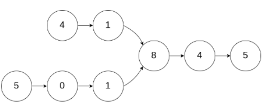

# 算法 - 剑指offer

## 数据结构

### 链表

#### [简单] 从尾到头打印链表

##### 描述

输入一个链表的头节点，按链表从尾到头的顺序返回每个节点的值（用数组返回）。

如输入{1,2,3}的链表如下图:


返回一个数组为 [3,2,1]

0 <= 链表长度 <= 1000

##### 示例

输入：

```
// 输入
{1,2,3}
//返回值
[3,2,1]

// 输入
{67,0,24,58}
// 返回
[58,24,0,67]
```

##### 解题思路

先遍历链表一次存入数组中，再倒序处理数组

##### 代码实现

Golang

```go
// 定义节点
type ListNode struct {
	Val int
	Next *ListNode
}

/**
 * 从尾到头打印链表
 *
 * @param head ListNode类
 * @return int整型一维数组
 */
func printListFromTailToHead(head *ListNode) []int {
	ret := make([]int, 0)
	
	// 遍历链表
	tmp := make([]int, 0)
	for head != nil {
		tmp = append(tmp, head.Val)
		head = head.Next
	}

	// 遍历数组，倒序处理
	tmpLen := len(tmp) - 1
	for tmpLen >= 0 {
		ret = append(ret, tmp[tmpLen])
		tmpLen--
	}

	return ret
}
```

#### [简单] 链表中倒数最后k个结点

##### 描述

输入一个链表，输出一个链表，该输出链表包含原链表中从倒数第k个结点至尾节点的全部节点。

如果该链表长度小于k，请返回一个长度为 0 的链表。

##### 示例

```go
// 输入
{1,2,3,4,5}, 1 

// 返回
{5} 
```

##### 代码实现

**方法一：**

1. 先遍历统计链表长度，记为 n；
2. 设置一个指针走 (n-k) 步，即可找到链表倒数第 k个节点。

```go
/**
 * 链表中倒数最后k个结点
 *
 * @param pHead ListNode类
 * @param k int整型
 * @return ListNode类
 */
func findKthToTail(pHead *ListNode,  k int) *ListNode {
	current, res := pHead, pHead
    n := 0
    for current != nil {
			current = current.Next
			n++
		}
    if (k > n) {
        return nil
    }
		// current 指针先走 k 步
    for i := 1; i <= (n - k); i++ {
			res = res.Next
		}
		return res
}
```

**方法二（快慢指针）：**

初始化： 当前指针 current 、后指针 prev ，双指针都指向头节点 head 
构建双指针距离： current 指针先向前走 k 步（结束后，双指针 current 和 prev 间相距 k 步）
双指针共同移动： 循环中，current 和 prev 每轮都向前走一步，直至 current 走过链表 尾节点 时跳出（跳出后， prev 与尾节点距离为 k-1，即 prev 指向倒数第 k 个节点）。
返回值： 返回 prev 即可。

```go
/**
 * 链表中倒数最后k个结点
 *
 * @param pHead ListNode类
 * @param k int整型
 * @return ListNode类
 */
func FindKthToTail(pHead *ListNode,  k int) *ListNode {
	// 边界值
	if pHead == nil || k <= 0 {
		return nil
	}

	current, prev := pHead, pHead

	// current 指针先走 k 步
	for i := 0; i < k; i++ {
		if current == nil {
			return nil
		}
		current = current.Next
	}

	// 双指针每轮都向前走一步，直至 current 走过链表 尾节点 时跳出
	// 跳出后，prev 与尾节点距离为 k-1，即 prev 指向倒数第 k 个节点
	for current != nil {
		current = current.Next
		prev = prev.Next
	}
	return prev
}
```

#### [简单] 合并两个排序的链表

##### 描述

输入两个单调递增的链表，输出两个链表合成后的链表，当然我们需要合成后的链表满足单调不减规则。

##### 示例

```
// 输入
{1,3,5},{2,4,6}
// 返回值
{1,2,3,4,5,6}
```

##### 代码实现

**方法一（递归）：**

```go
/**
 * 合并两个排序的链表（递归）
 *
 * @param pHead1 ListNode类
 * @param pHead2 ListNode类
 * @return ListNode类
 */
func Merge(pHead1 *ListNode , pHead2 *ListNode) *ListNode {
	if pHead1 == nil {
		return pHead2
	}
	if pHead2 == nil {
		return pHead1
	}

	if pHead1.Val <= pHead2.Val {
		pHead1.Next = Merge(pHead1.Next, pHead2)
		return pHead1
	}
	if pHead1.Val > pHead2.Val {
		pHead2.Next = Merge(pHead1, pHead2.Next)
		return pHead2
	}
	return nil
}
```

时间复杂度：O(m+n)
空间复杂度：O(m+n),每一次递归，递归栈都会保存一个变量，最差情况会保存(m+n)个变量

**方法二（递归）：**

```go
/**
 * 合并两个排序的链表（递归）
 *
 * @param pHead1 ListNode类
 * @param pHead2 ListNode类
 * @return ListNode类
 */
func Merge(pHead1 *ListNode , pHead2 *ListNode) *ListNode {
	// 初始化
    ret := &ListNode{}
	current := ret
    
    // 遍历链表，比较大小
	for pHead1 != nil && pHead2 != nil {
		if pHead1.Val <= pHead2.Val {
			current.Next = pHead1
			pHead1 = pHead1.Next
		} else {
			current.Next = pHead2
			pHead2 = pHead2.Next
		}
		current = current.Next
	}
    
    // 尾节点
	if pHead1 != nil {
		current.Next = pHead1
	}
	if pHead2 != nil {
		current.Next = pHead2
	}
	return ret.Next
}
```

时间复杂度：O(m+n),m，n分别为两个单链表的长度
空间复杂度：O(1)

####  [简单] 两个链表的第一个公共结点

##### 描述

输入两个无环的单链表，找出它们的第一个公共结点。（注意因为传入数据是链表，所以错误测试数据的提示是用其他方式显示的，保证传入数据是正确的）

##### 示例1

```
// 输入
{1,2,3},{4,5},{6,7}
// 返回值
{6,7}
```

说明：

```
第一个参数{1,2,3}代表是第一个链表非公共部分，第二个参数{4,5}代表是第二个链表非公共部分，最后的{6,7}表示的是2个链表的公共部分
这3个参数最后在后台会组装成为2个两个无环的单链表，且是有公共节点的     
```

##### 示例2

```
// 输入
{1},{2,3},{}
// 返回值
{}
```

说明：

```
2个链表没有公共节点 ,返回null，后台打印{}  
```

##### 解题思路

由题意可知，我们要找的公共节点就是如下图所示的 8



可以利用双指针法，设 A 链表长度为 a，B链表长度为 b，则得：`a+b=b+a`，所以将`a+b`作为 A 链表的新长度，`b+a`作为 B 链表的新长度

##### 代码实现

```go
type ListNode struct{
    Val int
    Next *ListNode
}

/**
 * 两个链表的第一个公共节点
 *
 * @param pHead1 ListNode类
 * @param pHead2 ListNode类
 * @return ListNode类
 */
func FindFirstCommonNode(pHead1 *ListNode,  pHead2 *ListNode) *ListNode {
	p1, p2 := pHead1, pHead2
	for p1 != p2 {
		if p1 == nil {
			p1 = pHead2
		} else {
			p1 = p1.Next
		}
		if p2 == nil {
			p2 = pHead1
		} else {
			p2 = p2.Next
		}
	}
    // return p1 或 p2
	return p1
}
```

时间复杂度：O(m+n)
空间复杂度：O(1)

#### [JZ24-简单] 反转链表

##### 题目描述

输入一个链表，反转链表后，输出新链表的表头。

##### 示例

```
// 输入
{1,2,3}
// 返回值
{3,2,1}

// 输入
{}
// 返回值
{}
```

##### 代码实现

PHP

```php
<?php
/*class ListNode{
    var $val;
    var $next = NULL;
    function __construct($x){
        $this->val = $x;
    }
}*/
function reverseList($pHead)
{
    $head = null;
    while ($pHead) {
        $tmp = $pHead->next;
        $pHead->next = $head;
        $head = $pHead;
        $pHead = $tmp;
    }
    return $head;
}
```

Golang

```golang
/**
 * [JZ24-简单]反转链表
 *
 * @param head Node类
 * @return Node类
 */
func reverseList(head *Node) *Node {
	var newHead *Node
	var tmp *Node
	for head != nil {
		// 暂存下一个节点
		tmp = head.Next
		// 把新链表挂到原链表后面
		head.Next = newHead
		// 更新新链表
		newHead = head
		// 移动指针
		head = tmp
	}

	return newHead
}
```

#### [JZ18-简单] 删除链表的节点

##### 题目描述

给定单向链表的头指针和一个要删除的节点的值，定义一个函数删除该节点。返回删除后的链表的头节点。

1.此题对比原题有改动

2.题目保证链表中节点的值互不相同

3.该题只会输出返回的链表和结果做对比，所以若使用 C 或 C++ 语言，你不需要 free 或 delete 被删除的节点

数据范围:

0<=链表节点值<=10000

0<=链表长度<=10000

##### 示例1

```
// 输入
{2,5,1,9},5
// 返回值
{2,1,9}
// 说明
给定你链表中值为 5 的第二个节点，那么在调用了你的函数之后，该链表应变为 2 -> 1 -> 9   
```

##### 示例2

```
// 输入
{2,5,1,9},1
// 返回值
{2,5,9}
// 说明
给定你链表中值为 1 的第三个节点，那么在调用了你的函数之后，该链表应变为 2 -> 5 -> 9   
```

##### 解题思路

删除节点，需要把下一个节点的值移动到当前删除节点，然后更改当前节点的 Next

```
node.Val = node.Next.Val
node.Next = node.Next.Next
```

##### 代码实现

```go
/**
 * [JZ18]删除链表的节点
 *
 * @param head Node类
 * @param val int整型
 * @return Node类
 */
func deleteNode(head *Node, val int) *Node {
	if head.Value == val {
		return head.Next
	}
	pre := head
	for nil != head {
		if head.Value == val {
			head.Value = head.Next.Value
			head.Next = head.Next.Next
			break
		}
		head = head.Next
	}
	return pre
}

// 简化版 - 直接从 head 的 Next 节点开始遍历
func deleteNodeSimplify(head *Node, val int) *Node {
	if head.Value == val {
		return head.Next
	}
	pre := head
	for head.Next.Value != val {
		head = head.Next
	}
	head.Next = head.Next.Next
	return pre
}
```

#### [JZ76-中等] 删除链表中重复的结点

##### 题目描述

在一个排序的链表中，存在重复的结点，请删除该链表中重复的结点，重复的结点不保留，返回链表头指针。 例如，链表 1->2->3->3->4->4->5 处理后为 1->2->5

数据范围：链表长度满足 0 \le n \le 1000 \0≤*n*≤1000 ，链表中的值满足 1 \le val \le 1000 \1≤*v**a**l*≤1000 

进阶：空间复杂度 O(n)\*O*(*n*) ，时间复杂度 O(n) \*O*(*n*) 

例如输入{1,2,3,3,4,4,5}时，对应的输出为{1,2,5}

##### 示例

```
// 输入：
{1,2,3,3,4,4,5}
// 返回值：
{1,2,5}

// 输入：
{1,1,1,8}
// 返回值：
{8}
```

##### 代码实现

```go
/**
 * [JZ76-简单]删除链表中重复的结点
 *
 * @param pHead Node类
 * @return Node类
 */
func deleteDuplication(pHead *Node) *Node {
	// 定义一个空链表
	var res = new(Node)
	// 给新链表添加表头
	res.Next = pHead
	cur := res
	// 从 next 节点开始遍历（前面加了一个表头）
	for nil != cur.Next && nil != cur.Next.Next {
		if cur.Next.Value == cur.Next.Next.Value {
			// 遇到前后节点相同情况，进行遍历，跳过所有相同节点
			tmp := cur.Next.Value
			for nil != cur.Next && cur.Next.Value == tmp {
				cur.Next = cur.Next.Next
			}
		} else {
			// 循环链表
			cur = cur.Next
		}
	}
	return res.Next
}
```

#### [JZ23-中等] 链表中环的入口结点

##### 题目描述

给一个长度为 n 的链表，若其中包含环，请找出该链表的环的入口结点，否则，返回 null。

数据范围： n\le10000*n*≤10000，1<=结点值<=100001<=结点值<=10000

要求：空间复杂度 O(1)*O*(1)，时间复杂度 O(n)*O*(*n*)

例如，输入{1,2},{3,4,5}时，对应的环形链表如下图所示：


可以看到环的入口结点的结点值为3，所以返回结点值为3的结点。

- 输入描述：输入分为 2 段，第一段是入环前的链表部分，第二段是链表环的部分，后台会根据第二段是否为空将这两段组装成一个无环或者有环单链表

- 返回值描述：返回链表的环的入口结点即可，我们后台程序会打印这个结点对应的结点值；若没有，则返回对应编程语言的空结点即可。

##### 示例

```
// 输入
{1,2},{3,4,5}
// 返回值
// 返回环形链表入口结点，我们后台程序会打印该环形链表入口结点对应的结点值，即 3
3

// 输入
{1},{}
// 返回值
// 没有环，返回对应编程语言的空结点，后台程序会打印"null"
"null"

// 输入
{},{2}
// 返回值
// 环的部分只有一个结点，所以返回该环形链表入口结点，后台程序打印该结点对应的结点值，即 2
2
```

##### 解题思路

快慢指针法：

快慢指针可以很容易判断一条链表是否存在环，快指针 fast 每次走两步，慢指针 slow 每次走一步，那么若进入环中，每次他们之间的相对距离都会 -1，直到两者相遇。

那么，怎么使用快慢指针找到环的入口呢？


在慢指针 slow 进入链表环之前，快指针 fast 已经进入了环，且在里面循环，这才能在慢指针进入环之后，快指针追到了慢指针（第一次相遇）

假设：fast 指针在环中走了 n 圈，slow 指针在环中走了 m 圈时，两指针相遇。环前距离为 x，入口节点到第一次相遇节点相差距离为 y，相遇节点到环入口为距离为 z。则有：

- x + n * (y + z) + y（fast 指针第一次相遇步数）
- x + m * (y + z) + y（slow 指针第一次相遇步数）
- 则：x + n * (y + z) + y = 2 * (x + m * (y + z) + y)
- 得：x + y = (n − 2m)(y + z) 
- 即：从链表头经过环入口到达相遇地方经过的距离等于整数倍环的大小
- 那如果 fast 指针从头开始遍历到相遇位置，slow 指针从相遇位置开始在环中遍历，使用相同的步数，最后会在 y 节点处相遇，由于步数相同，所以在环入口处已经相遇，y处属于重复相遇。

示例：

```
输入：{1,2},{3,4,5}
fast 每次走 2 步，slow 每次走 1 步，第一次相遇
fast：3 -> 5 -> 4
slow：2 -> 3 -> 4

令快指针 fast 为 head，这时快慢指针同时一步一步走
fast：2 -> 3
slow：5 -> 3
再次相遇节点 3 即为入口节点
```

因此，可以得出结论：

> 快指针 fast 每次走两步，慢指针 slow 每次走一步，第一次相遇后，令快指针 fast 为 head，这时快慢指针同时一步一步走，再次相遇点即为环的入口

##### 代码实现

```go
/**
 * [JZ23-中等]链表中环的入口结点
 *
 * @param pHead Node类
 * @return Node类
 */
func entryNodeOfLoop(pHead *Node) *Node {
	if nil == pHead || nil == pHead.Next {
		return nil
	}
	fast, slow := pHead, pHead
	for nil != fast && nil != fast.Next.Next {
		fast = fast.Next.Next
		slow = slow.Next
		if fast == slow {
			fast = pHead
			for fast != slow {
				fast = fast.Next
				slow = slow.Next
			}
			return fast
		}
	}
	return nil
}
```

#### [JZ35-较难] 复杂链表的复制

##### 题目描述

输入一个复杂链表（每个节点中有节点值，以及两个指针，一个指向下一个节点，另一个特殊指针random指向一个随机节点），请对此链表进行深拷贝，并返回拷贝后的头结点。（注意，输出结果中请不要返回参数中的节点引用，否则判题程序会直接返回空）。 下图是一个含有5个结点的复杂链表。图中实线箭头表示next指针，虚线箭头表示random指针。为简单起见，指向null的指针没有画出。


##### 示例

输入：{1,2,3,4,5,3,5,#,2,#}

输出：{1,2,3,4,5,3,5,#,2,#}

解析：我们将链表分为两段，前半部分{1,2,3,4,5}为ListNode，后半部分{3,5,#,2,#}是随机指针域表示。

以上示例前半部分可以表示链表为的ListNode:1->2->3->4->5

后半部分，3，5，#，2，#分别的表示为

1的位置指向3，2的位置指向5，3的位置指向null，4的位置指向2，5的位置指向null

如下图：


##### 代码实现

```go

```

### 树

#### [简单] 二叉树的深度

##### 题目描述

输入一棵二叉树，求该树的深度。从根结点到叶结点依次经过的结点（含根、叶结点）形成树的一条路径，最长路径的长度为树的深度。

##### 示例

```
// 输入
{1,2,3,4,5,#,6,#,#,7}
// 返回值：
4
```

##### 代码实现

PHP

```php
<?php

/*class TreeNode{
    var $val;
    var $left = NULL;
    var $right = NULL;
    function __construct($val){
        $this->val = $val;
    }
}*/
function TreeDepth($pRoot)
{
    if($pRoot == null) return 0;
    $left = TreeDepth($pRoot->left);
    $right = TreeDepth($pRoot->right);
    return $left > $right ? $left + 1 : $right +1;
}
```

Golang

```go
type TreeNode struct {
    Val int
    Left *TreeNode
    Right *TreeNode
}

/**
 * 二叉树的深度
 * 
 * @param pRoot TreeNode 类 
 * @return int 整型
*/
func TreeDepth( pRoot *TreeNode ) int {
    if (pRoot == nil) {
        return 0
    }

    left,right := 0,0
    left = TreeDepth(pRoot.Left)
    right = TreeDepth(pRoot.Right)
    
    depth := left
    if (right > left) {
        depth = right
    }
    return depth + 1
}
```

#### [JZ27-简单] 二叉树的镜像

##### 题目描述

操作给定的二叉树，将其变换为源二叉树的镜像。

```
比如：    源二叉树 
            8
           /  \
          6   10
         / \  / \
        5  7 9 11
        镜像二叉树
            8
           /  \
          10   6
         / \  / \
        11 9 7  5
```

##### 示例

```
// 输入
{8,6,10,5,7,9,11}
// 返回
{8,10,6,11,9,7,5}
```

##### 代码实现

PHP

```php
<?php
/*class TreeNode{
    var $val;
    var $left = NULL;
    var $right = NULL;
    function __construct($val){
        $this->val = $val;
    }
}*/

function Mirror(&$root)
{
    if(!$root)return;
    $temp1 = $temp2 = NULL;
    if($root->left){
        $temp1 = Mirror($root->left);
    }
    if($root->right){
        $temp2 = Mirror($root->right);
    }
    $root->left = $temp2;
    $root->right = $temp1;
    return $root;
}
```

Golang

```go
/**
 * 二叉树的镜像
 *
 * @param pRoot TreeNode 类 
 * @return TreeNode 类
*/
func Mirror(pRoot *TreeNode) *TreeNode {
    if nil == pRoot {
        return pRoot
    }
    pRoot.Left, pRoot.Right = Mirror(pRoot.Right), Mirror(pRoot.Left)
    return pRoot
}
```

#### [JZ32-简单] 从上往下打印二叉树

##### 题目描述

不分行从上往下打印出二叉树的每个节点，同层节点从左至右打印。例如输入{8,6,10,#,#,2,1}，如以下图中的示例二叉树，则依次打印8,6,10,2,1(空节点不打印，跳过)，请你将打印的结果存放到一个数组里面，返回。

```
    8
   /  \
  6   10
      / \
     2   1
```

数据范围:

0<=节点总数<=1000

-1000<=节点值<=1000

##### 示例

```
// 输入：
{8,6,10,#,#,2,1}
// 返回值：
[8,6,10,2,1]

// 输入：
{5,4,#,3,#,2,#,1}
// 返回值：
[5,4,3,2,1]
```

##### 解题思路

层次遍历

##### 代码实现

```go
/**
 * [JZ32-简单]从上往下打印二叉树
 * 
 * @param root TreeNode类 
 * @return int 整型一维数组
*/
func printFromTopToBottom(root *TreeNode) []int {
    res := []int{}
    if nil == root {
        return res
    }
    
    tmp := []*TreeNode{root}
    for i := 0; i < len(tmp); i++ {
        current := tmp[i]
        res = append(res, current.Val)
        if nil != current.Left {
            tmp = append(tmp, current.Left)
        }
        if nil != current.Right {
            tmp = append(tmp, current.Right)
        }
    }
    return res
}
```

#### [JZ68-简单] 二叉搜索树的最近公共祖先

##### 题目描述

给定一个二叉搜索树, 找到该树中两个指定节点的最近公共祖先。

1.对于该题的最近的公共祖先定义:对于有根树T的两个节点p、q，最近公共祖先LCA(T,p,q)表示一个节点x，满足x是p和q的祖先且x的深度尽可能大。在这里，一个节点也可以是它自己的祖先.

2.二叉搜索树是若它的左子树不空，则左子树上所有节点的值均小于它的根节点的值； 若它的右子树不空，则右子树上所有节点的值均大于它的根节点的值

3.所有节点的值都是唯一的。

4.p、q 为不同节点且均存在于给定的二叉搜索树中。

数据范围:

3<=节点总数<=10000

0<=节点值<=10000

如果给定以下搜索二叉树: {7,1,12,0,4,11,14,#,#,3,5}，如下:

```
 	     7
 	   /   \
 	1	     12
   /  \     /  \
  0    4   11   14
      / \
     3   5
```

##### 示例

```
// 输入：
{7,1,12,0,4,11,14,#,#,3,5},1,12
// 返回值：
7
// 说明：节点1 和 节点12的最近公共祖先是7 

// 输入：
{7,1,12,0,4,11,14,#,#,3,5},12,11
// 返回值：
12
// 说明：因为一个节点也可以是它自己的祖先.所以输出12
```

##### 解题思路

二叉搜索树每个节点值大于它的左子节点，且大于全部左子树的节点值，小于它右子节点，且小于全部右子树的节点值。

递归思路：

对于某一个节点若是p与q都小于等于这个这个节点值，说明p、q都在这个节点的左子树，而最近的公共祖先也一定在这个节点的左子树；若是p与q都大于等于这个节点，说明p、q都在这个节点的右子树，而最近的公共祖先也一定在这个节点的右子树。而若是对于某个节点，p与q的值一个大于等于节点值，一个小于等于节点值，说明它们分布在该节点的两边，而这个节点就是最近的公共祖先，因此从上到下的其他祖先都将这个两个节点放到同一子树，只有最近公共祖先会将它们放入不同的子树，每次进入一个子树又回到刚刚的问题，因此可以使用递归。

##### 代码实现

```go
/**
 * [JZ68-简单]二叉搜索树的最近公共祖先
 *
 * @param root TreeNode类 
 * @param p int整型 
 * @param q int整型 
 * @return int整型
*/
func lowestCommonAncestor(root *TreeNode, p int, q int) int {
    if nil == root {
        return 0
    }
    
    // p q 都小于等于这个节点值，则 p q 都在左子树
    if root.Val > p && root.Val > q {
        return lowestCommonAncestor(root.Left, p, q)
    }

    // p q 都大于等于这个节点值，则 p q 都在右子树
    if root.Val < p && root.Val < q {
        return lowestCommonAncestor(root.Right, p, q)
    }

    return root.Val
}
```

#### [JZ79 -简单] 判断是不是平衡二叉树

##### 题目描述

输入一棵节点数为 n 二叉树，判断该二叉树是否是平衡二叉树。

在这里，我们只需要考虑其平衡性，不需要考虑其是不是排序二叉树

**平衡二叉树**（Balanced Binary Tree），具有以下性质：它是一棵空树或它的左右两个子树的高度差的绝对值不超过1，并且左右两个子树都是一棵平衡二叉树。

样例解释：

```
 		 1
 	   /   \
 	2	     3
   /  \     /  \
  4    5   6    7
```

样例二叉树如图，为一颗平衡二叉树

注：我们约定空树是平衡二叉树。

数据范围：n ≤ 100,树上节点的val值满足 0 10000 ≤ n ≤ 1000

要求：空间复杂度O(1)，时间复杂度 O(n)

- 输入描述：输入一棵二叉树的根节点
- 返回值描述：输出一个布尔类型的值

##### 示例

```
// 输入：
{1,2,3,4,5,6,7}
// 返回值：
true

// 输入：
{}
// 返回值：
true
```

##### 解题思路

通过判断左右子树深度差（高度差）不大于1

因此，分别求解左右子树高度差即可

##### 代码实现

```go
/**
 * [JZ79-简单] 判断是否是平衡二叉树
 *
 * @param pRoot TreeNode类 
 * @return bool布尔型
*/
func isBalancedBinaryTree(pRoot *TreeNode) bool {
    return treeDepth(pRoot) > -1
}

func treeDepth(root *TreeNode) int {
	if nil == root {
		return 0
	}

	leftLength := treeDepth(root.Left);
	rightLength := treeDepth(root.Right);

	if -1 == leftLength || -1 == rightLength || 1 < abs(leftLength - rightLength) {
		return -1
	}

	return max(leftLength, rightLength) + 1
}

func abs(a int) int {
    if 0 > a {
        return -a
    }
    return a
}

func max(a, b int) int {
	if a > b {
		return a
	}
	return b
}
```

#### [JZ28 -简单] 对称的二叉树

##### 描述

给定一棵二叉树，判断其是否是自身的镜像（即：是否对称）
例如：下面这棵二叉树是对称的

```
 		 1
 	   /   \
 	2	     2
   /  \     /  \
  3    4   4    3
```

下面这棵二叉树不对称的：

```
 		 1
 	   /   \
 	  2	    2
       \     \
        3     3
```

数据范围：节点数满足 0≤*n*≤1000，节点上的值满足∣*v**a**l*∣≤1000

要求：空间复杂度 O(n)，时间复杂度 O(n)

##### 示例

```
// 输入：
{1,2,2,3,4,4,3}
// 返回值：
true

// 输入：
{8,6,9,5,7,7,5}
// 返回值
false
```

##### 解题思路

递归

##### 代码实现

```go
func recursion(root1 *TreeNode, root2 *TreeNode) bool {
	if nil == root1 && nil == root2 {
		return true
	}
	if nil == root1 || nil == root2 || root1.Val != root2.Val {
		return false
	}
	return recursion(root1.Left, root2.Right) && recursion(root1.Right, root2.Left)
}

/**
 * [JZ28-简单] 对称二叉树
 *
 * @param pRoot TreeNode 类
 * @return bool 布尔型
*/
func isSymmetricalTree(pRoot *TreeNode) bool {
    return recursion(pRoot, pRoot)
}
```

#### [JZ82-简单] 二叉树中和为某一值的路径(一)

##### 描述

给定一个二叉树 root 和一个值 sum ，判断是否有从根节点到叶子节点的节点值之和等于 sum 的路径。

1.该题路径定义为从树的根结点开始往下一直到叶子结点所经过的结点

2.叶子节点是指没有子节点的节点

3.路径只能从父节点到子节点，不能从子节点到父节点

4.总节点数目为n
例如：
给出如下的二叉树sum=22，

```
		 5
 	   /   \
 	  4	    8
    /  \     \
   1   11     9
  	  /  \  
  	  2   7
```

返回 true，因为存在一条路径 5→4→11→2 的节点值之和为 22

数据范围：

1.树上的节点数满足 0≤*n*≤10000

2.每 个节点的值都满足 |val|≤1000

要求：空间复杂度 O(n)，时间复杂度 O(n)

进阶：空间复杂度 O(树的高度)，时间复杂度 O(n)

##### 示例

```
// 输入：
{5,4,8,1,11,#,9,#,#,2,7},22
// 返回值：
true

// 输入：
{1,2},0
// 返回值：
false

// 输入：
{1,2},3
// 返回值：
true

// 输入：
{},0
// 返回值：
false
```

##### 解题思路

前序遍历

##### 代码实现

```go
/**
  * [JZ82-简单] 二叉树中和为某一值的路径(一)
  *
  * @param root TreeNode 类 
  * @param sum int 整型 
  * @return bool 布尔型
*/
func hasTreePathSum(root *TreeNode, sum int) bool {
    if nil == root {
		return false
	}
	if nil == root.Left && nil == root.Right && root.Val == sum {
		return true
	}

	return hasTreePathSum(root.Left, sum - root.Val) || hasTreePathSum(root.Right, sum - root.Val)
}
```

#### [JZ34-中等] 二叉树中和为某一值的路径(二)

##### 描述

输入一颗二叉树的根节点 root 和一个整数 expectNumber，找出二叉树中结点值的和为 expectNumber 的所有路径。

1.该题路径定义为从树的根结点开始往下一直到叶子结点所经过的结点

2.叶子节点是指没有子节点的节点

3.路径只能从父节点到子节点，不能从子节点到父节点

4.总节点数目为 n

如二叉树 root 为 {10,5,12,4,7} ，expectNumber 为 22

```
		 10
 	   /    \
 	  5	     12
    /  \     
   4    7     
```

则合法路径有[[10,5,7],[10,12]]

数据范围:

树中节点总数在范围 [0, 5000] 内

-1000 <= 节点值 <= 1000

-1000 <= expectNumber <= 1000

##### 示例

```
// 输入：
{10,5,12,4,7},22
// 返回值：
[[10,5,7],[10,12]]（返回[[10,12],[10,5,7]]也是对的）

// 输入：
{10,5,12,4,7},15
// 返回值：
[]

// 输入：
{2,3},0
// 返回值：
[]

// 输入：
{1,3,4},7
// 返回值：
[]
```

##### 解题思路

深度优先搜索

- 维护两个向量`ret`和`path`
- 编写递归函数`dfs`
- 递归函数内部要处理更新`path`，更新`expectNumber`，判断是否为叶子节点和判断是否要将`path`追加到`ret`末尾

##### 代码示例

```go
var ret [][]int

func dfs(root *TreeNode, expectNumber int, path []int) {
	if nil == root {
		return
	}
	if nil == root.Left && nil == root.Right && root.Val == expectNumber {
		ret = append(ret, append(path, root.Val))
		return
	}
	dfs(root.Left, expectNumber - root.Val, append(path, root.Val))
	dfs(root.Right, expectNumber - root.Val, append(path, root.Val))
}

/**
  * [JZ34-简单] 二叉树中和为某一值的路径(二)
  *
  * @param root TreeNode 类 
  * @param sum int 整型 
  * @return bool 布尔型
*/
func findTreePathSum(root *TreeNode, expectNumber int) [][]int {
	dfs(root, expectNumber, []int{})
	return ret
}
```

#### [中等]按之字形顺序打印二叉树

##### 描述

给定一个二叉树，返回该二叉树的之字形层序遍历，（第一层从左向右，下一层从右向左，一直这样交替）

数据范围：,树上每个节点的 val 满足 
要求：空间复杂度：%20%20%5C)，时间复杂度：%20%5C)

例如：
给定的二叉树是{1,2,3,#,#,4,5}


该二叉树之字形层序遍历的结果是

```
[
[1],
[3,2],
[4,5]
]
```

##### 示例

```
// 输入1
{1,2,3,#,#,4,5}
// 返回值1
[[1],[3,2],[4,5]]

// 输入2
{8,6,10,5,7,9,11}
// 返回值2
[[8],[10,6],[5,7,9,11]]

// 输入3
{1,2,3,4,5}
// 返回值3
[[1],[3,2],[4,5]]
```

##### 代码实现

```go

```

### 队列 & 栈

#### [JZ9-简单] 用两个栈实现队列

##### 题目描述

用两个栈来实现一个队列，使用n个元素来完成 n 次在队列尾部插入整数(push)和n次在队列头部删除整数(pop)的功能。 队列中的元素为int类型。保证操作合法，即保证pop操作时队列内已有元素。

数据范围： n≤1000

要求：存储n个元素的空间复杂度为 O(n) ，插入与删除的时间复杂度都是 O(1)

##### 示例1

输入：

```
// 输入
["PSH1","PSH2","POP","POP"]

// 返回值
1,2

// 说明
"PSH1":代表将1插入队列尾部
"PSH2":代表将2插入队列尾部
"POP“:代表删除一个元素，先进先出=>返回1
"POP“:代表删除一个元素，先进先出=>返回2    
```

##### 示例2

```
// 输入
["PSH2","POP","PSH1","POP"]

// 返回值
2,1
```

##### 代码实现

PHP：

```php
<?php

$queue = array();
function mypush($node)
{
    global $queue;
    return array_push($queue,$node);
}
function mypop()
{
    global $queue;
    return array_shift($queue);
}
```

Go：

```go
var stack1 [] int
var stack2 [] int

func Push(node int) {
    stack1 = append(stack1, node)
}

func Pop() int{
    var result int
    // stack2 为空，将 stack1 中的元素逐个入栈 stack2，再弹出 stack2 栈顶元素
    if len(stack2) == 0 {
        for i := len(stack1) - 1; i > 0; i-- {
            stack2 = append(stack2, stack1[i])
        }
        result = stack1[0]
        stack1 = []int{}
    } else {// 弹出 stack2 栈顶元素
        result = stack2[len(stack2)-1]
        stack2 = stack2[:len(stack2)-1]
    }
    return result
}
```

#### [JZ30-简单] 包含min函数的栈

##### 描述

定义栈的数据结构，请在该类型中实现一个能够得到栈中所含最小元素的 min 函数，输入操作时保证 pop、top 和 min 函数操作时，栈中一定有元素。

此栈包含的方法有：

- push(value):将value压入栈中
- pop():弹出栈顶元素
- top():获取栈顶元素
- min():获取栈中最小元素

数据范围：操作数量满足 0≤*n*≤300 ，输入的元素满足 |val|≤10000 
进阶：栈的各个操作的时间复杂度是 O(1)，空间复杂度是 O(n)

##### 示例

```
 // 输入：
 ["PSH-1","PSH2","MIN","TOP","POP","PSH1","TOP","MIN"]
 // 输出：
 -1,2,1,-1
```

"PSH-1"表示将-1压入栈中，栈中元素为-1

"PSH2"表示将2压入栈中，栈中元素为2，-1

“MIN”表示获取此时栈中最小元素==>返回-1

"TOP"表示获取栈顶元素==>返回2

"POP"表示弹出栈顶元素，弹出2，栈中元素为-1

"PSH1"表示将1压入栈中，栈中元素为1，-1

"TOP"表示获取栈顶元素==>返回1

“MIN”表示获取此时栈中最小元素==>返回-1

##### 代码实现

```go
var stack []int

func Push(node int) {
    stack = append(stack, node)
}

func Pop() {
    stack = stack[0:len(stack)-1]
}

func Top() int {
    result := stack[len(stack) - 1]
    return result
}

func Min() int {
    min := stack[0]
    for _, v := range stack {
        if min > v {
            min = v
        }
    }
    return min
}
```

#### [JZ73-简单] 翻转单词序列

##### 题目描述

最近来了一个新员工Fish，每天早晨总是会拿着一本英文杂志，写些句子在本子上。同事Cat对Fish写的内容颇感兴趣，有一天他向Fish借来翻看，但却读不懂它的意思。例如，“nowcoder. a am I”。后来才意识到，这家伙原来把句子单词的顺序翻转了，正确的句子应该是“I am a nowcoder.”。Cat对一一的翻转这些单词顺序可不在行，你能帮助他么？

数据范围：1≤*n*≤100 
进阶：空间复杂度 O(n)，时间复杂度 O(n)，保证没有只包含空格的字符串

##### 示例

```
// 输入：
"nowcoder. a am I"
// 输出：
"I am a nowcoder."

// 输入：
""
// 输出：
""
```

##### 解题思路

- 遍历字符串，将整个字符串按照空格分割然后入栈。
- 遍历栈，将栈中内容弹出拼接成字符串。

##### 代码实现

```go
/**
 * [JZ73-简单] 翻转单词序列
 *
 * 
 * @param str string 字符串 
 * @return string 字符串
*/
func reverseSentence(str string) string {
    strArr := strings.Split(str, " ")
    result := ""
    for i := len(strArr) - 1; i >= 0; i-- {
        result += strArr[i]
        if i > 0 {
            result += " "
        }
    }
    return result
}
```

## 算法

### 搜索算法

#### [JZ11-简单] 旋转数组的最小数字

##### 描述

把一个数组最开始的若干个元素搬到数组的末尾，我们称之为数组的旋转。
输入一个非递减排序数组的一个旋转，输出旋转数组的最小元素。
NOTE：给出的所有元素都大于0，若数组大小为0，请返回0。

##### 示例

输入：

```
[3,4,5,1,2]
```

返回值：

```
1
```

##### 解题思路

由题意，非递减排序的数组即为递增数组，所以本题输入是一个递增数组的旋转

第一种做法比较简单，可以使用暴力法，更优的解法是二分法

##### 代码实现

二分 - PHP

```php
function minNumberInRotateArray($rotateArray)
{
	$count = count($rotateArray);
    if($count == 0) return 0;
    if ($count == 1) return $rotateArray[0];
    $left = 0;
    $right = count($rotateArray) - 1;
    while ($rotateArray[$left] >= $rotateArray[$right]) {
    	if ($right - $left == 1) {
    		$mid = $right;
    		break;
    	}
    	$mid = floor(($left + $right) / 2);
    	if ($rotateArray[$mid] > $rotateArray[$right]) {
    		$left = $mid;
    	} elseif ($rotateArray[$mid] == $rotateArray[$right]) {
    		--$right;
    	} else {
    		$right = $mid;
    	}
    }
    return $rotateArray[$mid];
}
```

二分 - Golang

```go
/**
 * 旋转数组的最小数字
 *
 * @param rotateArray int整型一维数组
 * @return int整型
 */
func minNumberInRotateArray(rotateArray []int) int {
	// 边界值处理
	if len(rotateArray) == 0 {
		return 0
	}
	if len(rotateArray) == 1 {
		return rotateArray[0]
	}

	// 初始化中间变量
	var mid int
	// 定义左右变量
	left, right := 0, len(rotateArray) - 1
	for rotateArray[left] >= rotateArray[right] {
		// 退出条件
		if (right - left) == 1 {
			mid = right
			break
		}
		// 中间变量
		mid = (left + right) / 2
		if rotateArray[mid] > rotateArray[right] {// 中间值大于最右侧值，说明最小值在右侧
			left = mid
		} else if rotateArray[mid] < rotateArray[right] {// 中间值小于最右侧值，说明最小值在左侧
			right = mid
		} else {
			right--
		}
	}
	return rotateArray[mid]
}
```

#### [JZ53-简单] 数字在升序数组中出现的次数

##### 描述

给定一个长度为 n 的非降序数组和一个非负数整数 k ，要求统计 k 在数组中出现的次数

数据范围：1000≤*n*≤1000,0≤*k*≤100，数组中每个元素的值满足 0≤val≤100
要求：空间复杂度 O(1)，时间复杂度 O(logn)

##### 示例

```
// 输入
[1,2,3,3,3,3,4,5],3
// 输出
4

// 输入
[1,3,4,5],6
// 输出
0
```

##### 解题思路

由题意，非降序数组，即升序数组，因此，可以使用二分法

- 先通过二分法找出 k 在数组中的位置
- 再分别向左右查找

##### 代码实现

```go
/**
 * [JZ53-简单] 数字在升序数组中出现的次数
 *
 * @param data int 整型一维数组
 * @param k int 整型
 * @return int 整型
 */
func getNumFromAscArray(data []int, k int) int {
	if 0 == len(data) {
		return 0
	}

	// 二分查找 k 位置
	left, right, mid, isExist := 0, len(data)-1, 0, false
	for left <= right {
		mid = (left + right) / 2
		if data[mid] == k {
			isExist = true
			break
		} else if data[mid] > k {
			right = right - 1
		} else {
			left = left + 1
		}
	}

	if false == isExist {
		return 0
	}

	// // 向左遍历查找
	count, move := 1, mid
	for {
		move--
		if move < 0 || data[move] != k {
			break
		}
		count++
	}

	// 向右遍历查找
	move = mid
	for {
		move++
		if move >= len(data) || data[move] != k {
			break
		}
		count++
	}

	return count
}
```

#### [JZ44-简单] 数字序列中某一位的数字

##### 描述

数字以 0123456789101112131415... 的格式作为一个字符序列，在这个序列中第 2 位（**从下标 0 开始计算**）是 2 ，第 10 位是 1 ，第 13 位是 1 ，以此类题，请你输出第 n 位对应的数字。

数据范围： 0≤*n*≤10^9 

##### 示例

```
// 输入
0
// 输出
0

// 输入
2
// 输出
2

// 输入
10
// 输出
1

// 输入
13
// 输出
1
```

##### 解题思路

```
// 区间规律
0
1 ~ 9：1 * 9 = 9
10 ~ 99：2 * 90 = 180
100 ~ 999：3 * 900 = 2700
...

// n 属于哪个自然数
// 0 1 2 3 4 5 6 7 8 9 10 11 12 13
n   - 区间首位 - 位数 - 所属自然数 - 下标
2   -   1    -  1  -  2=1+(2-1)/1      -   0=(2-1)%1
10  -   10   -  2  -  10=10+(10-9-1)/2  -   0=(10-9-1)%2
13  -   10   -  2  -  11=10+(13-9-1)/2  -   1=(13-9-1)%2

所属自然数 = 区间首位数 + 剩余部分除以这个区间的位数
```

从以上示例可以发现 n-1 和区间之间的规律

```
位数：digit
区间首位：start
区间总位数：sum = digit * 9 * start
区间剩余部分：x
所属自然数：start + (x-1)/digit
```

- 确定 n 属于哪个区间
  - 通过 n 不断减去前面区间的位数
- 确定 n 属于哪个自然数
  -  区间首位数 + 剩余部分 / 这个区间的位数
- 确定 n 在自然数中的位置
  - n - 1 对这个位数取模

##### 代码实现

```go
/**
 * [JZ44-简单] 数字序列中某一位的数字
 *
 * @param data int 整型一维数组
 * @param k int 整型
 * @return int 整型
 */
func findNthDigit(n int) int {
	// 位数、区间首位数字、区间总位数
	digit, start, sum := 1, 1, 9

	// 获取位数、区间首位、区间总位数
	for n > sum {
		n -= sum
		start *= 10
		digit += 1
		sum = 9 * start * digit
	}

	// 定位 n 在哪个数上
	num := start + (n-1)/digit

	// 定位 n 在这个数的哪一位上
	index := (n - 1) % digit

	// 将 num 转化成 string
	numStr := strconv.Itoa(num)

	// 根据 index 索引获取字符串值
	numStr = string(numStr[index])

	// 将字符串转化成 int
	ret, _ := strconv.Atoi(numStr)

	return ret
}
```

#### [JZ4-中等]二维数组中的查找

##### 题目描述

在一个二维数组中（每个一维数组的长度相同），每一行都按照从左到右递增的顺序排序，每一列都按照从上到下递增的顺序排序。请完成一个函数，输入这样的一个二维数组和一个整数，判断数组中是否含有该整数。

##### 代码实现

```php
<?php
function Find($target, $array)
{
    foreach($array as $key => $val){
        if(in_array($target, $val)){
            return "true";
        }
    }
    return "false";
}
while(fscanf(STDIN,"%d,%s",$target,$arr) == 2){
    eval('$array='.$arr.';');
    echo Find($target,$array)."\n";
}
```

### 动态规划

#### [入门] 斐波那契数列

##### 题目描述

大家都知道斐波那契数列，现在要求输入一个整数n，请你输出斐波那契数列的第n项（从0开始，第0项为0，第1项是1）。

n<=39

##### 解题思路

斐波那契数列指的是这样一个数列：0、1、1、2、3、5、8、13、21、34、……在数学上，斐波那契数列以如下被以递推的方法定义：*F*(0)=0，*F*(1)=1, *F*(n)=*F*(n - 1)+*F*(n - 2)（*n* ≥ 3，*n* ∈ N*）

##### 代码实现

动规 - PHP

```php
function Fibonacci($n)
{
    if ($n == 0 || $n == 1) return $n;
    $pre = 0;
    $next = 1;
    $res = 0;
    for ($i = 2; $i <= $n; $i++) {
        $res = $pre + $next;
        $pre = $next;
        $next = $res;
    }
    return $res;
}
```

递归法 - PHP

```php
<?php
function Fibonacci($n)
{
    if ($n == 0 || $n == 1) return $n;
    return Fibonacci($n - 1) + Fibonacci($n + 1);
}
```

递归法 - Golang

```go
/**
 * 递归
 *
 * @param n int整型
 * @return int整型
 */
func Fibonacci( n int ) int {
	// 边界值处理
	if n == 0 || n == 1 {
		return n
	}
	return Fibonacci(n -1) + Fibonacci(n - 2)
}
```

#### [简单] 跳台阶

##### 题目描述

一只青蛙一次可以跳上1级台阶，也可以跳上2级。求该青蛙跳上一个n级的台阶总共有多少种跳法（先后次序不同算不同的结果）

##### 解题思路

```
n -- m    n -- m
1 -- 1    5 -- 8(11111、122、212、221、1112、1211、1121、2111)
2 -- 2
3 -- 3    m = (n-1) + (n-2)
4 -- 5
```

由题意可知此题和斐波那契数列解法相同

##### 代码实现

动规 - PHP

```php
function jumpFloor($number)
{
    if ($number === 1 || $number === 2) return $number;
    $pre = 1;
    $next = 2;
    for ($i = 3; $i <= $number; $i++) {
    	$sum = $pre + $next;
    	$pre = $next;
    	$next = $sum;
    }
    return $sum;
}
```

递归 - PHP

```php
function jumpFloor($number)
{
    if ($number === 1 || $number === 2) return $number;
    $sum = jumpFloor($number - 1) + jumpFloor($number - 2);
    return $sum;
}
```

递归 - GOlang

```go
/**
 * 递归
 *
 * @param number int整型 
 * @return int整型
*/
func jumpFloor( number int ) int {
    if number == 1 || number == 2 {
        return number
    }
    return jumpFloor (number - 1) +  jumpFloor (number - 2)
}
```

#### [简单] 跳台阶扩展问题

##### 描述

一只青蛙一次可以跳上1级台阶，也可以跳上2级……它也可以跳上n级。求该青蛙跳上一个n级的台阶(n为正整数)总共有多少种跳法。

##### 示例

```
输入：3
输出：4
```

##### 解题思路

```
n -- m    n -- m
1 -- 1    4 -- 8    m = n^(2-1)
2 -- 2    5 -- 16
3 -- 3
```

由题意可知结果为2的n-1次方，所以可以转化为一个数学问题

##### 代码实现

PHP

```php
<?php

function jumpFloorII($number)
{
    if($number == 1) return 1;
    return pow(2,($number - 1));
}
```

Golang

```go
/**
 * 2^（n - 1）
 * 
 * @param number int整型 
 * @return int整型
*/
func jumpFloorII( number int ) int {
    return 1 << (number - 1)
}
```

#### [JZ42-简单] 连续子数组的最大和

##### 描述

输入一个长度为 n 的整型数组 array，数组中的一个或连续多个整数组成一个子数组，子数组最小长度为1。求所有子数组的和的最大值。

数据范围:

- 1<=*n*<=2×105
- −100<=*a*[*i*]<=100

要求：时间复杂度为 O(n)，空间复杂度为 O(n)

进阶：时间复杂度为 O(n)，空间复杂度为 O(1)

##### 示例

```
// 输入
[1,-2,3,10,-4,7,2,-5]
// 输出：输入数组的子数组[3,10,-4,7,2]可以求得最大和为18
18

// 输入
[2]
// 输出
2

// 输入
[-10]
// 输出
10
```

##### 解题思路

动态规划

##### 代码实现

```go
/**
 * [JZ44-简单] 数字序列中某一位的数字
 *
 * @param array int 一维数组
 * @return int
 */
func findGreatestSumOfSubArray(array []int) int {
	length := len(array)
	if 1 == length {
		return array[0]
	}

	dp := make([]int, length)
	dp[0] = array[0]
	max := array[0]
	for i := 1; i < length; i++ {
		dp[i] = int(math.Max(float64(dp[i-1]+array[i]), float64(array[i])))
		max = int(math.Max(float64(dp[i]), float64(max)))
	}
	return max
}
```

#### [JZ63-简单] 买卖股票的最好时机(一)

##### 描述

假设你有一个数组 prices，长度为 n，其中 prices[i] 是股票在第 i 天的价格，请根据这个价格数组，返回买卖股票能获得的最大收益

1. 你可以买入一次股票和卖出一次股票，并非每天都可以买入或卖出一次，总共只能买入和卖出一次，且买入必须在卖出的前面的某一天
2. 如果不能获取到任何利润，请返回0
3. 假设买入卖出均无手续费

数据范围： 0≤ n≤10^5 , 0≤val≤10^4

要求：空间复杂度 O(1)，时间复杂度 O(n)

##### 示例

输入：

```
// 输入
[8,9,2,5,4,7,1]
// 输出
5
// 说明：在第3天(股票价格 = 2)的时候买入，在第6天(股票价格 = 7)的时候卖出，最大利润 = 7-2 = 5 ，不能选择在第2天买入，第3天卖出，这样就亏损7了；同时，你也不能在买入前卖出股票。 

// 输入
[2,4,1]
// 返回值
2

// 输入
[3,2,1]
// 返回值
0
```

##### 解题思路

动态规划中贪心算法：找出整体当中给的每个局部子结构的最优解，并且最终将所有的这些局部最优解结合起来形成整体上的一个最优解。

- 将每天收入与最低价格相见获取最大值

##### 代码实现

```go
/**
 * [JZ63-简单] 买卖股票的最好时机(一)
 *
 * @param array int 一维数组
 * @return int
 */
func maxProfit(prices []int) int {
	n := len(prices)
	if 0 == n {
		return 0
	}

	min := prices[0]

	ret := 0
	for i := 1; i < n; i++ {
		min = int(math.Min(float64(min), float64(prices[i])))
		ret = int(math.Max(float64(ret), float64(prices[i]-min)))
	}
	return ret
}
```

#### [中等]矩形覆盖

##### 题目描述

我们可以用2 * 1的小矩形横着或者竖着去覆盖更大的矩形。请问用n个2 * 1的小矩形无重叠地覆盖一个2 * n的大矩形，总共有多少种方法？

比如n=3时，2 * 3的矩形块有3种覆盖方法：


##### 解题思路

> n：	 1	2	3	4
>
> 方法：1	2	3	5

可以发现此题也是斐波那契数列的解法

##### 代码实现

示例1（递归）：

```php
function rectCover($number)
{
    if ($number === 0 || $number === 1 || $number === 2) return $number;
    $sum = jumpFloor($number - 1) + jumpFloor($number - 2);
    return $sum;
}
```

示例2：

```php
function rectCover($number)
{
    if ($number === 0 || $number === 1 || $number === 2) return $number;
    $pre = 1;
    $next = 2;
    for ($i = 3; $i <= $number; $i++) {
    	$sum = $pre + $next;
    	$pre = $next;
    	$next = $sum;
    }
    return $sum;
}
```

### 回溯算法

### 排序算法

#### [简单] 数组中重复的数字

##### 描述

在一个长度为n的数组里的所有数字都在0到n-1的范围内。 数组中某些数字是重复的，但不知道有几个数字是重复的。也不知道每个数字重复几次。请找出数组中任一一个重复的数字。 例如，如果输入长度为7的数组[2,3,1,0,2,5,3]，那么对应的输出是2或者3。存在不合法的输入的话输出-1

##### 示例

输入：

```
[2,3,1,0,2,5,3]
```

返回值：

```
2
```

说明：

```
2或3都是对的 
```

##### 代码实现

```go
/**
 * 【暴力】数组中重复的数字
 *
 * @param numbers int整型一维数组
 * @return int整型
 */
func duplicate(numbers []int) int {
	ret := -1
	// 遍历数组
	for i := 0; i < len(numbers); i++ {
		//fmt.Println("Element", i, "of arr is", numbers[i])
		for j := 0; j < len(numbers); j++ {
			if i == j {
				continue
			}
			if numbers[i] == numbers[j] {
				ret = numbers[i]
			}
		}
	}
	return ret
}
```

### 位运算

位运算符简介：

| 例子             | 名称              | 结果                                 |
| :------------- | :-------------- | :--------------------------------- |
| **`$a & $b`**  | And（按位与）        | 将把 $a 和 $b 中都为 1 的位设为 1。           |
| **`$a | $b`**  | Or（按位或）         | 将把 $a 和 $b 中任何一个为 1 的位设为 1。        |
| **`$a ^ $b`**  | Xor（按位异或）       | 将把 $a 和 $b 中一个为 1 另一个为 0 的位设为 1。   |
| **`~ $a`**     | Not（按位取反）       | 将 $a 中为 0 的位设为 1，反之亦然。             |
| **`$a << $b`** | Shift left（左移）  | 将 $a 中的位向左移动 $b 次（每一次移动都表示“乘以 2”）。 |
| **`$a >> $b`** | Shift right（右移） | 将 $a 中的位向右移动 $b 次（每一次移动都表示“除以 2”）。 |

#### [简单] 不用加减乘除做加法

##### 题目描述

写一个函数，求两个整数之和，要求在函数体内不得使用+、-、*、/四则运算符号。

##### 示例

```
输入：
1,2
返回值：
3
```

##### 解题思路

转化成二进制进行计算，演示相关过程如下：

```
num1=2,num2=3
---
第一次：
2^3 : 0000 0010 ^ 0000 0011 = 0000 0001 = 1
2&3 : 0000 0010 & 0000 0011 = 0000 0010 = 2
2<<1: 0000 0010 << 1 = 0000 0100 = 4
第二次：
1和4进入
1^4 : 0000 0001 ^ 0000 0100 = 0000 0101 = 5
1&4 : 0000 0001 & 0000 0100 = 0000 0000 = 0
0<<1: 0000 0000 << 1 = 0000 0000 = 0
第三次：
5和0进入
返回5
```

##### 代码实现

PHP

```php
<?php

function Add($num1, $num2)
{
    if($num1 == 0) return $num2;
    if($num2 == 0) return $num1;
    return Add($num1 ^ $num2, ($num1 & $num2) << 1);
}
```

Golang

```go
/**
 * 不用加减乘除做加法
 *
 * @param num1 int整型
 * @param num2 int整型
 * @return int整型
 */
func Add(num1 int, num2 int) int {
	for num2 != 0 {
		c := (num1 & num2) << 1		//进位
		num1 ^= num2				//非进位和
		num2 = c
	}
	return num1
}
```

#### [简单] 二进制中1的个数

##### 题目描述

输入一个整数，输出该数32位二进制表示中1的个数。其中负数用补码表示。

##### 代码实现

示例1：

```javascript
function NumberOf1(n)
{
    let flag = 1;
    let count = 0;
    while(flag){
        if (flag & n) {
            count++;
        }
        flag <<= 1;
    }
    return count
}
```

示例2：

```php
<?php

function NumberOf1($n)
{
    $count = 0;
  	// 如果n小于0，php、python等需要做特殊处理
    if ($n < 0) {
        $n = $n & 0xffffffff;
    }
    while ($n != 0) {
        $count++;
        $n = $n & ($n - 1);
    }
    return $count;
}
```

```javascript
function NumberOf1(n)
{
    let count = 0;
    while (n != 0) {
        count++;
        n = n & (n-1);
    }
    return count;
}
```

##### 思路

如果一个整数不为0，那么这个整数至少有一位是1。如果我们把这个整数减1，那么原来处在整数最右边的1就会变为0，原来在1后面的所有的0都会变成1(如果最右边的1后面还有0的话)。其余所有位将不会受到影响。
如：一个二进制数1100，从右边数起第三位是处于最右边的一个1。减去1后，第三位变成0，它后面的两位0变成了1，而前面的1保持不变，因此得到的结果是1011.我们发现减1的结果是把最右边的一个1开始的所有位都取反了。这个时候如果我们再把原来的整数和减去1之后的结果做`按位与`运算，从原来整数最右边一个1那一位开始所有位都会变成0。如1100&1011=1000.也就是说，把一个整数减去1，再和原整数做`按位与`运算，会把该整数最右边一个1变成0.那么一个整数的二进制有多少个1，就可以进行多少次这样的操作。

##### 知识点

进制转化

```
你以十进制的数除以你所要转换的进制数,把每次除得的余数记在旁边,所得的商数继续除以进制数,直到余数为0时止.
十进制转八进制：
100/8=12...(余数为4); 
12/8=1.....(余数为4); 
1/8=0......(余数为1); 
结果：144
十进制转十六进制: 
100/16=6....(余数为4); 
6/16=0......(余数为6); 
结果：64; 
十进制转二进制: 
100/2=50....(余数为0); 
50/2=25.....(余数为0); 
25/2=12.....(余数为1); 
12/2=6......(余数为0); 
6/2=3.......(余数为0); 
3/2=1.......(余数为1); 
1/2=0.......(余数为1); 
结果：1100100; 
```

位运算符知识

[计算机组成原理](计算机组成原理.md)

#### [中等]求1+2+3+...+n

##### 题目描述

求1+2+3+...+n，要求不能使用乘除法、for、while、if、else、switch、case等关键字及条件判断语句（A?B:C）。

##### 解题思路

由题可知：sum=n(n+1)/2，由于不能使用循环和乘除，所以使用递归实现

##### 代码实现

```php
function Sum_Solution($n)
{
    $n > 1 && $n += Sum_Solution($n-1);
    return $n;
}
```

#### [中等]数值的整数次方

##### 题目描述

给定一个double类型的浮点数base和int类型的整数exponent。求base的exponent次方。

保证base和exponent不同时为0

##### 代码实现

```php
function Power($base, $exponent)
{
    if ($exponent == 0) return 1;
    if ($base == 0) return 0;
    return pow($base, $exponent);
}
```

### 模拟

#### [JZ29-简单] 顺时针打印矩阵

##### 描述

输入一个矩阵，按照从外向里以顺时针的顺序依次打印出每一个数字，例如，如果输入如下4 X 4矩阵：

```
[[1,2,3,4],
[5,6,7,8],
[9,10,11,12],
[13,14,15,16]]
```

则依次打印出数字

```
[1,2,3,4,8,12,16,15,14,13,9,5,6,7,11,10]
```

数据范围:

0 <= matrix.length <= 100

0 <= matrix[i].length <= 100

##### 示例

```
// 输入：
[[1,2,3,4],[5,6,7,8],[9,10,11,12],[13,14,15,16]]
// 返回值：
[1,2,3,4,8,12,16,15,14,13,9,5,6,7,11,10]

// 输入：
[[1,2,3,1],[4,5,6,1],[4,5,6,1]]
// 返回值：
[1,2,3,1,1,1,6,5,4,4,5,6]
```

##### 解题思路


##### 代码实现


### 其他算法

#### [简单] 构建乘积数组

##### 题目描述

给定一个数组 A[0,1,...,n-1]，请构建一个数组 B[0,1,...,n-1]，其中B中的元素B[i]=A[0]*A[1]*...*A[i-1]*A[i+1]*...*A[n-1]。不能使用除法。（注意：规定B[0] = A[1] * A[2] * ... * A[n-1]，B[n-1] = A[0] * A[1] * ... * A[n-2]）

对于A长度为1的情况，B无意义，故而无法构建，因此该情况不会存在。

##### 示例

```
输入：
[1,2,3,4,5]
返回值：
[120,60,40,30,24]
```

##### 代码实现

时间复杂度：O(n^2)

PHP

```php
<?php

function multiply($numbers)
{
    $count = count($numbers);
    $arr = array();
    for ($i = 0; $i < $count; $i++) {
        $temp = 1;
        for ($j = 0; $j < $count; $j++) {
            if ($i != $j) {
                $temp *= $numbers[$j]; 
            }
        }
        $arr[$i] = $temp;
    }
    return $arr;
}
```

Golang

```go
/**
 * [暴力] 构建乘积数组
 *
 * @param A int整型一维数组
 * @return int整型一维数组
 */
func multiply(A []int) []int {
	n := len(A)
	B := make([]int, n)
	for i := 0; i < n; i++ {
		B[i] = 1;
		for j := 0; j < n; j++ {
			if i == j {
				continue
			}
			B[i] *= A[j]
		}
	}
	return B
}
```

**优化方法**

时间复杂度：O(n)

Golang

```go
/**
 * 构建乘积数组
 *
 * @param A int整型一维数组
 * @return int整型一维数组
 */
func multiply(A []int) []int {
	n := len(A)
	letf := 1
	B := make([]int, n)
	for i, v := range A {
		B[i] = letf
		letf *= v
	}
	right := 1
	for j := n - 1; j >= 0; j-- {
		B[j] *= right
		right *= A[j]
	}
	return B
}
```

#### [简单] 替换空格

##### 描述

请实现一个函数，将一个字符串中的每个空格替换成“%20”。例如，当字符串为We Are Happy.则经过替换之后的字符串为We%20Are%20Happy。

##### 示例

输入：

```
"We Are Happy"
```

返回值：

```
"We%20Are%20Happy"
```

##### 代码实现

PHP

```php
<?php
function replaceSpace($str)
{
    return str_replace(" ", "%20", $str);
}
```

Golang

```go
/**
 * 替换字符串
 *
 * @param s string字符串
 * @return string字符串
 */
func replaceSpace(s string) string {
	res := ""
	for _, v := range s {
		if v == ' ' {
			res += "%20"
		} else {
			res += string(v)
		}
	}
	return res
}
```

#### [简单] 第一个只出现一次的字符串

##### 描述

在一个字符串(0<=字符串长度<=10000，全部由字母组成)中找到第一个只出现一次的字符，并返回它的位置，如果没有则返回 -1（需要区分大小写）.（从0开始计数）

##### 示例

输入：

```
"google"
```

返回值：

```
4
```

##### 解题思路

先开一个map数组统计字符串每个元素出现的次数，再遍历字符串，如果map中的某个元素值为1，代表出现1次，直接返回

##### 代码实现

```go
/**
 * 第一个只出现一次的字符串
 *
 * @param str string字符串
 * @return int整型
 */
func FirstNotRepeatingChar(str string) int {
	if len(str) == 0 {
		return -1
	}
	keyMap := [256]int {0}
	for i := range str {
		keyMap[str[i]]++
	}
	for i , v := range str {
		if keyMap[v] == 1 {
			return i
		}
	}
	return -1
}
```

#### [JZ39-简单] 数组中出现次数超过一半的数字

##### 描述

给一个长度为 n 的数组，数组中有一个数字出现的次数超过数组长度的一半，请找出这个数字。

例如输入一个长度为 9 的数组 [1,2,3,2,2,2,5,4,2] 。由于数字 2 在数组中出现了 5 次，超过数组长度的一半，因此输出2。

- 数据范围：n≤50000，数组中元素的值 0≤val≤10000
- 要求：空间复杂度：O(1)，时间复杂度 O(n)
- 保证数组输入非空，且保证有解

##### 示例

```
// 输入：
[1,2,3,2,2,2,5,4,2]
// 返回值：
2

// 输入：
[3,3,3,3,2,2,2]
// 返回值：
3

// 输入：
[1]
// 返回值：
1
```

##### 解题思路

哈希法

- 先遍历一遍数组，将每个元素出现的次数存在入 map 中，再遍历 map，找出次数大于数组一半的数

候选法（优化）

- 如果两个数不相等，就消去这两个数，最坏情况下，每次消去一个众数和一个非众数，那么如果存在众数，最后留下的数肯定是众数。

##### 代码实现

哈希法：

```go
/**
 * [JZ39-简单] 数组中出现次数超过一半的数字（哈希法）
 *
 * @param numbers int整型一维数组
 * @return int整型
 */
func moreThanHalfNum(numbers []int) int {
	length := len(numbers)
	if 1 == length {
		return numbers[0]
	}

	hash := map[int]int{}
	for _, v := range numbers {
		if _, ok := hash[v]; ok {
			hash[v] += 1
		} else {
			hash[v] = 1
		}
	}

	for k, v := range hash {
		if v > length/2 {
			return k
		}
	}

	return 0
}
```

候选法：

```go
/**
 * [JZ39-简单] 数组中出现次数超过一半的数字（候选法）
 *
 * @param numbers int整型一维数组
 * @return int整型
 */
func moreThanHalfNum(numbers []int) int {
	length := len(numbers)
	if 1 == length {
		return numbers[0]
	}

	cond, count := -1, 0
	for _, v := range numbers {
		if 0 == count {
			cond = v
			count++
		} else {
			if cond == v {
				count++
			} else {
				count--
			}
		}
	}

	count = 0
	for _, v := range numbers {
		if v == cond {
			count++
		}
	}

	if count > length/2 {
		return cond
	} else {
		return 0
	}
}
```

#### [JZ17-简单] 打印从1到最大的n位数

##### 描述

输入数字 n，按顺序打印出从 1 到最大的 n 位十进制数。比如输入 3，则打印出 1、2、3 一直到最大的 3 位数 999。

- 用返回一个整数列表来代替打印
- n 为正整数，0 < n <= 5

##### 示例

```
// 输入：
1
// 返回值：
[1,2,3,4,5,6,7,8,9]
```

##### 解题思路

由题意可知，数组长度为 10^n - 1，先求出数组长度，再遍历依次向空数组中添加元素即可

##### 代码实现

```go
/**
 * [JZ17-简单] 打印从1到最大的n位数
 *
 * @param n int整型 最大位数
 * @return int整型一维数组
 */
func printNumbers(n int) []int {
	pow := math.Pow10(n)
	count := int(pow) - 1
	arr := make([]int, count)
	for i := 1; i <= count; i++ {
		arr[i-1] = i
	}
	return arr
}
```

#### [JZ81-简单] 调整数组顺序使奇数位于偶数前面(二)

##### 描述

输入一个长度为 n 整数数组，数组里面可能含有相同的元素，实现一个函数来调整该数组中数字的顺序，使得所有的奇数位于数组的前面部分，所有的偶数位于数组的后面部分，对奇数和奇数，偶数和偶数之间的相对位置不做要求，但是时间复杂度和空间复杂度必须如下要求。

数据范围：0≤*n*≤50000，数组中每个数的值 0≤*v**a**l*≤10000

要求：时间复杂度 O(n)，空间复杂度 O(1)

##### 示例


```
// 输入
[1,2,3,4]
// 输出
[1,3,2,4]
// 说明
[3,1,2,4]或者[3,1,4,2]也是正确答案 

// 输入
[1,3,5,6,7]
// 输出
[1,3,5,7,6]
// 说明
[3,1,5,7,6]等也是正确答案 

// 输入
[1,4,4,3]
// 输出
[1,3,4,4]
```

##### 解题思路


##### 代码实现

```go

```

#### [中等] 左旋转字符串

##### 题目描述

汇编语言中有一种移位指令叫做循环左移（ROL），现在有个简单的任务，就是用字符串模拟这个指令的运算结果。对于一个给定的字符序列S，请你把其循环左移K位后的序列输出。例如，字符序列S=”abcXYZdef”,要求输出循环左移3位后的结果，即“XYZdefabc”。是不是很简单？OK，搞定它！

##### 代码实现

PHP

```php
function LeftRotateString($str, $n)
{
    if(strlen($str) == 0) return $str;
    $str1 = substr($str,0,$n);
    $str2 = substr($str,$n);
    return $str2.$str1;
}
```

Node

```javascript
// js
function LeftRotateString(str, n)
{
    if(!str || str.length === 0) return '';
    let num = n % str.length;
    return str.substr(num) + str.substr(0,num);
}
```
