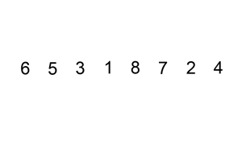

## 数据结构

### 复杂度

#### 时间复杂度

从 CPU 的角度来看，以下示例代码的每一行都执行着类似的操作：**读数据**-**运算**-**写数据**。尽管每行代码对应的 CPU 执行的个数、执行的时间都不一样，但是，我们这里可以粗略估计，可以假设每行代码执行的时间都一样，为 `unit_time`。在这个假设的基础之上，我们来计算每段代码的总执行时间。

**示例**

**例1：**

```
int cal(int n) {
   int sum = 0;
   int i = 1;
   for (; i <= n; ++i) {
     sum = sum + i;
   }
   return sum;
 }
```

第 2、3 行代码分别需要 1 个 unit_time 的执行时间，第 4、5 行都运行了 n 遍，所以需要 2n*unit_time 的执行时间，所以这段代码总的执行时间就是 `(2n+2)*unit_time`。可以看出来，**所有代码的执行时间 T(n) 与每行代码的执行次数成正比**。

**例2：**

```
 int cal(int n) {
   int sum = 0;
   int i = 1;
   int j = 1;
   for (; i <= n; ++i) {
     j = 1;
     for (; j <= n; ++j) {
       sum = sum +  i * j;
     }
   }
 }
```

第 2、3、4 行代码，每行都需要 1 个 unit_time 的执行时间，第 5、6 行代码循环执行了 n 遍，需要 2n * unit_time 的执行时间，第 7、8 行代码循环执行了 n^2遍，所以需要 2n^2 * unit_time 的执行时间。所以，整段代码总的执行时间` T(n) = (2n2+2n+3)*unit_time`

**总结**

> 所有代码的执行时间 T(n) 与每行代码的执行次数成正比

$$
T(n)=O(f(n))
$$

T(n) 表示代码执行的时间；n 表示数据规模的大小；f(n) 表示每行代码执行的次数总和。因为这是一个公式，所以用 f(n) 来表示。公式中的 O，表示代码的执行时间 T(n) 与 f(n) 表达式成正比

第一个例子中的 T(n) = O(2n+2)，第二个例子中的 T(n) = O(2n2+2n+3)。这就是**大 O 时间复杂度表示法**。大 O 时间复杂度实际上并不具体表示代码真正的执行时间，而是表示**代码执行时间随数据规模增长的变化趋势**，所以，也叫作**渐进时间复杂度**（asymptotic time complexity），简称**时间复杂度**

当 n 很大时，你可以把它想象成 10000、100000。而公式中的低阶、常量、系数三部分并不左右增长趋势，所以都可以忽略。我们只需要记录一个最大量级就可以了，如果用大 O 表示法表示刚讲的那两段代码的时间复杂度，就可以记为：T(n) = O(n)； T(n) = O(n^2)

**常用时间复杂度**

- 常量：O(1)
- 平方：O(n^2)
- 立方：O(n^3)
- K次方阶：O(n^k)
- 对数阶：O(logn)
- 线性对数阶：O(nlogn)
- 线性：O(n)
- 阶乘：O(n!)
- 增数阶：O(2^n)

**1. O(1)**

所有复杂度是常量的都是O(1)，一般情况下，只要算法中不存在循环语句、递归语句，即使有成千上万行的代码，其时间复杂度也是Ο(1)

**2. O(logn)、O(nlogn)**

```
i=1;
while (i <= n)  {
   i = i * 2;
}
```

变量 i 的值从 1 开始取，每循环一次就乘以 2。2^x=n，x=log2n，所以，这段代码的时间复杂度就是 O(log2n)。

```
i=1;
while (i <= n)  {
   i = i * 3;
}
```

改变一下，这段代码的时间复杂度为 O(log3n)

实际上，不管是以 2 为底、以 3 为底，还是以 10 为底，我们可以把所有对数阶的时间复杂度都记为 O(logn)。

对数之间是可以互相转换的，log3n 就等于 log32 * log2n，所以 O(log3n) = O(C * log2n)，其中 C=log32 是一个常量。基于我们前面的一个理论：**在采用大 O 标记复杂度的时候，可以忽略系数，即 O(Cf(n)) = O(f(n))**。所以，O(log2n) 就等于 O(log3n)。因此，在对数阶时间复杂度的表示方法里，我们忽略对数的“底”，统一表示为 O(logn)。

如果一段代码的时间复杂度是 O(logn)，我们循环执行 n 遍，时间复杂度就是 O(nlogn) 了。而且，O(nlogn) 也是一种非常常见的算法时间复杂度。比如，归并排序、快速排序的时间复杂度都是 O(nlogn)。

#### 空间复杂度

空间复杂度全称就是**渐进空间复杂度**（asymptotic space complexity），**表示算法的存储空间与数据规模之间的增长关系**。

```
void print(int n) {
  int i = 0;
  int[] a = new int[n];
  for (i; i <n; ++i) {
    a[i] = i * i;
  }
 
  for (i = n-1; i >= 0; --i) {
    print out a[i]
  }
}
```

第 2 行代码中，我们申请了一个空间存储变量 i，但是它是常量阶的，跟数据规模 n 没有关系，所以我们可以忽略。第 3 行申请了一个大小为 n 的 int 类型数组，除此之外，剩下的代码都没有占用更多的空间，所以整段代码的空间复杂度就是 O(n)。

我们常见的空间复杂度就是 O(1)、O(n)、O(n2 )，像 O(logn)、O(nlogn) 这样的对数阶复杂度平时都用不到。而且，空间复杂度分析比时间复杂度分析要简单很多。

### 数组和链表

**数组和链表的区别**

-  链表适合插入、删除，时间复杂度 O(1)； 数组支持随机访问，根据下标随机访问的时间复杂度为 O(1) 
-  数组需要一块**连续的内存空间**来存储 ， 链表通过“指针”将一组**零散的内存块**串联起来使用 

#### 数组

>  数组（Array）是一种线性表数据结构。它用一组连续的内存空间，来存储一组具有相同类型的数据。
>
> 数组不仅仅是一种编程语言中的数据类型，还是一种最基础的数据结构 

 **为什么大多数编程语言中，数组要从 0 开始编号，而不是从 1 开始呢？** 

> 从数组存储的内存模型上来看，“下标”最确切的定义应该是“偏移（offset）”。前面也讲到，如果用 a 来表示数组的首地址，a[0] 就是偏移为 0 的位置，也就是首地址 

####  链表

##### 单链表

>  通过指针将一组零散的内存块串联在一起 ， 把内存块称为链表的“**结点**”。  记录下个结点地址的指针叫作**后继指针 next** ， 一个结点叫作**头结点**，把最后一个结点叫作**尾结点** 。

##### 循环链表

>  **循环链表是一种特殊的单链表**。实际上，循环链表也很简单。它跟单链表唯一的区别就在尾结点。我们知道，单链表的尾结点指针指向空地址，表示这就是最后的结点了。而循环链表的尾结点指针是指向链表的头结点 

 和单链表相比，**循环链表**的优点是从链尾到链头比较方便。 

##### 双向链表

 支持两个方向，每个结点不止有一个后继指针 next 指向后面的结点，还有一个前驱指针 prev 指向前面的结点 

### 栈

>  后进者先出，先进者后出 

 用数组实现的栈，我们叫作**顺序栈**，用链表实现的栈，我们叫作**链式栈** 

当某个数据集合只涉及在一端插入和删除数据，并且满足后进先出、先进后出的特性，我们就应该首选“栈”这种数据结构。

**栈的应用**

- 表达式求职

- 括号匹配

### 队列

> 先进先出， 队列跟栈一样，也是一种**操作受限的线性表数据结构**。 

 用数组实现的队列叫作**顺序队列**，用链表实现的队列叫作**链式队列** 

### 递归

**三要素**

1.  一个问题的解可以分解为几个子问题的解
2.  这个问题与分解之后的子问题，除了数据规模不同，求解思路完全一样
3.  存在递归终止条件

**利弊**

利就是递归代码的表达力很强，写起来非常简洁；而弊就是空间复杂度高、有堆栈溢出的风险、存在重复计算、过多的函数调用会耗时较多等问题 

### 图谱

#### 知识图谱


### 排序算法

##### 冒泡排序

**原理**

> 两两相邻的数进行比较，如果反序就交换，否则不交换

**复杂度**

> 时间复杂度：O(n^2)
>
> 空间复杂度：O(1)

**代码实现**

```php
<?php
/**
  * 快速排序.
  * @param  array $arr 待排序数组
  * @return array
  */
function bubblesort($arr) {
	$len = count($arr);
	//从小到大
	for($i = 1; $i < $len; $i++){
		for ($j = $len-1; $j >= $i; $j--) {
			if ($arr[$j] < $arr[$j-1]) {//如果是从大到小的话，只要在这里的判断改成if($b[$j]>$b[$j-1])就可以了
				 $tmp = $arr[$j];
				 $arr[$j] = $arr[$j-1];
				 $arr[$j-1] = $tmp;
			}
		}
	}
	return $arr;
}
```

##### 快速排序

**原理**

> 选择一个基准元素，通常选择第一个元素或者最后一个元素。通过一趟扫描，将待排序列分成两部分，一部分比基准元素小，一部分大于等于基准元素。此时基准元素在其排好序后的正确位置，然后再用同样的方法递归地排序划分的两部分。

**复杂度**

> 时间复杂度：O(nlog2n)，最差：O(n^2)
>
> 空间复杂度：O(n)，最差：O(log2n)

**代码实现**

```php
<?php
/**
  * 快速排序.
  * @param  array $value 待排序数组
  * @param  array $left  左边界
  * @param  array $right 右边界
  * @return array
  */
function quicksort(&$value, $left, $right) {
	//左右重合，跳出
	if ($left >= $right) {
		return;
	}
	$base = $left;
	do {
		//最右边开始找第一个小于基准点的值，然后互换位置
		//找到为止
		for ($i = $right; $i > $base; --$i) {
			if ($value[$base] > $value[$i]) {
				$tmp = $value[$i];
				$value[$i] = $value[$base];
				$value[$base] = $tmp;
				$base = $i;
				break;
			
			}
		}
		
		//最左边开始找第一个大于基准点的值，互换位置
		//找到为止

		for ($j = $left; $j < $base; ++$j) {
			if ($value[$base] < $value[$j]) {
				$tmp = $value[$j];
				$value[$j] = $value[$base];
				$value[$base] = $tmp;
				$base = $j;
				break;
			
			}
		}
	} while ($i > $j);//直到索引重合
	//开始递归
	//以当前索引为分界
	//开始排序左部分
	quicksort($value, $left, $i - 1);
	quicksort($value, $i + 1, $right);

}
// $value = [1,4,2,7,6,4,2];
// quicksort($value,0,count($value) - 1);
// print_r($value);

```

##### 选择排序

**原理**

> 每次从待排序的数据元素中选出最小（或最大）的一个元素，存放在序列起始位置，直到全部排序的数据元素排完

**复杂度**

> 时间复杂度：O(n^2)
>
> 空间复杂度：O(1)

**代码实现**

```php
<?php
/**
  * 选择排序.
  * @param  array $arr 待排序数组
  * @return array
  */
function selectSort($arr) {
	$len = count($arr);
	for ($i = 0; $i < $len - 1; $i++) {
		//假设最小值为$i
		$min = $i;
		for ($j = $i + 1; $j < $len; $j++) { 
			//发现更小的,记录下最小值的位置；并且在下次比较时采用已知的最小值进行比较
			if ($arr[$min] > $arr[$j]) {
				$min = $j;
			}
		}
		//已经确定了当前的最小值的位置，如果发现最小值的位置与当前假设的位置$i不同，则位置互换即可
		if ($min != $i) {
			$tmp = $arr[$min];
            $arr[$min] = $arr[$i];
            $arr[$i] = $tmp;
		}
	}
	return $arr;
}
// $list = array(10,3,5,7,18,11,45,64,74,23,21,6);
// $list = selectSort($list);
// print_r($list);
```

##### 插入排序

**原理**

> 每次从无序表中取出第一个元素，把他到有序表合适的位置，使有序表依然有序



**复杂度**

> 时间复杂度：O(n^2)
>
> 空间复杂度：O(1)

**代码实现**

```php
/**
  * 插入排序.
  * @param  array $arr 待排序数组
  * @return array
  */
function insertSort($arr) {
	$len = count($arr);
	for ($i = 1; $i < $len; $i++) {
		$tmp = $arr[$i];
		for ($j = $i - 1; $j >= 0; $j--) {
			//发现插入的元素要小，交换位置，将后边的元素与前面的元素互换
			if ($tmp < $arr[$j]) {
				$arr[$j+1] = $arr[$j];
                $arr[$j] = $tmp;
			} else {
				//如果碰到不需要移动的元素，由于是已经排序好是数组，则前面的就不需要再次比较了。
                break;
			}
		}
	}
	return $arr;
}
// $list = array(10,3,5,7,18,11,45,64,74,23,21,6);
// $list = insertSort($list);
// print_r($list);
```

##### 希尔排序

**原理**

> 把待排序的数据根据增量分成几个子序列，对子序列进行插入排序，直到增量为1，直接进行插入排序；增量的排序，一般是数组的长度的一半，再变为原来增量的一半，直到增量为1

**示例**

对`49，38，65，97，76，13，27，49，55，04 `十个数字排序

增量分别为：`ceil(10 / 2) = 5`，`ceil(5 / 2) = 3`，`ceil(3 / 2) = 2`，`ceil(2 / 1) = 1`

```
初始：      49，38，65，97，76，13，27，49，55，04
第一趟：    13，27，49，55，04，49，38，65，97，76
第二趟：    13，04，49，38，27，49，55，65，97，76
第三趟：    13，04，27，38，49，49，55，65，97，76
第四趟：    13，04，27，38，49，49，55，65，76，97
```


**复杂度**

> 时间复杂度：O(nlog2n)，最差：O(n^2)
>
> 空间复杂度：O(1)

**代码实现**

```php
<?php
/**
  * 希尔排序(对直接插入排序的改进)
  * @param  array $arr 待排序数组
  * @return array
  */
function shellSort(&$arr) {
    $count = count($arr);
    //增量
    $inc = $count;
    do {
        //计算增量
        $inc = ceil($inc / 2);
        for ($i = $inc; $i < $count; $i++) {
        	//设置哨兵
            $temp = $arr[$i];
            //需将$temp插入有序增量子表
            for ($j = $i - $inc; $j >= 0 && $arr[$j + $inc] < $arr[$j]; $j -= $inc) {
                $arr[$j + $inc] = $arr[$j]; //记录后移
            }
            //插入
            $arr[$j + $inc] = $temp;
        }
        //增量为1时停止循环
    } while ($inc > 1);
}
// $arr = array(49,38,65,97,76,13,27,49,55,04);
// shellSort($arr);
// print_r($arr);
```

##### 归并排序

**原理**

> 归并排序：又称合并排序
>
> 归并（Merge）排序法是将两个（或两个以上）有序表合并成一个新的有序表，
>
> 即把待排序序列分为若干个有序的子序列，再把有序的子序列合并为整体有序序列。
>
> 归并排序的一个缺点是它需要存储器有另一个大小等于数据项数目的数组。如果初始数组几乎占满整个存储器，那么归并排序将不能工作，但是如果有足够的空间，归并排序会是一个很好的选择。

**复杂度**

> 时间复杂度：O(nlog2n)
>
> 空间复杂度：O(n)

**代码实现**

```php
class Merge_sort{
	/**
	* 归并排序
	*/
 	public static function mergeSort(&$array, $cmp_function = 'strcmp') {
 		//边界判断
        if (count($array) < 2) {
            return;
        }
        //拆分
        $halfway = count($array) / 2;
        $array1 = array_slice($array, 0, $halfway);
        $array2 = array_slice($array, $halfway);
        //递归调用
        self::mergeSort($array1, $cmp_function);
        self::mergeSort($array2, $cmp_function);
		//array1与array2各自有序;要整体有序，需要比较array1的最后一个元素和array2的第一个元素大小
        if (call_user_func($cmp_function, end($array1), $array2[0]) < 1) {
            $array = array_merge($array1, $array2);
            return;
        }
        //将两个有序数组合并为一个有序数组
        $array = array();
        $ptr1 = $ptr2 = 0;
        while ($ptr1 < count($array1) && $ptr2 < count($array2)) {
            if (call_user_func($cmp_function, $array1[$ptr1], $array2[$ptr2]) < 1) {
                $array[] = $array1[$ptr1++];
            } else {
                $array[] = $array2[$ptr2++];  
            }
        }
        //合并剩余部分
        while ($ptr1 < count($array1)) {
            $array[] = $array1[$ptr1++];  
        }
        while ($ptr2 < count($array2)) {
            $array[] = $array2[$ptr2++];
        }
        return;
    }
    public static function stableSort(&$array, $cmp_function = 'strcmp') { 
	    //使用合并排序
	    self::mergeSort($array, $cmp_function);
	    return;
	}
}  
	$list = array(3,2,4,1,5);
	$sort = new Merge_sort();
	$sort->stableSort($list, function ($a, $b) {// function ($a, $b)匿名函数  
	    return $a < $b;  
	});  
	//静态调用方式也行  
	/*Merge_sort:: stableSort($arrStoreList, function ($a, $b) {
	    return $a < $b; 
	});*/
	print_r($list); 
```

##### 堆排序

**原理**

> 

**复杂度**

> 时间复杂度：O(nlog2n)
>
> 空间复杂度：O(1)

**代码实现**

```php

```

#### 查找算法

##### 二分算法

**原理**

> 先和中间数对比，若和中间不等，且小于中间数，则在左边查找，反之在右侧查找

**复杂度**

> 时间复杂度：O(log2n)
>
> 空间复杂度：迭代：O(1)，递归：O(log2n)

**代码实现**

```php
<?php
 /**
  * 二分查找
  * @param  array $data 查找数组
  * @param  string $search 匹配元素
  * @return string
  */
function binarySearch($data, $search){
    $low = 0;
    $high = count($data) - 1;
    while( $low <= $high ){
        $mid = floor( ($low + $high) / 2 );
        if( $data[$mid] == $search ){
            return $mid;
        }
        if( $data[$mid] > $search ){
            $high = $mid - 1;
        }
        if($data[$mid] < $search){
            $low = $mid + 1;
        }
    }
    return -1;
}
```

##### 顺序查找

**原理**

> 按照顺序查找，暴力

**复杂度**

> 时间复杂度：O(n)
>
> 空间复杂度：O(1)

**代码实现**

```php
<?php
 /**
  * 顺序查找
  * @param  array $data 查找数组
  * @param  string $search 匹配元素
  * @return string
  */
function search($data, $search){
    $len = count($)
    for ($i = 0; $i < $len; $i++) {
        if ($search == $data[$i]) {
            return $i;
        }
    }
    return -1;
}
```
