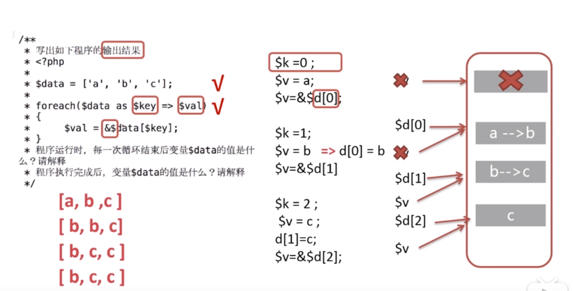

## PHP面试知识点

#### 1.引用变量

**例题：**

什么是引用变量？在php中，用什么符号表示？

> 在php中引用意味着用不同的名字访问同一个变量内容，用&符号

**引用变量的工作原理**

```php
<?php
$a = range(0, 1000);//定义变量，开辟一个a的存储空间
var_dump(memory_get_usage());
$b = $a;//定义b，将a赋值给b，此时不会重新开辟空间
var_dump(memory_get_usage());
$a = range(0, 1000);//对a进行修改，开辟空间变化
var_dump(memory_get_usage());
```


```php
<?php
$a = range(0, 1000);//定义变量，开辟一个a的存储空间
var_dump(memory_get_usage());
$b = &$a;//$a,$b都指向$a
var_dump(memory_get_usage());
$a = range(0, 1000);//对a进行修改，开辟空间变化不大
var_dump(memory_get_usage());
```


**unset删除引用**


**注意：对象本身就是引用传递**

**面试题**



#### 2.常量及数据类型

例题：php字符串的定义方式及各自的区别

定义方式：

- 单引号：不能解析变量，不能解析转义字符，效率更高
- 双引号：可以解析变量和所有转义字符
- heredoc：类似双引号


- newdoc：类似单引号


##### **2.1数据类型**

> 八大数据类型可以归为三大数据类型

**标量数据类型**

- 浮点类型
- 布尔类型

false的七种情况：


- 数组类型


$_SERVER:

<https://www.cnblogs.com/rendd/p/6182918.html>


##### **2.2常量**


#### 3.运算符

**例题：**

foo()和@foo()之间的区别

== 和 === 的区别

示例：0 == 'abc'

> 数字和字符串比较，PHP会把字符串转换成数字再进行比较
>
> PHP转换的规则的是：**若字符串以数字开头，则取开头数字作为转换结果，若无则输出0**


#### 4.流程控制


#### 5.自定义函数和内部函数

##### 5.1变量


##### 2.内置函数


例题：


#### 6.正则表达式

基础

后向引用

贪婪模式

常见的PCRE函数


中文匹配


#### 7.文件目录操作

##### fopen()函数

> fopen() 函数打开文件或者 URL
>
> 如果打开失败，本函数返回 FALSE

```
fopen(filename,mode,include_path,context)
```

| 参数         | 描述                                                         |
| :----------- | :----------------------------------------------------------- |
| filename     | 必需。规定要打开的文件或 URL。                               |
| mode         | 必需。规定要求到该文件/流的访问类型。可能的值见下表。        |
| include_path | 可选。如果也需要在 include_path 中检索文件的话，可以将该参数设为 1 或 TRUE。 |
| context      | 可选。规定文件句柄的环境。Context 是可以修改流的行为的一套选项。 |

**mode 参数的可能的值**

| mode | 说明                                                         |
| :--- | :----------------------------------------------------------- |
| "r"  | 只读方式打开，将文件指针指向文件头。                         |
| "r+" | 读写方式打开，将文件指针指向文件头。                         |
| "w"  | 写入方式打开，将文件指针指向文件头并将文件大小截为零。如果文件不存在则尝试创建之。 |
| "w+" | 读写方式打开，将文件指针指向文件头并将文件大小截为零。如果文件不存在则尝试创建之。 |
| "a"  | 写入方式打开，将文件指针指向文件末尾。如果文件不存在则尝试创建之。 |
| "a+" | 读写方式打开，将文件指针指向文件末尾。如果文件不存在则尝试创建之。 |
| "x"  | 创建并以写入方式打开，将文件指针指向文件头。如果文件已存在，则 fopen() 调用失败并返回 FALSE，并生成一条 E_WARNING 级别的错误信息。如果文件不存在则尝试创建之。这和给底层的 open(2) 系统调用指定 O_EXCL\|O_CREAT 标记是等价的。此选项被 PHP 4.3.2 以及以后的版本所支持，仅能用于本地文件。 |
| "x+" | 创建并以读写方式打开，将文件指针指向文件头。如果文件已存在，则 fopen() 调用失败并返回 FALSE，并生成一条 E_WARNING 级别的错误信息。如果文件不存在则尝试创建之。这和给底层的 open(2) 系统调用指定 O_EXCL\|O_CREAT 标记是等价的。此选项被 PHP 4.3.2 以及以后的版本所支持，仅能用于本地文件。 |

**读取文件**

##### fread()

```
fread(file,length)
```

> fread() 函数读取文件（可安全用于二进制文件）

| 参数   | 描述                           |
| :----- | :----------------------------- |
| file   | 必需。规定要读取打开文件。     |
| length | 必需。规定要读取的最大字节数。 |

##### fgetc()

```
fgetc(file)
```

fgetc() 函数从文件指针中读取一个字符

##### fgets()

```
fgets(file,length)
```

> fgets() 函数从文件指针中读取一行。

| 参数   | 描述                                         |
| :----- | :------------------------------------------- |
| file   | 必需。规定要读取的文件。                     |
| length | 可选。规定要读取的字节数。默认是 1024 字节。 |

##### fclose()

```
fclose(file)
```

> fclose() 函数关闭一个打开文件

##### file_get_contents()

> file_get_contents() 函数把整个文件读入一个字符串中

```
file_get_contents(path,include_path,context,start,max_length)
```

| 参数         | 描述                                                         |
| :----------- | :----------------------------------------------------------- |
| path         | 必需。规定要读取的文件。                                     |
| include_path | 可选。如果也想在 include_path 中搜寻文件的话，可以将该参数设为 "1"。 |
| context      | 可选。规定文件句柄的环境。context 是一套可以修改流的行为的选项。若使用 null，则忽略。 |
| start        | 可选。规定在文件中开始读取的位置。该参数是 PHP 5.1 新加的。  |
| max_length   | 可选。规定读取的字节数。该参数是 PHP 5.1 新加的。            |

##### file_put_contents()

> file_put_contents() 函数把一个字符串写入文件中。
>
> 与依次调用 fopen()，fwrite() 以及 fclose() 功能一样。

```
file_put_contents(file,data,mode,context)
```

| 参数    | 描述                                                         |
| :------ | :----------------------------------------------------------- |
| file    | 必需。规定要写入数据的文件。如果文件不存在，则创建一个新文件。 |
| data    | 可选。规定要写入文件的数据。可以是字符串、数组或数据流。     |
| mode    | 可选。规定如何打开/写入文件。可能的值：FILE_USE_INCLUDE_PATHFILE_APPENDLOCK_EX |
| context | 可选。规定文件句柄的环境。context 是一套可以修改流的行为的选项。若使用 null，则忽略。 |

##### file()

> file() 函数把整个文件读入一个数组中。
>
> 与 file_get_contents()类似，不同的是 file() 将文件作为一个数组返回。数组中的每个单元都是文件中相应的一行，包括换行符在内。
>
> 如果失败，则返回 false。

```
file(path,include_path,context)
```

##### readfile()

> readfile() 函数输出一个文件。
>
> 该函数读入一个文件并写入到输出缓冲。
>
> 若成功，则返回从文件中读入的字节数。若失败，则返回 false。您可以通过 @readfile() 形式调用该函数，来隐藏错误信息。

```
readfile(filename,include_path,context)
```

##### 例题：


#### 8.会话控制

##### cookie

> 存储在客户端中的文件

**setcookie**

```
setcookie(name,value,expire,path,domain,secure)
```

| 参数   | 描述                                               |
| :----- | :------------------------------------------------- |
| name   | 必需。规定 cookie 的名称。                         |
| value  | 必需。规定 cookie 的值。                           |
| expire | 可选。规定 cookie 的有效期。                       |
| path   | 可选。规定 cookie 的服务器路径。                   |
| domain | 可选。规定 cookie 的域名。                         |
| secure | 可选。规定是否通过安全的 HTTPS 连接来传输 cookie。 |

**$_COOKIE**

> 读取

**优缺点**

> 保存在客户端，不会占用服务器资源，同时不安全

##### session

> session称为会话信息，位于web服务器上

**操作**

```
session_start();
$_SESSION;
$_SESSION = [];
session_destroy();
```

**配置**


##### session与cookie的区别

（1）Cookie以文本文件格式存储在浏览器中，而session存储在服务端它存储了限制数据量。它只允许4kb它没有在cookie中保存多个变量。

（2）cookie的存储限制了数据量，只允许4KB，而session是无限量的

（3）我们可以轻松访问cookie值但是我们无法轻松访问会话值，因此它更安全

（4）设置cookie时间可以使cookie过期。但是使用session-destory（），我们将会销毁会话。

#### 9.面向对象

##### 继承

> 单一继承
>
> 方法重写

##### 多态

> 抽象类定义
>
> 接口定义

##### 魔术方法


##### 设计模式

#### 10.网络协议

##### HTTP状态码

##### OSI七层模型

##### HTTP协议


##### HTTP请求方法


##### HTTPS


#### 11.JavaScript和jQuery

#### 12.AJAX

#### 13.Linux

##### Linux常用命令

**系统安全**

> sudo	su	chmod	setfacl

**进程管理**

> w	top	ps	kill	pkill	pstree	killall

**用户管理**

> id	usermod	useradd	groupadd	userdel

**文件系统**

> mount	umount	fsck	df	du

**系统关机重启**

> shutdown	reboot

**网络应用**

> curl	telnet	mail	elinks

**网络测试**

> ping	netstat	host

**网络配置**

> hostname	ifconfig

**常用工具**

> ssh	screen	clear	who	date

**软件包管理**

> yum	rpm	apt-get

**文件查找**

> locate	find

......

##### 系统定时任务

> crontab -e
>
> at

##### vi/vim编译器

一般模式、编辑模式、命令模式、视图模式


##### shell基础


#### 14.mysql

##### 数据类型

##### 基础操作

##### 存储引擎

##### 锁机制

##### 事务处理、存储过程、触发器

#### 15.高并发

#### 16.web资源防盗链

##### Referer

##### 加密签名

#### 17.减少HTTP请求次数


#### 18.浏览器缓存和数据压缩

#### 19.CDN