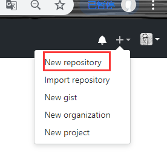
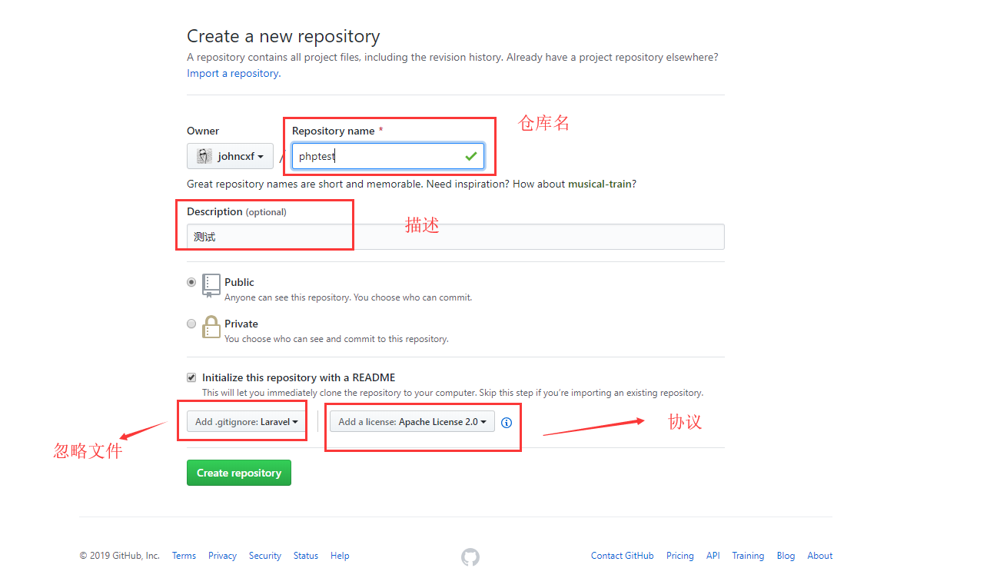
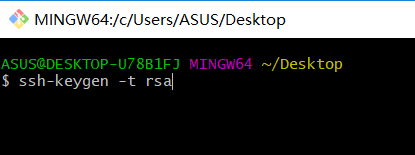
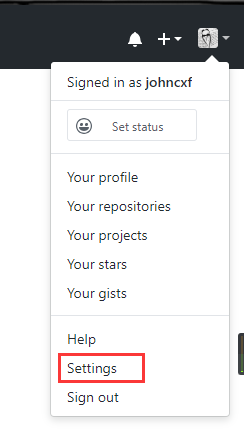
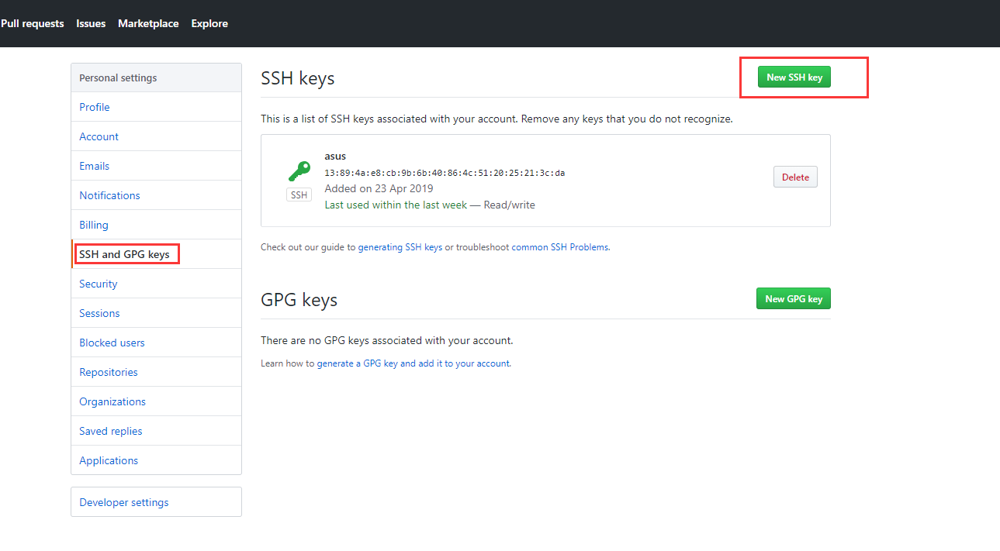

### 常用

##### 退出查看状态

> 当使用`git log`，`git tag`等指令查看所有的时候，按英文字母Q退出

##### 撤销add

```
git reset HEAD -filename # .表示所有的
```

##### 撤销commit

```
git reset --参数 HEAD^ 		# HEAD^表示上一个版本，也可以接commit_id（通过git log查看）
```

**参数**

- mixed： 不删除工作空间改动代码，撤销commit，并且撤销git add . 操作
- soft  不删除工作空间改动代码，撤销commit，不撤销git add . 

- hard：删除工作空间改动代码，撤销commit，撤销git add . 

##### 暂存

使用场景

> 当前分支发生改动，需要切换到其他分支
>
> 没注意再主分支或者不对的分支进行了开发，想要将代码转到正确的分支上去

```
git stash	#暂存
git checkout ... #切换分支
git pop	#从暂存拉取代码（应用并删除储藏，更多选项查看“冲突”部分）
```

##### 拉取远程分支上并创建本地分支

```
git checkout -b 本地分支名 remotes/origin/远程分支名 #采用此种方法建立的本地分支会和远程分支建立映射关系
```

##### 切换到远程分支上

```
git checkout remotes/origin/master # master根据实际情况修改
```

##### 查看所有分支信息

```
git branch -a
```

##### 查看本地分支和远程分支映射关系

```
git branch -vv
```

##### 撤销本地所有修改，没有提交的

```
git checkout .
```

##### 强制使用远程仓库覆盖本地仓库

```
git fetch --all
git reset --hard origin``/master
git pull
```

##### add commit后要撤销commit

```
git reset --soft HEAD^
```

### 指令分类

#### 安装

https://git-scm.com/

https://gitforwindows.org/

**注意：安装路径不要有中文**

#### 配置

> 配置文件为 `~/.gitconfig` ，执行任何Git配置命令后文件将自动创建

```
git config --global user.name 'johncxf'
```

```
git config --global user.email '13777719513@163.com'
```

#### 常用指令

- 初始化新仓库 `git init`
- 克隆旧仓库 `git clone `
- 查看状态 `git status`
- 提交单个文件 `git add index.php`
- 提交所有文件 `git add -A `或`git add .`
- 使用通配符提交 `git add *.js`
- 提交到仓库中 `git commit -m '提示信息'`
- 提交已经跟踪过的文件，不需要执行add `git commit -a -m '提交信息'`
- 删除版本库与项目目录中的文件 `git rm index.php`
- 只删除版本库中文件但保存项目目录中文件 `git rm --cached index.php`
- 修改最后一次提交 `git commit --amend`
- 修改文件名：`git mv a.php index.php`

- 放弃没有提交的修改 `git checkout .`
- 删除没有add 的文件和目录 `git clean -fd`
- 显示将要删除的文件或目录 `git clean -n`

#### Log操作

- 查看日志 `git log`
- 查看最近2次提交日志并显示文件差异 `git log -p -2`
- 显示已修改的文件清单 `git log --name-only`
- 显示新增、修改、删除的文件清单 `git log --name-status`
- 一行显示并只显示SHA-1的前几个字符 `git log --oneline`

#### Alias

> 别名设置
>
> 可以在配置文件 ~/.gitconfig 中查看或直接编辑

```
git config --global alias.c commit
```

通过创建命令别名可以减少命令输入量。

```
git config --global alias.c commit
```

> 可以在配置文件 ~/.gitconfig 中查看或直接编辑

下面是一个Git命令Alias配置

```
[alias]
    a = add .
    c = commit
    s = status
    l = log
    b = branch
```

现在可以使用 `git a` 实现 `git add .` 一样的效果了。

**系统Alias**

在 `~/.bash_profile` 文件中定义

```
alias gs="git status"
alias gc="git commit -m "
alias gl="git log --graph --pretty=format:'%Cred%h%Creset -%C(yellow)%d%Creset %s %Cgreen(%cr) %C(bold blue)<%an>%Creset' --abbrev-commit  "
alias gb="git branch"
alias ga="git add ."
alias go="git checkout"
```

命令行直接使用 `gs` 即可以实现 `git status` 一样的效果了。

> window 系统需要使用 git for window 中的 `Git Base` 软件.gitignore

> .gitignore用于定义忽略提交的文件

- 所有空行或者以注释符号 `＃` 开头的行都会被 Git 忽略。
- 匹配模式最后跟反斜杠（`/`）说明要忽略的是目录。
- 可以使用标准的 glob 模式匹配。

```
.idea
/vendor
.env
/node_modules
/public/storage
*.txt
```

#### Branch

分支用于为项目增加新功能或修复Bug时使用。

1. 创建分支 `git branch dev`

2. 查看分支 `git branch`

3. 切换分支 `git checkout dev`

4. 创建并切换分支 `git checkout -b feature/bbs`

5. 合并dev分支到master

   ```
   git checkout master
   git merge dev
   ```

6. 删除分支 `git branch -d dev`

7. 删除没有合并的分支`git branch -D dev`

8. 删除远程分支 `git push origin :dev`

9. 查看未合并的分支(切换到master) `git branch --no-merged`

10. 查看已经合并的分支(切换到master) `git branch --merged`

#### 冲突

不同分修改同一个文件或不同开发者修改同一个分支文件都可能造成冲突，造成无法提交代码。

1. 使用编辑器修改冲突的文件
2. 添加暂存 `git add .` 表示已经解决冲突
3. git commit 提交完成

当你正在进行项目中某一部分的工作，里面的东西处于一个比较杂乱的状态，而你想转到其他分支上进行一些工作。问题是，你不想提交进行了一半的工作，否则以后你无法回到这个工作点。

"暂存" 可以获取你工作目录的中间状态——也就是你修改过的被追踪的文件和暂存的变更——并将它保存到一个未完结变更的堆栈中，随时可以重新应用。

1. 储藏工作 `git stash`
2. 查看储藏列表 `git stash list`
3. 应用最近的储藏 `git stash apply`
4. 应用更早的储藏 `git stash apply stash@{2}`
5. 删除储藏`git stash drop stash@{0}`
6. 应用并删除储藏 `git stash pop`

#### Tag

Git 也可以对某一时间点上的版本打上标签 ，用于发布软件版本如 v1.0

1. 添加标签 `git tag v1.0`
2. 列出标签 `git tag`
3. 推送标签 `git push --tags`
4. 删除标签 `git tag -d v1.0.1`
5. 删除远程标签 `git push origin :v1.0.1`

#### 发布

对mster分支代码生成压缩包供使用者下载使用，`--prefix` 指定目录名

```
git archive master --prefix='hdcms/' --format=zip > hdcms.zip
```

#### 其他

rebase

> replace base
>
> 移动主分支

### 远程仓库

下面是最热的`Github`进行讲解，使用`码云、codeing` 等国内仓库使用方式一致，就不在赘述了。

**创建仓库**

为了完成以下示例，你需要在`GitHub` 创建好仓库。





#### SSH

**生成秘钥**

使用ssh连接Github发送指令更加安全可靠，也可以免掉每次输入密码的困扰。

在命令行中输入以下代码（windows用户使用 Git Bash）

```
ssh-keygen -t rsa
```

一直按回车键直到结束。系统会在`~/.ssh` 目录中生成 `id_rsa`和`id_rsa.pub`，即密钥`id_rsa`和公钥`id_rsa.pub`。



**向GitHub添加秘钥**





点击 `New SSH key` 按钮，添加上面生成的 `id_rsa.pub` 公钥内容。

#### 关联远程

##### 手动关联

1. 创建本地库并完成初始提交

   ```
   echo "# hd-xj" >> README.md
   git init
   git add README.md
   git commit -m "first commit"
   ```

2. 添加远程仓库

   ```
   git remote add origin git@github.com:johncxf/php.git
   ```

3. 查看远程库

   ```
    git remote -v
   ```

4. 推送数据到远程仓库

   ```
   git push -u origin master
   ```

5. 删除远程仓库关联

   ```
   git remote rm origin
   ```

##### 克隆

> 通过 clone 克隆的仓库，本地与远程已经自动关联，上面几步都可以省略。

```
git clone 地址
```

#### pull

拉取远程主机某个分支的更新，再与本地的指定分支合并。

1. 拉取origin主机的ask分支与本地的master分支合并 `git pull origin ask:ask`
2. 拉取origin主机的ask分支与当前分支合并 `git pull origin ask`
3. 如果远程分支与当前本地分支同名直接执行 `git pull`

#### push

`git push`命令用于将本地分支的更新，推送到远程主机。它的格式与`git pull`命令相似。

1. 将当前分支推送到`origin`主机的对应分支(如果当前分支只有一个追踪分支 ，可省略主机名)

   ```
   git push origin
   ```

2. 使用`-u`选项指定一个默认主机 ,这样以后就可以不加任何参数直播使用`git push`。

   ```
   $ git push -u origin master
   ```

3. 删除远程`ask`分支 `git push origin --delete ask`

4. 本地ask分支关联远程分支并推送 `git push --set-upstream origin ask`

#### 提交多个库

我可以将代码提交到多个远程版本库中，比如后盾人的 [课程代码](https://gitee.com/houdunren/code) 就提交到了Github与Gitee两个库中。

```
# 增加一个远程库
git remote add github git@github.com:houdunwang/coding.git

# 提交到远程库
git push github
```

也可以创建命令一次提交到两个库(注：参考上面的命令设置章节)

```
alias gp="git push & git push github"
```

### hooks

Git拥有客户端的和服务器端的两组钩子，客户端钩子由诸如提交和合并这样的操作所调用，而服务器端钩子作用于诸如接收被推送的提交这样的联网操作。

#### 安装

钩子都被存储在 Git 目录下的 `hooks` 子目录中，也即绝大部分项目中的 `.git/hook`。

```
applypatch-msg.sample
commit-msg.sample
fsmonitor-watchman.sample
post-update.sample
pre-applypatch.sample
pre-commit.sample
pre-merge-commit.sample
pre-push.sample
pre-rebase.sample
pre-receive.sample
prepare-commit-msg.sample
update.sample
```

所有的示例都是 shell 脚本，其中一些还混杂了 Perl 代码，不过，任何正确命名的可执行脚本都可以正常使用 —— 你可以用 Ruby 或 Python，或任何你熟悉的语言编写它们。 这些示例的名字都是以 `.sample` 结尾，如果你想启用它们，得先移除这个后缀。

把一个正确命名（不带扩展名）且可执行的文件放入 `.git` 目录下的 `hooks` 子目录中，即可激活该钩子脚本。 这样一来，它就能被 Git 调用。

#### 钩子类型

##### 客户端钩子

> 客户端钩子由诸如提交和合并这样的操作所调用

###### 提交工作流钩子

- `pre-commit` 钩子：在键入提交信息前运行。 它用于检查即将提交的快照，例如，检查是否有所遗漏，确保测试运行，以及核查代码。 如果该钩子以非零值退出，Git 将放弃此次提交，不过你可以用 `git commit --no-verify` 来绕过这个环节。 你可以利用该钩子，来检查代码风格是否一致（运行类似 `lint` 的程序）、尾随空白字符是否存在（自带的钩子就是这么做的），或新方法的文档是否适当。
- `prepare-commit-msg` 钩子：在启动提交信息编辑器之前，默认信息被创建之后运行。 它允许你编辑提交者所看到的默认信息。 该钩子接收一些选项：存有当前提交信息的文件的路径、提交类型和修补提交的提交的 SHA-1 校验。 它对一般的提交来说并没有什么用；然而对那些会自动产生默认信息的提交，如提交信息模板、合并提交、压缩提交和修订提交等非常实用。 你可以结合提交模板来使用它，动态地插入信息。
- `commit-msg` 钩子：接收一个参数，此参数即上文提到的，存有当前提交信息的临时文件的路径。 如果该钩子脚本以非零值退出，Git 将放弃提交，因此，可以用来在提交通过前验证项目状态或提交信息。 在本章的最后一节，我们将展示如何使用该钩子来核对提交信息是否遵循指定的模板。
- `post-commit` 钩子：在整个提交过程完成后运行。 它不接收任何参数，但你可以很容易地通过运行 `git log -1 HEAD` 来获得最后一次的提交信息。 该钩子一般用于通知之类的事情。

###### 电子邮件工作流钩子

> 你可以给电子邮件工作流设置三个客户端钩子。 它们都是由 `git am` 命令调用的， 如果你需要通过电子邮件接收由 `git format-patch` 产生的补丁，这些钩子也许用得上。

-  `applypatch-msg` 钩子： 它接收单个参数：包含请求合并信息的临时文件的名字。 如果脚本返回非零值，Git 将放弃该补丁。 你可以用该脚本来确保提交信息符合格式，或直接用脚本修正格式错误。
-  `pre-applypatch` 。 在 `git am` 运行期间被调用，它正好运行于应用补丁之后，产生提交之前，所以你可以用它在提交前检查快照。 你可以用这个脚本运行测试或检查工作区。 如果有什么遗漏，或测试未能通过，脚本会以非零值退出，中断 `git am` 的运行，这样补丁就不会被提交。
- `post-applypatch` 运行于提交产生之后，是在 `git am` 运行期间最后被调用的钩子。 你可以用它把结果通知给一个小组或所拉取的补丁的作者。 但你没办法用它停止打补丁的过程。

###### 其它钩子

- `pre-rebase` 钩子：运行于变基之前，以非零值退出可以中止变基的过程。 你可以使用这个钩子来禁止对已经推送的提交变基。 Git 自带的 `pre-rebase` 钩子示例就是这么做的，不过它所做的一些假设可能与你的工作流程不匹配。

- `post-rewrite` 钩子：被那些会替换提交记录的命令调用，比如 `git commit --amend` 和 `git rebase`（不过不包括 `git filter-branch`）。 它唯一的参数是触发重写的命令名，同时从标准输入中接受一系列重写的提交记录。 这个钩子的用途很大程度上跟 `post-checkout` 和 `post-merge` 差不多。
- `post-checkout` 钩子：在 `git checkout` 成功运行后被调用。你可以根据你的项目环境用它调整你的工作目录。 其中包括放入大的二进制文件、自动生成文档或进行其他类似这样的操作。
- `post-merge` 钩子：在 `git merge` 成功运行后被调用。 你可以用它恢复 Git 无法跟踪的工作区数据，比如权限数据。 这个钩子也可以用来验证某些在 Git 控制之外的文件是否存在，这样你就能在工作区改变时，把这些文件复制进来。
- `pre-push` 钩子：在 `git push` 运行期间， 更新了远程引用但尚未传送对象时被调用。 它接受远程分支的名字和位置作为参数，同时从标准输入中读取一系列待更新的引用。 你可以在推送开始之前，用它验证对引用的更新操作（一个非零的退出码将终止推送过程）。
-  `pre-auto-gc` 钩子：Git 的一些日常操作在运行时，偶尔会调用 `git gc --auto` 进行垃圾回收。这个钩子会在垃圾回收开始之前被调用，可以用它来提醒你现在要回收垃圾了，或者依情形判断是否要中断回收。

##### 服务端钩子

> 这些钩子脚本在推送到服务器之前和之后运行。 推送到服务器前运行的钩子可以在任何时候以非零值退出，拒绝推送并给客户端返回错误消息，还可以依你所想设置足够复杂的推送策略。

- `pre-receive`钩子：处理来自客户端的推送操作时，最先被调用的脚本是 `pre-receive`。 它从标准输入获取一系列被推送的引用。如果它以非零值退出，所有的推送内容都不会被接受。 你可以用这个钩子阻止对引用进行非快进（non-fast-forward）的更新，或者对该推送所修改的所有引用和文件进行访问控制。
- `update`钩子：`update` 脚本和 `pre-receive` 脚本十分类似，不同之处在于它会为每一个准备更新的分支各运行一次。 假如推送者同时向多个分支推送内容，`pre-receive` 只运行一次，相比之下 `update` 则会为每一个被推送的分支各运行一次。 它不会从标准输入读取内容，而是接受三个参数：引用的名字（分支），推送前的引用指向的内容的 SHA-1 值，以及用户准备推送的内容的 SHA-1 值。 如果 update 脚本以非零值退出，只有相应的那一个引用会被拒绝；其余的依然会被更新。
- `post-receive钩子`：`post-receive` 挂钩在整个过程完结以后运行，可以用来更新其他系统服务或者通知用户。 它接受与 `pre-receive` 相同的标准输入数据。 它的用途包括给某个邮件列表发信，通知持续集成（continous integration）的服务器， 或者更新问题追踪系统（ticket-tracking system） —— 甚至可以通过分析提交信息来决定某个问题（ticket）是否应该被开启，修改或者关闭。 该脚本无法终止推送进程，不过客户端在它结束运行之前将保持连接状态， 所以如果你想做其他操作需谨慎使用它，因为它将耗费你很长的一段时间。


