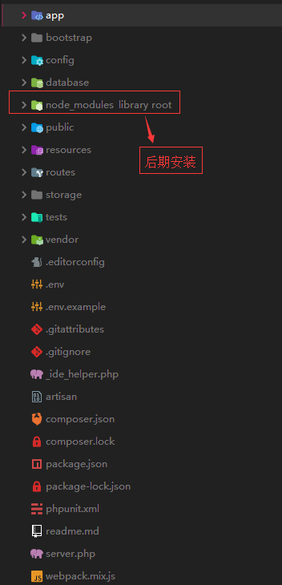

### 前言

> laravel是目前最火的php框架，之前用过thinkphp3.2和thinkphp5.1，最近接触laravel
>
> 我这里使用的laravel版本是5.6

### 安装

#### 环境要求

官方文档给的环境要求**

- PHP> = 7.1.3
- OpenSSL PHP扩展
- PDO PHP扩展
- Mbstring PHP扩展
- Tokenizer PHP扩展
- XML PHP扩展
- Ctype PHP扩展
- JSON PHP扩展

#### composer安装

需要先在自己电脑安装composer，网上有许多教程。国外镜像较慢，可以安装国内镜像

> 参考：https://www.phpcomposer.com/

在站点安装laravel，可以指定版本安装，如下blog是项目别名，可以自己设置，后面版本不加则安装默认版本

```
composer create-project --prefer-dist laravel/laravel blog "5.6.*"
```

#### 安装语言包

composer安装语言包

```
composer require caouecs/laravel-lang:~3.0
```

安装完成可以在`/vendor`目录中多了`caouecs`目录

在`/vendor/caouecs/src`中复制需要的语言包目录到`/resources/lang`目录中

修改`/config/app.php`中的`'locale' => 'en'`

```
locale' => 'en' 改成 locale' => 'zh-CN'
```

#### bootstrap的使用

##### 安装

`package.json`中已经定义了需要安装的依赖，如果需要可以更改

```
"devDependencies": {
        "axios": "^0.19",
        "bootstrap": "^4.1.0",
        "cross-env": "^5.1",
        "jquery": "^3.2",
        "laravel-mix": "^4.0.7",
        "lodash": "^4.17.13",
        "popper.js": "^1.12",
        "resolve-url-loader": "^2.3.1",
        "sass": "^1.15.2",
        "sass-loader": "^7.1.0",
        "vue": "^2.5.17",
        "vue-template-compiler": "^2.6.10"
    }
```

npm安装生成`node_modules`目录，npm安装类似composer安装，是国外源，可以更改成cnpm来安装

```
npm install
```

##### 编译前端资源

命令定义在 `package.json` 中

```
"scripts": {
        "dev": "npm run development",
        "development": "cross-env NODE_ENV=development node_modules/webpack/bin/webpack.js --progress --hide-modules --config=node_modules/laravel-mix/setup/webpack.config.js",
        "watch": "npm run development -- --watch",
        "watch-poll": "npm run watch -- --watch-poll",
        "hot": "cross-env NODE_ENV=development node_modules/webpack-dev-server/bin/webpack-dev-server.js --inline --hot --config=node_modules/laravel-mix/setup/webpack.config.js",
        "prod": "npm run production",
        "production": "cross-env NODE_ENV=production node_modules/webpack/bin/webpack.js --no-progress --hide-modules --config=node_modules/laravel-mix/setup/webpack.config.js"
    },
```

我们就可以运行 `npm run dev` 命令通过 Laravel Mix 来编译前端资源。

该命令最终运行的是 `npm run development` 命令，意为在开发环境对前端资源进行编译，如果需要的话你可以在这里对命令参数进行修改，如果是在生产环境，需要运行 `npm run prod` 命令，如果在开发环境中想要修改文件后自动编译资源可以运行 `npm run watch` 命令

参考：https://xueyuanjun.com/post/9665.html

#### mysql版本问题

如果mysql版本低于5.7.7，使用数据迁移的数据后报错

需要在laravel的`App\Providers\AppServiceProvider`中添加

```
public function boot()
{
    //
    \Schema::defaultStringLength(191);
}
```

### 目录结构

开始学习框架第一步应该先了解他的目录结构，接下来学习起来才能得心应手

以下是laravel的目录结构，app下的部分目录是我后期生成的，初始安装不自带

```
| app 			应用程序目录
| 	| Console 			控制台目录
| 	| Http				Http目录
| 	| Providers			服务目录
|	| Job				队列作业
|	| Listeners			时间侦听
| 	| Exceptions 		异常处理
| 	| Mail				邮件目录
| 	| Notifications		通知目录
| 	| Policy			策略目录
| bootstrap 	Bootstrap目录
| 	| cache				服务缓存文件
| 	| app.php			路由文件
| config 		配置目录
| database 		数据库目录
|	| factories			工厂类
|	| migrations		数据迁移文件
|	| seeds
| public 		公共目录
|	| css				css文件	
|	| js				js文件
| resources 	资源目录
|	| assets
|	| lang				语言包
|	| views				视图文件
| routes 		路由目录
| storage 		存储目录
| tests 		测试目录
| vendor 		供应商目录
| .env			全局配置文件
| .env.example	配置文件样例
| .gitattributes指定费文本文件的对比合并方式
| .gitignore	git忽略文件
| _ide_helper.php
| artisan		控制文件
| composer.json	composer依赖文件
| composer.lock	composer锁定文件
| package.json	依赖文件
| package-lock.json
| phpunit.xml
| readme.md		说明文档
| server.php	服务文件
| webpack.mix.js资源编译文件
```

以下是安装laravel的初始目录截图，node_modules是composer安装的前端文件



### 快速创建文件

**模型**

```
php artisan make:model Blog
```

**控制器**

```
//创建控制器
php artisan make:controller BlogController
//资源控制器
php artisan make:controller --resource BlogController
//资源控制器并指定模型
php artisan make:controller --resource --model=Blog BlogController
```

### 路由

#### 基本路由

路由存放在`routes`目录中，以下是基本路由

```
Route::get('foo', function () {
    return 'Hello World';
});
```

#### 可用路由方法

路由器允许您注册响应任何HTTP动词的路由：

```
Route::get($uri, $callback);
Route::post($uri, $callback);
Route::put($uri, $callback);
Route::patch($uri, $callback);
Route::delete($uri, $callback);
Route::options($uri, $callback);
```

时您可能需要注册响应多个HTTP谓词的路由。您可以使用该`match`方法执行此操作。或者，您甚至可以使用以下`any`方法注册响应所有HTTP谓词的路由：

```php
Route::match(['get', 'post'], '/', function () {
    //
});

Route::any('foo', function () {
    //
});
```

#### 重定向路由

如果要定义重定向到另一个URI的路由，则可以使用该方法。此方法提供了方便的快捷方式，因此您无需为执行简单重定向定义完整路由或控制器：`Route::redirect`

```php
Route::redirect('/here', '/there', 301);
```

#### 路由别名

使用`name()`方法

```
Route::get('/home', 'TestController@home')->name('home');
```

#### 路由参数

比如我们定义下面的路由规则，其中 {user} 和 {name} 为路由中的参数变量

```text
Route::get('/user/{user}/{name}','UserController@show')->name('user.show');
```

### 视图

`视图文件存放在resources/views` 中

### 模型

默认生成的模型通常放在 `app` 目录中，可以直接使用artisan命令创建

```
php artisan make:model Article
```

#### 数据表命名

可以通过在模型上定义 `table` 属性，来指定自定义数据表。如果不指定时使用模型名加s，如Article 对应表名为articles

```text
 protected $table = 'articles';
```

#### 时间戳

默认情况下，Eloquent 会默认数据表中存在 `created_at` 和 `updated_at` 这两个字段。如果你不需要这两个字段，则需要在模型内将 `$timestamps` 属性设置为 `false` ：

```text
//该模型是否被自动维护时间戳
public $timestamps = false;
```

#### 模型事件

Eloquent 的模型触发了几个事件，可以在模型的生命周期的以下几点进行监控： `retrieved`、`creating`、`created`、`updating`、`updated`、`saving`、`saved`、`deleting`、`deleted`、`restoring`、`restored`。事件能在每次在数据库中保存或更新特定模型类时轻松地执行代码。

如果要给某个模型监听很多事件，则可以使用观察器将所有监听器分组到一个类中。观察器类里的方法名应该对应 Eloquent 中你想监听的事件。 每种方法接收 model 作为其唯一的参数。Laravel 没有为观察器设置默认的目录，所以你可以创建任何你喜欢你的目录来存放：

##### 定义事件

下面是User模型的观察器

```text
<?php namespace app\Observers;
use App\User;
class UserObserver{
	public function creating(User $user){
		$user->active_token = str_random(20);
	}
	public function saving(User $user){}
}
```

##### 声明事件

在AppServiceProvicer服务提供者的 `boot` 方法执行以下代码

```text
User::observe(UserObserver::class);
```

或者在模型中定义

```text
namespace App;

use App\Observers\UserServer;
use Illuminate\Notifications\Notifiable;
use Illuminate\Foundation\Auth\User as Authenticatable;

class User extends Authenticatable
{
    ...
    protected static function boot()
    {
        parent::boot();
        User::observe(UserServer::class);
    }
}
```


### 控制器

存放在`app/Http/Controllers`目录中

#### 定义控制器

```php
<?php

namespace App\Http\Controllers;

use App\User;
use App\Http\Controllers\Controller;

class UserController extends Controller
{
    /**
     * Show the profile for the given user.
     *
     * @param  int  $id
     * @return Response
     */
    public function show($id)
    {
        return view('user.profile', ['user' => User::findOrFail($id)]);
    }
}
```

您可以定义到此控制器操作的路由，如下所示：

```php
Route::get('user/{id}', 'UserController@show');
```

#### 资源控制器

Laravel 遵从 RESTful 架构的设计原则，将数据看做一个资源。Laravel 资源路由将典型的「CRUD」路由分配给具有单行代码的控制器。

使用 Artisan 命令 `make:controller` 来快速创建控制器：

```text
php artisan make:controller ArticleController --resource
```

接下来，你可以给控制器注册一个资源路由：

```text
Route::resource('photos', 'PhotoController');
```

##### 资源控制器方法说明：

| 动作      | URI                    | 行为    | 路由名称       |
| --------- | ---------------------- | ------- | -------------- |
| GET       | `/photos`              | index   | photos.index   |
| GET       | `/photos/create`       | create  | photos.create  |
| POST      | `/photos`              | store   | photos.store   |
| GET       | `/photos/{photo}`      | show    | photos.show    |
| GET       | `/photos/{photo}/edit` | edit    | photos.edit    |
| PUT/PATCH | `/photos/{photo}`      | update  | photos.update  |
| DELETE    | `/photos/{photo}`      | destroy | photos.destroy |

> 可以使用 `php artisan route:list` 查看已经定义的路由

##### 指定资源模型

如果你使用了路由模型绑定，并且想在资源控制器的方法中使用类型提示，你可以在生成控制器的时候使用 `--model` 选项：

```text
php artisan make:controller PhotoController --resource --model=Photo
```

##### 伪造表单方法

因为 HTML 表单不能生成 `PUT`、 `PATCH` 或者 `DELETE` 请求，所以你需要添加一个隐藏的 `_method` 输入字段来伪造这些 HTTP 动作。辅助函数 `method_field`可以帮你创建这个字段：

```text
@method('DELETE')
```

### 分页

控制器中

```text
$users = User::paginate(10);
```

模板中显示分页列表

```text
$users->links();
```

分页时传递GET参数

```text
$users->appends(Request::except('page'))->links()
```

### 策略

创建策略文件

```
artisan make:policy --model=User UserPolicy
```

在新建策略文件中对应的方法中编写策略

在`App\Providers\AuthServiceProvider`中注册

```
protected $policies = [
    'App\Model' => 'App\Policies\ModelPolicy',
    'App\User' => UserPolicy::class,
    'App\Blog' => BlogPolicy::class,
];
```

### 表单

#### 表单函数

##### **csrf**

laravel （跨站请求伪造），Laravel 为了安全考虑，会让我们提供一个 token（令牌）来防止我们的应用受到CSRF（跨站请求伪造）的攻击。放置在表单（form）体内。

```text
<form method="POST" action="/profile">
    @csrf
    ...
</form>
```

##### **old**

`old`函数获取一次性存放在session中的值，用在表单的value属性中。这样当我们输出错误回调页面时，原来输入的值还存在。

```text
<input type="text" class="form-control" name="name" value={{old('name')}}>
```

#### 表单验证

下面是控制器中的 store 方法

```text
public function store(Request $request)
{
    $this->validate($request, [
        'title' => 'required|unique:posts|max:255',
        'body' => 'required',
    ]);

    // 文章内容是符合规则的，存入数据库
}
```

##### 常用规则

| 规则      | 说明说明                                                     | 示例                                    |
| --------- | ------------------------------------------------------------ | --------------------------------------- |
| confirmed | 验证的字段必须和 `foo_confirmation`的字段值一致。例如，如果要验证的字段是 `password`，输入中必须存在匹配的 `password_confirmation` 字段。 |                                         |
| size      | 验证的字段必须具有与给定值匹配的大小。对于字符串来说，*value* 对应于字符数。对于数字来说，*value* 对应于给定的整数值。对于数组来说， *size* 对应的是数组的 `count` 值。对文件来说，*size* 对应的是文件大小（单位 kb ）。 |                                         |
| max       | 验证中的字段必须小于或等于 *value*。字符串、数字、数组或是文件大小的计算方式都用 [`size`](https://laravel-china.org/docs/laravel/5.5/validation#rule-size) 方法进行评估。 |                                         |
| min       | 验证中的字段必须具有最小值。字符串、数字、数组或是文件大小的计算方式都用 [`size`](https://laravel-china.org/docs/laravel/5.5/validation#rule-size) 方法进行评估。 |                                         |
| unique    | unique:*table*,*column*,*except*,*idColumn*验证的字段在给定的数据库表中必须是唯一的。如果没有指定 `column`，将会使用字段本身的名称 | 'email' => 'unique:users,email_address' |
| required  | 验证的字段必须存在于输入数据中，而不是空。如果满足以下条件之一，则字段被视为「空」： 该值为 `null`. 该值为空字符串。 该值为空数组或空的 `可数` 对象。 该值为没有路径的上传文件。 |                                         |
| email     | 验证的字段必须符合 e-mail 地址格式。                         |                                         |
| sometimes | **只有**在该字段存在时， 才对字段执行验证                    |                                         |
| nullable  | 如果你不希望验证程序将 `null` 值视为无效的，那就将「可选」的请求字段标记为 `nullable`，也可以理解为有值时才验证。 |                                         |

```text
$request->validate([
    'title' => 'required|unique:posts|max:255',
    'body' => 'required',
    'publish_at' => 'nullable|date',
]);
```

在这个例子里，我们指定 `publish_at` 字段可以为 `null` 或者一个有效的日期格式。如果 `nullable` 的修饰词没有被添加到规则定义中，验证器会认为 `null` 是一个无效的日期格式。

> 更多验证规则使用时请查阅手册 https://laravel.com/docs/5.6/validation

##### 显示验证错误

如果表单验证失败，laravel会向分配错误信息到 `$errors` 中，那么我们就可在模板中使用以下代码展示验证错误。

```text
@if (count($errors) > 0)
    <div class="alert alert-danger">
        <ul>
            @foreach ($errors->all() as $error)
                <li>{{ $error }}</li>
            @endforeach
        </ul>
    </div>
@endif
```

#### 表单请求验证

面对更复杂的验证情境中，你可以创建一个「表单请求」来处理更为复杂的逻辑

```text
php artisan make:request StoreBlogRequest
```

新生成的类保存在 `app/Http/Requests` 目录下。

```text
<?php namespace App\Http\Requests;
use Illuminate\Foundation\Http\FormRequest;
class UserRequest extends FormRequest
{
    //权限验证
    public function authorize()
    {
        return true;
    }
    //验证规则
    public function rules()
    {
        return [
            'name'=>'required|max:20',
            'email'=>'required|email|unique:users|max:255',
            'password'=>'required|confirmed|min:5',
        ];
    }
    //提示信息
    public function messages()
    {
        return [
            'name.required' => '名称不能为空',
            'email.required'  => '邮箱不能为空',
        ];
    }
}
```

在控制器的方法中依赖注入就可以使用了

```text
public function store(UserRequest $request){  
}
```

### 重定向

`redirect` 函数返回一个 HTTP 重定向响应，如果调用时没有传入参数则返回 redirector 实例：

```text
return redirect('/home');
return redirect()->route('route.name');
```

传递路由参数

```text
$user = User::first()
return redirect()->route('user.show',[$user]);
```

假设路由规则为 `Route::get('user/show/{user}')` ，上例中的`[$user]`会自动提出 $user模型对象的主键做为路由参数。

### 数据迁移

创建表文件，在`database\magrations\`中会生成对应的表结构文件

```
php artisan make:migration create_blogs_table --create
```

创建表到数据库

```
php artisan migration
```

### 数据填充

#### 普通方式

phpstorm使用命令输入`artisan make:seeder UserSeeder`就会在`database/seeds/`下生成`UserSeeder.php`

然后在`DatabaseSeeder`注册

```php
public function run()
{
        // $this->call(UsersTableSeeder::class);
        $this->call(userSeeder::class);
}
```

在`UserSeeder.php`写入

```php
public function run()
{
    \App\User::create([
        'name' => 'cxf',
        'email' => 'cxf@qq.com',
        'password' => bcrypt('admin')
    ]);
}
```

命令执行

```
artisan db:seed
```

#### 模型工厂

在`database/factories/`中自带的`UserFactory.php`

> https://github.com/fzaninotto/Faker

命令运行

```
artisan tinker 
```

输入指令生成数据（数据表数据没有生成，只是展示测试）

```
factory(App\User::class,20)->make()
```

生成数据

```
factory(App\User::class,20)->create()
```

#### 调用模型工程

新建seeder文件，在`database\seeds`中

```
php artisan make:seeder BlogSeeder
```

写入创建数量

```
public function run()
{
	factory(\App\Blog::class, 200)->create();
}
```

在`database\seeds\DatabaseSeeder.php`中调用

```
public function run()
{
    // $this->call(UsersTableSeeder::class);
    $this->call(userSeeder::class);
    $this->call(BlogSeeder::class);
}
```

执行重置

```
php artisan migrate:refresh --seed
```

### 消息通知

#### **创建通知**

```text
php artisan make:notification FindPasswordNotify
```

这个命令会在 `app/Notifications` 目录下生成一个新的通知类。

#### 数据库通知

`database` 通知渠道在一张数据库表里存储通知信息。该表以自定义的 JSON 格式，存储如通知类型等描述通知的信息。需要先创建一个数据库表来存放这些通知。

```text
php artisan notifications:table

php artisan migrate
```

修改通知类的 `via` 方法为数据库通知

```text
public function via($notifiable)
{
	return ['database'];
}
```

然后定义 `toArray` 方法返回用于储存到数据表中的通知数据。

##### 存取通知

Laravel 的默认模型 `App\User` 已经引入了 Trait `Illuminate\Notifications\Notifiable` ，它包含了一个 Eloquet 关系 `notifications` ，可以为实体返回通知。

```text
$user = App\User::find(1);

foreach ($user->notifications as $notification) {
    echo $notification->type;
}
```

如果你仅仅想检索所有「未读」通知，你需要使用 `unreadNotifications` 关系。

```text
$user = App\User::find(1);

foreach ($user->unreadNotifications as $notification) {
    echo $notification->type;
}
```

##### 通知标记已读

```text
$user = App\User::find(1);

foreach ($user->unreadNotifications as $notification) {
    $notification->markAsRead();
}
```

你可以直接使用 `markAsRead` 方法操作一个通知集合，而不是遍历处理每个通知：

```text
$user->unreadNotifications->markAsRead();
```

#### 邮件通知

修改通知类中的 `toMail` 与 `__construct` 方法

```text
public function __construct($token)
{
	$this->token=$token;
}
public function toMail($notifiable)
{
	return (new MailMessage)
		->subject('验证邮箱')
		->greeting(config('app.name'))->line('点击下面的链接重设密码')
		->action('重置密码',url(route('password.change', $this->token)))
		->line('感谢使用后盾人');
}
```

##### 自定义模板

你可以通过发布通知包的资源来修改 HTML 模板和纯文本模板。运行这个命令后，邮件通知模板就被放在了 `resources/views/vendor/notifications` 文件夹下：

```text
php artisan vendor:publish --tag=laravel-notifications
```

#### 发送通知

##### 使用 Notifiable Trait

通知可以通过两种方法发送： `Notifiable` trait 的`notify` 方法或 `Notification` [facade](https://laravel-china.org/docs/laravel/5.6/facades)。首先，让我们探索使用 trait ：

```text
<?php namespace App;

use Illuminate\Notifications\Notifiable;
use Illuminate\Foundation\Auth\User as Authenticatable;

class User extends Authenticatable
{
    use Notifiable;
}
```

默认的 `App\User` 模型中使用了这个 trait，它包含着一个可以用来发通知的方法：`notify` 。 `notify`方法需要一个通知实例做参数：

```text
use App\Notifications\InvoicePaid;

$user->notify(new InvoicePaid($invoice));
```

##### **使用 Notification Facade**

另外，你可以通过 `Notification` `facade` 来发送通知。它主要用在当你给多个可接收通知的实体发送通知的时候，比如给用户集合发通知。要用 facade 发送通知的话，要把可接收通知的实体和通知的实例传递给 `send` 方法：

```text
Notification::send($users, new InvoicePaid($invoice));
```

#### 队列化通知

发送通知可能很耗时，尤其是是当频道需要一个额外的 API 来发送通知。要加速你的应用响应时间，让你的通知继承 `ShouldQueue` 接口 并且在你的类中添加 `Queueable` trait。这些接口和 trait 已经被使用 `make:notification` 生成的所有通知引入了，所以你可以直接将他们添加到你的通知类：

```text
<?php

namespace App\Notifications;

use Illuminate\Bus\Queueable;
use Illuminate\Notifications\Notification;
use Illuminate\Contracts\Queue\ShouldQueue;

class InvoicePaid extends Notification implements ShouldQueue
{
    use Queueable;

    // ...
}
```

做好一上操作并正常配置好队列后，系统将自动使用异步队列发送通知。

### 添加Blade模板标签

- **在`\app\services`新建service类`TagService.php`**

- **在providers中注册**

```php
public function boot()
{
	(new TagService())->make();
}
```

- **在`TagService.php`中编写，下面是示例代码**

```php
public function make()
{
    $this->friendLinkLists();
}

/**
     * 友情链接
     */
public function friendLinkLists()
{
    Blade::directive('friendLinks', function ($expression) {
        $expression = $expression?$expression:10;
        $php=<<<php
            <ul class="list-group mt-2">
            <li class="list-group-item active">友情链接</li>
            <?php
            \$param = $expression;
        \$data = (new \App\Stores\Home\HomeStore)->getFriendLinks(\$param);
        foreach(\$data as \$field):
        echo '<li class="list-group-item"><a href="'.\$field->url.'" class="text-decoration-none" target="_blank">'.\$field->name.'</a></li>';
        endforeach;
        ?>
            </ul>
            php;
        return $php;
    });
}
```

- **在blade模板中调用**

```
@friendLinks
```


