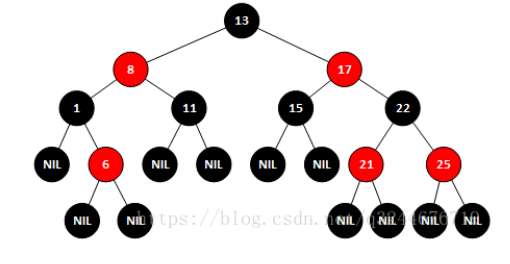
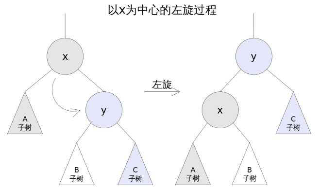
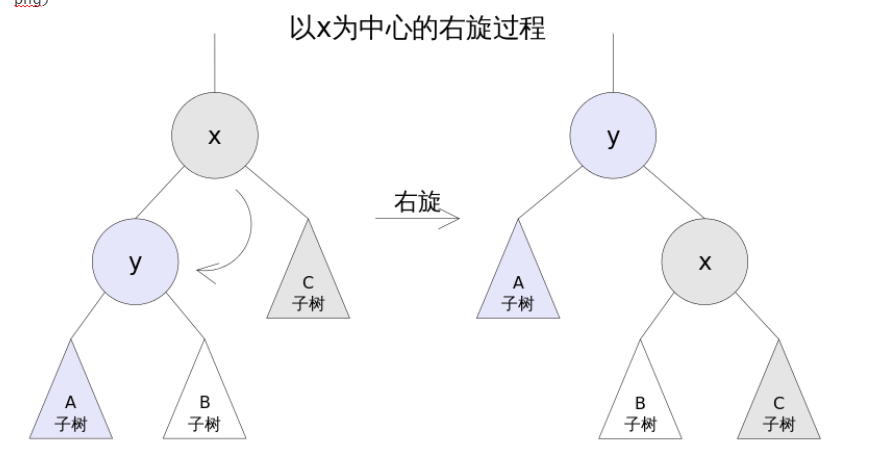

### 数据结构和算法

#### 1.时间复杂度

https://blog.csdn.net/qq_41523096/article/details/82142747

https://www.bilibili.com/video/av30688616/?p=30

#### 2.数组链表的区别

- 链表是链式的存储结构；数组是顺序的存储结构
- 链表通过指针来连接元素与元素，数组则是把所有元素按次序存储
- 链表插入删除相对数组较为简单，寻找元素较为困难

#### 3.红黑树

> 一种平衡的二叉查找树

##### 特征

特征

特征

1. 节点是红色或者黑色
2. 根节点是黑色
3. 每个红色节点的两个子节点都是黑色
4. 对于每个节点，从该点至`null`（树尾端）的任何路径，都含有相同个数的黑色节点

##### 图示



##### 调整

###### 颜色

> 根据红黑树特征调整颜色

###### 左旋

> 左旋的过程是将`x`的右子树绕`x`逆时针旋转，使得`x`的右子树成为`x`的父亲，同时修改相关节点的引用。旋转之后，二叉查找树的属性仍然满足



###### 右旋

> 右旋的过程是将`x`的左子树绕`x`顺时针旋转，使得`x`的左子树成为`x`的父亲，同时修改相关节点的引用。旋转之后，二叉查找树的属性仍然满足



##### 代码实现

> <https://blog.csdn.net/baidu_30000217/article/details/52938622>
>
> <https://blog.csdn.net/AIkiller/article/details/83151221

#### 4.排序算法

##### 4.1 冒泡排序

**原理**

> 两两相邻的数进行比较，如果反序就交换，否则不交换

**复杂度**

> 时间复杂度：O(n^2)
>
> 空间复杂度：O(1)

**代码实现**

```php
<?php
/**
  * 快速排序.
  * @param  array $arr 待排序数组
  * @return array
  */
function bubblesort($arr) {
	$len = count($arr);
	//从小到大
	for($i = 1; $i < $len; $i++){
		for ($j = $len-1; $j >= $i; $j--) {
			if ($arr[$j] < $arr[$j-1]) {//如果是从大到小的话，只要在这里的判断改成if($b[$j]>$b[$j-1])就可以了
				 $tmp = $arr[$j];
				 $arr[$j] = $arr[$j-1];
				 $arr[$j-1] = $tmp;
			}
		}
	}
	return $arr;
}
```

##### 4.2 快速排序

**原理**

> 选择一个基准元素，通常选择第一个元素或者最后一个元素。通过一趟扫描，将待排序列分成两部分，一部分比基准元素小，一部分大于等于基准元素。此时基准元素在其排好序后的正确位置，然后再用同样的方法递归地排序划分的两部分。

**复杂度**

> 时间复杂度：O(nlog2n)，最差：O(n^2)
>
> 空间复杂度：O(n)，最差：O(log2n)

**代码实现**

```php
<?php
/**
  * 快速排序.
  * @param  array $value 待排序数组
  * @param  array $left  左边界
  * @param  array $right 右边界
  * @return array
  */
function quicksort(&$value, $left, $right) {
	//左右重合，跳出
	if ($left >= $right) {
		return;
	}
	$base = $left;
	do {
		//最右边开始找第一个小于基准点的值，然后互换位置
		//找到为止
		for ($i = $right; $i > $base; --$i) {
			if ($value[$base] > $value[$i]) {
				$tmp = $value[$i];
				$value[$i] = $value[$base];
				$value[$base] = $tmp;
				$base = $i;
				break;
			
			}
		}
		
		//最左边开始找第一个大于基准点的值，互换位置
		//找到为止

		for ($j = $left; $j < $base; ++$j) {
			if ($value[$base] < $value[$j]) {
				$tmp = $value[$j];
				$value[$j] = $value[$base];
				$value[$base] = $tmp;
				$base = $j;
				break;
			
			}
		}
	} while ($i > $j);//直到索引重合
	//开始递归
	//以当前索引为分界
	//开始排序左部分
	quicksort($value, $left, $i - 1);
	quicksort($value, $i + 1, $right);

}
// $value = [1,4,2,7,6,4,2];
// quicksort($value,0,count($value) - 1);
// print_r($value);

```

##### 4.3 选择排序

**原理**

> 每次从待排序的数据元素中选出最小（或最大）的一个元素，存放在序列起始位置，直到全部排序的数据元素排完

**复杂度**

> 时间复杂度：O(n^2)
>
> 空间复杂度：O(1)

**代码实现**

```php
<?php
/**
  * 选择排序.
  * @param  array $arr 待排序数组
  * @return array
  */
function selectSort($arr) {
	$len = count($arr);
	for ($i = 0; $i < $len - 1; $i++) {
		//假设最小值为$i
		$min = $i;
		for ($j = $i + 1; $j < $len; $j++) { 
			//发现更小的,记录下最小值的位置；并且在下次比较时采用已知的最小值进行比较
			if ($arr[$min] > $arr[$j]) {
				$min = $j;
			}
		}
		//已经确定了当前的最小值的位置，如果发现最小值的位置与当前假设的位置$i不同，则位置互换即可
		if ($min != $i) {
			$tmp = $arr[$min];
            $arr[$min] = $arr[$i];
            $arr[$i] = $tmp;
		}
	}
	return $arr;
}
// $list = array(10,3,5,7,18,11,45,64,74,23,21,6);
// $list = selectSort($list);
// print_r($list);
```

##### 4.4 插入排序

**原理**

> 每次从无序表中取出第一个元素，把他到有序表合适的位置，使有序表依然有序


**复杂度**

> 时间复杂度：O(n^2)
>
> 空间复杂度：O(1)

**代码实现**

```php
/**
  * 插入排序.
  * @param  array $arr 待排序数组
  * @return array
  */
function insertSort($arr) {
	$len = count($arr);
	for ($i = 1; $i < $len; $i++) {
		$tmp = $arr[$i];
		for ($j = $i - 1; $j >= 0; $j--) {
			//发现插入的元素要小，交换位置，将后边的元素与前面的元素互换
			if ($tmp < $arr[$j]) {
				$arr[$j+1] = $arr[$j];
                $arr[$j] = $tmp;
			} else {
				//如果碰到不需要移动的元素，由于是已经排序好是数组，则前面的就不需要再次比较了。
                break;
			}
		}
	}
	return $arr;
}
// $list = array(10,3,5,7,18,11,45,64,74,23,21,6);
// $list = insertSort($list);
// print_r($list);
```

##### 4.5 希尔排序

**原理**

> 把待排序的数据根据增量分成几个子序列，对子序列进行插入排序，直到增量为1，直接进行插入排序；增量的排序，一般是数组的长度的一半，再变为原来增量的一半，直到增量为1

**示例**

对`49，38，65，97，76，13，27，49，55，04 `十个数字排序

增量分别为：`ceil(10 / 2) = 5`，`ceil(5 / 2) = 3`，`ceil(3 / 2) = 2`，`ceil(2 / 1) = 1`

```
初始：      49，38，65，97，76，13，27，49，55，04
第一趟：    13，27，49，55，04，49，38，65，97，76
第二趟：    13，04，49，38，27，49，55，65，97，76
第三趟：    13，04，27，38，49，49，55，65，97，76
第四趟：    13，04，27，38，49，49，55，65，76，97
```


**复杂度**

> 时间复杂度：O(nlog2n)，最差：O(n^2)
>
> 空间复杂度：O(1)

**代码实现**

```php
<?php
/**
  * 希尔排序(对直接插入排序的改进)
  * @param  array $arr 待排序数组
  * @return array
  */
function shellSort(&$arr) {
    $count = count($arr);
    //增量
    $inc = $count;
    do {
        //计算增量
        $inc = ceil($inc / 2);
        for ($i = $inc; $i < $count; $i++) {
        	//设置哨兵
            $temp = $arr[$i];
            //需将$temp插入有序增量子表
            for ($j = $i - $inc; $j >= 0 && $arr[$j + $inc] < $arr[$j]; $j -= $inc) {
                $arr[$j + $inc] = $arr[$j]; //记录后移
            }
            //插入
            $arr[$j + $inc] = $temp;
        }
        //增量为1时停止循环
    } while ($inc > 1);
}
// $arr = array(49,38,65,97,76,13,27,49,55,04);
// shellSort($arr);
// print_r($arr);
```

##### 4.6 归并排序

**原理**

> 归并排序：又称合并排序
>
> 归并（Merge）排序法是将两个（或两个以上）有序表合并成一个新的有序表，
>
> 即把待排序序列分为若干个有序的子序列，再把有序的子序列合并为整体有序序列。
>
> 归并排序的一个缺点是它需要存储器有另一个大小等于数据项数目的数组。如果初始数组几乎占满整个存储器，那么归并排序将不能工作，但是如果有足够的空间，归并排序会是一个很好的选择。

**复杂度**

> 时间复杂度：O(nlog2n)
>
> 空间复杂度：O(n)

**代码实现**

```php
class Merge_sort{
	/**
	* 归并排序
	*/
 	public static function mergeSort(&$array, $cmp_function = 'strcmp') {
 		//边界判断
        if (count($array) < 2) {
            return;
        }
        //拆分
        $halfway = count($array) / 2;
        $array1 = array_slice($array, 0, $halfway);
        $array2 = array_slice($array, $halfway);
        //递归调用
        self::mergeSort($array1, $cmp_function);
        self::mergeSort($array2, $cmp_function);
		//array1与array2各自有序;要整体有序，需要比较array1的最后一个元素和array2的第一个元素大小
        if (call_user_func($cmp_function, end($array1), $array2[0]) < 1) {
            $array = array_merge($array1, $array2);
            return;
        }
        //将两个有序数组合并为一个有序数组
        $array = array();
        $ptr1 = $ptr2 = 0;
        while ($ptr1 < count($array1) && $ptr2 < count($array2)) {
            if (call_user_func($cmp_function, $array1[$ptr1], $array2[$ptr2]) < 1) {
                $array[] = $array1[$ptr1++];
            } else {
                $array[] = $array2[$ptr2++];  
            }
        }
        //合并剩余部分
        while ($ptr1 < count($array1)) {
            $array[] = $array1[$ptr1++];  
        }
        while ($ptr2 < count($array2)) {
            $array[] = $array2[$ptr2++];
        }
        return;
    }
    public static function stableSort(&$array, $cmp_function = 'strcmp') { 
	    //使用合并排序
	    self::mergeSort($array, $cmp_function);
	    return;
	}
}  
	$list = array(3,2,4,1,5);
	$sort = new Merge_sort();
	$sort->stableSort($list, function ($a, $b) {// function ($a, $b)匿名函数  
	    return $a < $b;  
	});  
	//静态调用方式也行  
	/*Merge_sort:: stableSort($arrStoreList, function ($a, $b) {
	    return $a < $b; 
	});*/
	print_r($list); 
```

##### 4.7 堆排序

**原理**

> 

**复杂度**

> 时间复杂度：O(nlog2n)
>
> 空间复杂度：O(1)

**代码实现**

```php

```

#### 5.查找算法

##### 5.1 二分算法

**原理**

> 先和中间数对比，若和中间不等，且小于中间数，则在左边查找，反之在右侧查找

**复杂度**

> 时间复杂度：O(log2n)
>
> 空间复杂度：迭代：O(1)，递归：O(log2n)

**代码实现**

```php
<?php
 /**
  * 二分查找
  * @param  array $data 查找数组
  * @param  string $search 匹配元素
  * @return string
  */
function binarySearch($data, $search){
    $low = 0;
    $high = count($data) - 1;
    while( $low <= $high ){
        $mid = floor( ($low + $high) / 2 );
        if( $data[$mid] == $search ){
            return $mid;
        }
        if( $data[$mid] > $search ){
            $high = $mid - 1;
        }
        if($data[$mid] < $search){
            $low = $mid + 1;
        }
    }
    return -1;
}
```

##### 5.2 顺序查找

**原理**

> 按照顺序查找，暴力

**复杂度**

> 时间复杂度：O(n)
>
> 空间复杂度：O(1)

**代码实现**

```php
<?php
 /**
  * 顺序查找
  * @param  array $data 查找数组
  * @param  string $search 匹配元素
  * @return string
  */
function search($data, $search){
    $len = count($)
    for ($i = 0; $i < $len; $i++) {
        if ($search == $data[$i]) {
            return $i;
        }
    }
    return -1;
}
```

#### 6.链表、线性表、双向链表

#### 7.队列、栈、堆、集合、字典、图


