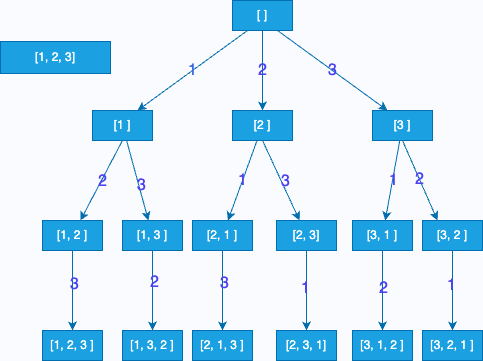
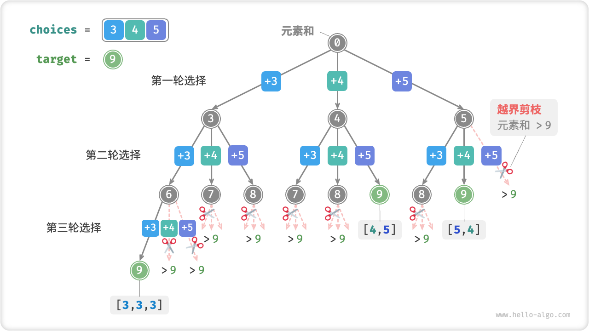

# 算法-Leetcode-Hot100

## 哈希

#### [L1-简单] 两数之和

给定一个整数数组 `nums` 和一个目标值 `target`，请你在该数组中找出和为目标值的那 **两个** 整数，并返回他们的数组下标。

你可以假设每种输入只会对应一个答案。但是，你不能重复利用这个数组中同样的元素。

**示例**

```
输入：nums = [2,7,11,15], target = 9
输出：[0,1]
解释：因为 nums[0] + nums[1] == 9 ，返回 [0, 1] 。

输入：nums = [3,2,4], target = 6
输出：[1,2]

输入：nums = [3,3], target = 6
输出：[0,1]
```

- `2 <= nums.length <= 104`
- `-109 <= nums[i] <= 109`
- `-109 <= target <= 109`
- **只会存在一个有效答案**

**题解**

哈希法:

```go
func twoSum(nums []int, target int) []int {
    hash := map[int]int{}
    for i, v := range nums {
        if p, ok := hash[target-v]; ok {
            return []int{p, i}
        }
        hash[v] = i
    }
    return nil
}
```

数组查找

```php
class Solution {

    /**
     * @param Integer[] $nums
     * @param Integer $target
     * @return Integer[]
     */
    function twoSum($nums, $target) {
        $count = count($nums);
        for ($i=0; $i<$count-1; $i++) {
            $tmp = $target - $nums[$i];
            $newnums = $nums;
            unset($newnums[$i]);
            $res = array_search($tmp, $newnums);
            if ($res !== false) {
                return array($i, $res);
                break;
            }
        }
    }
}
```

暴力：

```go
func twoSum(nums []int, target int) []int {
    n := len(nums)
    for i := 0; i < n - 1; i++ {
        for j := i + 1; j < n; j++ {
            if nums[i] + nums[j] == target {
                return []int{i, j}
            }
        }
    }
    return []int{}
}
```

PHP：

```php
class Solution {
    /**
     * @param Integer[] $nums
     * @param Integer $target
     * @return Integer[]
     */
    function twoSum($nums, $target) {
        $count = count($nums);
        for ($i=0; $i<$count-1; $i++) {
            for ($j=$i+1; $j<$count; $j++) {
            if(($nums[$i] + $nums[$j]) == $target ){
                    return array($i, $j);
                    break;
                }
            }
        }
    }
}
```

#### [L49-中等] 字母异位词分组

给你一个字符串数组，请你将 **字母异位词** 组合在一起。可以按任意顺序返回结果列表。

**字母异位词** 是由重新排列源单词的所有字母得到的一个新单词。

**示例**

```
输入: strs = ["eat", "tea", "tan", "ate", "nat", "bat"]
输出: [["bat"],["nat","tan"],["ate","eat","tea"]]

输入: strs = [""]
输出: [[""]]

输入: strs = ["a"]
输出: [["a"]]
```

- `1 <= strs.length <= 104`
- `0 <= strs[i].length <= 100`
- `strs[i]` 仅包含小写字母

**题解**

构建hashMap，先对字符串安装字母进行排序，然后以排序后的字符串为key，原单词为 value

最后遍历 hashMap，取出所有 value 拼装成结果数组即可

```go
func groupAnagrams(strs []string) [][]string {
	hash := map[string][]string{}
	for _, str := range strs {
		// 将字符串转化成数组
		s := []byte(str)
		// 对字符串数组进行排序
		sort.Slice(s, func(i, j int) bool { return s[i] < s[j] })
		// 将字符串数组中的元素类型进行转化
		sortedStr := string(s)
		// 以字符串为key构建map
		hash[sortedStr] = append(hash[sortedStr], str)
	}
	// 重新组装成数组
    ans := make([][]string, 0)
	for _, v := range hash {
		ans = append(ans, v)
	}
	return ans
}
```

#### [L128-中等] 最长连续序列

给定一个未排序的整数数组 `nums` ，找出数字连续的最长序列（不要求序列元素在原数组中连续）的长度。

请你设计并实现时间复杂度为 `O(n)` 的算法解决此问题。

**示例**

```
输入：nums = [100,4,200,1,3,2]
输出：4
解释：最长数字连续序列是 [1, 2, 3, 4]。它的长度为 4。

输入：nums = [0,3,7,2,5,8,4,6,0,1]
输出：9
```

- `0 <= nums.length <= 105`
- `-109 <= nums[i] <= 109`

**题解**

以数组中元素为key构建hashMap

遍历hashMap，若当前元素没有-1的元素存在，说明该元素为以其作为递增序列的最小值

因此，可以按照+1的进行遍历，查找元素是否存在，不存在则退出，所以当前为序列最大长度，进行更新

```go
func longestConsecutive(nums []int) int {
	// 构建 hash 表
	hash := map[int]bool{}
	for _, v := range nums {
		hash[v] = true
	}
	max := 0
	// 遍历 hash 表
	for num := range hash {
		// 只取 num 为最小值的情况
		if !hash[num-1] {
			// 以当前值为最小值情况下的递增序列长度
			count := 1
            // 当前值
			current := num
			// 查找依次增加的序列
			for hash[current+1] {
				current++
				count++
			}
			// 更新最大序列长度值
			if count > max {
				max = count
			}
		}
	}
	return max
}
```

## 双指针

#### [L283-简单] 移动零

给定一个数组 `nums`，编写一个函数将所有 `0` 移动到数组的末尾，同时保持非零元素的相对顺序。

**请注意** ，必须在不复制数组的情况下原地对数组进行操作。

**示例**

```
输入: nums = [0,1,0,3,12]
输出: [1,3,12,0,0]

输入: nums = [0]
输出: [0]
```

- `1 <= nums.length <= 104`
- `-231 <= nums[i] <= 231 - 1`

**题解**

两个指针l、r，r不断的向右移动，当nums[r] 不等于0的时候，交换l和r元素，并且l向前走一步

```go
func moveZeroes(nums []int)  {
    l, r, n := 0, 0, len(nums)
    for r < n {
        if nums[r] != 0 {
            nums[l], nums[r] = nums[r], nums[l]
            l++
        }
        r++
    }
}
```

#### [L11-中等] 盛最多水的容器

给定 *n* 个非负整数 *a*1，*a*2，...，*a*n，每个数代表坐标中的一个点 (*i*, *ai*) 。在坐标内画 *n* 条垂直线，垂直线 *i* 的两个端点分别为 (*i*, *ai*) 和 (*i*, 0)。找出其中的两条线，使得它们与 *x* 轴共同构成的容器可以容纳最多的水。

**说明：**你不能倾斜容器，且 *n* 的值至少为 2。


图中垂直线代表输入数组 [1,8,6,2,5,4,8,3,7]。在此情况下，容器能够容纳水（表示为蓝色部分）的最大值为 49。

**示例**

```
输入: [1,8,6,2,5,4,8,3,7]
输出: 49

输入：height = [1,1]
输出：1
```

**题解**

双指针，左指针left、右指针right，当`height[left] < height[right]` 左指针右移，反之则右指针左移，计算2中场景下的面积大小并和之前的最大面积对比，进行更新

Go：

```go
func maxArea(height []int) int {
    n := len(height)
    left, right, max, tmp := 0, n - 1, 0, 0
    for left < right {
        if height[left] < height[right] {
            tmp = height[left] * (right - left)
            left++
        } else {
            tmp = height[right] * (right - left)
            right--
        }
        if tmp > max {
            max = tmp
        }
    }
    return max
}
```

PHP：

```php
class Solution {

    /**
     * @param Integer[] $height
     * @return Integer
     */
    function maxArea($height) {
        $left = 0;
        $right = count($height) -1;
        $maxarea = 0;
        while ($left < $right) {
        	$maxarea = max($maxarea, min($height[$left], $height[$right]) * ($right - $left));
        	if ($height[$left] < $height[$right]) {
        		$left++;
        	} else {
        		$right--;
        	}
        }
        return $maxarea;
    }
}
```

#### [L15-中等] 三数之和

给定一个包含 *n* 个整数的数组 `nums`，判断 `nums` 中是否存在三个元素 *a，b，c ，*使得 *a + b + c =* 0 ？找出所有满足条件且不重复的三元组。

**注意：**答案中不可以包含重复的三元组。

**示例**

```
例如, 给定数组 nums = [-1, 0, 1, 2, -1, -4]，

满足要求的三元组集合为：
[
  [-1, 0, 1],
  [-1, -1, 2]
]
```

**题解**

**排序+双指针**

先对数组进行排序，数组变成升序数组

遍历数组，此时 target 等于 0-nums[i]，设定 left 指针为 i+1，right 指针为 n-1

- 当`nums[left] + nums[right]`等于target的时候，将三个元素存入结果数组，并且此时，需要对重复的进行去重（遍历跳过相同的元素）
- 当`nums[left] + nums[right]`小于target的时候，left++
- 当`nums[left] + nums[right]`大于target的时候，right--

最后，还需要注意，在最外层遍历也需要增加去重判断

Go：

```go
func threeSum(nums []int) [][]int {
    n := len(nums)
    if n < 3 {
        return [][]int{}
    }
    // 先进行排序
    sort.Ints(nums)
    ret := make([][]int, 0)
    for i := 0; i < n - 2; i++ {
        // 需要和上一次枚举的数不相同（去重）
        if i > 0 && nums[i] == nums[i - 1] {
            continue
        }
        left, right := i + 1, n - 1
        need := 0 - nums[i]
        for left < right {
            if nums[left] + nums[right] == need {
                ret = append(ret, []int{nums[i], nums[left], nums[right]})
                // 遍历跳过相同的元素进行去重
                for left < right && nums[left] == nums[left + 1] {
                    left++
                }
                for left < right && nums[right] == nums[right - 1] {
                    right--
                }
                left++
                right--
            } else if nums[left] + nums[right] < need {
                left++
            } else {
                right--
            }
        }
    }
    return ret
}
```

PHP：

```php
class Solution {

    /**
     * @param Integer[] $nums
     * @return Integer[][]
     */
    function threeSum($nums) {
        if (!$nums) return [];
        sort($nums);
        $ret = [];
        for ($i = 0; $i < count($nums) - 2; $i++) {
            if ($i > 0 && $nums[$i] == $nums[$i - 1]) continue;
            $left = $i + 1;
            $right = count($nums) - 1;
            
            $need = 0 - $nums[$i];
            
            while ($left < $right) {
                if ($nums[$left] + $nums[$right] == $need) {
                    array_push($ret, [$nums[$i], $nums[$left], $nums[$right]]);
                    while ($left < $right && $nums[$left] == $nums[$left + 1]) $left++;
                    while ($left < $right && $nums[$right] == $nums[$right - 1]) $right--;
                    $left++;
                    $right--;
                } else if ($nums[$left] + $nums[$right] > $need) {
                    $right--;
                } else {
                    $left++;
                }
            }
        }
        return $ret;
    }
}
```

#### [L42-困难] 接雨水

给定 `n` 个非负整数表示每个宽度为 `1` 的柱子的高度图，计算按此排列的柱子，下雨之后能接多少雨水。

**示例**


```
输入：height = [0,1,0,2,1,0,1,3,2,1,2,1]
输出：6
解释：上面是由数组 [0,1,0,2,1,0,1,3,2,1,2,1] 表示的高度图，在这种情况下，可以接 6 个单位的雨水（蓝色部分表示雨水）。 

输入：height = [4,2,0,3,2,5]
输出：9
```

- `n == height.length`
- `1 <= n <= 2 * 104`
- `0 <= height[i] <= 105`

**题解**

动态规划：

```go
func trap(height []int) int {
	n := len(height)
	if n == 0 {
		return -1
	}

	leftMax := make([]int, n)
	leftMax[0] = height[0]
	for i := 1; i < n; i++ {
		if leftMax[i-1] > height[i] {
			leftMax[i] = leftMax[i-1]
		} else {
			leftMax[i] = height[i]
		}
	}

	rightMax := make([]int, n)
	rightMax[n-1] = height[n-1]
	for i := n - 2; i >= 0; i-- {
		if rightMax[i+1] > height[i] {
			rightMax[i] = rightMax[i+1]
		} else {
			rightMax[i] = height[i]
		}
	}
	ans := 0
	for i, h := range height {
		if leftMax[i] < rightMax[i] {
			ans += leftMax[i] - h
		} else {
			ans += rightMax[i] - h
		}
	}
	return ans
}
```

- 时间复杂度：O(n)
- 空间复杂度：O(n)

滑动窗口

> 在动态规划解法基础上进行优化

```go
func trap2(height []int) int {
	n := len(height)
	if n == 0 {
		return -1
	}
	ans := 0
	left, right, leftMax, rightMax := 0, n-1, 0, 0
	for left < right {
		if height[left] > leftMax {
			leftMax = height[left]
		}
		if height[right] > rightMax {
			rightMax = height[right]
		}
		if leftMax < rightMax {
			ans += leftMax - height[left]
			left++
		} else {
			ans += rightMax - height[right]
			right--
		}
	}
	return ans
}
```

- 时间复杂度：O(n)
- 空间复杂度：O(1)

## 滑动窗口

#### [L3-中等] 无重复字符的最长子串

给定一个字符串，请你找出其中不含有重复字符的 **最长子串** 的长度。

**示例**

```
输入: "abcabcbb"
输出: 3 
解释: 因为无重复字符的最长子串是 "abc"，所以其长度为 3。

输入: "bbbbb"
输出: 1
解释: 因为无重复字符的最长子串是 "b"，所以其长度为 1。

输入: "pwwkew"
输出: 3
解释: 因为无重复字符的最长子串是 "wke"，所以其长度为 3。
     请注意，你的答案必须是 子串 的长度，"pwke" 是一个子序列，不是子串。
```

**题解**

滑动窗口

```go
func lengthOfLongestSubstring(s string) int {
    n := len(s)
    right, max := 0, 0
    // hash map，存储不重复的字符串，用于判断字符串是否出现过
    hash := make(map[byte]int)
    for i := 0; i < n; i++ {
        // 除了 i = 0 第一次，每一次移动左指针的时候都需要删除第一个hash元素
        if i != 0 {
            delete(hash, s[i-1])
        }
        // 不断移动右指针，直到出现重复字符退出
        for right < n && hash[s[right]] == 0 {
            hash[s[right]]++
            right++
        }
        // 更新最大值
        if right - i > max {
            max = right - i
        }
    }
    return max
}
```

PHP：

```php
class Solution {

    /**
     * @param String $s
     * @return Integer
     */
    function lengthOfLongestSubstring($s) {
        //边界
        if (!$s || strlen($s) == 0) return 0;
        //初始化
        $array= [];
        $ret = 0;
        $start = 0;
        //遍历
        for ($i = 0; $i < strlen($s); $i++) {
           if (isset($array[$s[$i]]) && $start <= $array[$s[$i]]) {
               $start = $array[$s[$i]] + 1;
           } else {
               $ret = max($ret, $i - $start + 1);
           }
            $array[$s[$i]] = $i;
        }
        return $ret;
    }
}
```

#### [L438-中等] 找到字符串中所有字母异位词

给定两个字符串 `s` 和 `p`，找到 `s` 中所有 `p` 的 **异位词** 的子串，返回这些子串的起始索引。不考虑答案输出的顺序。

**异位词** 指由相同字母重排列形成的字符串（包括相同的字符串）。

**示例**

```
输入: s = "cbaebabacd", p = "abc"
输出: [0,6]
解释:
起始索引等于 0 的子串是 "cba", 它是 "abc" 的异位词。
起始索引等于 6 的子串是 "bac", 它是 "abc" 的异位词。

输入: s = "abab", p = "ab"
输出: [0,1,2]
解释:
起始索引等于 0 的子串是 "ab", 它是 "ab" 的异位词。
起始索引等于 1 的子串是 "ba", 它是 "ab" 的异位词。
起始索引等于 2 的子串是 "ab", 它是 "ab" 的异位词。
```

- `1 <= s.length, p.length <= 3 * 104`
- `s` 和 `p` 仅包含小写字母

**题解**

```go
func findAnagrams(s string, p string) []int {
	n, m := len(s), len(p)
	if n < m {
		return nil
	}

	// 维护2个m个元素的数组，统计每个字符出现的次数
	// 利用golang数组可以使用==比较的特性，判断2个窗口数组是否相等
	var sCount, pCount [123]int
	for i, ch := range p {
		sCount[s[i]]++
		pCount[ch]++
	}

	var ans []int
	if sCount == pCount {
		ans = append(ans, 0)
	}
	for i, ch := range s[:n-m] {
		sCount[ch]--
		sCount[s[i+m]]++
		if sCount == pCount {
			ans = append(ans, i+1)
		}
	}
	return ans
}
```

## 子串

#### [L560-中等] 和为 K 的子数组

给你一个整数数组 `nums` 和一个整数 `k` ，请你统计并返回 *该数组中和为 `k` 的子数组的个数* 。

子数组是数组中元素的连续非空序列。

**示例**

```go
输入：nums = [1,1,1], k = 2
输出：2

输入：nums = [1,2,3], k = 3
输出：2
```

- `1 <= nums.length <= 2 * 104`
- `-1000 <= nums[i] <= 1000`
- `-107 <= k <= 107`

**代码实现**

暴力枚举

- 时间复杂度：O(N^2)
- 空间复杂度：O(1)

```go
func subarraySum(nums []int, k int) int {
    n := len(nums)
    ans := 0
    for i, num := range nums {
        target := k - num
        if target == 0 {
            ans++
        }
        for j := i + 1; j < n; j++ {
            target -= nums[j]
            if target == 0 {
                ans++
            }
        }
    }
    return ans
}
```

前缀和

构造前缀和数组 preSum，其中 preSum[i] 为前 i 和元素之和

此时，本题求和为k的子数组，可以转化为在 preSum 前缀和数组中求 两数之差为k的数量

- 时间复杂度：O(N^2)
- 空间复杂度：O(N)

```go
func subarraySum2(nums []int, k int) int {
	n := len(nums)
	// 计算前缀和数组
	// preSum[i] = 前 i 和元素之和
	preSum := make([]int, n+1)
	preSum[0] = 0
	for i, num := range nums {
		preSum[i+1] = preSum[i] + num
	}
	// 在 preSum 中计算两数之差为 k 的数量
	cnt := 0
	// 依次遍历求解
	for i := 0; i < len(preSum); i++ {
		for j := i + 1; j < len(preSum); j++ {
			if preSum[j]-preSum[i] == k {
				cnt++
			}
		}
	}

	return cnt
}
```

前缀和+哈希表

计算数组的两数之差可以使用hashMap，整体优化后如下

- 时间复杂度：O(2N)
- 空间复杂度：O(2N)

```go
func subarraySum3(nums []int, k int) int {
	n := len(nums)
	// 计算前缀和数组
	// preSum[i] = 前 i 和元素之和
	preSum := make([]int, n+1)
	preSum[0] = 0
	for i, num := range nums {
		preSum[i+1] = preSum[i] + num
	}
	// 在 preSum 中计算两数之差为 k 的数量
	cnt := 0
	//优化：结合 hashMap
	hash := map[int]int{}
	for _, sum := range preSum {
		if val, ok := hash[sum-k]; ok {
			cnt += val
		}
		hash[sum]++
	}

	return cnt
}
```

前缀和+哈希表（继续优化）

```go
func subarraySum4(nums []int, k int) int {
	count, sum := 0, 0
	hash := make(map[int]int)
	hash[0] = 1

	for _, num := range nums {
		// 直接构建前缀和
		sum += num
		// 判断前缀和是否在 hashMap 中
		if val, ok := hash[sum-k]; ok {
			count += val
		}
		// 将前缀和加入 hashMap
		hash[sum]++
	}
	return count
}
```

#### [L76-困难] 最小覆盖子串

给你一个字符串 `s` 、一个字符串 `t` 。返回 `s` 中涵盖 `t` 所有字符的最小子串。如果 `s` 中不存在涵盖 `t` 所有字符的子串，则返回空字符串 `""` 。

**注意：**

- 对于 `t` 中重复字符，我们寻找的子字符串中该字符数量必须不少于 `t` 中该字符数量。
- 如果 `s` 中存在这样的子串，我们保证它是唯一的答案。

**示例**

```
输入：s = "ADOBECODEBANC", t = "ABC"
输出："BANC"
解释：最小覆盖子串 "BANC" 包含来自字符串 t 的 'A'、'B' 和 'C'。

输入：s = "a", t = "a"
输出："a"
解释：整个字符串 s 是最小覆盖子串。

输入: s = "a", t = "aa"
输出: ""
解释: t 中两个字符 'a' 均应包含在 s 的子串中，
因此没有符合条件的子字符串，返回空字符串。
```

- `m == s.length`
- `n == t.length`
- `1 <= m, n <= 105`
- `s` 和 `t` 由英文字母组成

**题解**

```go
func minWindow(s string, t string) string {
	n := len(s)
	// hashMap 维护 t 字符以及字符个数
	hashT := make(map[byte]int, 0)
	for i := range t {
		hashT[t[i]]++
	}

	// hashMap 维护窗口中所有字符以及个数
	cnt := make(map[byte]int, 0)

	// 检查窗口是否覆盖 t
	check := func() bool {
		for k, v := range hashT {
			if cnt[k] < v {
				return false
			}
		}
		return true
	}

	// 子串左右边界坐标
	ansL, ansR := -1, -1
	// 子串最小值
	minLength := math.MaxInt32
	for l, r := 0, 0; r < n; r++ {
		if r < n && hashT[s[r]] > 0 {
			cnt[s[r]]++
		}
		for check() && l <= r {
			// 更新窗口大小
			if r-l+1 < minLength {
				minLength = r - l + 1
				ansL, ansR = l, l+minLength
			}
			// 左指针移动，收缩窗口
			if _, ok := hashT[s[l]]; ok {
				cnt[s[l]]--
			}
			l++
		}
	}
	if ansL == -1 {
		return ""
	}
	return s[ansL:ansR]
}
```

#### [L239-困难] 滑动窗口最大值

给你一个整数数组 `nums`，有一个大小为 `k` 的滑动窗口从数组的最左侧移动到数组的最右侧。你只可以看到在滑动窗口内的 `k` 个数字。滑动窗口每次只向右移动一位。

返回 *滑动窗口中的最大值* 。

**示例**

```
输入：nums = [1,3,-1,-3,5,3,6,7], k = 3
输出：[3,3,5,5,6,7]
解释：
滑动窗口的位置                最大值
---------------               -----
[1  3  -1] -3  5  3  6  7       3
 1 [3  -1  -3] 5  3  6  7       3
 1  3 [-1  -3  5] 3  6  7       5
 1  3  -1 [-3  5  3] 6  7       5
 1  3  -1  -3 [5  3  6] 7       6
 1  3  -1  -3  5 [3  6  7]      7
 
输入：nums = [1], k = 1
输出：[1]
```

- `1 <= nums.length <= 105`
- `-104 <= nums[i] <= 104`
- `1 <= k <= nums.length`

**题解**

暴力，时间复杂度 O(nk) 超时

```go
// 超时 - 不适用
func maxSlidingWindow99(nums []int, k int) []int {
	maxIndex, max := 0, nums[0]
	ans, kArr := make([]int, 0), make([]int, 0)
	for i := 0; i < k; i++ {
		kArr = append(kArr, nums[i])
		if nums[i] > max {
			max = nums[i]
			maxIndex = i
		}
	}
	ans = append(ans, max)
	for i := k; i < len(nums); i++ {
		kArr = append(kArr, nums[i])
		kArr = kArr[1:]
		if nums[i] > max {
			max = nums[i]
			maxIndex = len(kArr) - 1
		} else {
			if maxIndex > 0 {
				maxIndex--
			} else {
				max = kArr[0]
				maxIndex = 0
				for j, v := range kArr {
					if v > max {
						maxIndex = j
						max = v
					}
				}
			}
		}
		ans = append(ans, max)
	}
	return ans
}
```

优化：

```go
func maxSlidingWindow(nums []int, k int) []int {
	q := make([]int, 0)
	push := func(i int) {
		// 删除队列中所有大于 num[i] 的元素
		for len(q) > 0 && nums[i] >= nums[q[len(q)-1]] {
			q = q[:len(q)-1]
		}
		q = append(q, i)
	}
	// 先将前 k 个元素入队
	for i := 0; i < k; i++ {
		push(i)
	}

	ans := make([]int, 0)
	ans = append(ans, nums[q[0]])
	for i := k; i < len(nums); i++ {
		// 入队
		push(i)
		// 保证队首元素不能超过区间范围
		for q[0] <= i-k {
			q = q[1:]
		}
		ans = append(ans, nums[q[0]])
	}
	return ans
}
```

## 普通数组

#### [L53-中等] 最大子数组和

给你一个整数数组 `nums` ，请你找出一个具有最大和的连续子数组（子数组最少包含一个元素），返回其最大和。

**子数组**是数组中的一个连续部分

**示例**

```
输入：nums = [-2,1,-3,4,-1,2,1,-5,4]
输出：6
解释：连续子数组 [4,-1,2,1] 的和最大，为 6 。

输入：nums = [1]
输出：1

输入：nums = [5,4,-1,7,8]
输出：23
```

**题解**

动态规划法：

将问题分解成n个字问题：

- 子问题 1：以 −2 结尾的连续子数组的最大和是多少；
    - 以 −2 **结尾的**连续子数组是 `[-2]`，因此最大和就是 −2。
- 子问题 2：以 1 结尾的连续子数组的最大和是多少；
    - 以 1 结尾的连续子数组有 [-2,1] 和 [1] ，其中 [-2,1] 就是在「子问题 1」的后面加上 1 得到。−2+1=−1<1，因此「子问题 2」 的答案是 1。

- 子问题 3：以 −3 结尾的连续子数组的最大和是多少；
- 子问题 4：以 4 结尾的连续子数组的最大和是多少；
- 子问题 5：以 −1 结尾的连续子数组的最大和是多少；
- 子问题 6：以 2 结尾的连续子数组的最大和是多少；
- 子问题 7：以 1 结尾的连续子数组的最大和是多少；
- 子问题 8：以 −5 结尾的连续子数组的最大和是多少；
- 子问题 9：以 4 结尾的连续子数组的最大和是多少。

假设`dp[i]`表示以 `nums[i]` **结尾** 的 **连续** 子数组的最大和，则可以得出：

- 当 `dp[i - 1] > 0` 时 `dp[i] = dp[i - 1] + nums[i]`

- 当 `dp[i - 1] <= 0` 时 `dp[i] = nums[i]`

```go
func maxSubArray(nums []int) int {
    n := len(nums)
    dp := make([]int, n)
    dp[0] = nums[0]
    max := dp[0]
    for i := 1; i < n; i++ {
        if dp[i - 1] > 0 {
            dp[i] = dp[i - 1] + nums[i]
        } else {
            dp[i] = nums[i]
        }
        if dp[i] > max {
            max = dp[i]
        }
    }
    return max
}
```

#### [L56-中等] 合并区间

以数组 `intervals` 表示若干个区间的集合，其中单个区间为 `intervals[i] = [starti, endi]` 。请你合并所有重叠的区间，并返回 *一个不重叠的区间数组，该数组需恰好覆盖输入中的所有区间* 。

**示例**

```go
输入：intervals = [[1,3],[2,6],[8,10],[15,18]]
输出：[[1,6],[8,10],[15,18]]
解释：区间 [1,3] 和 [2,6] 重叠, 将它们合并为 [1,6].

输入：intervals = [[1,4],[4,5]]
输出：[[1,5]]
解释：区间 [1,4] 和 [4,5] 可被视为重叠区间。
```

- `1 <= intervals.length <= 104`
- `intervals[i].length == 2`
- `0 <= starti <= endi <= 104`

**题解**

1. 先根据数组左端大小进行排序
2. 遍历数组，依次比较每个数组，将前一个数组的右端 r 和后一个数组的左端 l 比较，若 `r < l`则说明不重叠

```go
func merge(intervals [][]int) [][]int {
    // 先安装数组左端元素从小到大进行排序
	// 先根据数组左侧大小对二维数组进行从小到大排序
	n := len(intervals)
	sort.Slice(intervals, func(i, j int) bool {
		return intervals[i][0] < intervals[j][0]
	})
	// 遍历数组
	res := make([][]int, 0)
	pre := intervals[0]
	for i := 1; i < n; i++ {
		// 重合：2个条件
		// 1、前一个数组的右区间大于下一个数组的左区间
		if pre[1] >= intervals[i][0] {
			// 2、前一个数组的右区间大于下一个数组的右区间
			if pre[1] < intervals[i][1] {
				pre[1] = intervals[i][1]
			}

		} else {
			res = append(res, pre)
			pre = intervals[i]
		}
	}
	res = append(res, pre)
	return res
}
```

#### [L189-中等] 轮转数组

给定一个整数数组 `nums`，将数组中的元素向右轮转 `k` 个位置，其中 `k` 是非负数。

**示例：**

```
输入: nums = [1,2,3,4,5,6,7], k = 3
输出: [5,6,7,1,2,3,4]
解释:
向右轮转 1 步: [7,1,2,3,4,5,6]
向右轮转 2 步: [6,7,1,2,3,4,5]
向右轮转 3 步: [5,6,7,1,2,3,4]

输入：nums = [-1,-100,3,99], k = 2
输出：[3,99,-1,-100]
解释: 
向右轮转 1 步: [99,-1,-100,3]
向右轮转 2 步: [3,99,-1,-100]
```

- `1 <= nums.length <= 105`
- `-231 <= nums[i] <= 231 - 1`
- `0 <= k <= 105`

**题解：**

根据k值切分两个数组，再合并数组，再将新数组copy给原数组

```go
func rotateArray(nums []int, k int) {
	n := len(nums)
	// 处理 k > n 的情况
	k = k % n
	arr1 := nums[:n-k]
	arr2 := nums[n-k:]
	ans := append(arr2, arr1...)
	copy(nums, ans)
}
```

#### [L238-中等] 除自身以外数组的乘积

给你一个整数数组 `nums`，返回 *数组 `answer` ，其中 `answer[i]` 等于 `nums` 中除 `nums[i]` 之外其余各元素的乘积* 。

题目数据 **保证** 数组 `nums`之中任意元素的全部前缀元素和后缀的乘积都在 **32 位** 整数范围内。

请 **不要使用除法，**且在 `O(n)` 时间复杂度内完成此题。

**示例：**

```
输入: nums = [1,2,3,4]
输出: [24,12,8,6]

输入: nums = [-1,1,0,-3,3]
输出: [0,0,9,0,0]
```

- `2 <= nums.length <= 105`
- `-30 <= nums[i] <= 30`
- **保证** 数组 `nums`之中任意元素的全部前缀元素和后缀的乘积都在 **32 位** 整数范围内

**题解：**

`ans[i]`的乘机等于`ans[i-1]` * `ans[i+1]`，因此，需要计算两侧每个位置的乘机值

初始化两个数组，分别存储 i 左右两侧的乘机，这里有不同的表示方式

第一种：

```go
func productExceptSelf(nums []int) []int {
	n := len(nums)
	// 初始化两个数组，分别存储 i 左右两侧的乘机
	lArr, rArr := make([]int, n), make([]int, n)
	lArr[0] = 1
	for i := 1; i < n; i++ {
		lArr[i] = lArr[i-1] * nums[i-1]
	}
	rArr[n-1] = 1
	for i := n - 2; i >= 0; i-- {
		rArr[i] = rArr[i+1] * nums[i+1]
	}
	// i 的值为左右两侧乘机
	ans := make([]int, n)
	for i := 0; i < n; i++ {
		ans[i] = lArr[i] * rArr[i]
	}
	return ans
}
```

第二种：

```go
func productExceptSelf(nums []int) []int {
    n := len(nums)
    // 初始化两个数组，分别存储 i 左右两侧的乘机
    left, right := make([]int, n), make([]int, n)
    // ans[i] 左侧乘积用 left[i]
    left[0] = 1
    // ans[i] 右侧乘积用 right[n-i-1]
    right[0] = 1
    for i := 1; i < n; i++ {
        left[i] = left[i-1] * nums[i-1]
        right[i] = right[i-1] * nums[n-i]
    }
    // 遍历数组，构建乘积数组
    var ans []int
    for i := range nums {
        ans = append(ans, left[i] * right[n-i-1])
    }
    return ans
}
```

#### [L41-困难] 缺失的第一个正数

给你一个未排序的整数数组 `nums` ，请你找出其中没有出现的最小的正整数。

请你实现时间复杂度为 `O(n)` 并且只使用常数级别额外空间的解决方案。

**示例**

```
输入：nums = [1,2,0]
输出：3
解释：范围 [1,2] 中的数字都在数组中。

输入：nums = [3,4,-1,1]
输出：2
解释：1 在数组中，但 2 没有。

输入：nums = [7,8,9,11,12]
输出：1
解释：最小的正数 1 没有出现。
```

- `1 <= nums.length <= 105`
- `-231 <= nums[i] <= 231 - 1`

**题解**

我将数组所有的数放入哈希表，随后从 1 开始依次枚举正整数，并判断其是否在哈希表中

此种方法时间复杂度为 O(n)，空间复杂度也是 O(n)，空间复杂度不满足题目要求

因此，可以利用原数组进行改造

题解见：https://leetcode.cn/problems/first-missing-positive/solutions/304743/que-shi-de-di-yi-ge-zheng-shu-by-leetcode-solution/?envType=study-plan-v2&envId=top-100-liked

```go
func firstMissingPositive(nums []int) int {
	n := len(nums)
	// 将数组中所有小于等于 0 的数修改为 N+1
	for i := 0; i < n; i++ {
		if nums[i] <= 0 {
			nums[i] = n + 1
		}
	}
	// 定义取绝对值函数
	abs := func(x int) int {
		if x < 0 {
			return -x
		}
		return x
	}
	// 遍历所有元素
	for i := 0; i < n; i++ {
		num := abs(nums[i])
		// 将所有小于 n 的元素打标记
		if num <= n {
			nums[num-1] = -abs(nums[num-1])
		}
	}
	// 取第一个正数 + 1，如果都是负数，那答案就是 n + 1
	for i := 0; i < n; i++ {
		if nums[i] > 0 {
			return i + 1
		}
	}
	return n + 1
}
```

## 矩阵

#### [L73-中等] 矩阵置零

给定一个 `m x n` 的矩阵，如果一个元素为 **0** ，则将其所在行和列的所有元素都设为 **0** 。请使用 **[原地](http://baike.baidu.com/item/原地算法)** 算法**。**

**示例**

```
输入：matrix = [[1,1,1],[1,0,1],[1,1,1]]
输出：[[1,0,1],[0,0,0],[1,0,1]]

输入：matrix = [[0,1,2,0],[3,4,5,2],[1,3,1,5]]
输出：[[0,0,0,0],[0,4,5,0],[0,3,1,0]]
```

- `m == matrix.length`
- `n == matrix[0].length`
- `1 <= m, n <= 200`
- `-231 <= matrix[i][j] <= 231 - 1`

**题解**

两个数组 row 和 col 分别记录横纵位置是否为0

再次遍历矩阵，该位置对应的横纵坐标有一个为0则为0

```go
func setZeroes(matrix [][]int)  {
    // 初始化两个数组，存放横纵每个位置是否为0
    row, col := make([]bool, len(matrix)), make([]bool, len(matrix[0]))
    // 遍历矩阵，进行标记
    for i := 0; i < len(matrix); i++ {
        for j := 0; j < len(matrix[i]); j++ {
            if matrix[i][j] == 0 {
                row[i] = true
                col[j] = true
            }
        }
    }
    // 遍历矩阵，对标记位置进行更新
    for i, v := range matrix {
        for j := range v {
            if row[i] || col[j] {
                v[j] = 0
            }
        }
    }
}
```

#### [L54-中等] 螺旋矩阵

给你一个 `m` 行 `n` 列的矩阵 `matrix` ，请按照 **顺时针螺旋顺序** ，返回矩阵中的所有元素。

```
输入：matrix = [[1,2,3],[4,5,6],[7,8,9]]
输出：[1,2,3,6,9,8,7,4,5]

输入：matrix = [[1,2,3,4],[5,6,7,8],[9,10,11,12]]
输出：[1,2,3,4,8,12,11,10,9,5,6,7]
```

- `m == matrix.length`
- `n == matrix[i].length`
- `1 <= m, n <= 10`
- `-100 <= matrix[i][j] <= 100`

**题解**

定义4个边界

对矩阵进行不断移动，同时更新边界值，直到超出退出

```go
func spiralOrder(matrix [][]int) []int {
    // 定义4个边界
    upper, down, left, right := 0, len(matrix)-1, 0, len(matrix[0]) - 1
    ans := make([]int, 0)
    for {
        // 向右移动直到最右
        for i := left; i <= right; i++ {
            ans = append(ans, matrix[upper][i])
        }
        // 重新设定上边界
        upper++
        if upper > down {
            break
        }
        // 向下
        for i := upper; i <= down; i++ {
            ans = append(ans, matrix[i][right])
        }
        // 重新设定右边界
        right--
        if right < left {
            break
        }
        // 向左
        for i := right; i >= left; i-- {
            ans = append(ans, matrix[down][i])
        }
        // 重新设定下边界
        down--
        if down < upper {
            break
        }
        // 向上
        for i := down; i >= upper; i-- {
            ans = append(ans, matrix[i][left])
        }
        // 重新设定左边界
        left++
        if left > right {
            break
        }
    }
    return ans
}
```

#### [L48-中等] 旋转图像

给定一个 *n* × *n* 的二维矩阵 `matrix` 表示一个图像。请你将图像顺时针旋转 90 度。

你必须在**[ 原地](https://baike.baidu.com/item/原地算法)** 旋转图像，这意味着你需要直接修改输入的二维矩阵。**请不要** 使用另一个矩阵来旋转图像。

**示例**

```
输入：matrix = [[1,2,3],[4,5,6],[7,8,9]]
输出：[[7,4,1],[8,5,2],[9,6,3]]

输入：matrix = [[5,1,9,11],[2,4,8,10],[13,3,6,7],[15,14,12,16]]
输出：[[15,13,2,5],[14,3,4,1],[12,6,8,9],[16,7,10,11]]
```

- `n == matrix.length == matrix[i].length`
- `1 <= n <= 20`
- `-1000 <= matrix[i][j] <= 1000`

**题解**

由题意可以得到规律：

对于矩阵中第 *i* 行的第 *j* 个元素，在旋转后，它出现在倒数第 *i* 列的第 *j* 个位置。

即：对于`matrix[row][col]`，在旋转后，它的新位置为 `matrix[col][n−row−1]`

```go
func rotate(matrix [][]int)  {
    n := len(matrix)
    newMatrix := make([][]int, n)
    for i := range newMatrix {
        newMatrix[i] = make([]int, n)
    }
    for i, row := range matrix {
        for j, col := range row {
            newMatrix[j][n-1-i] = col
        }
    }
    copy(matrix, newMatrix)
}
```

#### [L240-中等] 搜索二维矩阵II

编写一个高效的算法来搜索 `m x n` 矩阵 `matrix` 中的一个目标值 `target` 。该矩阵具有以下特性：

- 每行的元素从左到右升序排列。
- 每列的元素从上到下升序排列。

**示例**

```
输入：matrix = [[1,4,7,11,15],[2,5,8,12,19],[3,6,9,16,22],[10,13,14,17,24],[18,21,23,26,30]], target = 5
输出：true

输入：matrix = [[1,4,7,11,15],[2,5,8,12,19],[3,6,9,16,22],[10,13,14,17,24],[18,21,23,26,30]], target = 20
输出：false
```

- `m == matrix.length`
- `n == matrix[i].length`
- `1 <= n, m <= 300`
- `-109 <= matrix[i][j] <= 109`
- 每行的所有元素从左到右升序排列
- 每列的所有元素从上到下升序排列
- `-109 <= target <= 109`

**题解**

Z 字查找

```go
func searchMatrix(matrix [][]int, target int) bool {
    m, n := len(matrix), len(matrix[0])
    x, y := 0, n - 1
    for x < m && y >= 0 {
        if matrix[x][y] == target {
            return true
        } else if matrix[x][y] > target {
            y--
        } else {
            x++
        }
    }
    return false
}
```

## 链表

#### [L21-简单] 合并两个有序链表

将两个有序链表合并为一个新的有序链表并返回。新链表是通过拼接给定的两个链表的所有节点组成的。 

**示例**

```
输入：1->2->4, 1->3->4
输出：1->1->2->3->4->4
```

**题解**

**递归：**

Go：

```go
/**
 * Definition for singly-linked list.
 * type ListNode struct {
 *     Val int
 *     Next *ListNode
 * }
 */
func mergeTwoLists(l1 *ListNode, l2 *ListNode) *ListNode {
    if l1 == nil{
        return l2
    }  
    if l2 == nil{
        return l1
    }
    var res *ListNode
    if l1.Val >= l2.Val{
        res = l2
        res.Next = mergeTwoLists(l1,l2.Next)
    }else{
        res = l1
        res.Next = mergeTwoLists(l1.Next,l2)
    }
    return res
}
```

**迭代：**

思路和归并排序中两个排序数组合并一致

Go：

```go
func mergeTwoLists(list1 *ListNode, list2 *ListNode) *ListNode {
    dummy := &ListNode{Val: 0}
    current := dummy
    for list1 != nil && list2 != nil {
        if list1.Val < list2.Val {
            current.Next = list1
            current = current.Next
            list1 = list1.Next
        } else {
            current.Next = list2
            current = current.Next
            list2 = list2.Next
        }
    }
    if list1 != nil {
        current.Next = list1
    }
    if list2 != nil {
        current.Next = list2
    }
    return dummy.Next
}
```

PHP：

```php
/**
 * Definition for a singly-linked list.
 * class ListNode {
 *     public $val = 0;
 *     public $next = null;
 *     function __construct($val) { $this->val = $val; }
 * }
 */
class Solution {

    /**
     * @param ListNode $l1
     * @param ListNode $l2
     * @return ListNode
     */
    function mergeTwoLists($l1, $l2) {
        if (!$l1) return $l2;
        if (!$l2) return $l1;
        
        $dummyhead = new ListNode(0);
        $current = $dummyhead;
        while ($l1 || $l2) {
            if (!$l1) {
                $current->next = $l2;
                break;
            }
            if (!$l2) {
                $current->next = $l1;
                break;
            }
            if ($l1->val < $l2->val) {
                $current->next = $l1;
                $current = $current->next;
                $l1 = $l1->next;
            } else {
                $current->next = $l2;
                $current = $current->next;
                $l2 = $l2->next;
            }
        }
        return $dummyhead->next;
    }
}
```

有关php实现链表可以参考以下文章：https://www.cnblogs.com/sunshineliulu/p/7717301.html

#### [L141-简单] 环形链表

给你一个链表的头节点 `head` ，判断链表中是否有环。

如果链表中有某个节点，可以通过连续跟踪 `next` 指针再次到达，则链表中存在环。 为了表示给定链表中的环，评测系统内部使用整数 `pos` 来表示链表尾连接到链表中的位置（索引从 0 开始）。**注意：`pos` 不作为参数进行传递** 。仅仅是为了标识链表的实际情况。

*如果链表中存在环* ，则返回 `true` 。 否则，返回 `false` 。

**示例**

```
输入：head = [3,2,0,-4], pos = 1
输出：true
解释：链表中有一个环，其尾部连接到第二个节点。

输入：head = [1,2], pos = 0
输出：true
解释：链表中有一个环，其尾部连接到第一个节点。

输入：head = [1], pos = -1
输出：false
解释：链表中没有环。
```

- 链表中节点的数目范围是 `[0, 104]`
- `-105 <= Node.val <= 105`
- `pos` 为 `-1` 或者链表中的一个 **有效索引** 。

**题解**

hashMap，遍历链表，将节点存入 hashMap，如果已存在相同节点，则说明存在环

```go
/**
 * Definition for singly-linked list.
 * type ListNode struct {
 *     Val int
 *     Next *ListNode
 * }
 */
func hasCycle(head *ListNode) bool {
    if head == nil {
        return false
    }

    hash := map[*ListNode]bool{}
    for head != nil {
        if _, ok := hash[head]; ok {
            return true
        }
        hash[head] = true
        head = head.Next
    }
    return false
}
```

#### [L160-简单] 相交链表

给你两个单链表的头节点 `headA` 和 `headB` ，请你找出并返回两个单链表相交的起始节点。如果两个链表不存在相交节点，返回 `null` 

**题解**

哈希表，先遍历链表A，存入hash，再遍历链表B，如果当前节点在hash表中，且后面的节点都在，则相交

```go
/**
 * Definition for singly-linked list.
 * type ListNode struct {
 *     Val int
 *     Next *ListNode
 * }
 */
func getIntersectionNode(headA, headB *ListNode) *ListNode {
    hash := map[*ListNode]int{}
    tmpA, tmpB := headA, headB
    for tmpA != nil {
        hash[tmpA] = tmpA.Val
        tmpA = tmpA.Next
    }
    for tmpB != nil {
        if hash[tmpB] == tmpB.Val {
            return tmpB
        }
        tmpB = tmpB.Next
    }
    return nil
}
```

双指针

```go
/**
 * Definition for singly-linked list.
 * type ListNode struct {
 *     Val int
 *     Next *ListNode
 * }
 */
func getIntersectionNode(headA, headB *ListNode) *ListNode {
    if headA == nil || headB == nil {
        return nil
    }
    pa, pb := headA, headB
    for pa != pb {
        if pa == nil {
            pa = headB
        } else {
            pa = pa.Next
        }
        if pb == nil {
            pb = headA
        } else {
            pb = pb.Next
        }
    }
    return pa
}
```

#### [L206-简单] 反转链表

给你单链表的头节点 `head` ，请你反转链表，并返回反转后的链表。

**示例**

```
输入：head = [1,2,3,4,5]
输出：[5,4,3,2,1]

输入：head = [1,2]
输出：[2,1]

输入：head = []
输出：[]
```

**题解**

先遍历链表，存在数组中，再遍历数组，构建新的链表

```go
/**
 * Definition for singly-linked list.
 * type ListNode struct {
 *     Val int
 *     Next *ListNode
 * }
 */
func reverseList(head *ListNode) *ListNode {
    if head == nil {
		return head
	}
    arr := make([]int, 0)
    for head != nil {
        arr = append([]int{head.Val}, arr...)
        head = head.Next
    }
    newHead := &ListNode{Val: arr[0], Next: nil}
    tmpHead := newHead
    for i := 1; i < len(arr); i++ {
        tmpHead.Next = &ListNode{arr[i], nil}
        tmpHead = tmpHead.Next
    }
    return newHead
}
```

迭代：

在遍历链表时，将当前节点的 next 指针改为指向前一个节点


```go
/**
 * Definition for singly-linked list.
 * type ListNode struct {
 *     Val int
 *     Next *ListNode
 * }
 */
func reverseList(head *ListNode) *ListNode {
    var pre *ListNode
    // 遍历链表
    for head != nil {
        // 暂存 next 指针
        temp := head.Next
        // 将 Next 指向前一个节点（断开head）
        head.Next = pre
        pre = head
        // 移动
        head = temp
    }
    return pre
}
```

#### [L234-简单] 回文链表

给你一个单链表的头节点 `head` ，请你判断该链表是否为回文链表。如果是，返回 `true` ；否则，返回 `false` 。

**示例**

```
输入：head = [1,2,2,1]
输出：true

输入：head = [1,2]
输出：false
```

**题解**

先遍历链表存入数组，再遍历数组进行判断

```go
/**
 * Definition for singly-linked list.
 * type ListNode struct {
 *     Val int
 *     Next *ListNode
 * }
 */
func isPalindrome(head *ListNode) bool {
    if head == nil {
        return false
    }
    tmp := make([]int, 0)
    for head != nil {
        tmp = append(tmp, head.Val)
        head = head.Next
    }
    n := len(tmp)
    for i := 0; i < n/2; i++ {
        if tmp[i] != tmp[n-1-i] {
            return false
        }
    }
    return true
}
```

#### [L2-中等] 两数相加

给出两个 **非空** 的链表用来表示两个非负的整数。其中，它们各自的位数是按照 **逆序** 的方式存储的，并且它们的每个节点只能存储 **一位** 数字。

如果，我们将这两个数相加起来，则会返回一个新的链表来表示它们的和。

您可以假设除了数字 0 之外，这两个数都不会以 0 开头。

**示例**

```
2 -> 4 -> 3
5 -> 6 -> 4
输入：l1 = [2,4,3], l2 = [5,6,4]
输出：[7,0,8]
解释：342 + 465 = 807

输入：l1 = [0], l2 = [0]
输出：[0]

输入：l1 = [9,9,9,9,9,9,9], l2 = [9,9,9,9]
输出：[8,9,9,9,0,0,0,1]
```

- 每个链表中的节点数在范围 `[1, 100]` 内
- `0 <= Node.val <= 9`
- 题目数据保证列表表示的数字不含前导零

**题解**

同时移动两个链表，将链表值相加添加到新的链表中

需要考虑双数相加大于10进位的问题

Go：

```go
/**
 * Definition for singly-linked list.
 * type ListNode struct {
 *     Val int
 *     Next *ListNode
 * }
 */
func addTwoNumbers(l1 *ListNode, l2 *ListNode) *ListNode {
    var head, cur *ListNode
    add := 0
    for l1 != nil || l2 != nil {
        n1, n2 := 0, 0
        if l1 != nil {
            n1 = l1.Val
            l1 = l1.Next
        }
        if l2 != nil {
            n2 = l2.Val
            l2 = l2.Next
        }

        sum := n1 + n2 + add
        sum, add = sum % 10, sum / 10

        if head == nil {
            head = &ListNode{Val: sum}
            cur = head
        } else {
            cur.Next = &ListNode{Val: sum}
            cur = cur.Next
        }
    }

    if add > 0 {
        cur.Next = &ListNode{Val: add}
    }

    return head
}
```

PHP：

```php
/**
 * Definition for a singly-linked list.
 * class ListNode {
 *     public $val = 0;
 *     public $next = null;
 *     function __construct($val) { $this->val = $val; }
 * }
 */
class Solution {

    /**
     * @param ListNode $l1
     * @param ListNode $l2
     * @return ListNode
     */
    function addTwoNumbers($l1, $l2) {
        $add = 0;
        $list = new ListNode(0);
        $current = $list;
        while($l1 || $l2) {
            $x = 0;
            $y = 0;
            if ($l1 != null) {
                $x = $l1->val;
                $l1 = $l1->next;
            }
            if ($l2 != null) {
                $y = $l2->val;
                $l2 = $l2->next;
            }
            
            $val = ($x + $y + $add) % 10;
            $add = intval(($x + $y + $add) / 10);
            
            $new = new ListNode($val);
            $current->next = $new;
            $current = $current->next;
        }
        if ($add > 0) {
            $current->next = new ListNode($add);
        }
        return $list->next;
    }
}
```

#### [L19-中等] 删除链表的倒数第N个节点

给定一个链表，删除链表的倒数第 n 个节点，并且返回链表的头结点。

给定的 n 保证是有效的。

**示例**

```
给定一个链表: 1->2->3->4->5, 和 n = 2.
当删除了倒数第二个节点后，链表变为 1->2->3->5.
```

**题解**

先遍历链表，获取链表长度，计算出删除第 k 个节点

再次遍历链表，删除第 k 个节点即可

```go
func removeNthFromEnd(head *ListNode, n int) *ListNode {
    // 先遍历链表，获取链表长度
    length := 0
    tmp := head
    for tmp != nil {
        length++
        tmp = tmp.Next
    }
    // 计算删除第 k 个节点
    k := length - n
    // 如果是头节点，则直接返回后面的节点
    if k == 0 {
        return head.Next
    }
    // 对第 k 个节点进行删除操作
    i := 1
    cur := head
    for cur != nil {
        if i == k {
            cur.Next = cur.Next.Next
            break
        }
        cur = cur.Next
        i++
    }
    return head
}
```

快慢指针：

定义 fast、slow 两个指针，slow需要增加一个哑节点

fast 先走 n 步，fast和slow相隔 n 个节点

然后fast 和 slow 同时前进，当快指针走到尾部的时候，此时slow慢指针的位置刚好是要删除节点的前一个节点

Go:

```go
/**
 * Definition for singly-linked list.
 * type ListNode struct {
 *     Val int
 *     Next *ListNode
 * }
 */
func removeNthFromEnd(head *ListNode, n int) *ListNode {
    dummy := &ListNode{0, head}
    fast, slow := head, dummy
    // fast 指针先走 n 步，完成后 fast 和 slow 相差 n 个节点
    for i := 0; i < n; i++ {
        fast = fast.Next
    }
    // fast 和 slow 同时移动
    for fast != nil {
        fast = fast.Next
        slow = slow.Next
    }
    // 此时，删除下一个节点
    slow.Next = slow.Next.Next
    return dummy.Next
}
```

PHP:

```php
/**
 * Definition for a singly-linked list.
 * class ListNode {
 *     public $val = 0;
 *     public $next = null;
 *     function __construct($val) { $this->val = $val; }
 * }
 */
class Solution {

    /**
     * @param ListNode $head
     * @param Integer $n
     * @return ListNode
     */
    function removeNthFromEnd($head, $n) {
        $dummy = new ListNode(0);
        $dummy->next = $head;
        $slow = $dummy;
        $first = $dummy;
        for ($i = 0; $i <= $n; $i++) {
            $first = $first->next;
        }
        while($first) {
            $slow = $slow->next;
            $first = $first->next;
        }
        $slow->next = $slow->next->next;
        return $dummy->next;
    }
}
```

#### [L24-中等] 两两交换链表中的节点

给定一个链表，两两交换其中相邻的节点，并返回交换后的链表。

你不能只是单纯的改变节点内部的值，而是需要实际的进行节点交换。

**示例**

```
给定 1->2->3->4, 你应该返回 2->1->4->3.

输入：head = [1,2,3,4]
输出：[2,1,4,3]

输入：head = []
输出：[]

输入：head = [1]
输出：[1]
```

- 链表中节点的数目在范围 `[0, 100]` 内
- `0 <= Node.val <= 100`

**解题**

```
		  node1   node2   next
     dummy->1 ->    2  ->   3  -> 4
     dummy->2 -> 1 -> 3 -> 4
```

**代码实现**

递归：

```go
func swapPairs(head *ListNode) *ListNode {
	if head == nil || head.Next == nil {
		return head
	}
	newHead := head.Next
	head.Next = swapPairs(newHead.Next)
	newHead.Next = head
	return newHead
}
```

迭代：

Go：

```go
func swapPairs(head *ListNode) *ListNode {
    if head == nil || head.Next == nil {
        return head
    }
    // 哑节点：0-1-2-3-4
    dummy := &ListNode{0, head}
    cur := dummy
    for cur.Next != nil && cur.Next.Next != nil {
        node1 := cur.Next
        node2 := cur.Next.Next

        cur.Next = node2
        node1.Next = node2.Next
        node2.Next = node1

        cur = node1
    }
    return dummy.Next
}
```

PHP：

```php
/**
 * Definition for a singly-linked list.
 * class ListNode {
 *     public $val = 0;
 *     public $next = null;
 *     function __construct($val) { $this->val = $val; }
 * }
 */
class Solution {

    /**
     * @param ListNode $head
     * @return ListNode
     */
    function swapPairs($head) {
        $dummyhead = new ListNode(0);
        $dummyhead->next = $head;
        $q = $dummyhead;
        while ($q->next && $q->next->next) {
            $node1 = $q->next;
            $node2 = $node1->next;
            $next = $node2->next;
            
            $node2->next = $node1;
            $node1->next = $next;
            $q->next = $node2;

            $q = $node1;
        }
        return $dummyhead->next;
    }
}
```

#### [L138-中等] 随机链表的复制

给你一个长度为 `n` 的链表，每个节点包含一个额外增加的随机指针 `random` ，该指针可以指向链表中的任何节点或空节点。

构造这个链表的 **[深拷贝](https://baike.baidu.com/item/深拷贝/22785317?fr=aladdin)**。 深拷贝应该正好由 `n` 个 **全新** 节点组成，其中每个新节点的值都设为其对应的原节点的值。新节点的 `next` 指针和 `random` 指针也都应指向复制链表中的新节点，并使原链表和复制链表中的这些指针能够表示相同的链表状态。**复制链表中的指针都不应指向原链表中的节点** 。

例如，如果原链表中有 `X` 和 `Y` 两个节点，其中 `X.random --> Y` 。那么在复制链表中对应的两个节点 `x` 和 `y` ，同样有 `x.random --> y` 。

返回复制链表的头节点。

用一个由 `n` 个节点组成的链表来表示输入/输出中的链表。每个节点用一个 `[val, random_index]` 表示：

- `val`：一个表示 `Node.val` 的整数。
- `random_index`：随机指针指向的节点索引（范围从 `0` 到 `n-1`）；如果不指向任何节点，则为 `null` 。

你的代码 **只** 接受原链表的头节点 `head` 作为传入参数。

**示例**

```
输入：head = [[7,null],[13,0],[11,4],[10,2],[1,0]]
输出：[[7,null],[13,0],[11,4],[10,2],[1,0]]

输入：head = [[1,1],[2,1]]
输出：[[1,1],[2,1]]

输入：head = [[3,null],[3,0],[3,null]]
输出：[[3,null],[3,0],[3,null]]
```

- `0 <= n <= 1000`
- `-104 <= Node.val <= 104`
- `Node.random` 为 `null` 或指向链表中的节点。

**题解**

```go
func copyRandomList(head *Node) *Node {
    if head == nil {
        return nil
    }
    // 创建一个哈希表，key是原节点，value是新节点
    hash := make(map[*Node]*Node, 0)
    p := head
    // 将原节点和新节点放入哈希表中
    for p != nil {
        newNode := &Node{Val: p.Val}
        hash[p] = newNode
        p = p.Next
    }
    p = head
    // 遍历原链表，设置新节点的next和random
    for p != nil {
        // 获取新节点
        newNode := hash[p]
        // 原节点的下一个节点存在，则更新新节点的下一个节点
        if p.Next != nil {
            newNode.Next = hash[p.Next]
        }
        // 原节点的随机节点存在，则更新新节点的随机节点
        if p.Random != nil {
            newNode.Random = hash[p.Random]
        }
        p = p.Next
    }
    // 返回头节点，即原节点对应的 value 值
    return hash[head]
}
```

#### [L142-中等] 环形链表 II

给定一个链表的头节点  `head` ，返回链表开始入环的第一个节点。 *如果链表无环，则返回 `null`。*

如果链表中有某个节点，可以通过连续跟踪 `next` 指针再次到达，则链表中存在环。 为了表示给定链表中的环，评测系统内部使用整数 `pos` 来表示链表尾连接到链表中的位置（**索引从 0 开始**）。如果 `pos` 是 `-1`，则在该链表中没有环。**注意：`pos` 不作为参数进行传递**，仅仅是为了标识链表的实际情况。

**不允许修改** 链表。

**示例**

```
输入：head = [3,2,0,-4], pos = 1
输出：返回索引为 1 的链表节点
解释：链表中有一个环，其尾部连接到第二个节点。

输入：head = [1,2], pos = 0
输出：返回索引为 0 的链表节点
解释：链表中有一个环，其尾部连接到第一个节点。

输入：head = [1], pos = -1
输出：返回 null
解释：链表中没有环。
```

- 链表中节点的数目范围在范围 `[0, 104]` 内
- `-105 <= Node.val <= 105`
- `pos` 的值为 `-1` 或者链表中的一个有效索引

**题解**

借助 hashMap，遍历链表，每个节点存入 hashMap，如果当前节点已存在，则就是环，直接返回 key 值

```go
func detectCycle(head *ListNode) *ListNode {
    hash := map[*ListNode]bool{}
    for head != nil {
        if _, ok := hash[head]; ok {
            return head
        }
        hash[head] = true
        head = head.Next
    }
    return nil
}
```

#### [L146-中等] LRU 缓存

请你设计并实现一个满足 [LRU (最近最少使用) 缓存](https://baike.baidu.com/item/LRU) 约束的数据结构。

实现 `LRUCache` 类：

- `LRUCache(int capacity)` 以 **正整数** 作为容量 `capacity` 初始化 LRU 缓存
- `int get(int key)` 如果关键字 `key` 存在于缓存中，则返回关键字的值，否则返回 `-1` 。
- `void put(int key, int value)` 如果关键字 `key` 已经存在，则变更其数据值 `value` ；如果不存在，则向缓存中插入该组 `key-value` 。如果插入操作导致关键字数量超过 `capacity` ，则应该 **逐出** 最久未使用的关键字。

函数 `get` 和 `put` 必须以 `O(1)` 的平均时间复杂度运行。

**示例**

```
输入
["LRUCache", "put", "put", "get", "put", "get", "put", "get", "get", "get"]
[[2], [1, 1], [2, 2], [1], [3, 3], [2], [4, 4], [1], [3], [4]]
输出
[null, null, null, 1, null, -1, null, -1, 3, 4]

解释
LRUCache lRUCache = new LRUCache(2);
lRUCache.put(1, 1); // 缓存是 {1=1}
lRUCache.put(2, 2); // 缓存是 {1=1, 2=2}
lRUCache.get(1);    // 返回 1
lRUCache.put(3, 3); // 该操作会使得关键字 2 作废，缓存是 {1=1, 3=3}
lRUCache.get(2);    // 返回 -1 (未找到)
lRUCache.put(4, 4); // 该操作会使得关键字 1 作废，缓存是 {4=4, 3=3}
lRUCache.get(1);    // 返回 -1 (未找到)
lRUCache.get(3);    // 返回 3
lRUCache.get(4);    // 返回 4
```

- `1 <= capacity <= 3000`
- `0 <= key <= 10000`
- `0 <= value <= 105`
- 最多调用 `2 * 105` 次 `get` 和 `put`

**题解**

双向链表+hash

```go
// DLinkedNode 定义双向链表结构体
type DLinkedNode struct {
	key, value int          // 键值对
	prev, next *DLinkedNode // 指向前驱、后继节点的指针
}

// newDLinkedNode 初始化链表
func newDLinkedNode(key, value int) *DLinkedNode {
	return &DLinkedNode{
		key:   key,
		value: value,
	}
}

// LRUCache 缓存结构
type LRUCache struct {
	size       int                  // 当前已用容量大小
	capacity   int                  // 容量
	cache      map[int]*DLinkedNode // 哈希表，存储缓存数据的键映射到双向链表的位置
	head, tail *DLinkedNode         // 头部和尾部节点
}

// Constructor 构造函数
func Constructor(capacity int) LRUCache {
	l := LRUCache{
		cache:    map[int]*DLinkedNode{},
		head:     newDLinkedNode(0, 0),
		tail:     newDLinkedNode(0, 0),
		capacity: capacity,
	}
    // 相当于添加首位2个哑节点
	l.head.next = l.tail
	l.tail.prev = l.head
	return l
}

// Get 获取缓存值
func (t *LRUCache) Get(key int) int {
	// 不存在，则返回-1
	if _, ok := t.cache[key]; !ok {
		return -1
	}
	// 获取该值在双向链表中的位置
	node := t.cache[key]
	// 先删除该节点，再添加至链表头部（使访问过的节点处于最新状态）
	t.moveToHead(node)
	// 返回节点的值
	return node.value
}

// Put 插入或更新缓存值
func (t *LRUCache) Put(key int, value int) {
	if node, ok := t.cache[key]; ok { // 已存在，则更新
		node.value = value
		// 先删除该节点，再添加至链表头部（使访问过的节点处于最新状态）
		t.moveToHead(node)
	} else { // 不存在
		// 以该 key value 初始化一个节点
		node = newDLinkedNode(key, value)
		// 加入hash表映射
		t.cache[key] = node
		// 添加该节点至头部
		t.addToHead(node)
		t.size++
		// 若加入该缓存后容量超过最大限制，则删除最后一个缓存
		if t.size > t.capacity {
			rmNode := t.removeTail()    // 删除链表最后一个节点
			delete(t.cache, rmNode.key) // 删除该节点在hash表中的映射关系
			t.size--
		}
	}
}

// 添加节点至头部
func (t *LRUCache) addToHead(node *DLinkedNode) {
	node.prev = t.head
	node.next = t.head.next
	t.head.next.prev = node
	t.head.next = node
}

// 删除节点
func (t *LRUCache) removeNode(node *DLinkedNode) {
	node.prev.next = node.next
	node.next.prev = node.prev
}

// 删除节点，并将该节点添加至头部
func (t *LRUCache) moveToHead(node *DLinkedNode) {
	t.removeNode(node)
	t.addToHead(node)
}

// 删除链表最后一个节点
func (t *LRUCache) removeTail() *DLinkedNode {
	node := t.tail.prev
	t.removeNode(node)
	return node
}
```

#### [L148-中等] 排序链表

给你链表的头结点 `head` ，请将其按 **升序** 排列并返回 **排序后的链表** 。

**示例**

```
输入：head = [4,2,1,3]
输出：[1,2,3,4]

输入：head = [-1,5,3,4,0]
输出：[-1,0,3,4,5]

输入：head = []
输出：[]
```

- 链表中节点的数目在范围 `[0, 5 * 104]` 内
- `-105 <= Node.val <= 105`

**题解**

使用归并排序思路，只是这里是链表，链表的切分和合并需要注意

链表切分：

1. 通过快慢指针找出链表中点
2. 在中点处切断链表，一分为二（通过将中等位置链表的 next 指针置为 nil 来切断）

链表合并：

1. 需要创建一个哑节点作为新链表的头
2. 依次对比左右链表第一个元素的大小，将小的先加入结果链表，这里思路和数组合并一致

```go
func sortList(head *ListNode) *ListNode {
	if head == nil || head.Next == nil {
		return head
	}
	// 定义快慢指针
	slow, fast := head, head.Next
	// 慢指针每次走1步，快指针每次走2步，当快指针fast走到最后的时候，慢指针的位置就是中点
	// 当链表为偶数是，slow指向中间前一个元素
	for fast != nil && fast.Next != nil {
		slow = slow.Next
		fast = fast.Next.Next
	}
	// 暂存
	tmp := slow.Next
	// 切断链表
	slow.Next = nil
	// 递归左右链表，直到切分每个链表剩一个节点终止
	left := sortList(head)
	right := sortList(tmp)

	// 返回合并的结果
	return merge(left, right)
}

// 合并左右链表
func merge(left, right *ListNode) *ListNode {
    // 创建一个哑节点作为新链表的头
	dummy := &ListNode{}
	curr := dummy
	for left != nil && right != nil {
		if left.Val < right.Val {
			curr.Next = left
			left = left.Next
		} else {
			curr.Next = right
			right = right.Next
		}
		curr = curr.Next
	}
	// 链接剩余的部分
	if left != nil {
		curr.Next = left
	}
	if right != nil {
		curr.Next = right
	}
	// 返回新链表的头（跳过哑节点）
	return dummy.Next
}
```

#### [L23-困难] 合并 K 个升序链表

给你一个链表数组，每个链表都已经按升序排列。

请你将所有链表合并到一个升序链表中，返回合并后的链表。

**示例**

```
输入：lists = [[1,4,5],[1,3,4],[2,6]]
输出：[1,1,2,3,4,4,5,6]
解释：链表数组如下：
[
  1->4->5,
  1->3->4,
  2->6
]
将它们合并到一个有序链表中得到。
1->1->2->3->4->4->5->6

输入：lists = []
输出：[]

输入：lists = [[]]
输出：[]
```

- `k == lists.length`
- `0 <= k <= 10^4`
- `0 <= lists[i].length <= 500`
- `-10^4 <= lists[i][j] <= 10^4`
- `lists[i]` 按 **升序** 排列
- `lists[i].length` 的总和不超过 `10^4`

**题解**

两两依次合并

```go
func mergeKLists(lists []*ListNode) *ListNode {
    if len(lists) == 0 {
        return nil
    }
    ans := lists[0]
    for i := 1; i < len(lists); i++ {
        ans = mergeList(ans, lists[i])
    }
    return ans
}

// 合并两个有序链表
func mergeList(list1, list2 *ListNode) *ListNode {
    if list1 == nil {
        return list2
    }
    if list2 == nil {
        return list1
    }
    dummy := &ListNode{0, nil}
    cur := dummy
    for list1 != nil || list2 != nil {
        if list1 == nil {
            cur.Next = list2
            break
        }
        if list2 == nil {
            cur.Next = list1
            break
        }
        if list1.Val < list2.Val {
            cur.Next = list1
            cur = cur.Next
            list1 = list1.Next
        } else {
            cur.Next = list2
            cur = cur.Next
            list2 = list2.Next
        }
    }
    return dummy.Next
}
```

分治合并

```go
func mergeKLists(lists []*ListNode) *ListNode {
    return merge(lists, 0, len(lists)-1)
}

func merge(lists []*ListNode, left, right int) *ListNode {
    if left == right {
        return lists[left]
    }
    if left > right {
        return nil
    }
    mid := (left + right) / 2
    return mergeList(merge(lists, left, mid), merge(lists, mid+1, right))
}

// 合并两个有序链表
func mergeList(list1, list2 *ListNode) *ListNode {
    ...
}
```

#### [L25-困难] K 个一组翻转链表

给你链表的头节点 `head` ，每 `k` 个节点一组进行翻转，请你返回修改后的链表。

`k` 是一个正整数，它的值小于或等于链表的长度。如果节点总数不是 `k` 的整数倍，那么请将最后剩余的节点保持原有顺序。

你不能只是单纯的改变节点内部的值，而是需要实际进行节点交换。

**示例**

```
输入：head = [1,2,3,4,5], k = 2
输出：[2,1,4,3,5]

输入：head = [1,2,3,4,5], k = 3
输出：[3,2,1,4,5]
```

- 链表中的节点数目为 `n`
- `1 <= k <= n <= 5000`
- `0 <= Node.val <= 1000`

**题解**

需要一个哑节点链表 dummy，指针 pre 为待反转链表的前驱节点，遍历链表

- end 初始化为当前节点，end 指针每次先走 k 步（变为尾部节点），达到待反转链表尾部，start 为待反转链表头部
- 将 end 与后面 nex 部分进行断开
- 将以start为头部的链表进行反转，反转后 start 变成了尾部，end 变成了头部
- 将断开的部分重新进行连接
- pre 指针移动到当前的尾部，即 start 的位置

重复以上步骤


```go
func reverseKGroup(head *ListNode, k int) *ListNode {
    // 哑节点
    dummy := &ListNode{0, head}
    // 初始化 pre 指针
    pre := dummy
    for pre != nil {
        // 尾部指针
        tail := pre
        // 尾部指针 tail 每次移动 k 步
        for i := 0; i < k; i++ {
            tail = tail.Next
            // 剩余可移动步数小于k，则直接返回
            if tail == nil {
                return dummy.Next
            }
        }
        // 暂存尾部指针后面的节点，然后将指针断开
        nex := tail.Next
        tail.Next = nil
        // 定义 start 指针，作为待反转链表的头部
        start := pre.Next
        // 进行反转链表，反转后重新连接到 pre 上
        pre.Next = reverse(start)
        // 将前面断开的部分重新连接上（此时的 start 是该段链表的尾部）
        start.Next = nex
        // pre 指针移动到当前已反转完成的尾部
        pre = start
    }
    return dummy.Next
}

// 反转链表
func reverse(head *ListNode) *ListNode {
    var pre *ListNode
    for head != nil {
        temp := head.Next
        head.Next = pre
        pre = head
        head = temp
    }
    return pre
}
```

## 二叉树

#### [L94-简单] 二叉树的中序遍历

给定一个二叉树的根节点 `root` ，返回 *它的 **中序** 遍历* 。

**示例**

```
输入：root = [1,null,2,3]
输出：[1,3,2]

输入：root = []
输出：[]

输入：root = [1]
输出：[1]
```

- 树中节点数目在范围 `[0, 100]` 内
- `-100 <= Node.val <= 100`

**题解**

递归实现中序遍历

```go
/**
 * Definition for a binary tree node.
 * type TreeNode struct {
 *     Val int
 *     Left *TreeNode
 *     Right *TreeNode
 * }
 */
func inorderTraversal(root *TreeNode) (res []int) {
    var inorder func(node *TreeNode)
    inorder = func(node *TreeNode) {
        if node == nil {
            return
        }
        inorder(node.Left)
        res = append(res, node.Val)
        inorder(node.Right)
    }
    inorder(root)
    return
}
```

#### [L101-简单] 对称二叉树

给你一个二叉树的根节点 `root` ， 检查它是否轴对称。

**示例**

```
输入：root = [1,2,2,3,4,4,3]
输出：true

输入：root = [1,2,2,null,3,null,3]
输出：false
```

- 树中节点数目在范围 `[1, 1000]` 内
- `-100 <= Node.val <= 100`

**题解**

建立2颗树，递归分别比较2颗的左子树和右子树、右子树和左子树

```go
/**
 * Definition for a binary tree node.
 * type TreeNode struct {
 *     Val int
 *     Left *TreeNode
 *     Right *TreeNode
 * }
 */
func isSymmetric(root *TreeNode) bool {
    return check(root, root)
}

func check(p, q *TreeNode) bool {
    if p == nil && q == nil {
        return true
    }
    if p == nil || q == nil {
        return false
    }
    return p.Val == q.Val && check(p.Left, q.Right) && check(p.Right, q.Left)
}
```

#### [L104-简单] 二叉树的最大深度

给定一个二叉树 `root` ，返回其最大深度。

二叉树的 **最大深度** 是指从根节点到最远叶子节点的最长路径上的节点数。

**示例**

```
输入：root = [3,9,20,null,null,15,7]
输出：3

输入：root = [1,null,2]
输出：2
```

- 树中节点的数量在 `[0, 104]` 区间内。
- `-100 <= Node.val <= 100`

**题解**

> 深度优先搜索

```go
/**
 * Definition for a binary tree node.
 * type TreeNode struct {
 *     Val int
 *     Left *TreeNode
 *     Right *TreeNode
 * }
 */
func maxDepth(root *TreeNode) int {
    if root == nil {
        return 0
    }
    return max(maxDepth(root.Left), maxDepth(root.Right)) + 1
}

func max(a, b int) int {
    if a > b {
        return a
    }
    return b
}
```

#### [L108-简单] 将有序数组转化为二叉搜索树

给你一个整数数组 `nums` ，其中元素已经按 **升序** 排列，请你将其转换为一棵 平衡 二叉搜索树。

**示例**

```
输入：nums = [-10,-3,0,5,9]
输出：[0,-3,9,-10,null,5]
解释：[0,-10,5,null,-3,null,9] 也将被视为正确答案

输入：nums = [1,3]
输出：[3,1]
解释：[1,null,3] 和 [3,1] 都是高度平衡二叉搜索树。
```

- `1 <= nums.length <= 104`
- `-104 <= nums[i] <= 104`
- `nums` 按 **严格递增** 顺序排列

**题解**

平衡二叉树需要满足：

任意节点的左子树和右子树的高度之差的绝对值不超过 1 

二叉搜索树需要满足以下条件：

1. 对于根节点，左子树中所有节点的值 < 根节点的值 < 右子树中所有节点的值。
2. 任意节点的左、右子树也是二叉搜索树，即同样满足条件 `1.` 。

二叉树的中序遍历遵循“左 → 根 → 右”的遍历顺序，而二叉搜索树满足“左子节点 < 根节点 < 右子节点”的大小关系，

因此，可以得出结论：**中序遍历二叉搜索树得到的是升序序列**

本题中，已知一个升序序列，求二叉搜索树，从上面的结论可以知道升序序列的中位数为二叉搜索树的根节点

因此，依次进行递归，不断获取根根节点即可

```go
func sortedArrayToBST(nums []int) *TreeNode {
	return helper(nums, 0, len(nums)-1)
}

func helper(nums []int, left, right int) *TreeNode {
	if left > right {
		return nil
	}
	mid := (left + right) / 2
	root := &TreeNode{Val: nums[mid]}
	root.Left = helper(nums, left, mid-1)
	root.Right = helper(nums, mid+1, right)
	return root
}
```

#### [L226-简单] 翻转二叉树

给你一棵二叉树的根节点 `root` ，翻转这棵二叉树，并返回其根节点。

**示例**

```
输入：root = [4,2,7,1,3,6,9]
输出：[4,7,2,9,6,3,1]

输入：root = [2,1,3]
输出：[2,3,1]

输入：root = []
输出：[]
```

- 树中节点数目范围在 `[0, 100]` 内
- `-100 <= Node.val <= 100`

**题解**

> 递归

```go
/**
 * Definition for a binary tree node.
 * type TreeNode struct {
 *     Val int
 *     Left *TreeNode
 *     Right *TreeNode
 * }
 */
func invertTree(root *TreeNode) *TreeNode {
    if root == nil {
		return nil
	}
	// 交换左右节点位置
	tmp := root.Left
	root.Left = root.Right
	root.Right = tmp
	// 递归
	invertTree(root.Left)
	invertTree(root.Right)
	return root
}
```

#### [L543-简单] 二叉树的直径

给你一棵二叉树的根节点，返回该树的 **直径** 。

二叉树的 **直径** 是指树中任意两个节点之间最长路径的 **长度** 。这条路径可能经过也可能不经过根节点 `root` 。

两节点之间路径的 **长度** 由它们之间边数表示。

**示例**

```
输入：root = [1,2,3,4,5]
输出：3
解释：3 ，取路径 [4,2,1,3] 或 [5,2,1,3] 的长度。

输入：root = [1,2]
输出：1
```

- 树中节点数目在范围 `[1, 104]` 内
- `-100 <= Node.val <= 100`

**题解**

```go
/**
 * Definition for a binary tree node.
 * type TreeNode struct {
 *     Val int
 *     Left *TreeNode
 *     Right *TreeNode
 * }
 */
var result int
func diameterOfBinaryTree(root *TreeNode) int {
    result = 1
    depth(root)
    return result - 1
}
    
func depth(root *TreeNode) int {
    if root == nil {
        return 0
    }
    l := depth(root.Left)
    r := depth(root.Right)
    if result < l + r + 1 {
        result = l + r + 1
    }
    if l > r {
        return l + 1
    } else {
        return r + 1
    }
}
```

#### [L102-中等] 二叉树的层序遍历

给你二叉树的根节点 `root` ，返回其节点值的 **层序遍历** 。 （即逐层地，从左到右访问所有节点）。

**示例**

```
输入：root = [3,9,20,null,null,15,7]
输出：[[3],[9,20],[15,7]]

输入：root = [1]
输出：[[1]]

输入：root = []
输出：[]
```

- 树中节点数目在范围 `[0, 2000]` 内
- `-1000 <= Node.val <= 1000`

**题解**

```go
func levelOrder(root *TreeNode) [][]int {
	ret := make([][]int, 0)
	if root == nil {
		return ret
	}
	q := []*TreeNode{root}
	for len(q) > 0 {
		// 收集当前层的所有值
		level := make([]int, 0)
		p := make([]*TreeNode, 0)
		for _, node := range q {
			level = append(level, node.Val)
			if node.Left != nil {
				p = append(p, node.Left)
			}
			if node.Right != nil {
				p = append(p, node.Right)
			}
		}
		// 将收集到的值添加到结果集中
		ret = append(ret, level)
		// 更新队列为下一层的节点
		q = p
	}
	return ret
}
```

#### [L98-中等] 验证二叉搜索树

给你一个二叉树的根节点 `root` ，判断其是否是一个有效的二叉搜索树。

**有效** 二叉搜索树定义如下：

- 节点的左子树只包含小于当前节点的数。
- 节点的右子树只包含 **大于**当前节点的数。
- 所有左子树和右子树自身必须也是二叉搜索树。

**示例**

```
输入：root = [2,1,3]
输出：true

输入：root = [5,1,4,null,null,3,6]
输出：false
解释：根节点的值是 5 ，但是右子节点的值是 4 。
```

- 树中节点数目范围在`[1, 104]` 内
- `-231 <= Node.val <= 231 - 1`

**题解**

二叉搜索树中序遍历结果为递增序列，利用这一特性进行验证

```go
func isValidBST(root *TreeNode) bool {
    var inorder func(node *TreeNode)
	// 根据题意，节点最小值为-2的32次方
	tmp := math.MinInt64
	res := true
	inorder = func(node *TreeNode) {
		// 已知结果，直接返回
		if res == false {
			return
		}
		if node == nil {
			return
		}
		inorder(node.Left)
		// 当前节点值必需大于前一个节点值，否则为非二叉搜索树
		if node.Val <= tmp {
			res = false
			return
		}
		tmp = node.Val
		inorder(node.Right)
	}
	inorder(root)
	return res
}
```

#### [230-中等] 二叉搜索树中第K小的元素

给定一个二叉搜索树的根节点 `root` ，和一个整数 `k` ，请你设计一个算法查找其中第 `k` 小的元素（从 1 开始计数）。

**示例**

```
输入：root = [3,1,4,null,2], k = 1
输出：1

输入：root = [5,3,6,2,4,null,null,1], k = 3
输出：3
```

- 树中的节点数为 `n` 。
- `1 <= k <= n <= 104`
- `0 <= Node.val <= 104`

**题解**

二叉搜索树中序遍历结果为递增序列，利用这一特性

方法一：中序遍历，结果存入数组 list，返回 list[k] 就是结果

```go
func kthSmallest(root *TreeNode, k int) int {
    var list []int
    var inorder func(node *TreeNode)
    inorder = func(node *TreeNode) {
        if node == nil {
            return
        }
        inorder(node.Left)
        list = append(list, node.Val)
        inorder(node.Right)
    }
    inorder(root)
    return list[k-1]
}
```

方法二：遍历过程 `k--`，当k为0时则就是结果

```go
func kthSmallest(root *TreeNode, k int) int {
    ans := 0
    var inorder func(node *TreeNode)
    inorder = func(node *TreeNode) {
        if ans != 0 {
            return
        }
        if node == nil {
            return
        }
        inorder(node.Left)
        k--
        if k == 0 {
            ans = node.Val
            return
        }
        inorder(node.Right)
    }
    inorder(root)
    return ans
}
```

#### [L199-中等] 二叉树的右视图

给定一个二叉树的 **根节点** `root`，想象自己站在它的右侧，按照从顶部到底部的顺序，返回从右侧所能看到的节点值。

**示例**

```
输入: [1,2,3,null,5,null,4]
输出: [1,3,4]

输入: [1,null,3]
输出: [1,3]

输入: []
输出: []
```

- 二叉树的节点个数的范围是 `[0,100]`
- `-100 <= Node.val <= 100` 

**题解**

二叉树的层次遍历，取每一层最后一个元素

```go
func rightSideView(root *TreeNode) []int {
	ans := make([]int, 0)
	if root == nil {
		return ans
	}
	// 层次遍历
	q := []*TreeNode{root}
	for len(q) > 0 {
		// 收集当前层的所有值
		level := make([]int, 0)
		p := make([]*TreeNode, 0)
		for _, node := range q {
			level = append(level, node.Val)
			if node.Left != nil {
				p = append(p, node.Left)
			}
			if node.Right != nil {
				p = append(p, node.Right)
			}
		}
		// 将收集到的值添加到结果集中
		ans = append(ans, level[len(level)-1])
		// 更新队列为下一层的节点
		q = p
	}
	return ans
}
```

#### [L114-中等] 二叉树展开为链表

给你二叉树的根结点 `root` ，请你将它展开为一个单链表：

- 展开后的单链表应该同样使用 `TreeNode` ，其中 `right` 子指针指向链表中下一个结点，而左子指针始终为 `null` 。
- 展开后的单链表应该与二叉树 [**先序遍历**](https://baike.baidu.com/item/先序遍历/6442839?fr=aladdin) 顺序相同。

**示例**

```
输入：root = [1,2,5,3,4,null,6]
输出：[1,null,2,null,3,null,4,null,5,null,6]

输入：root = []
输出：[]

输入：root = [0]
输出：[0]
```

- 树中结点数在范围 `[0, 2000]` 内
- `-100 <= Node.val <= 100`

**题解**

先前序遍历二叉树，存储节点

遍历节点列表，修改二叉树左右节点信息

```go
func flatten(root *TreeNode) {
	// 前序遍历二叉树，存储节点
	list := make([]*TreeNode, 0)
	var preorder func(node *TreeNode)
	preorder = func(node *TreeNode) {
		if node == nil {
			return
		}
		list = append(list, node)
		preorder(node.Left)
		preorder(node.Right)
	}
	preorder(root)
	// 遍历节点列表，修改二叉树左右节点信息
	for i := 1; i < len(list); i++ {
		prev, curr := list[i-1], list[i]
		prev.Left, prev.Right = nil, curr
	}
}
```

#### [L105-中等] 从前序与中序遍历序列构造二叉树

给定两个整数数组 `preorder` 和 `inorder` ，其中 `preorder` 是二叉树的**先序遍历**， `inorder` 是同一棵树的**中序遍历**，请构造二叉树并返回其根节点。

**示例**

```
输入: preorder = [3,9,20,15,7], inorder = [9,3,15,20,7]
输出: [3,9,20,null,null,15,7]

输入: preorder = [-1], inorder = [-1]
输出: [-1]
```

- `1 <= preorder.length <= 3000`
- `inorder.length == preorder.length`
- `-3000 <= preorder[i], inorder[i] <= 3000`
- `preorder` 和 `inorder` 均 **无重复** 元素
- `inorder` 均出现在 `preorder`
- `preorder` **保证** 为二叉树的前序遍历序列
- `inorder` **保证** 为二叉树的中序遍历序列

**题解**

前序：`[ 根节点, [左子树的前序遍历结果], [右子树的前序遍历结果] ]`

中序：`[ [左子树的中序遍历结果], 根节点, [右子树的中序遍历结果] ]`

前序遍历第一个元素为二叉树的根节点

在中序遍历中找到根节点，则可以知道左子树和右子树的长度

因为前序和中序的左右子树结果长度一致，只是顺序不同，因此可以根据中序的左右子树长度来映射前序中左右子树的长度

按照前序遍历进行递归，还原二叉树

```go
// 递归
func buildTree(preorder []int, inorder []int) *TreeNode {
	if len(preorder) == 0 {
		return nil
	}
	// 已知前序遍历第一个元素为根节点
	root := &TreeNode{Val: preorder[0]}
	// 在中序遍历列表中找到根节点位置
	i := 0
	for ; i < len(inorder); i++ {
		if inorder[i] == preorder[0] {
			break
		}
	}
	// 左子树的长度
	l := len(inorder[:i])
	root.Left = buildTree(preorder[1:l+1], inorder[:i])
	root.Right = buildTree(preorder[l+1:], inorder[i+1:])
	return root
}
```

#### [L437-中等] 路径总和 III

给定一个二叉树的根节点 `root` ，和一个整数 `targetSum` ，求该二叉树里节点值之和等于 `targetSum` 的 **路径** 的数目。

**路径** 不需要从根节点开始，也不需要在叶子节点结束，但是路径方向必须是向下的（只能从父节点到子节点）。

**示例**

```
输入：root = [10,5,-3,3,2,null,11,3,-2,null,1], targetSum = 8
输出：3
解释：和等于 8 的路径有 3 条

输入：root = [5,4,8,11,null,13,4,7,2,null,null,5,1], targetSum = 22
输出：3
```

- 二叉树的节点个数的范围是 `[0,1000]`
- `-109 <= Node.val <= 109` 
- `-1000 <= targetSum <= 1000` 

**题解**

遍历所有节点，统计以每个节点作为根节点情况下符合条件的路径数量

所以一共两次先序遍历即可实现

- 时间复杂度：O(n^2)
- 空间复杂度：O(n)

```go
func pathSum(root *TreeNode, targetSum int) int {
    if root == nil {
        return 0
    }
    ans := 0
    var preorder func(node *TreeNode, res *int)
    preorder = func(node *TreeNode, res *int) {
        if node == nil {
            return
        }
        *res += rootSum(node, targetSum)
        preorder(node.Left, res)
        preorder(node.Right, res)
    }
    // 遍历所有节点，以每个节点为根节点统计对应符合条件的数量
    preorder(root, &ans)
    return ans
}

// 先序遍历：以当前节点为根节点下所有节点和为 target 的数量
func rootSum(node *TreeNode, target int) (res int) {
    if node == nil {
        return
    }
    v := node.Val
    if v == target {
        res++
    }
    res += rootSum(node.Left, target-v)
    res += rootSum(node.Right, target-v)
    return
}
```

#### [L236-中等] 二叉树的最近公共祖先

给定一个二叉树, 找到该树中两个指定节点的最近公共祖先。

[百度百科](https://baike.baidu.com/item/最近公共祖先/8918834?fr=aladdin)中最近公共祖先的定义为：“对于有根树 T 的两个节点 p、q，最近公共祖先表示为一个节点 x，满足 x 是 p、q 的祖先且 x 的深度尽可能大（**一个节点也可以是它自己的祖先**）。”

**示例**

```
输入：root = [3,5,1,6,2,0,8,null,null,7,4], p = 5, q = 1
输出：3
解释：节点 5 和节点 1 的最近公共祖先是节点 3 。

输入：root = [3,5,1,6,2,0,8,null,null,7,4], p = 5, q = 4
输出：5
解释：节点 5 和节点 4 的最近公共祖先是节点 5 。因为根据定义最近公共祖先节点可以为节点本身。

输入：root = [1,2], p = 1, q = 2
输出：1
```

**题解**

递归左右子树，找到等于p或者q的节点，如果root的左右子树中都能找到等于p或者q的节点，则root为父节点

否则，父节点为p或者q

```go
func lowestCommonAncestor(root, p, q *TreeNode) *TreeNode {
    // 当越过叶节点，则直接返回 null
    if root == nil {
        return nil
    }
    // 当 root 等于 p,q ，则直接返回 root
    if root == p || root == q {
        return root
    }
    // 分别递归左右子树
    left := lowestCommonAncestor(root.Left, p, q)
    right := lowestCommonAncestor(root.Right, p, q)
    if left == nil {
        return right
    }
    if right == nil {
        return left
    }
    return root
}
```

#### [L124-困难] 二叉树中的最大路径和

二叉树中的 **路径** 被定义为一条节点序列，序列中每对相邻节点之间都存在一条边。同一个节点在一条路径序列中 **至多出现一次** 。该路径 **至少包含一个** 节点，且不一定经过根节点。

**路径和** 是路径中各节点值的总和。

给你一个二叉树的根节点 `root` ，返回其 **最大路径和** 。

**示例**

```
输入：root = [1,2,3]
输出：6
解释：最优路径是 2 -> 1 -> 3 ，路径和为 2 + 1 + 3 = 6

输入：root = [-10,9,20,null,null,15,7]
输出：42
解释：最优路径是 15 -> 20 -> 7 ，路径和为 15 + 20 + 7 = 42
```

- 树中节点数目范围是 `[1, 3 * 104]`
- `-1000 <= Node.val <= 1000`

**题解**

```go
func maxPathSum(root *TreeNode) int {
    maxSum := math.MinInt32
    var maxGain func(*TreeNode) int
    maxGain = func(node *TreeNode) int {
        if node == nil {
            return 0
        }
        // 递归计算左右子节点的最大贡献值
        // 只有在最大贡献值大于 0 时，才会选取对应子节点
        left := max(maxGain(node.Left), 0)
        right := max(maxGain(node.Right), 0)
        // 节点的最大路径和取决于该节点的值与该节点的左右子节点的最大贡献值
        path := node.Val + left + right
        // 更新最大值
        maxSum = max(maxSum, path)
        // 返回节点最大贡献值
        return node.Val + max(left, right)
    }
    maxGain(root)
    return maxSum
}

func max(x, y int) int {
    if x > y {
        return x
    }
    return y
}
```

## 图论

#### [L200-中等] 岛屿数量

给你一个由 `'1'`（陆地）和 `'0'`（水）组成的的二维网格，请你计算网格中岛屿的数量。

岛屿总是被水包围，并且每座岛屿只能由水平方向和/或竖直方向上相邻的陆地连接形成。

此外，你可以假设该网格的四条边均被水包围。

**示例**

```
输入：grid = [
  ["1","1","1","1","0"],
  ["1","1","0","1","0"],
  ["1","1","0","0","0"],
  ["0","0","0","0","0"]
]
输出：1

输入：grid = [
  ["1","1","0","0","0"],
  ["1","1","0","0","0"],
  ["0","0","1","0","0"],
  ["0","0","0","1","1"]
]
输出：3
```

- `m == grid.length`
- `n == grid[i].length`
- `1 <= m, n <= 300`
- `grid[i][j]` 的值为 `'0'` 或 `'1'`

**题解**

岛屿问题的深度优先遍历，本题传入的是char类型，需要注意

遍历矩阵每个位置，如果为1，说明是岛屿，则进行扩张，

则以该位置为中心，进行上下左右扩张，扩张过的地方赋值为2

需要注意边界条件判断，超出边界则 return

```go
func numIslands(grid [][]byte) int {
	ans := 0
	// 遍历矩阵
	for i := 0; i < len(grid); i++ {
		for j := 0; j < len(grid[0]); j++ {
			// 1 是岛屿，则进行扩张操作
			if grid[i][j] == '1' {
				ans++
				dfsIslands(grid, i, j)
			}
		}
	}
	return ans
}

// 以某个点位为中心进行上下左右位置的标记
func dfsIslands(grid [][]byte, r, c int) {
	// 超出边界，返回
	if r < 0 || len(grid) <= r || c < 0 || len(grid[0]) <= c {
		return
	}
	// 如果这个格子不是岛屿，直接返回
	if grid[r][c] != '1' {
		return
	}
	// 将遍历过的格子标记为2
	grid[r][c] = '2'
	// 访问上、下、左、右相邻节点
	dfsIslands(grid, r-1, c)
	dfsIslands(grid, r+1, c)
	dfsIslands(grid, r, c-1)
	dfsIslands(grid, r, c+1)
}
```

#### [L994-中等] 腐烂的橘子

在给定的 `m x n` 网格 `grid` 中，每个单元格可以有以下三个值之一：

- 值 `0` 代表空单元格；
- 值 `1` 代表新鲜橘子；
- 值 `2` 代表腐烂的橘子。

每分钟，腐烂的橘子 **周围 4 个方向上相邻** 的新鲜橘子都会腐烂。

返回 *直到单元格中没有新鲜橘子为止所必须经过的最小分钟数。如果不可能，返回 `-1`* 。

**示例**

```
输入：grid = [[2,1,1],[1,1,0],[0,1,1]]
输出：4

输入：grid = [[2,1,1],[0,1,1],[1,0,1]]
输出：-1
解释：左下角的橘子（第 2 行， 第 0 列）永远不会腐烂，因为腐烂只会发生在 4 个方向上。

输入：grid = [[0,2]]
输出：0
解释：因为 0 分钟时已经没有新鲜橘子了，所以答案就是 0 。
```

**题解**

先遍历矩阵，获取所有腐烂橘子坐标存入队列 queue中，并获取新鲜橘子的数量

遍历 queue，一次遍历，时间+1，该橘子坐标出队，并进行一次上下左右位置的腐烂操作，同时将腐烂的橘子入队

最后需要判断剩余的新鲜橘子数量是否为0，大于0的话则说明无法全部腐化，返回-1

```go
func orangesRotting(grid [][]int) int {
    m, n := len(grid), len(grid[0])
    // 腐烂橘子坐标
    queue := make([][]int, 0)
    // 新鲜橘子的数量
    count := 0
    // 遍历网格，获取新鲜橘子数量和腐烂橘子坐标集合
    for i := 0; i < m; i++ {
        for j := 0; j < n; j++ {
            if grid[i][j] == 1 {
                count++
            } else if grid[i][j] == 2 {
                queue = append(queue, []int{i, j})
            }
        }
    }
    // 腐烂遍历次数 == 分钟
    round := 0
    for count > 0 && len(queue) > 0 {
        round++
        // 获取当前队列长度
        size := len(queue)
        // 遍历当前层，将新鲜橘子更新为腐烂橘子，并更新新一轮腐烂橘子的队列
        for i := 0; i < size; i++ {// 使用size来避免在迭代中改变queue的长度
            orange := queue[0]
            queue = queue[1:]
            r, c := orange[0], orange[1]
            // 分别在腐烂橘子的上、下、左、右进行感染
            if r-1 >= 0 && grid[r-1][c] == 1 {// 上
                grid[r-1][c] = 2
                count--
                queue = append(queue, []int{r-1, c})
            }
            if r+1 < m && grid[r+1][c] == 1 {// 下
                grid[r+1][c] = 2
                count--
                queue = append(queue, []int{r+1, c})
            }
            if c-1 >= 0 && grid[r][c-1] == 1 {// 左
                grid[r][c-1] = 2
                count--
                queue = append(queue, []int{r, c-1})
            }
            if c+1 < n && grid[r][c+1] == 1 {// 右
                grid[r][c+1] = 2
                count--
                queue = append(queue, []int{r, c+1})
            }
        }
    }
    if count > 0 {
        return -1
    }
    return round
}
```

#### [L207-中等] 课程表

你这个学期必须选修 `numCourses` 门课程，记为 `0` 到 `numCourses - 1` 。

在选修某些课程之前需要一些先修课程。 先修课程按数组 `prerequisites` 给出，其中 `prerequisites[i] = [ai, bi]` ，表示如果要学习课程 `ai` 则 **必须** 先学习课程 `bi` 。

- 例如，先修课程对 `[0, 1]` 表示：想要学习课程 `0` ，你需要先完成课程 `1` 。

请你判断是否可能完成所有课程的学习？如果可以，返回 `true` ；否则，返回 `false` 。

**示例**

```
输入：numCourses = 2, prerequisites = [[1,0]]
输出：true
解释：总共有 2 门课程。学习课程 1 之前，你需要完成课程 0 。这是可能的。

输入：numCourses = 2, prerequisites = [[1,0],[0,1]]
输出：false
解释：总共有 2 门课程。学习课程 1 之前，你需要先完成课程 0 ；并且学习课程 0 之前，你还应先完成课程 1 。这是不可能的。
```

- `1 <= numCourses <= 2000`
- `0 <= prerequisites.length <= 5000`
- `prerequisites[i].length == 2`
- `0 <= ai, bi < numCourses`
- `prerequisites[i]` 中的所有课程对 **互不相同**

**题解**

深度优先搜索（DFS）：

先构建邻接表（存储有向图）`edges=[0:[1,2], 1:[3], 2:[3]]`

构建 visited 栈标记每个搜索节点的状态：0=未搜索，1=搜索中，2=已完成

对有向图进行深度优先搜索（DFS）：

- 如果当前节点未搜索过，开始搜索，并标记节点为 1
- 若该节点已在搜索中，则说明存在环（双向），则不满足拓扑排序条件，退出循环
- 当该节点没有下一个节点的时候，搜索完成，标记为 2

搜索结束后，返回是否满足拓扑排序结果即可，如果满足，则一定存在

```go
func canFinish(numCourses int, prerequisites [][]int) bool {
    // 构建邻接表（存储有向图）
	// i 对应于一个节点（即课程），edges[i] 则是一个包含所有以课程 i 为先修课程的课程列表。
	edges := make([][]int, numCourses)
	for _, info := range prerequisites {
		edges[info[1]] = append(edges[info[1]], info[0])
	}
	// 栈结构：标记每个节点的状态：0=未搜索，1=搜索中，2=已完成
	visited := make([]int, numCourses)
	// 是否存在拓扑排序（如果一个有向图包含环，则不存在）
	valid := true
	// 深度优先遍历
	var dfs func(u int)
	dfs = func(u int) {
		// 标记为搜索中：1
		visited[u] = 1
		for _, v := range edges[u] {
			if visited[v] == 0 { // 未搜索，则开始搜索
				dfs(v)
				if !valid {
					return
				}
			} else if visited[v] == 1 { // 搜索中，说明找到了环
				valid = false
				return
			}
		}
		// 搜索完成，修改为已完成状态
		visited[u] = 2
	}
	// 遍历，对未搜索的节点进行深度优先搜索
	// 为什么遍历 numCourses？因为题目中说到 0 ～ numCourses-1 为对应要选的课程
	for i := 0; i < numCourses && valid; i++ {
		if visited[i] == 0 {
			dfs(i)
		}
	}
	return valid
}
```

广度优先搜索（BFS）：

先构建邻接表（存储有向图）`edges=[0:[1,2], 1:[3], 2:[3]]`，并计算出每个课程的度（所依赖课程数）

先找出不依赖任何课程的课程队列 queue

遍历 queue 中的节点（入度为0，说明不依赖其他课程，可以进行学习，所以可以加入结果集合中）

- 进行出队操作，并将当前节点加入结果
- 删除当前节点，并删除依赖它的边（入度-1）
- 若出现入度为0的节点，则加入 queue 队列
- 不断进行循环，直到不存在入度为0的节点

当最后结果集合的数量小于课程数，说明存在无法完成的课程，返回false，反之，则返回 true

```go
func canFinish(numCourses int, prerequisites [][]int) bool {
	// 每门课程的入度（即有多少课程依赖它）
	inDegree := make([]int, numCourses)
	// 构建邻接表
	edges := make([][]int, numCourses)
	for _, info := range prerequisites {
		// edges[i] 表示课程 i 的所有后继课程（即依赖于课程 i 的课程）。
		edges[info[1]] = append(edges[info[1]], info[0])
		// 获取每门课程的入度（有多少课程依赖它）
		inDegree[info[0]]++
	}
	// 先找出所有入度为0的节点（即先找出不依赖其他课程的课程）
	queue := make([]int, 0)
	for i := 0; i < numCourses; i++ {
		if inDegree[i] == 0 {
			queue = append(queue, i)
		}
	}
    // 结果集
	res := make([]int, 0)
	// 遍历入度为0的节点
	for len(queue) > 0 {
		// 出队
		u := queue[0]
		queue = queue[1:]
		// 入度为0，则说明已不依赖其他节点，加入结果
		res = append(res, u)
		// 删除依赖当前课程的度（边）
		for _, v := range edges[u] {
			inDegree[v]--
			// 度为0的时候则可以加入 queue 队列中
			if inDegree[v] == 0 {
				queue = append(queue, v)
			}
		}
	}
	// 解雇长度不等于课程数，说明有无法删除的节点，则说明存在环
	if len(res) != numCourses {
		return false
	}
	return true
}
```

#### [L208-中等] 实现 Trie (前缀树)

**[Trie](https://baike.baidu.com/item/字典树/9825209?fr=aladdin)**（发音类似 "try"）或者说 **前缀树** 是一种树形数据结构，用于高效地存储和检索字符串数据集中的键。这一数据结构有相当多的应用情景，例如自动补完和拼写检查。

请你实现 Trie 类：

- `Trie()` 初始化前缀树对象。
- `void insert(String word)` 向前缀树中插入字符串 `word` 。
- `boolean search(String word)` 如果字符串 `word` 在前缀树中，返回 `true`（即，在检索之前已经插入）；否则，返回 `false` 。
- `boolean startsWith(String prefix)` 如果之前已经插入的字符串 `word` 的前缀之一为 `prefix` ，返回 `true` ；否则，返回 `false` 

**示例**

```
输入
["Trie", "insert", "search", "search", "startsWith", "insert", "search"]
[[], ["apple"], ["apple"], ["app"], ["app"], ["app"], ["app"]]
输出
[null, null, true, false, true, null, true]

解释
Trie trie = new Trie();
trie.insert("apple");
trie.search("apple");   // 返回 True
trie.search("app");     // 返回 False
trie.startsWith("app"); // 返回 True
trie.insert("app");
trie.search("app");     // 返回 True
```

- `1 <= word.length, prefix.length <= 2000`
- `word` 和 `prefix` 仅由小写英文字母组成
- `insert`、`search` 和 `startsWith` 调用次数 **总计** 不超过 `3 * 104` 次

**题解**

本题使用字典树：https://segmentfault.com/a/1190000040801084

```go
// Trie 前缀树结构体
type Trie struct {
    // 指向子节点的指针数组
    // children[0]对应小写字母a，children[1]对应小写字母b，…，children[25]对应小写字母z
    children [26]*Trie
    // 该节点是否为字符串结尾
    isEnd bool
}

// Constructor 构造函数
func Constructor() Trie {
    return Trie{}
}

// Insert 插入单词
func (this *Trie) Insert(word string)  {
    node := this
    for _, ch := range word {
        // 减去小写字母a的ASCII值（97）：a->0，b->1，...，z->25
        ch -= 'a'
        // 子节点不存在，则创建一个新的节点
        if node.children[ch] == nil {
            node.children[ch] = &Trie{}
        }
        // 沿着指针移动到子节点，继续处理下一个字符
        node = node.children[ch]
    }
    // 处理到最后一个字符，标记为结束位置
    node.isEnd = true
}

// Search 查找单词
func (this *Trie) Search(word string) bool {
    node := this.SearchPrefix(word)
    return node != nil && node.isEnd
}

// StartsWith 单词是否是这个前缀
func (this *Trie) StartsWith(prefix string) bool {
    return this.SearchPrefix(prefix) != nil
}

// SearchPrefix 查找前缀
func (this *Trie) SearchPrefix(prefix string) *Trie {
    node := this
    // 遍历前缀所有单词，依次查找
    for _, ch := range prefix {
        ch -= 'a'
        // 有一个单词不存在，则直接返回 nil
        if node.children[ch] == nil {
            return nil
        }
        node = node.children[ch]
    }
    return node
}


/**
 * Your Trie object will be instantiated and called as such:
 * obj := Constructor();
 * obj.Insert(word);
 * param_2 := obj.Search(word);
 * param_3 := obj.StartsWith(prefix);
 */
```

## 回溯

#### [L46-中等] 全排列

给定一个 **没有重复 ** 数字的序列，返回其所有可能的全排列。

**示例**

```
输入: [1,2,3]
输出:
[
  [1,2,3],
  [1,3,2],
  [2,1,3],
  [2,3,1],
  [3,1,2],
  [3,2,1]
]

输入：nums = [0,1]
输出：[[0,1],[1,0]]

输入：nums = [1]
输出：[[1]]
```

**题解**

回溯算法



Go：

```go
// 回溯算法
func backtracePermute(nums []int, state []int, selected []bool, res [][]int) [][]int {
	// 当状态长度等于元素数量时，记录解
	if len(nums) == len(state) {
		res = append(res, append([]int{}, state...))
		return res
	}
	// 遍历所有选择
	for i := 0; i < len(nums); i++ {
        // 剪枝
		if selected[i] {
			continue
		}
		// 更新状态
		selected[i] = true
		state = append(state, nums[i])
		// 进行下一轮选择
		res = backtracePermute(nums, state, selected, res)
		// 回退：撤销选择，恢复到之前的状态
		selected[i] = false
		state = state[:len(state)-1]
	}
	return res
}

func permute(nums []int) [][]int {
	res := make([][]int, 0)
	state := make([]int, 0)
	selected := make([]bool, len(nums))
	return backtracePermute(nums, state, selected, res)
}
```

PHP：

```php
class Solution {
    public $res = [];
    /**
     * @param Integer[] $nums
     * @return Integer[][]
     */
    function permute($nums) {
        $this->do([], $nums);
        return $this->res;
    }
    function do($arr, $nums) {
        if (count($arr) == count($nums)) {
            array_push($this->res, $arr);
            return;
        }
        for ($i = 0; $i < count($nums); $i++) {
            if (in_array($nums[$i], $arr)) continue;
            array_push($arr, $nums[$i]);
            $this->do($arr, $nums);
            array_pop($arr);
        }
    }
}
```

#### [L78-中等] 子集

给你一个整数数组 `nums` ，数组中的元素 **互不相同** 。返回该数组所有可能的子集（幂集）。

解集 **不能** 包含重复的子集。你可以按 **任意顺序** 返回解集。

**示例**

```
输入：nums = [1,2,3]
输出：[[],[1],[2],[1,2],[3],[1,3],[2,3],[1,2,3]]

输入：nums = [0]
输出：[[],[0]]
```

- `1 <= nums.length <= 10`
- `-10 <= nums[i] <= 10`
- `nums` 中的所有元素 **互不相同**

**题解**

```go
// 回溯
func backtrackSubsets(nums []int, path []int, start int, res *[][]int) {
	// 记录结果
	*res = append(*res, append([]int{}, path...))
	// 遍历所有选择
	for i := start; i < len(nums); i++ {
		// 更新状态
		path = append(path, nums[i])
		// 进行下一次选择
		backtrackSubsets(nums, path, i+1, res)
		// 回退
		path = path[:len(path)-1]
	}
}

func subsets(nums []int) [][]int {
	res := make([][]int, 0)
	path := make([]int, 0)
	backtrackSubsets(nums, path, 0, &res)
	return res
}
```

#### [L17-中等] 电话号码的字母组合

给定一个仅包含数字 2-9 的字符串，返回所有它能表示的字母组合。

给出数字到字母的映射如下（与电话按键相同）。注意 1 不对应任何字母。


**示例**

```
输入："23"
输出：["ad", "ae", "af", "bd", "be", "bf", "cd", "ce", "cf"].
说明：尽管上面的答案是按字典序排列的，但是你可以任意选择答案输出的顺序。

输入：digits = "2"
输出：["a","b","c"]

输入：digits = ""
输出：[]
```

**题解**

**回溯法：**


Go：

```go
var phoneMap = map[string]string{
	"2": "abc",
	"3": "def",
	"4": "ghi",
	"5": "jkl",
	"6": "mno",
	"7": "pqrs",
	"8": "tuv",
	"9": "wxyz",
}

func backtrackLetter(digits string, index int, combination string, res *[]string) {
	if index == len(digits) {
		*res = append(*res, combination)
		return
	}
	digit := string(digits[index])
	letters := phoneMap[digit]
	for i := 0; i < len(letters); i++ {
		backtrackLetter(digits, index+1, combination+string(letters[i]), res)
	}
}

func letterCombinations(digits string) []string {
	if len(digits) == 0 {
		return []string{}
	}
	res := make([]string, 0)
	backtrackLetter(digits, 0, "", &res)
	return res
}
```

PHP：

```php
class Solution {
    public $res = [];
    public $str = "";
    public $array = [
        '2' => ['a', 'b', 'c'],
        '3' => ['d', 'e', 'f'],
        '4' => ['g', 'h', 'i'],
        '5' => ['j', 'k', 'l'],
        '6' => ['m', 'n', 'o'],
        '7' => ['p', 'q', 'r', 's'],
        '8' => ['t', 'u', 'v'],
        '9' => ['w', 'x', 'y', 'z'],
    ];

    /**
     * @param String $digits
     * @return String[]
     */
    function letterCombinations($digits) {
        if (!$digits) return [];
        $this->_dfs($digits, 0);
        return $this->res;
    }

    private function _dfs($digits, $step) {
        if ($step == strlen($digits)) {
            $this->res[] = $this->str;
            return;
        }
        $key = substr($digits, $step, 1);
        $chars = $this->array[$key];
        foreach ($chars as $v) {
            $this->str .=$v;
            $this->_dfs($digits, $step + 1);
            $this->str = substr($this->str, 0, strlen($this->str) - 1);
        }
    }
}
```

#### [L39-中等] 组合总和

给你一个 **无重复元素** 的整数数组 `candidates` 和一个目标整数 `target` ，找出 `candidates` 中可以使数字和为目标数 `target` 的 所有 **不同组合** ，并以列表形式返回。你可以按 **任意顺序** 返回这些组合。

`candidates` 中的 **同一个** 数字可以 **无限制重复被选取** 。如果至少一个数字的被选数量不同，则两种组合是不同的。 

对于给定的输入，保证和为 `target` 的不同组合数少于 `150` 个。

**示例**

```
输入：candidates = [2,3,6,7], target = 7
输出：[[2,2,3],[7]]
解释：
2 和 3 可以形成一组候选，2 + 2 + 3 = 7 。注意 2 可以使用多次。
7 也是一个候选， 7 = 7 。
仅有这两种组合。

输入: candidates = [2,3,5], target = 8
输出: [[2,2,2,2],[2,3,3],[3,5]]

输入: candidates = [2], target = 1
输出: []
```

**提示：**

- `1 <= candidates.length <= 30`
- `2 <= candidates[i] <= 40`
- `candidates` 的所有元素 **互不相同**
- `1 <= target <= 40`

**题解**

回溯算法

本题需要注意去重和边界

先对 candidates 进行排序，这样越界判断的时候，当和大于target 的时候就可以直接 break（如果不排序，这里就只能 continue）

第二轮循环的时候，应该跳过第一个元素，如果不跳过，则会形成重复的组合（只是顺序不同）



代码实现：

```go
// 回溯
func backtraceCombinationSum(start, target int, state, choices []int, res *[][]int) {
	// 子集和等于 target 时，记录解
	if target == 0 {
		*res = append(*res, append([]int{}, state...))
		return
	}
	// 遍历所有选择
	// 剪枝二：从 start 开始遍历，避免生成重复子集
	for i := start; i < len(choices); i++ {
		// 剪枝一：若子集和超过 target ，则直接结束循环
		// 这是因为数组已排序，后边元素更大，子集和一定超过 target
		if target-choices[i] < 0 {
			break
		}
		// 更新状态
		state = append(state, choices[i])
		// // 进行下一轮选择
		backtraceCombinationSum(i, target-choices[i], state, choices, res)
		// 回退
		state = state[:len(state)-1]
	}
}

func combinationSum(candidates []int, target int) [][]int {
	// 先进行排序，为去重
	sort.Ints(candidates)
	res := make([][]int, 0)
	state := make([]int, 0)
	backtraceCombinationSum(0, target, state, candidates, &res)
	return res
}
```

#### [L22-中等] 括号生成

给出 n 代表生成括号的对数，请你写出一个函数，使其能够生成所有可能的并且有效的括号组合。

**示例**

例如，给出 n = 3，生成结果为：

```
[
  "((()))",
  "(()())",
  "(())()",
  "()(())",
  "()()()"
]
```

**题解**

回溯法

左右括号从 0 开始计数，满足以下条件回溯

- 左括号数 >= n：留给右括号的位置不多了，回溯
- 右括号数 >= 左括号数：右括号肯定不能比左括号多，回溯

```go
// 回溯
func backtrackGenPas(left, right, n int, state string, res *[]string) {
    // 左右括号数达到要求，加入结果集
	if left == n && right == n {
		*res = append(*res, state)
		return
	}
    
    // 先添加左括号，左括号添加条件需要 < n
	if left < n {
		backtrackGenPas(left+1, right, n, state+"(", res)
	}
    // 右括号添加条件需要 < n，并且当前左括号数要大于右括号
	if right < n && left > right {
		backtrackGenPas(left, right+1, n, state+")", res)
	}
}

func generateParenthesis(n int) []string {
	res := make([]string, 0)
	backtrackGenPas(0, 0, n, "", &res)
	return res
}
```

PHP：

```php
class Solution {
    public $list = [];
    /**
     * @param Integer $n
     * @return String[]
     */
    function generateParenthesis($n) {
        $this->_gen(0, 0, $n, '');
        return $this->list;
    }
    private function _gen($left, $right, $num, $result) {
        if ($left == $num && $right == $num) {
            array_push($this->list, $result);
            return;
        }
        if ($left < $num) {
            $this->_gen($left + 1, $right, $num, $result.'(');
        }
        if ($right < $num && $left > $right) {
            $this->_gen($left, $right + 1, $num, $result.')');
        }
    }
}
```

#### [L79-中等] 单词搜索

给定一个 `m x n` 二维字符网格 `board` 和一个字符串单词 `word` 。如果 `word` 存在于网格中，返回 `true` ；否则，返回 `false` 。

单词必须按照字母顺序，通过相邻的单元格内的字母构成，其中“相邻”单元格是那些水平相邻或垂直相邻的单元格。同一个单元格内的字母不允许被重复使用。

**示例**

```
输入：board = [["A","B","C","E"],["S","F","C","S"],["A","D","E","E"]], word = "ABCCED"
输出：true

输入：board = [["A","B","C","E"],["S","F","C","S"],["A","D","E","E"]], word = "SEE"
输出：true

输入：board = [["A","B","C","E"],["S","F","C","S"],["A","D","E","E"]], word = "ABCB"
输出：false
```

- `m == board.length`
- `n = board[i].length`
- `1 <= m, n <= 6`
- `1 <= word.length <= 15`
- `board` 和 `word` 仅由大小写英文字母组成

**题解**

```go
func searchWord(board [][]byte, word string) bool {
	m, n := len(board), len(board[0])
	words := []byte(word)
	for i := 0; i < m; i++ {
		for j := 0; j < n; j++ {
			if backtrackSW(board, words, i, j, 0) {
				return true
			}
		}
	}
	return false
}

func backtrackSW(board [][]byte, words []byte, i, j, k int) bool {
	// 越界
	if i < 0 || i >= len(board) || j < 0 || j >= len(board[0]) {
		return false
	}
	// 已访问过
	if board[i][j] == '0' {
		return false
	}
	// 当前字符串不匹配
	if board[i][j] != words[k] {
		return false
	}
	// 全部匹配通过
	if k == len(words)-1 {
		return true
	}
	// 标记访问过的路径
	board[i][j] = '0'
	// DFS遍历所有路径
	res := backtrackSW(board, words, i-1, j, k+1) ||
		backtrackSW(board, words, i+1, j, k+1) ||
		backtrackSW(board, words, i, j-1, k+1) ||
		backtrackSW(board, words, i, j+1, k+1)
	// 回退
	board[i][j] = words[k]
	return res
}
```

#### [L131-中等] 分割回文串

给你一个字符串 `s`，请你将 `s` 分割成一些子串，使每个子串都是 回文串。返回 `s` 所有可能的分割方案。

**示例**

```
输入：s = "aab"
输出：[["a","a","b"],["aa","b"]]

输入：s = "a"
输出：[["a"]]
```

- `1 <= s.length <= 16`
- `s` 仅由小写英文字母组成

**题解**

```go
func partition(s string) [][]string {
    path := make([]string, 0)
    ans := make([][]string, 0)
    backtrackPa(s, path, 0, &ans)
    return ans
}

func backtrackPa(s string, path []string, start int, ans *[][]string) {
    // 所有元素都遍历完成，将path添加到结果中
    if start == len(s) {
        *ans = append(*ans, append([]string{}, path...))
        return
    }
    // 遍历所有选择
    for i := start; i < len(s); i++ {
        if isPalindrome(s, start, i) {
            path = append(path, s[start:i+1])
            backtrackPa(s, path, i+1, ans)
            path = path[:len(path)-1]
        }
    }
    return
}

// 判断是否是回文串
func isPalindrome(s string, left, right int) bool {
    for left < right {
        if s[left] != s[right] {
            return false
        }
        left++
        right--
    }
    return true
}
```

#### [L51-困难] N皇后

按照国际象棋的规则，皇后可以攻击与之处在同一行或同一列或同一斜线上的棋子。

**n 皇后问题** 研究的是如何将 `n` 个皇后放置在 `n×n` 的棋盘上，并且使皇后彼此之间不能相互攻击。

给你一个整数 `n` ，返回所有不同的 **n 皇后问题** 的解决方案。

每一种解法包含一个不同的 **n 皇后问题** 的棋子放置方案，该方案中 `'Q'` 和 `'.'` 分别代表了皇后和空位。

**示例**

```
输入：n = 4
输出：[[".Q..","...Q","Q...","..Q."],["..Q.","Q...","...Q",".Q.."]]
解释：如上图所示，4 皇后问题存在两个不同的解法。

输入：n = 1
输出：[["Q"]]
```

- `1 <= n <= 9`

**题解**

参考：https://www.hello-algo.com/chapter_backtracking/n_queens_problem/#3

```go
func solveNQueens(n int) [][]string {
	// 初始化 n*n 大小的棋盘，其中 'Q' 代表皇后，'#' 代表空位
	state := make([][]string, n)
	for i := 0; i < n; i++ {
		row := make([]string, n)
		for j := 0; j < n; j++ {
			row[j] = "."
		}
		state[i] = row
	}
	// 记录列是否有皇后
	cols := make([]bool, n)
	// 记录主对角线是否有皇后
	diags1 := make([]bool, 2*n-1)
	// 记录副对角线是否有皇后
	diags2 := make([]bool, 2*n-1)
	// 结果
	res := make([][]string, 0)
	// 进行回溯
	backtrackNQ(0, n, &state, &res, &cols, &diags1, &diags2)
	return res
}

// 回溯
func backtrackNQ(row, n int, state *[][]string, res *[][]string, cols, diags1, diags2 *[]bool) {
	// 当放置完所有行时，记录解
	if row == n {
		newState := make([]string, len(*state))
		for i := range newState {
			newState[i] = strings.Join((*state)[i], "")
		}
		*res = append(*res, newState)
		return
	}
	// 遍历所有列
	for col := 0; col < n; col++ {
		// 计算该格子对应的主对角线和次对角线
		diag1 := row - col + n - 1
		diag2 := row + col
		// 剪枝：不允许该格子所在列、主对角线、次对角线上存在皇后
		if !(*cols)[col] && !(*diags1)[diag1] && !(*diags2)[diag2] {
			// 尝试：将皇后放置在该格子
			(*state)[row][col] = "Q"
			(*cols)[col], (*diags1)[diag1], (*diags2)[diag2] = true, true, true
			// 放置下一行
			backtrackNQ(row+1, n, state, res, cols, diags1, diags2)
			// 回退：将该格子恢复为空位
			(*state)[row][col] = "."
			(*cols)[col], (*diags1)[diag1], (*diags2)[diag2] = false, false, false
		}
	}
}
```

## 二分查找

#### [L35-简单] 搜索插入位置

给定一个排序数组和一个目标值，在数组中找到目标值，并返回其索引。如果目标值不存在于数组中，返回它将会被按顺序插入的位置。

请必须使用时间复杂度为 `O(log n)` 的算法。

**示例**

```go
输入: nums = [1,3,5,6], target = 5
输出: 2

输入: nums = [1,3,5,6], target = 2
输出: 1

输入: nums = [1,3,5,6], target = 7
输出: 4
```

- `1 <= nums.length <= 104`
- `-104 <= nums[i] <= 104`
- `nums` 为 **无重复元素** 的 **升序** 排列数组
- `-104 <= target <= 104`

**题解**

```go
func searchInsert(nums []int, target int) int {
	n := len(nums)
	left, right := 0, n-1
	insert := n
	for left <= right {
		mid := (right + left) / 2
		if target == nums[mid] { // 找到
			return mid
		} else if target < nums[mid] { // 目标值小于中间值，且找不到
			insert = mid
			right = mid - 1
		} else { // 目标值大于中间值，且找不到
			left = mid + 1
		}
	}
	return insert
}
```

#### [L33-中等] 搜索旋转排序数组

假设按照升序排序的数组在预先未知的某个点上进行了旋转。

( 例如，数组 [0,1,2,4,5,6,7] 可能变为 [4,5,6,7,0,1,2] )。

搜索一个给定的目标值，如果数组中存在这个目标值，则返回它的索引，否则返回 -1 。

你可以假设数组中不存在重复的元素。

你的算法时间复杂度必须是 O(log n) 级别。

**示例**

```
输入: nums = [4,5,6,7,0,1,2], target = 0
输出: 4

输入: nums = [4,5,6,7,0,1,2], target = 3
输出: -1
```

**题解**

> 二分查找，外加一些判断条件

GO:

```go
func searchOrderArray(nums []int, target int) int {
	left, right := 0, len(nums)-1
	for left <= right {
		mid := (left + right) / 2
		if target == nums[mid] {
			return mid
		}
        // 左侧序列递增
		if nums[mid] >= nums[left] {
			if nums[left] <= target && target <= nums[mid] {// 在左序列中
				right = mid - 1
			} else {// 不在左序列
				left = mid + 1
			}
		} else {// 左序列非递增，则右序列递增
			if nums[mid] <= target && target <= nums[right] {// 在右序列中
				left = mid + 1
			} else {// 不在右序列中
				right = mid - 1
			}
		}
	}
	return -1
}
```

PHP:

```Php
class Solution {

    /**
     * @param Integer[] $nums
     * @param Integer $target
     * @return Integer
     */
    function search($nums, $target) {
        if (!$nums) return -1;
        $low = 0;
        $high = count($nums) - 1;
        while ($low <= $high) {
            $mid = floor(($high - $low) / 2) + $low;
            if ($target == $nums[$mid]) return $mid;
            if ($nums[$low] <= $nums[$mid]) {
                if ($nums[$low] <= $target && $target < $nums[$mid]) {
                    $high = $mid - 1;
                } else {
                    $low = $mid + 1;
                }
            } else {
                if ($nums[$mid] < $target && $target <= $nums[$high]) {
                    $low = $mid + 1;
                } else {
                    $high = $mid - 1;
                }
            }
        }
        return -1;
    }
}
```

#### [L34-中等] 在排序数组中查找元素的第一个和最后一个位置

给定一个按照升序排列的整数数组 nums，和一个目标值 target。找出给定目标值在数组中的开始位置和结束位置。

你的算法时间复杂度必须是 O(log n) 级别。

如果数组中不存在目标值，返回 [-1, -1]。

**示例**

```
输入: nums = [5,7,7,8,8,10], target = 8
输出: [3,4]

输入: nums = [5,7,7,8,8,10], target = 6
输出: [-1,-1]
```

**题解**

> 由题意中复杂度O(log n) ，可知应该用二分思想

二分法：

GO：

```go
func searchRange(nums []int, target int) []int {
    res := []int{-1, -1}
    left, right := 0, len(nums) - 1
    for left <= right {
        mid := (left + right) / 2
        if target == nums[mid] {
            tmp := mid
            for mid >= left && target == nums[mid] {
                mid--
            }
            res[0] = mid + 1
            mid = tmp
            for mid <= right && target == nums[mid] {
                mid++
            }
            res[1] = mid - 1
            break
        } else if target > nums[mid] {
            left = mid + 1
        } else {
            right = mid - 1
        }
    }
    return res
}
```

PHP：

```php
class Solution {

    /**
     * @param Integer[] $nums
     * @param Integer $target
     * @return Integer[]
     */
    function searchRange($nums, $target) {
        $left = 0;
        $right = count($nums) - 1;
        $result = [-1, -1];
        while ($left <= $right) {
            $mid = floor(($right + $left) / 2);
            if($nums[$mid] == $target) {
                while ($mid >= $left && $nums[$mid] == $target) {
                    $mid--;
                }
                $result[0] = $mid + 1;
                $mid = floor(($right + $left) / 2);
                while ($mid <= $right && $nums[$mid] == $target) {
                    $mid++;
                }
                $result[1] = $mid - 1;
                break;
            } elseif($nums[$mid] > $target) {
                $right = $mid - 1;
            } else {
                $left = $mid + 1;
            }
        }
        return $result;
    }
}
```

暴力：

```php
class Solution {

    /**
     * @param Integer[] $nums
     * @param Integer $target
     * @return Integer[]
     */
    function searchRange($nums, $target) {
        $a = -1;
        $b = -1;
        for ($i = 0; $i < count($nums); $i++) {
            if($nums[$i] == $target){
                $a = $i;
                break;
            }
        }
        for ($j = count($nums) - 1; $j >= $a; $j--){
            if($nums[$j] == $target){
                $b= $j;
                break;
            }
        }
        return [$a,$b];
    }
}
```

#### [L74-中等] 搜索二维矩阵

给你一个满足下述两条属性的 `m x n` 整数矩阵：

- 每行中的整数从左到右按非严格递增顺序排列。
- 每行的第一个整数大于前一行的最后一个整数。

给你一个整数 `target` ，如果 `target` 在矩阵中，返回 `true` ；否则，返回 `false` 。

**示例**

```
输入：matrix = [[1,3,5,7],[10,11,16,20],[23,30,34,60]], target = 3
输出：true

输入：matrix = [[1,3,5,7],[10,11,16,20],[23,30,34,60]], target = 13
输出：false
```

- `m == matrix.length`
- `n == matrix[i].length`
- `1 <= m, n <= 100`
- `-104 <= matrix[i][j], target <= 104`

**题解**

先对第一列进行二分查找，找出最后一个小于目标值的元素 row

因为，矩阵从上到下递增，从左到右递增，所以目标值只可能存在于 row 行中

再在 row 行中进行二分查找即可

```go
func searchMatrix(matrix [][]int, target int) bool {
	m, n := len(matrix), len(matrix[0])
	// 对第一列进行二分查找，找出最后一个小于目标值的元素
	left, right := 0, m-1
	for left < right {
		mid := (left + right) / 2
		if matrix[mid][0] == target {
			return true
		} else if matrix[mid][0] > target {
			right = mid - 1
		} else {
			left = mid + 1
		}
	}
	row := left
	// 保障 row 不会大于 target
	if matrix[row][0] > target {
		row--
	}
	if row < 0 {
		return false
	}
	// 在对应行中进行二分查找
	l, r := 0, n-1
	for l <= r {
		mid := (l + r) / 2
		if matrix[row][mid] == target {
			return true
		} else if matrix[row][mid] < target {
			l = mid + 1
		} else {
			r = mid - 1
		}
	}
	return false
}
```

#### [L153-中等] 搜索旋转排序数组中的最小值

已知一个长度为 `n` 的数组，预先按照升序排列，经由 `1` 到 `n` 次 **旋转** 后，得到输入数组。例如，原数组 `nums = [0,1,2,4,5,6,7]` 在变化后可能得到：

- 若旋转 `4` 次，则可以得到 `[4,5,6,7,0,1,2]`
- 若旋转 `7` 次，则可以得到 `[0,1,2,4,5,6,7]`

注意，数组 `[a[0], a[1], a[2], ..., a[n-1]]` **旋转一次** 的结果为数组 `[a[n-1], a[0], a[1], a[2], ..., a[n-2]]` 。

给你一个元素值 **互不相同** 的数组 `nums` ，它原来是一个升序排列的数组，并按上述情形进行了多次旋转。请你找出并返回数组中的 **最小元素** 。

你必须设计一个时间复杂度为 `O(log n)` 的算法解决此问题。

**示例**

```
输入：nums = [3,4,5,1,2]
输出：1
解释：原数组为 [1,2,3,4,5] ，旋转 3 次得到输入数组。

输入：nums = [4,5,6,7,0,1,2]
输出：0
解释：原数组为 [0,1,2,4,5,6,7] ，旋转 3 次得到输入数组。

输入：nums = [11,13,15,17]
输出：11
解释：原数组为 [11,13,15,17] ，旋转 4 次得到输入数组。
```

- `n == nums.length`
- `1 <= n <= 5000`
- `-5000 <= nums[i] <= 5000`
- `nums` 中的所有整数 **互不相同**
- `nums` 原来是一个升序排序的数组，并进行了 `1` 至 `n` 次旋转

**题解**

```go
func findMin(nums []int) int {
    l, r := 0, len(nums)-1
    min := nums[0]
    for l <= r {
        mid := (l + r) / 2
        // 中间值小于等于最右侧值，这部分序列左侧mid即是这部分的最小值，记录下
        if nums[mid] <= nums[r] {
            if nums[mid] < min {
                min = nums[mid]
            }
            r = mid - 1
        } else {
            // 中间值大于最右侧值，说明这部分序列中存在翻转点，即最小值
            l = mid + 1
        }
    }
    return min
}
```

#### [L4-困难] 寻找两个正序数组的中位数

给定两个大小分别为 `m` 和 `n` 的正序（从小到大）数组 `nums1` 和 `nums2`。请你找出并返回这两个正序数组的 **中位数** 。

算法的时间复杂度应该为 `O(log (m+n))` 。

**示例**

```
输入：nums1 = [1,3], nums2 = [2]
输出：2.00000
解释：合并数组 = [1,2,3] ，中位数 2

输入：nums1 = [1,2], nums2 = [3,4]
输出：2.50000
解释：合并数组 = [1,2,3,4] ，中位数 (2 + 3) / 2 = 2.5
```

- `nums1.length == m`
- `nums2.length == n`
- `0 <= m <= 1000`
- `0 <= n <= 1000`
- `1 <= m + n <= 2000`
- `-106 <= nums1[i], nums2[i] <= 106`

**题解**

先合并两个有序数组，然后根据奇数，还是偶数，返回中位数

这种方法时间复杂度为：O(m+n)，不符合题意

```go
func findMedianSortedArrays(nums1 []int, nums2 []int) float64 {
	// 先合并两个有序数组
	nums := mergeSortedArrays(nums1, nums2)
    // 取数组中位数
	count := len(nums)
	if count%2 == 0 {
		return float64(nums[count/2-1]+nums[count/2]) / 2.0
	} else {
		return float64(nums[count/2])
	}
}

func mergeSortedArrays(l, r []int) (res []int) {
	for len(l) != 0 && len(r) != 0 {
		if l[0] <= r[0] {
			res = append(res, l[0])
			l = l[1:]
		} else {
			res = append(res, r[0])
			r = r[1:]
		}
	}
	for len(l) != 0 {
		res = append(res, l[0])
		l = l[1:]
	}
	for len(r) != 0 {
		res = append(res, r[0])
		r = r[1:]
	}
	return
}
```

优化解法：

`O(log (m+n))` 的复杂度，需要使用二分法

## 栈

#### [L20-简单] 有效的括号

给定一个只包括 `'('`，`')'`，`'{'`，`'}'`，`'['`，`']'` 的字符串，判断字符串是否有效。

有效字符串需满足：

1. 左括号必须用相同类型的右括号闭合。
2. 左括号必须以正确的顺序闭合。

注意空字符串可被认为是有效字符串。

**示例**

```
输入: "()"
输出: true

输入: "()[]{}"
输出: true

输入: "(]"
输出: false

输入: "([)]"
输出: false

输入: "{[]}"
输出: true
```

**题解**

如果属于左侧括号，则向数组end中插入对应的右侧括号；如果属于右侧括号则查找end数组中是否有一样的，如果有则删去
类似于用栈实现

Go：

```go
func isValid(s string) bool {
	bracketsMap := map[byte]byte{
		'(': ')',
		'{': '}',
		'[': ']',
	}
	stack := make([]byte, 0)
	for i := 0; i < len(s); i++ {
		if bracketsMap[s[i]] > 0 {
			// 左括号，将对应右括号入栈
			stack = append(stack, bracketsMap[s[i]])
		} else { // 右括号，判断栈中是否有匹配
			// 无匹配，返回 false
			if len(stack) == 0 || stack[len(stack)-1] != s[i] {
				return false
			}
			// 有匹配，进行出栈
			stack = stack[:len(stack)-1]
		}
	}
	return len(stack) == 0
}
```

PHP：

```php
class Solution {

    /**
     * @param String $s
     * @return Boolean
     */
    function isValid($s) {
        if (empty($s)) {
            return true;
        }
        $arr = array(
            "(" => ")",
            "{" => "}",
            "[" => "]",
        );
        $end = [];
        for ($i = 0; $i < strlen($s); $i++) {
            if (isset($arr[$s[$i]])) {
                $end[] = $arr[$s[$i]];
            } elseif (end($end) == $s[$i]){
                array_pop($end);
            } else {
                return false;
            }
        }
        return count($end) === 0;
    }
}
```

#### [L155-中等] 最小栈

设计一个支持 `push` ，`pop` ，`top` 操作，并能在常数时间内检索到最小元素的栈。

实现 `MinStack` 类:

- `MinStack()` 初始化堆栈对象。
- `void push(int val)` 将元素val推入堆栈。
- `void pop()` 删除堆栈顶部的元素。
- `int top()` 获取堆栈顶部的元素。
- `int getMin()` 获取堆栈中的最小元素。

**示例**

```
输入：
["MinStack","push","push","push","getMin","pop","top","getMin"]
[[],[-2],[0],[-3],[],[],[],[]]

输出：
[null,null,null,null,-3,null,0,-2]

解释：
MinStack minStack = new MinStack();
minStack.push(-2);
minStack.push(0);
minStack.push(-3);
minStack.getMin();   --> 返回 -3.
minStack.pop();
minStack.top();      --> 返回 0.
minStack.getMin();   --> 返回 -2.
```

- `-231 <= val <= 231 - 1`
- `pop`、`top` 和 `getMin` 操作总是在 **非空栈** 上调用
- `push`, `pop`, `top`, and `getMin`最多被调用 `3 * 104` 次

**题解**

```go
type MinStack struct {
	stack    []int
	minStack []int
}

func Constructor() MinStack {
	return MinStack{
		stack:    []int{},
		minStack: []int{math.MaxInt64},
	}
}

func (t *MinStack) Push(val int) {
	t.stack = append(t.stack, val)
	top := t.minStack[len(t.minStack)-1]
	if top < val {
		t.minStack = append(t.minStack, top)
	} else {
		t.minStack = append(t.minStack, val)
	}
}

func (t *MinStack) Pop() {
	t.stack = t.stack[:len(t.stack)-1]
	t.minStack = t.minStack[:len(t.minStack)-1]
}

func (t *MinStack) Top() int {
	return t.stack[len(t.stack)-1]
}

func (t *MinStack) GetMin() int {
	return t.minStack[len(t.minStack)-1]
}
```

#### [L349-中等] 字符串解码

给定一个经过编码的字符串，返回它解码后的字符串。

编码规则为: `k[encoded_string]`，表示其中方括号内部的 `encoded_string` 正好重复 `k` 次。注意 `k` 保证为正整数。

你可以认为输入字符串总是有效的；输入字符串中没有额外的空格，且输入的方括号总是符合格式要求的。

此外，你可以认为原始数据不包含数字，所有的数字只表示重复的次数 `k` ，例如不会出现像 `3a` 或 `2[4]` 的输入。

**示例**

```
输入：s = "3[a]2[bc]"
输出："aaabcbc"

输入：s = "3[a2[c]]"
输出："accaccacc"

输入：s = "2[abc]3[cd]ef"
输出："abcabccdcdcdef"

输入：s = "abc3[cd]xyz"
输出："abccdcdcdxyz"
```

- `1 <= s.length <= 30`
- `s` 由小写英文字母、数字和方括号 `'[]'` 组成
- `s` 保证是一个 **有效** 的输入。
- `s` 中所有整数的取值范围为 `[1, 300]` 

**题解**

```go
func decodeString(s string) string {
	// 栈，存储数字、左括号、字母
	stack := make([]string, 0)
	// 遍历字符串
	for i := 0; i < len(s); {
		cur := s[i]
		if cur >= '0' && cur <= '9' { // 数字
			// 获取连续数字（可能是2位数或者3位数）
			digits := getDigits(s, &i)
			// 将数字入栈
			stack = append(stack, digits)
		} else if (cur >= 'a' && cur <= 'z' || cur >= 'A' && cur <= 'Z') || cur == '[' { // 字母或者左括号
			// 入栈
			stack = append(stack, string(cur))
			i++
		} else { // 右括号
			sub := make([]string, 0)
			// 字母出栈，直到遇到左括号停止
			for stack[len(stack)-1] != "[" {
				sub = append(sub, stack[len(stack)-1])
				stack = stack[:len(stack)-1]
			}
			// 反转字母序列
			for j := 0; j < len(sub)/2; j++ {
				sub[j], sub[len(sub)-j-1] = sub[len(sub)-j-1], sub[j]
			}
			// 左括号出栈
			stack = stack[:len(stack)-1]
			// 取出栈顶元素（数字），并转化成 int 类型，这个就是前面取出字符串的倍数
			repeat, _ := strconv.Atoi(stack[len(stack)-1])
			// 数字出栈
			stack = stack[:len(stack)-1]
			// 将字符串数组转化成字符串，并生成重复的字符串
			t := strings.Repeat(strings.Join(sub, ""), repeat)
			// 字符串入栈
			stack = append(stack, t)
			i++
		}
	}
	return strings.Join(stack, "")
}

// 获取连续的数字
func getDigits(s string, i *int) string {
	ret := ""
	for ; s[*i] >= '0' && s[*i] <= '9'; *i++ {
		ret += string(s[*i])
	}
	return ret
}
```

#### [L84-困难] 柱状图中最大的矩形

给定 *n* 个非负整数，用来表示柱状图中各个柱子的高度。每个柱子彼此相邻，且宽度为 1 。

求在该柱状图中，能够勾勒出来的矩形的最大面积。

**示例**

```
输入：heights = [2,1,5,6,2,3]
输出：10
解释：最大的矩形为图中红色区域，面积为 10

输入： heights = [2,4]
输出： 4
```

- `1 <= heights.length <=105`
- `0 <= heights[i] <= 104`

**题解**

```go
func largestRectangleArea(heights []int) int {
    n := len(heights)
    left, right := make([]int, n), make([]int, n)
    for i := 0; i < n; i++ {
        right[i] = n
    }
    stack := []int{}
    // 遍历数组
    for i := 0; i < n; i++ {
        // 栈不为空，且当前高度小于等于前一个高度时
        for len(stack) > 0 && heights[stack[len(stack)-1]] >= heights[i] {
            // 将当前坐标加入右侧坐标数组
            right[stack[len(stack)-1]] = i
            // 出栈
            stack = stack[:len(stack)-1]
        }
        if len(stack) == 0 {
            left[i]--
        } else {
            // 将当前坐标加入左侧坐标数组
            left[i] = stack[len(stack)-1]
        }
        // 入栈
        stack = append(stack, i)
    }
    ans := 0
    // 根据左右边界值计算面积，获得最大面积
    for i := 0; i < n; i++ {
        area := (right[i] - left[i] - 1) * heights[i]
        if area > ans {
            ans = area
        }
    }
    return ans
}
```

#### [L739-中等] 每日温度

给定一个整数数组 `temperatures` ，表示每天的温度，返回一个数组 `answer` ，其中 `answer[i]` 是指对于第 `i` 天，下一个更高温度出现在几天后。如果气温在这之后都不会升高，请在该位置用 `0` 来代替。

**示例**

```
输入: temperatures = [73,74,75,71,69,72,76,73]
输出: [1,1,4,2,1,1,0,0]

输入: temperatures = [30,40,50,60]
输出: [1,1,1,0]

输入: temperatures = [30,60,90]
输出: [1,1,0]
```

- `1 <= temperatures.length <= 105`
- `30 <= temperatures[i] <= 100`

**题解**

对于温度列表 [73,74,75,71,69,72,76,73]，单调栈 stack 的初始状态为空，答案 ans 的初始状态是 [0,0,0,0,0,0,0,0]，按照以下步骤更新单调栈和答案，其中单调栈内的元素都是下标，括号内的数字表示下标在温度列表中对应的温度。

当 i=0 时，单调栈为空，因此将 0 进栈。

- stack=[0(73)]

- ans=[0,0,0,0,0,0,0,0]


当 i=1 时，由于 74 大于 73，因此移除栈顶元素 0，赋值 ans[0]:=1−0，将 1 进栈。

- stack=[1(74)]

- ans=[1,0,0,0,0,0,0,0]


当 i=2 时，由于 75 大于 74，因此移除栈顶元素 1，赋值 ans[1]:=2−1，将 2 进栈。

- stack=[2(75)]

- ans=[1,1,0,0,0,0,0,0]


当 i=3 时，由于 71 小于 75，因此将 3 进栈。

- stack=[2(75),3(71)]

- ans=[1,1,0,0,0,0,0,0]


当 i=4 时，由于 69 小于 71，因此将 4 进栈。

- stack=[2(75),3(71),4(69)]

- ans=[1,1,0,0,0,0,0,0]


当 i=5 时，由于 72 大于 69 和 71，因此依次移除栈顶元素 4 和 3，赋值 ans[4]:=5−4 和 ans[3]:=5−3，将 5 进栈。

- stack=[2(75),5(72)]

- ans=[1,1,0,2,1,0,0,0]


当 i=6 时，由于 76 大于 72 和 75，因此依次移除栈顶元素 5 和 2，赋值 ans[5]:=6−5 和 ans[2]:=6−2，将 6 进栈。

- stack=[6(76)]

- ans=[1,1,4,2,1,1,0,0]


当 i=7 时，由于 73 小于 76，因此将 7 进栈。

- stack=[6(76),7(73)]

- ans=[1,1,4,2,1,1,0,0]


```go
func dailyTemperatures(temperatures []int) []int {
    n := len(temperatures)
    ans := make([]int, n)
    stack := make([]int, 0)
    for i := 0; i < n; i++ {
        // 当前温度
        temperature := temperatures[i]
        // 栈不为空，并且栈顶元素下标对应温度大于当前温度
        for len(stack) > 0 && temperature > temperatures[stack[len(stack)-1]] {
            // 栈顶元素出栈
            index := stack[len(stack)-1]
            stack = stack[:len(stack)-1]
            // 更新答案
            ans[index] = i - index
        }
        // 当前温度下标入栈
        stack = append(stack, i)
    }
    return ans
}
```

#### [L32-困难] 最长有效括号

给你一个只包含 `'('` 和 `')'` 的字符串，找出最长有效（格式正确且连续）括号子串的长度。

**示例**

```
输入：s = "(()"
输出：2
解释：最长有效括号子串是 "()"

输入：s = ")()())"
输出：4
解释：最长有效括号子串是 "()()"

输入：s = ""
输出：0
```

- `0 <= s.length <= 3 * 104`
- `s[i]` 为 `'('` 或 `')'`

**题解**

非动态规划法，依次标记字符串中每个位置是否匹配成功，然后遍历标记数组，连续标记的就是子串，获取最大的子串即可

```go
func longestValidParentheses(s string) int {
	n := len(s)
	if n == 0 {
		return 0
	}
	// 栈，存储左括号下标，用于判断是否匹配成功
	stack := make([]int, 0)
	// 标记数组，标记字符串该位置是否匹配成功
	flags := make([]bool, n)
	// 遍历字符串，进行标记
	for i := 0; i < n; i++ {
		if s[i] == '(' {
			stack = append(stack, i)
		} else {
			if len(stack) == 0 {
				continue
			} else {
				// 左括号下标
				leftIndex := stack[len(stack)-1]
				// 出栈
				stack = stack[:len(stack)-1]
				// 标记
				flags[i], flags[leftIndex] = true, true
			}
		}
	}
	// 遍历标记数组，找出连续匹配成功的最大字符串
	max := 0
	cur := 0
	for _, flag := range flags {
		if flag {
			cur++
		} else {
			if cur > max {
				max = cur
			}
			cur = 0
		}
	}
	// 最后一个字符也匹配成功的情况
	if cur > max {
		max = cur
	}
	return max
}
```

在上面的基础上进行优化

```go
func longestValidParentheses(s string) int {
	n := len(s)
	if n == 0 {
		return 0
	}
	// 栈，栈低存储没有被匹配的最后一个右括号，其他元素为左括号
	stack := make([]int, 0)
	// 初始化一个 -1
	stack = append(stack, -1)
	max := 0
	// 遍历字符串，进行标记
	for i := 0; i < n; i++ {
		if s[i] == '(' {
			stack = append(stack, i)
		} else {
			// 出栈
			stack = stack[:len(stack)-1]
			if len(stack) == 0 {
				// 栈为空，下标入栈，此时刚好是栈低元素
				stack = append(stack, i)
			} else {
				// 不为空，更新最大值
				if i-stack[len(stack)-1] > max {
					max = i - stack[len(stack)-1]
				}
			}
		}
	}
	return max
}
```

动态规划法：

不想推导了。。。

## 堆

#### [L215-中等] 数组中的第K个最大元素

给定整数数组 `nums` 和整数 `k`，请返回数组中第 `**k**` 个最大的元素。

请注意，你需要找的是数组排序后的第 `k` 个最大的元素，而不是第 `k` 个不同的元素。

你必须设计并实现时间复杂度为 `O(n)` 的算法解决此问题。

**示例**

```
输入: [3,2,1,5,6,4], k = 2
输出: 5

输入: [3,2,3,1,2,4,5,5,6], k = 4
输出: 4
```

- `1 <= k <= nums.length <= 105`
- `-104 <= nums[i] <= 104`

**题解**

构建大顶堆，然后不断删除堆顶，删除k-1个堆顶

```go
func findKthLargest(nums []int, k int) int {
	n := len(nums)
	// 构建大顶堆
	for i := n / 2; i >= 0; i-- {
		maxHeapify(nums, i, n)
	}
	// 不断删除堆顶元素
	for i := len(nums) - 1; i >= len(nums)-k+1; i-- {
		// 通过把堆顶和堆底元素进行交换，再删除堆底元素实现删除
		// 这样可以保证堆结构最小调整
		nums[0], nums[i] = nums[i], nums[0]
		n--
		// 删除后重新进行堆化
		maxHeapify(nums, 0, n)
	}
	return nums[0]
}

func maxHeapify(a []int, i, size int) {
	// 左子节点、右子节点
	l, r := 2*i+1, 2*i+2
	// 最大节点
	largest := i
	// 左子节点存在，且大于最大节点
	if l < size && a[l] > a[largest] {
		largest = l
	}
	// 右子节点存在，且大于最大节点
	if r < size && a[r] > a[largest] {
		largest = r
	}
	// 最大节点不等于当前节点，则交换位置
	//fmt.Println(largest)
	if largest != i {
		a[i], a[largest] = a[largest], a[i]
		// 递归
		maxHeapify(a, largest, size)
	}
}
```

#### [L347-中等] 前 K 个高频元素

给你一个整数数组 `nums` 和一个整数 `k` ，请你返回其中出现频率前 `k` 高的元素。你可以按 **任意顺序** 返回答案。

**示例**

```
输入: nums = [1,1,1,2,2,3], k = 2
输出: [1,2]

输入: nums = [1], k = 1
输出: [1]
```

- `1 <= nums.length <= 105`
- `k` 的取值范围是 `[1, 数组中不相同的元素的个数]`
- 题目数据保证答案唯一，换句话说，数组中前 `k` 个高频元素的集合是唯一的

**题解**

```go
type intHeap [][2]int

// Len sort.Interface 的方法，获取堆长度
func (h intHeap) Len() int { return len(h) }

// Less sort.Interface 的方法，定义是小顶堆还是大顶堆
func (h intHeap) Less(i, j int) bool { return h[i][1] < h[j][1] }

// Swap sort.Interface 的方法，交换元素位置
func (h intHeap) Swap(i, j int) { h[i], h[j] = h[j], h[i] }

// Push heap.Interface 的方法，实现推入元素到堆
func (h *intHeap) Push(x interface{}) { *h = append(*h, x.([2]int)) }

// Pop heap.Interface 的方法，实现弹出堆顶元素
func (h *intHeap) Pop() interface{} {
	old := *h
	n := len(old)
	x := old[n-1]
	*h = old[:n-1]
	return x
}

func topKFrequent(nums []int, k int) []int {
	// hashMap 存储 数字和出现次数对应关系
	hash := make(map[int]int, 0)
	for _, num := range nums {
		hash[num]++
	}
	// 构建小顶堆
	h := &intHeap{}
	heap.Init(h)
	// 遍历 hashMap
	for key, val := range hash {
		// 将当前元素和元素出现次数入堆
		heap.Push(h, [2]int{key, val})
		// 如果堆长度超过k，则移除堆顶
		if h.Len() > k {
			heap.Pop(h)
		}
	}
	// 依次取出堆中元素
	ret := make([]int, k)
	for i := 0; i < k; i++ {
		ret[k-i-1] = heap.Pop(h).([2]int)[0]
	}
	return ret
}
```

#### [L295-困难] 数据流的中位数

**中位数**是有序整数列表中的中间值。如果列表的大小是偶数，则没有中间值，中位数是两个中间值的平均值。

- 例如 `arr = [2,3,4]` 的中位数是 `3` 。
- 例如 `arr = [2,3]` 的中位数是 `(2 + 3) / 2 = 2.5` 。

实现 MedianFinder 类:

- `MedianFinder() `初始化 `MedianFinder` 对象。
- `void addNum(int num)` 将数据流中的整数 `num` 添加到数据结构中。
- `double findMedian()` 返回到目前为止所有元素的中位数。与实际答案相差 `10-5` 以内的答案将被接受。

**示例**

```
输入
["MedianFinder", "addNum", "addNum", "findMedian", "addNum", "findMedian"]
[[], [1], [2], [], [3], []]
输出
[null, null, null, 1.5, null, 2.0]

解释
MedianFinder medianFinder = new MedianFinder();
medianFinder.addNum(1);    // arr = [1]
medianFinder.addNum(2);    // arr = [1, 2]
medianFinder.findMedian(); // 返回 1.5 ((1 + 2) / 2)
medianFinder.addNum(3);    // arr[1, 2, 3]
medianFinder.findMedian(); // return 2.0
```

- `-105 <= num <= 105`
- 在调用 `findMedian` 之前，数据结构中至少有一个元素
- 最多 `5 * 104` 次调用 `addNum` 和 `findMedian`

**题解**

左边构建一个大顶堆存储小于中位数的数，右边构建一个小顶堆存储大于中位数的数

当总数为奇数时，左边多存一个，堆顶元素就是中位数

当总数为偶数时，左右顶堆的堆顶元素之和除以2就是中位数

这里有一个小技巧，只需要构造一个大顶堆，小顶堆只需要在数据入堆时以负数入堆即可实现小顶堆的效果

```go
type IntHeap []int

func (h IntHeap) Len() int           { return len(h) }
func (h IntHeap) Less(i, j int) bool { return h[i] < h[j] }
func (h IntHeap) Swap(i, j int)      { h[i], h[j] = h[j], h[i] }

func (h *IntHeap) Push(v interface{}) { *h = append(*h, v.(int)) }
func (h *IntHeap) Pop() interface{} {
	tmp := *h
	n := len(tmp)
	x := tmp[n-1]
	*h = tmp[:n-1]
	return x
}

type MedianFinder struct {
	// queMin：存储小于中位数的值（大顶堆），queMax：存储大于中位数的值（小顶堆）
	// queMin 比 queMax 多存一个元素，或者一样多
	queMin, queMax IntHeap
}

func Constructor() MedianFinder {
	h := MedianFinder{}
	heap.Init(&h.queMin)
	heap.Init(&h.queMax)
	return h
}

func (mf *MedianFinder) AddNum(num int) {
	// num 小于等于中位数时，添加数据到 queMin 中
	// 这里使用-的原因时，这里只定义了小顶堆结构，所以使用负数入队表示大顶堆
	if mf.queMin.Len() == 0 || num <= -mf.queMin[0] {
		heap.Push(&mf.queMin, -num)
		// 当 mf.queMin 元素比 mf.queMax 多2个，则添加到 mf.queMax 中
		if mf.queMax.Len()+1 < mf.queMin.Len() {
			heap.Push(&mf.queMax, -heap.Pop(&mf.queMin).(int))
		}
	} else {
		heap.Push(&mf.queMax, num)
		// 如果 mf.queMax 元素比 mf.queMin 多
		if mf.queMax.Len() > mf.queMin.Len() {
			heap.Push(&mf.queMin, -heap.Pop(&mf.queMax).(int))
		}
	}
}

func (mf *MedianFinder) FindMedian() float64 {
	if mf.queMin.Len() > mf.queMax.Len() {
		return float64(-mf.queMin[0])
	}
	return float64(mf.queMax[0]-mf.queMin[0]) / 2
}
```

## 贪心算法

#### [L45-中等] 跳跃游戏 II

给定一个长度为 `n` 的 **0 索引**整数数组 `nums`。初始位置为 `nums[0]`。

每个元素 `nums[i]` 表示从索引 `i` 向前跳转的最大长度。换句话说，如果你在 `nums[i]` 处，你可以跳转到任意 `nums[i + j]` 处:

- `0 <= j <= nums[i]` 
- `i + j < n`

返回到达 `nums[n - 1]` 的最小跳跃次数。生成的测试用例可以到达 `nums[n - 1]`。

**示例**

```
输入: nums = [2,3,1,1,4]
输出: 2
解释: 跳到最后一个位置的最小跳跃数是 2。
     从下标为 0 跳到下标为 1 的位置，跳 1 步，然后跳 3 步到达数组的最后一个位置。
     
输入: nums = [2,3,0,1,4]
输出: 2
```

- `1 <= nums.length <= 104`
- `0 <= nums[i] <= 1000`
- 题目保证可以到达 `nums[n-1]`

**题解**


```go
func jump(nums []int) int {
	// 当前可跳最大距离、步数、当前下标可跳最远距离结束下标
	max, steps, end := 0, 0, 0
	for i := 0; i < len(nums)-1; i++ {
		if i+nums[i] > max {
			max = i + nums[i]
		}
		if i == end {
			end = max
			steps++
			// 当前可跳最远位置大于数组长度则直接推出循环
			if end >= len(nums)-1 {
				break
			}
		}
	}
	return steps
}
```

#### [L55-中等] 跳跃游戏

给你一个非负整数数组 `nums` ，你最初位于数组的 **第一个下标** 。数组中的每个元素代表你在该位置可以跳跃的最大长度。

判断你是否能够到达最后一个下标，如果可以，返回 `true` ；否则，返回 `false` 。

**示例**

```
输入：nums = [2,3,1,1,4]
输出：true
解释：可以先跳 1 步，从下标 0 到达下标 1, 然后再从下标 1 跳 3 步到达最后一个下标。

输入：nums = [3,2,1,0,4]
输出：false
解释：无论怎样，总会到达下标为 3 的位置。但该下标的最大跳跃长度是 0 ， 所以永远不可能到达最后一个下标。
```

**题解**

> 贪心算法

由题意可知：

尽可能到达最远位置（贪心）。
如果能到达某个位置，那一定能到达它前面的所有位置。

设 k 为最远可到达的位置，如果能到达当前位置（i < k），则最远位置`k=i+nums[i]`

若最远位置k已经 >= 数组最大长度，则肯定可以达到，可直接返回 true

```go
func canJump(nums []int) bool {
    k, n := 0, len(nums)
    for i := 0; i < n; i++ {
        if i > k {
            return false
        }
        if i + nums[i] > k {
            k = i + nums[i]
        }
        if k >= n - 1 {
            return true
        }
    }
    return true
}
```

#### [L121-简单] 买卖股票的最佳时机

给定一个数组 `prices` ，它的第 `i` 个元素 `prices[i]` 表示一支给定股票第 `i` 天的价格。

你只能选择 **某一天** 买入这只股票，并选择在 **未来的某一个不同的日子** 卖出该股票。设计一个算法来计算你所能获取的最大利润。

返回你可以从这笔交易中获取的最大利润。如果你不能获取任何利润，返回 `0` 。

**示例**

```
输入：[7,1,5,3,6,4]
输出：5
解释：在第 2 天（股票价格 = 1）的时候买入，在第 5 天（股票价格 = 6）的时候卖出，最大利润 = 6-1 = 5 。
     注意利润不能是 7-1 = 6, 因为卖出价格需要大于买入价格；同时，你不能在买入前卖出股票。
     
输入：prices = [7,6,4,3,1]
输出：0
解释：在这种情况下, 没有交易完成, 所以最大利润为 0。
```

- `1 <= prices.length <= 105`
- `0 <= prices[i] <= 104`

**题解**

```go
func maxProfit(prices []int) int {
    minPro := int(1e5)
    maxPro := 0
    for i := 0; i < len(prices); i++ {
        if (prices[i] < minPro) {
            minPro = prices[i]
        }
        if (prices[i] - minPro > maxPro) {
            maxPro = prices[i] - minPro
        }
    }
    return maxPro
}
```

#### [L7363-中等] 划分字母区间

给你一个字符串 `s` 。我们要把这个字符串划分为尽可能多的片段，同一字母最多出现在一个片段中。

注意，划分结果需要满足：将所有划分结果按顺序连接，得到的字符串仍然是 `s` 。

返回一个表示每个字符串片段的长度的列表。

**示例**

```
输入：s = "ababcbacadefegdehijhklij"
输出：[9,7,8]
解释：
划分结果为 "ababcbaca"、"defegde"、"hijhklij" 。
每个字母最多出现在一个片段中。
像 "ababcbacadefegde", "hijhklij" 这样的划分是错误的，因为划分的片段数较少。 

输入：s = "eccbbbbdec"
输出：[10]
```

- `1 <= s.length <= 500`
- `s` 仅由小写英文字母组成

**题解**

```go
func partitionLabels(s string) []int {
    // 遍历字符串，找出每个字母最后出现的位置
    lastIndex := [26]int{}
    for i, v := range s {
        lastIndex[v-'a'] = i
    }
    res := make([]int, 0)
    start, end := 0, 0
    // 遍历字符串
    for i, v := range s {
        // 更新区间最靠后的位置
        if lastIndex[v-'a'] > end {
            end = lastIndex[v-'a']
        }
        // 达到区间末尾，更新结果
        if i == end {
            res = append(res, end-start+1)
            // 更新下一段区间的开始下标
            start = end + 1
        }
    }
    return res
}
```

## 动态规划

#### [L70-简单] 爬楼梯

假设你正在爬楼梯。需要 `n` 阶你才能到达楼顶。

每次你可以爬 `1` 或 `2` 个台阶。你有多少种不同的方法可以爬到楼顶呢？

**示例**

```
输入：n = 2
输出：2
解释：有两种方法可以爬到楼顶。
1. 1 阶 + 1 阶
2. 2 阶

输入：n = 3
输出：3
解释：有三种方法可以爬到楼顶。
1. 1 阶 + 1 阶 + 1 阶
2. 1 阶 + 2 阶
3. 2 阶 + 1 阶
```

- `1 <= n <= 45`

**题解**

> 本题推导出公式为：*f*(*x*)=*f*(*x*−1)+*f*(*x*−2)，是斐波那契数，因此可以使用递归和动态规划求解，但是递归在本题中时间复杂度较高

动态规划：

```go
func climbStairs(n int) int {
	if n <= 2 {
		return n
	}
    dp := make([]int, n)
	dp[0] = 1
	dp[1] = 2
	for i := 2; i < n; i++ {
		dp[i] = dp[i-1] + dp[i-2]
	}
	return dp[n-1]
}

// 优化空间
func climbStairs2(n int) int {
    if n == 1 || n == 2 {
        return n
    }
    a, b := 1, 2
    // 状态转移：从较小子问题逐步求解较大子问题
    for i := 3; i <= n; i++ {
        a, b = b, a+b
    }
    return b
}
```

#### [L118-简单] 杨辉三角

给定一个非负整数 *`numRows`，*生成「杨辉三角」的前 *`numRows`* 行。

在「杨辉三角」中，每个数是它左上方和右上方的数的和。


**示例**

```
输入: numRows = 5
输出: [[1],[1,1],[1,2,1],[1,3,3,1],[1,4,6,4,1]]

输入: numRows = 1
输出: [[1]]
```

- `1 <= numRows <= 30`

**题解**

```go
func generate(numRows int) [][]int {
    ans := make([][]int, numRows)
    for i := 0; i < numRows; i++ {
        ans[i] = make([]int, i+1)
        ans[i][0] = 1
        ans[i][i] = 1
        for j := 1; j < i; j++ {
            ans[i][j] = ans[i-1][j-1] + ans[i-1][j]
        }
    }
    return ans
}
```

#### [L139-中等] 单词拆分

给你一个字符串 `s` 和一个字符串列表 `wordDict` 作为字典。如果可以利用字典中出现的一个或多个单词拼接出 `s` 则返回 `true`。

**注意：**不要求字典中出现的单词全部都使用，并且字典中的单词可以重复使用。

**示例**

```
输入: s = "leetcode", wordDict = ["leet", "code"]
输出: true
解释: 返回 true 因为 "leetcode" 可以由 "leet" 和 "code" 拼接成。

输入: s = "applepenapple", wordDict = ["apple", "pen"]
输出: true
解释: 返回 true 因为 "applepenapple" 可以由 "apple" "pen" "apple" 拼接成。
     注意，你可以重复使用字典中的单词。
     
输入: s = "catsandog", wordDict = ["cats", "dog", "sand", "and", "cat"]
输出: false
```

- `1 <= s.length <= 300`
- `1 <= wordDict.length <= 1000`
- `1 <= wordDict[i].length <= 20`
- `s` 和 `wordDict[i]` 仅由小写英文字母组成
- `wordDict` 中的所有字符串 **互不相同**

**题解**

`dp[i]` 表示字符串` s[0, i-1]` 是否为能被拆分

`s[0, i-1]` 可以拆分为 `s[0, j-1]` 和 `s[j, i-1]`，所以可以得到状态转移公式：`dp[i]=dp[j] && s[j, i-1]是否可被拆分`

```go
func wordBreak(s string, wordDict []string) bool {
    // 将字典转化为 hashMap
    hash := make(map[string]bool)
    for _, v := range wordDict {
        hash[v] = true
    }
    // 构建 dp 表
    n := len(s)
    dp := make([]bool, n+1)
    dp[0] = true
    // 状态转移
    for i := 1; i <= n; i++ {
        for j := 0; j < i; j++ {
            if dp[j] && hash[s[j:i]] {
                dp[i] = true
                break
            }
        }
    }
    return dp[n]
}
```

#### [L152-中等] 乘积最大子数组

给你一个整数数组 `nums` ，请你找出数组中乘积最大的非空连续

子数组（该子数组中至少包含一个数字），并返回该子数组所对应的乘积。

测试用例的答案是一个 **32-位** 整数。

**示例**

```
输入: nums = [2,3,-2,4]
输出: 6
解释: 子数组 [2,3] 有最大乘积 6。

输入: nums = [-2,0,-1]
输出: 0
解释: 结果不能为 2, 因为 [-2,-1] 不是子数组。
```

- `1 <= nums.length <= 2 * 104`
- `-10 <= nums[i] <= 10`
- `nums` 的任何前缀或后缀的乘积都 **保证** 是一个 **32-位** 整数

**题解**

`dp[i]` 表示前i个元素中的子数组的最大乘积，由于本题需要考虑负数的情况，所以需要建立两个dp表，一个存储最小值，一个存储最大值，状态转移方程：
$$
maxDP[i] = max(maxDP[i-1]*nums[i], minDP[i-1]*nums[i], nums[i])
$$

$$
minDP[i] = min(maxDP[i-1]*nums[i], minDP[i-1]*nums[i], nums[i])
$$


```go
func maxProduct(nums []int) int {
	n := len(nums)
	max, min := make([]int, n), make([]int, n)
	max[0], min[0] = nums[0], nums[0]
	for i := 1; i < n; i++ {
		min[i], max[i] = maxAndMin(max[i-1]*nums[i], min[i-1]*nums[i], nums[i])
	}
	ans := max[0]
	for _, v := range max {
		if v > ans {
			ans = v
		}
	}
    if ans > math.MaxInt32 {
		return 1000000000
	}
	return ans
}

func maxAndMin(a, b, c int) (min, max int) {
	min, max = a, a
	if b < min {
		min = b
	}
	if c < min {
		min = c
	}
	if b > max {
		max = b
	}
	if c > max {
		max = c
	}
	return
}
```

#### [L198-中等] 打家劫舍

你是一个专业的小偷，计划偷窃沿街的房屋。每间房内都藏有一定的现金，影响你偷窃的唯一制约因素就是相邻的房屋装有相互连通的防盗系统，**如果两间相邻的房屋在同一晚上被小偷闯入，系统会自动报警**。

给定一个代表每个房屋存放金额的非负整数数组，计算你 **不触动警报装置的情况下** ，一夜之内能够偷窃到的最高金额。

**示例**

```
输入：[1,2,3,1]
输出：4
解释：偷窃 1 号房屋 (金额 = 1) ，然后偷窃 3 号房屋 (金额 = 3)。
     偷窃到的最高金额 = 1 + 3 = 4 。
     
输入：[2,7,9,3,1]
输出：12
解释：偷窃 1 号房屋 (金额 = 2), 偷窃 3 号房屋 (金额 = 9)，接着偷窃 5 号房屋 (金额 = 1)。
     偷窃到的最高金额 = 2 + 9 + 1 = 12 。
```

- `1 <= nums.length <= 100`
- `0 <= nums[i] <= 400`

**题解**

```go
func rob(nums []int) int {
    n := len(nums)
    if n == 1 {
        return nums[0]
    }
    dp := make([]int, n)
    dp[0] = nums[0]
    if nums[0] > nums[1] {
        dp[1] = nums[0]
    } else {
        dp[1] = nums[1]
    }
    for i := 2; i < n; i++ {
        if dp[i-2] + nums[i] > dp[i-1] {
            dp[i] = dp[i-2] + nums[i]
        } else {
            dp[i] = dp[i-1]
        }
    }
    return dp[n-1]
}
```

#### [L279-中等] 完全平方数

给你一个整数 `n` ，返回 *和为 `n` 的完全平方数的最少数量* 。

**完全平方数** 是一个整数，其值等于另一个整数的平方；换句话说，其值等于一个整数自乘的积。例如，`1`、`4`、`9` 和 `16` 都是完全平方数，而 `3` 和 `11` 不是。

**示例**

```
输入：n = 12
输出：3 
解释：12 = 4 + 4 + 4

输入：n = 13
输出：2
解释：13 = 4 + 9
```

- `1 <= n <= 104`

**题解**

当前数`n`和上一个数的关系：

设：n=12， 则上一个数可以是：

- 11（11+1*1）
- 8（8+2*2）
- 3（3+3*3）

由此，可以得出：`上一个数=当前数 - 某个数的平方`，所以上一个数可以表示为`n-j*j`，

设上一个数对应最小平方数表示为：`f(n-j*j)`

则当前数对应最小平方数为：`f(n) = f(n-j*j) + 1`（即上一个数最少要再加一次完全平方数，才能等于n）

而11 + 1 = 12、8 + 4 = 12、3 + 9 = 12有三种方式都可以得到n=12， 要选哪个呢？选最少的那个。f[n] = Math.min(f[n - j * j] + 1, f[n]);

```go
func numSquares(n int) int {
    f := make([]int, n+1)
    for i := 1; i <= n; i++ {
        min := math.MaxInt32
        for j := 1; j*j <= i; j++ {
            if f[i-j*j] < min {
                min = f[i-j*j]
            }
        }
        f[i] = min + 1
    }
    return f[n]
}
```

#### [L300-中等] 最长递增子序列

给你一个整数数组 `nums` ，找到其中最长严格递增子序列的长度。

**子序列** 是由数组派生而来的序列，删除（或不删除）数组中的元素而不改变其余元素的顺序。例如，`[3,6,2,7]` 是数组 `[0,3,1,6,2,2,7]` 的子序列

**示例**

```
输入：nums = [10,9,2,5,3,7,101,18]
输出：4
解释：最长递增子序列是 [2,3,7,101]，因此长度为 4 。

输入：nums = [0,1,0,3,2,3]
输出：4

输入：nums = [7,7,7,7,7,7,7]
输出：1
```

- `1 <= nums.length <= 2500`
- `-104 <= nums[i] <= 104`

**题解**

动态规划：

`dp[i]`表示以位置i结尾的最长递增子序列，增加一个元素，需要判断该元素是否大于上一个最大序列的最后一个元素

有数组 nums = [10,9,2,5,3,7,101,18]，可知 dp[0]=1，那么dp[i]如何求解呢？

j表示所有小于i的位置（`0<=j<i`），dp[j] 是已计算过的值，如果 `nums[i] > nume[j]`，则表示 nums[i] 可以追加到该序列中，

则有 dp[i] 取所有dp[j]+1中的最大值

因此，可以得到状态转移方程：
$$
dp[i]=max(dp[j])+1,其中0≤j<i且num[j]<num[i]
$$

参考：https://writings.sh/post/algorithm-longest-increasing-subsequence

```go
func lengthOfLIS(nums []int) int {
    n := len(nums)
    // 构建dp表
    // dp[i] 代表以位置 i 结尾的最长递增子序列的长度
    dp := make([]int, n+1)
    dp[0] = 1
    // dp中的最大值
    max := dp[0]
    // 状态转移，求解 dp[i]
    for i := 1; i < n; i++ {
        // 最小就是本身，为1
        dp[i] = 1
        for j := 0; j < i; j++ {
            // 说明 nums[i] 可以追加到 dp[j] 中
            // 这里为什么和 dp[i] 比？
            // 其实这里是找 dp[j]+1 的最大值，因为上一个 dp[j-1]+1 已经赋值给dp[i]了
            if nums[j] < nums[i] {
                if dp[j] + 1 > dp[i] {
                    dp[i] = dp[j] + 1
                } else {
                    dp[i] = dp[i]
                }
            }
        }
        // 更新最大值
        if dp[i] > max {
            max = dp[i]
        }
    }
    return max
}
```

#### [L322-中等] 零钱兑换

给你一个整数数组 `coins` ，表示不同面额的硬币；以及一个整数 `amount` ，表示总金额。

计算并返回可以凑成总金额所需的 **最少的硬币个数** 。如果没有任何一种硬币组合能组成总金额，返回 `-1` 。

你可以认为每种硬币的数量是无限的。

**示例**

```
输入：coins = [1, 2, 5], amount = 11
输出：3 
解释：11 = 5 + 5 + 1

输入：coins = [2], amount = 3
输出：-1

输入：coins = [1], amount = 0
输出：0
```

- `1 <= coins.length <= 12`
- `1 <= coins[i] <= 231 - 1`
- `0 <= amount <= 104`

**题解**

**第一步：思考每轮的决策，定义状态，从而得到 𝑑𝑝 表**

状态 [𝑖,𝑎] 对应的子问题为：**前 𝑖 种硬币能够凑出金额 𝑎 的最少硬币数量**，记为 𝑑𝑝[𝑖,𝑎] 。

二维 𝑑𝑝 表的尺寸为 (𝑛+1)×(𝑎𝑚𝑡+1) 。

**第二步：找出最优子结构，进而推导出状态转移方程**
$$
dp[i,a]=min(dp[i-1][a], dp[i][a-coins[i-1]]+1)
$$
**第三步：确定边界条件和状态转移顺序**

当目标金额为 0 时，凑出它的最少硬币数量为 0 ，即首列所有 𝑑𝑝[𝑖,0] 都等于 0 。

当无硬币时，**无法凑出任意 >0 的目标金额**，即是无效解。为使状态转移方程中的 min() 函数能够识别并过滤无效解，我们考虑使用 +∞ 来表示它们，即令首行所有 𝑑𝑝[0,𝑎] 都等于 +∞ 。

```go
func coinChange(coins []int, amount int) int {
	n := len(coins)
	max := amount + 1
	// 构建dp表
	dp := make([][]int, n+1)
	for i := 0; i <= n; i++ {
		dp[i] = make([]int, max)
	}
	// 当无硬币时，无法凑出任意 >0 的目标金额，即是无效解，用大于 amount+1 表示
	for a := 1; a <= amount; a++ {
		dp[0][a] = max
	}
	// 其他结果
	for i := 1; i <= n; i++ {
		for a := 1; a <= amount; a++ {
			if coins[i-1] > a {
				// 超过目标金额，则只能不选
				dp[i][a] = dp[i-1][a]
			} else {
				// 不选和选硬币 i 这两种方案的较小值
				if dp[i-1][a] < dp[i][a-coins[i-1]]+1 {
					dp[i][a] = dp[i-1][a]
				} else {
					dp[i][a] = dp[i][a-coins[i-1]] + 1
				}
			}
		}
	}
	// max 这里代表无效解
	if dp[n][amount] != max {
		return dp[n][amount]
	}
	return -1
}
```

#### [L416-中等] 分割等和子集

给你一个 **只包含正整数** 的 **非空** 数组 `nums` 。请你判断是否可以将这个数组分割成两个子集，使得两个子集的元素和相等。

**示例**

```
输入：nums = [1,5,11,5]
输出：true
解释：数组可以分割成 [1, 5, 5] 和 [11] 。

输入：nums = [1,2,3,5]
输出：false
解释：数组不能分割成两个元素和相等的子集。
```

- `1 <= nums.length <= 200`
- `1 <= nums[i] <= 100`

**题解**

这道题可以换一种表述：给定一个只包含正整数的非空数组 *nums*，判断是否可以从数组中选出一些数字，使得这些数字的和等于整个数组的元素和的一半。这样，这题就和 0-1 背包问题类似了。这道题则要求选取的数字的和**恰好等于**整个数组的元素和的一半。

动态规划前，边界情况判断：

1. 元素总数小于 2 时不可能分为两个相等的子集
2. 若元素和为奇数，则不可能分为两个相等的子集
3. 若nums中最大元素大于总和的一半，也不可能分为两个相等的子集

建立dp表：`dp[i][j]`，表示从数组的 [0,i] 下标范围内选取若干个正整数（可以是 0 个），是否存在一种选取方案使得被选取的正整数的和等于 j。初始时，dp 中的全部元素都是 false。

边界情况：

- 如果不选取任何正整数，则被选取的正整数之和等于 0。因此对于所有 `0≤i<n`，都有 `dp[i][0]=true`。

- 当 i==0 时，只有一个正整数 nums[0] 可以被选取，因此 `dp[0][nums[0]]=true`。

如果 `j≥nums[i]`，则对于当前的数字 nums[i]，可以选取也可以不选取，两种情况只要有一个为 true，就有 `dp[i][j]=true`。
如果 `j<nums[i]`，则在选取的数字的和等于 j 的情况下无法选取当前的数字 nums[i]，因此有 `dp[i][j]=dp[i−1`][j]。

状态转移方程：
$$
dp[i][j] = dp[i-1][j] || dp[i-1][j-nums[i]]
$$


```go
func canPartition(nums []int) bool {
    n := len(nums)
    if n < 2 {
        return false
    }
    // 获取元素和，和最大元素
    sum, max := 0, 0
    for _, v := range nums {
        sum += v
        if v > max {
            max = v
        }
    }
    // 若元素和为奇数，则不可能分为两个相等的子集
    if sum % 2 != 0 {
        return false
    }
    // 若最大元素大于总和的一半，也不可能分为两个相等的子集
    target := sum / 2
    if max > target {
        return false
    }
    
    // 构建 dp 表
    dp := make([][]bool, n)
    for i := range nums {
        dp[i] = make([]bool, target + 1)
        dp[i][0] = true
    }
    dp[0][nums[0]] = true
    for i := 1; i < n; i++ {
        for j := 1; j <= target; j++ {
            if j < nums[i] {
                dp[i][j] = dp[i-1][j]
            } else {
                dp[i][j] = dp[i-1][j] || dp[i-1][j-nums[i]]
            }
        }
    }
    return dp[n-1][target]
}
```

## 多维动态规划

#### [L62-中等] 不同路径

一个机器人位于一个 `m x n` 网格的左上角 （起始点在下图中标记为 “Start” ）。

机器人每次只能向下或者向右移动一步。机器人试图达到网格的右下角（在下图中标记为 “Finish” ）。

问总共有多少条不同的路径？

**示例**

```
输入：m = 3, n = 7
输出：28

输入：m = 3, n = 2
输出：3
解释：
从左上角开始，总共有 3 条路径可以到达右下角。
1. 向右 -> 向下 -> 向下
2. 向下 -> 向下 -> 向右
3. 向下 -> 向右 -> 向下

输入：m = 7, n = 3
输出：28

输入：m = 3, n = 3
输出：6
```

- `1 <= m, n <= 100`
- 题目数据保证答案小于等于 `2 * 109`

**题解**

动态规划

`dp[i][j]` 是到达 `i, j` 最多路径，表达式：`dp[i][j] = dp[i-1][j] + dp[i`][j-1]

```go
func uniquePaths(m, n int) int {
	dp := make([][]int, m)
	for i := range dp {
		dp[i] = make([]int, n)
		dp[i][0] = 1
	}
	for j := 0; j < n; j++ {
		dp[0][j] = 1
	}
	for i := 1; i < m; i++ {
		for j := 1; j < n; j++ {
			dp[i][j] = dp[i-1][j] + dp[i][j-1]
		}
	}
	return dp[m-1][n-1]
}
```

#### [L64-中等] 最小路径和

给定一个包含非负整数的 `*m* x *n*` 网格 `grid` ，请找出一条从左上角到右下角的路径，使得路径上的数字总和为最小。

**说明：**每次只能向下或者向右移动一步。

**示例**

```
输入：grid = [[1,3,1],[1,5,1],[4,2,1]]
输出：7
解释：因为路径 1→3→1→1→1 的总和最小。

输入：grid = [[1,2,3],[4,5,6]]
输出：12
```

- `m == grid.length`
- `n == grid[i].length`
- `1 <= m, n <= 200`
- `0 <= grid[i][j] <= 200`

**题解**

动态规划

设 `dp[i][j]` 是到达 `i, j` 最多长路径，则：

- 当`i=0,j=0`时：`dp[0][0] = grid[0`][0]
- 当`i>0,j=0`时：`dp[i][0] = dp[i-1][0] + grid[i][0]`
- 当`i=0,j>0`时：`dp[0][j] = dp[0][j-1] + grid[0][j]`
- 当`i>0,j>0`时： `dp[i][j]=min(dp[i-1][j], dp[i][j-1]) + grid[i][j]`

```go
func minPathSum(grid [][]int) int {
	m, n := len(grid), len(grid[0])
	dp := make([][]int, m)
	for i := range dp {
		dp[i] = make([]int, n)
	}
	dp[0][0] = grid[0][0]
	for i := 1; i < m; i++ {
		dp[i][0] = dp[i-1][0] + grid[i][0]
	}
	for j := 1; j < n; j++ {
		dp[0][j] = dp[0][j-1] + grid[0][j]
	}
	for i := 1; i < m; i++ {
		for j := 1; j < n; j++ {
			if dp[i-1][j] > dp[i][j-1] {
				dp[i][j] = dp[i][j-1] + grid[i][j]
			} else {
				dp[i][j] = dp[i-1][j] + grid[i][j]
			}
		}
	}
	return dp[m-1][n-1]
}

// 优化
func minPathSum(grid [][]int) int {
	m, n := len(grid), len(grid[0])
	// 直接以 grid 为 dp 表结构
	// 初始化 dp[i][0]
	for i := 1; i < m; i++ {
		grid[i][0] = grid[i-1][0] + grid[i][0]
	}
	// 初始化 dp[0][j]
	for j := 1; j < n; j++ {
		grid[0][j] = grid[0][j-1] + grid[0][j]
	}
	// 求解
	for i := 1; i < m; i++ {
		for j := 1; j < n; j++ {
			if grid[i-1][j] > grid[i][j-1] {
				grid[i][j] = grid[i][j-1] + grid[i][j]
			} else {
				grid[i][j] = grid[i-1][j] + grid[i][j]
			}
		}
	}
	return grid[m-1][n-1]
}
```

#### [L5-中等] 最长回文子串

给定一个字符串 `s`，找到 `s` 中最长的回文子串。你可以假设 `s` 的最大长度为 1000。

- `1 <= s.length <= 1000`
- `s` 仅由数字和英文字母组成

**示例**

```
输入: "babad"
输出: "bab"
注意: "aba" 也是一个有效答案。

输入: "cbbd"
输出: "bb"
```

**题解**

**暴力法**

> 时间复杂度-O(n^3)
>
> 空间复杂度-O(1)

GO：

```go
func longestPalindrome(s string) string {
    n := len(s)
    if (n < 2) {
        return s
    }

    max, index := 1, 0
    for i := 0; i < n - 1; i++ {
        for j := i + 1; j < n; j++ {
            if j - i + 1 > max && isPalindrome(s, i, j) {
                max = j - i + 1
                index = i
            }
        }
    }

    return s[index: index+max]
}

func isPalindrome(s string, left int, right int) bool {
    for left < right {
        if s[left] != s[right] {
            return false
        }
        left++
        right--
    }
    return true
}
```

JavaScript：

```go
var longestPalindrome = function(s) {
    let n = s.length;
    if (n < 2) {
        return s;
    }

    let maxLen = 1;
    let index = 0;
    for (let i = 0; i < n - 1; i++) {
        for (let j = i + 1; j < n; j++) {
            if (j - i + 1 > maxLen && isPalindrome(s, i ,j)) {
                maxLen = j - i + 1;
                index = i;
            }
        }
    }

    return s.slice(index, index + maxLen);
};

function isPalindrome(str, left, right) {
    while(left < right) {
        if (str[left] !== str[right]) {
            return false;
        }
        left++;
        right--;
    }
    return true;
}
```

**中心扩散法**

> 时间复杂度-O(n^2)
>
> 空间复杂度-O(1)

GO：

```go
func longestPalindrome(s string) string {
    n := len(s)
    if (n < 2) {
        return s
    }

    left, right := 0, 0
    for i := 0; i < n - 1; i++ {
        left1, right1 := expandAroundCenter(s, i, i);
        left2, right2 := expandAroundCenter(s, i, i + 1);
        if right1 - left1 > right - left {
            left, right = left1, right1
        }
        if right2 - left2 > right - left {
            left, right = left2, right2
        }
    }

    return s[left: right+1]
}

func expandAroundCenter(s string, left, right int) (int, int) {
    for left >= 0 && right < len(s) {
        if s[left] == s[right] {
            left--
            right++
        } else {
            break
        }
    }
    return left + 1, right - 1
}
```

PHP：

```php
class Solution {
    //定义全局
    public $res = "";
    public $max = 0;
    //比较左右
    private function diff($s, $left, $right) {
        while ($left >=0 && $right < strlen($s) && $s[$left] == $s[$right]) {
            if ($right - $left + 1 > $this->max) {
                $this->max = $right - $left + 1;
                $this->res = substr($s, $left, $right-$left+1);
            }
            $left--;
            $right++;
        }
    }
    /**
     * @param String $s
     * @return String
     */
    function longestPalindrome($s) {
        if (strlen($s) <= 1) return $s;
        for ($i = 0; $i < strlen($s); $i++) {
            $this->diff($s, $i, $i);
            $this->diff($s, $i, $i + 1);
        }
        return $this->res;
    }
}
```

**动态规划**

- 时间复杂度-O(n^2)
- 空间复杂度-O(n^2)

GO：

```go
func longestPalindrome(s string) string {
    n := len(s)
    if (n < 2) {
        return s
    }
    // 构建dp表：dp[i][j] 表示 s[i..j] 是否是回文串
    dp := make([][]bool, n)
    for i := range dp {
        dp[i] = make([]bool, n)
    }
    // 最大长度和开始下标
    max, index := 1, 0
    for j := 1; j < n; j++ {
        for i := 0; i < j; i++ {
            if s[i] != s[j] {
                dp[i][j] = false
            } else {
                if j - i < 3 {// 长度小于2，1个字母为回文串，2个字母相等也是回文串
                    dp[i][j] = true
                } else {
                    dp[i][j] = dp[i + 1][j - 1]
                }
            }
            // 更新回文长度和起始位置
            if dp[i][j] == true && j - i + 1 > max {
                max = j - i + 1
                index = i
            }
        }
    }
    return s[index: index+max]
}
```

PHP：

```php
class Solution {
    /**
     * @param String $s
     * @return String
     */
    function longestPalindrome($s) {
        if (strlen($s) <= 1) return $s;
        $res = $s[0];
        $max = 0;
        if ($s[0] == $s[1]) {
            $res = substr($s, 0, 2);
        }
        for ($j = 2; $j < strlen($s); $j++) {
            $dp[$j][$j] = true;
            for ($i = 0; $i < $j; $i++) {
                $dp[$i][$j] = $s[$i] == $s[$j] && ($j - $i <= 2 || $dp[$i + 1][$j - 1]);
                if ($dp[$i][$j] && $max < $j - $i + 1) {
                    $max = $j - $i + 1;
                    $res = substr($s, $i, $j - $i + 1);
                }
            }
        }
        return $res;
    }
}
```

#### [L1143-中等] 最长公共子序列

给定两个字符串 `text1` 和 `text2`，返回这两个字符串的最长 **公共子序列** 的长度。如果不存在 **公共子序列** ，返回 `0` 。

一个字符串的 **子序列** 是指这样一个新的字符串：它是由原字符串在不改变字符的相对顺序的情况下删除某些字符（也可以不删除任何字符）后组成的新字符串。

- 例如，`"ace"` 是 `"abcde"` 的子序列，但 `"aec"` 不是 `"abcde"` 的子序列。

两个字符串的 **公共子序列** 是这两个字符串所共同拥有的子序列。

**示例**

```
输入：text1 = "abcde", text2 = "ace" 
输出：3  
解释：最长公共子序列是 "ace" ，它的长度为 3 。

输入：text1 = "abc", text2 = "abc"
输出：3
解释：最长公共子序列是 "abc" ，它的长度为 3 。

输入：text1 = "abc", text2 = "def"
输出：0
解释：两个字符串没有公共子序列，返回 0 。
```

- `1 <= text1.length, text2.length <= 1000`
- `text1` 和 `text2` 仅由小写英文字符组成。

**题解**

`dp[i][j]`表示 text1的前i个字符和 text2 的前 j 个字符的最长公共子序列的长度

text1和text2的长度分别为m，n，创建 m+1、n+1的dp表

当 i=0 或 j=0 时最长公共子序列长度都为0，所以：`dp[i][0]=0`、 `dp[0][j]=0`

当 i>0 且 j>0 时，可以得到状态转移方程：
$$
dp[i][j]=dp[i-1][j-1] + 1，此时 text1[i-1]=text2[j-1]
$$

$$
dp[i][j]=max(dp[i-1][j],dp[i][j-1])，此时 text1[i-1]!=text2[j-1]
$$

```go
func longestCommonSubsequence(text1 string, text2 string) int {
    m, n := len(text1), len(text2)
    dp := make([][]int, m+1)
    for i := range dp {
        dp[i] = make([]int, n+1)
    }
    for i := 1; i <= m; i++ {
        for j := 1; j <= n; j++ {
            if text1[i-1] == text2[j-1] {
                dp[i][j] = dp[i-1][j-1] + 1
            } else {
                if dp[i-1][j] > dp[i][j-1] {
                    dp[i][j] = dp[i-1][j]
                } else {
                    dp[i][j] = dp[i][j-1]
                }
            }
        }
    }
    return dp[m][n]
}
```

#### [L72-中等] 编辑距离

给你两个单词 `word1` 和 `word2`， *请返回将 `word1` 转换成 `word2` 所使用的最少操作数* 。

你可以对一个单词进行如下三种操作：

- 插入一个字符
- 删除一个字符
- 替换一个字符

**示例**

```
输入：word1 = "horse", word2 = "ros"
输出：3
解释：
horse -> rorse (将 'h' 替换为 'r')
rorse -> rose (删除 'r')
rose -> ros (删除 'e')

输入：word1 = "intention", word2 = "execution"
输出：5
解释：
intention -> inention (删除 't')
inention -> enention (将 'i' 替换为 'e')
enention -> exention (将 'n' 替换为 'x')
exention -> exection (将 'n' 替换为 'c')
exection -> execution (插入 'u')
```

- `0 <= word1.length, word2.length <= 500`
- `word1` 和 `word2` 由小写英文字母组成

**题解**

参考：https://leetcode.cn/problems/edit-distance/solutions/188223/bian-ji-ju-chi-by-leetcode-solution/?envType=study-plan-v2&envId=top-100-liked

```go
func minDistance(word1 string, word2 string) int {
    m, n := len(word1), len(word2)
    // 有一个字符串为空
    if m == 0 || n == 0 {
        return m + n
    }
    // 构建 dp 表
    dp := make([][]int, m+1)
    for i := range dp {
        dp[i] = make([]int, n+1)
        dp[i][0] = i
    }
    for j := 0; j <= n; j++ {
        dp[0][j] = j
    }
    // 状态转移
    for i := 1; i <= m; i++ {
        for j := 1; j <=n; j++ {
            left := dp[i-1][j] + 1
            down := dp[i][j-1] + 1
            left_down := dp[i-1][j-1]
            if word1[i-1] != word2[j-1] {
                left_down++
            }
            // 取最小
            dp[i][j] = left
            if down < dp[i][j] {
                dp[i][j] = down
            }
            if left_down < dp[i][j] {
                dp[i][j] = left_down
            }
        }
    }
    return dp[m][n]
}
```

## 技巧

#### [L136-简单] 只出现一次的数字

你一个 **非空** 整数数组 `nums` ，除了某个元素只出现一次以外，其余每个元素均出现两次。找出那个只出现了一次的元素。

你必须设计并实现线性时间复杂度的算法来解决此问题，且该算法只使用常量额外空间。

**示例**

```
输入：nums = [2,2,1]
输出：1

输入：nums = [4,1,2,1,2]
输出：4

输入：nums = [1]
输出：1
```

- `1 <= nums.length <= 3 * 104`
- `-3 * 104 <= nums[i] <= 3 * 104`
- 除了某个元素只出现一次以外，其余每个元素均出现两次。

**题解**

本题的注意点是要做到线性时间复杂度和常数空间复杂度

这里可以使用位运算中的异或运算（相同数异或运算为0，0和任何数异或运算为该数）

1. 任何数和 0 做异或运算，结果仍然是原来的数，即 a⊕0=a。
2. 任何数和其自身做异或运算，结果是 0，即 a⊕a=0。
3. 异或运算满足交换律和结合律，即 a⊕b⊕a=b⊕a⊕a=b⊕(a⊕a)=b⊕0=b。

```go
func singleNumber(nums []int) int {
    single := 0
    for _, num := range nums {
        single ^= num
    }
    return single
}
```

#### [L169-简单] 多数元素

给定一个大小为 `n` 的数组 `nums` ，返回其中的多数元素。多数元素是指在数组中出现次数 **大于** `⌊ n/2 ⌋` 的元素。

你可以假设数组是非空的，并且给定的数组总是存在多数元素。

**示例**

```
输入：nums = [3,2,3]
输出：3

输入：nums = [2,2,1,1,1,2,2]
输出：2
```

- `n == nums.length`
- `1 <= n <= 5 * 104`
- `-109 <= nums[i] <= 109`

**进阶：**尝试设计时间复杂度为 O(n)、空间复杂度为 O(1) 的算法解决此问题。

**题解**

哈希表

```go
func majorityElement(nums []int) int {
    hash := map[int]int{}
    for _, num := range nums {
        if _, ok := hash[num]; ok {
            hash[num] = hash[num] + 1
        } else {
            hash[num] = 1
        }
    }
    maxKey := 0
    maxValue := 0
    for k, v := range hash {
        if v > maxValue {
            maxKey = k
            maxValue = v
        }
    }
    return maxKey
}
```

优化：

初始化一个士兵 winner

若新来士兵与原有士兵同一阵营，即相同，则数量+1

若新来士兵与原有士兵不同阵营，即不同，则数量-1

当数量为0时，更换当前士兵

```go
func majorityElement(nums []int) int {
    winner := nums[0]
    count := 1
    for i := 1; i < len(nums); i++ {
        if nums[i] == winner {
            count++
        } else if (count == 0) {
            winner = nums[i]
            count++
        } else {
            count--
        }
    }
    return winner
}
```

#### [L75-中等] 颜色分类

给定一个包含红色、白色和蓝色、共 `n` 个元素的数组 `nums` ，原地对它们进行排序，使得相同颜色的元素相邻，并按照红色、白色、蓝色顺序排列。

我们使用整数 `0`、 `1` 和 `2` 分别表示红色、白色和蓝色。

必须在不使用库内置的 sort 函数的情况下解决这个问题。

**示例**

```
输入：nums = [2,0,2,1,1,0]
输出：[0,0,1,1,2,2]

输入：nums = [2,0,1]
输出：[0,1,2]
```

- `n == nums.length`
- `1 <= n <= 300`
- `nums[i]` 为 `0`、`1` 或 `2`

**题解**

双指针

设 p0、p2 分别为0元素末尾位置、2元素开始位置，在遍历过程中：

- 当 `nums[i] == 0`：则与交换`num[p0]`交换位置，并向右移动 p0 指针，继续遍历
- 当 `nums[i] == 2`：则与交换`num[p2]`交换位置，并向左移动 p2 指针
- 当 `nums[i] == 1`：不做交换，继续遍历

```go
func sortColors(nums []int) {
    // p0 为0元素的末尾，p2 为2元素的开始
    p0, p2 := 0, len(nums)-1
    // 当前位置
    i := 0
    for i <= p2 {
        // 为0，则和p0交换位置
        if nums[i] == 0 {
            nums[i], nums[p0] = nums[p0], nums[i]
            p0++
            i++
        } else if nums[i] == 2 { // 为2，则和 p2 交换位置
            nums[i], nums[p2] = nums[p2], nums[i]
            p2--
        } else { // 为1，则不交换，继续移动
            i++
        }
    }
}
```

#### [L31-中等] 下一个排列

整数数组的一个 **排列** 就是将其所有成员以序列或线性顺序排列。

- 例如，`arr = [1,2,3]` ，以下这些都可以视作 `arr` 的排列：`[1,2,3]`、`[1,3,2]`、`[3,1,2]`、`[2,3,1]` 。

整数数组的 **下一个排列** 是指其整数的下一个字典序更大的排列。更正式地，如果数组的所有排列根据其字典顺序从小到大排列在一个容器中，那么数组的 **下一个排列** 就是在这个有序容器中排在它后面的那个排列。如果不存在下一个更大的排列，那么这个数组必须重排为字典序最小的排列（即，其元素按升序排列）。

- 例如，`arr = [1,2,3]` 的下一个排列是 `[1,3,2]` 。
- 类似地，`arr = [2,3,1]` 的下一个排列是 `[3,1,2]` 。
- 而 `arr = [3,2,1]` 的下一个排列是 `[1,2,3]` ，因为 `[3,2,1]` 不存在一个字典序更大的排列。

给你一个整数数组 `nums` ，找出 `nums` 的下一个排列。

必须**[ 原地 ](https://baike.baidu.com/item/原地算法)**修改，只允许使用额外常数空间。

**示例**

```
输入：nums = [1,2,3]
输出：[1,3,2]

输入：nums = [3,2,1]
输出：[1,2,3]

输入：nums = [1,1,5]
输出：[1,5,1]
```

**题解**

解题思路：

1. 第一次从右侧开始遍历，找到第一个较小值 `nums[i]`
2. 第二次从右侧开始遍历，找出第一个大于较小值的数值 `nums[j]`
3. 交换 `nums[i]` 和  `nums[j]`
4. 翻转  `nums[i]` 之后的序列


GO：

```go
func nextPermutation(nums []int) {
	n := len(nums)
	i := n - 2
	// 第一次从右侧开始遍历，找出最靠近右侧的较小值
	for i >= 0 && nums[i] >= nums[i+1] {
		i--
	}
	if i >= 0 {
		j := n - 1
		// 第二次遍历，找出最靠右的大于较小值的第一个数
		for j >= 0 && nums[i] >= nums[j] {
			j--
		}
		// 交换两个数的位置
		nums[i], nums[j] = nums[j], nums[i]
	}
	// 将右侧翻转
	reverse(nums[i+1:])
	//fmt.Println(nums)
}

// 翻转数组
func reverse(a []int) {
	for i, n := 0, len(a); i < n/2; i++ {
		a[i], a[n-1-i] = a[n-1-i], a[i]
	}
}
```

PHP：

```php
class Solution {

    /**
     * @param Integer[] $nums
     * @return NULL
     */
    function nextPermutation(&$nums) {
        $n = count($nums);
        for ($i = $n - 2; $i >= 0; $i--) {
            if ($nums[$i + 1] > $nums[$i]) {
                for ($j = $n - 1; $j >= 0; $j--) {
                    if ($nums[$j] > $nums[$i]) {
                        break;
                    }
                }
                $temp = $nums[$i];
                $nums[$i] = $nums[$j];
                $nums[$j] = $temp;
                
                $left = $i + 1;
                $right = $n - 1;
                return $this->reverse($nums, $left, $right);
            }
        }
        return $this->reverse($nums, 0, $n - 1);
    }
    //反转函数
    function reverse(&$nums, $left, $right) {
        while ($left < $right) {
            $temp = $nums[$left];
            $nums[$left] = $nums[$right];
            $nums[$right] = $temp;
            
            $left++;
            $right--;
        }
    }
}
```

#### [L287-中等] 寻找重复数

给定一个包含 `n + 1` 个整数的数组 `nums` ，其数字都在 `[1, n]` 范围内（包括 `1` 和 `n`），可知至少存在一个重复的整数。

假设 `nums` 只有 **一个重复的整数** ，返回 **这个重复的数** 。

你设计的解决方案必须 **不修改** 数组 `nums` 且只用常量级 `O(1)` 的额外空间。

**示例**

```
输入：nums = [1,3,4,2,2]
输出：2

输入：nums = [3,1,3,4,2]
输出：3

输入：nums = [3,3,3,3,3]
输出：3
```

- `1 <= n <= 105`
- `nums.length == n + 1`
- `1 <= nums[i] <= n`
- `nums` 中 **只有一个整数** 出现 **两次或多次** ，其余整数均只出现 **一次**

**题解**

快慢指针，把数组类比成链表，重复的值即是有换链表的入环点，解法和  [142. 环形链表 II](https://leetcode-cn.com/problems/linked-list-cycle-ii/solution/huan-xing-lian-biao-ii-by-leetcode/) 一样

- 慢指针走一步 `slow = slow.next` ==> 本题 `slow = nums[slow]`

- 快指针走两步 `fast = fast.next.next` ==> 本题 `fast = nums[nums[fast]]`

```go
func findDuplicate(nums []int) int {
    // 定义快慢指针
    slow, fast := 0, 0
    // 慢指针每次走1步，快指针每次走2步，找出相遇点
    slow, fast = nums[slow], nums[nums[fast]]
    for slow != fast {
        slow = nums[slow]
        fast = nums[nums[fast]]
    }
    // 重新设定一个指针 cur，从头开始走，当 cur 和 slow 相遇的时候，就是入环点
    cur := 0
    for cur != slow {
        slow = nums[slow]
        cur = nums[cur]
    }
    return cur
}
```


