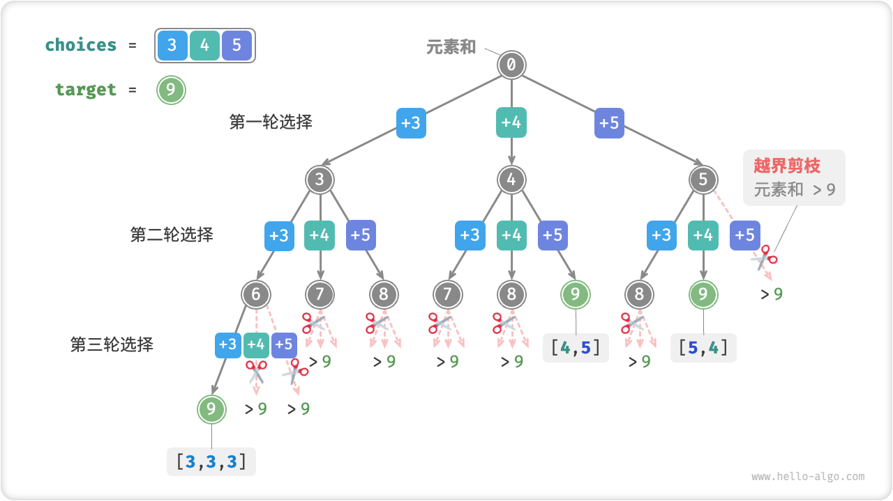
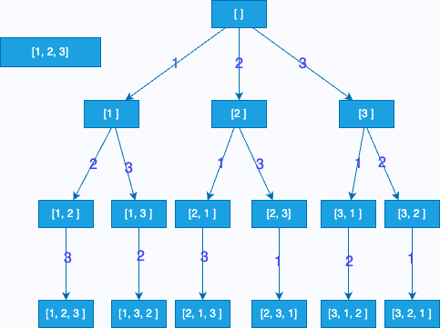

# 算法-Leetcode

### 链表


### 二叉树


### 回溯算法

#### [L39-中等] 组合总和

给你一个 **无重复元素** 的整数数组 `candidates` 和一个目标整数 `target` ，找出 `candidates` 中可以使数字和为目标数 `target` 的 所有 **不同组合** ，并以列表形式返回。你可以按 **任意顺序** 返回这些组合。

`candidates` 中的 **同一个** 数字可以 **无限制重复被选取** 。如果至少一个数字的被选数量不同，则两种组合是不同的。 

对于给定的输入，保证和为 `target` 的不同组合数少于 `150` 个。

**示例**

```
输入：candidates = [2,3,6,7], target = 7
输出：[[2,2,3],[7]]
解释：
2 和 3 可以形成一组候选，2 + 2 + 3 = 7 。注意 2 可以使用多次。
7 也是一个候选， 7 = 7 。
仅有这两种组合。

输入: candidates = [2,3,5], target = 8
输出: [[2,2,2,2],[2,3,3],[3,5]]

输入: candidates = [2], target = 1
输出: []
```

**提示：**

- `1 <= candidates.length <= 30`
- `2 <= candidates[i] <= 40`
- `candidates` 的所有元素 **互不相同**
- `1 <= target <= 40`

**题解**

> 回溯算法
>



代码实现：

```go
func combinationSum(candidates []int, target int) [][]int {
	// 排序
	sort.Ints(candidates)
	// 过程数组
	state := make([]int, 0)
	// 结果数组
	res := make([][]int, 0)
	return backtrace(candidates, target, state, 0, res)
}

func backtrace(candidates []int, target int, state []int, start int, res [][]int) [][]int {
	// 为0时符合，添加子集到结果集中
	if target == 0 {
		//res = append(res, state)
		res = append(res, append([]int{}, state...))
		return res
	}
	// 遍历，从 start 开始，避免重复子集
	for i := start; i < len(candidates); i++ {
		// 元素和不能超过 target
		if target-candidates[i] < 0 {
			break
		}
		// 更新子集
		state = append(state, candidates[i])
		// 递归，进行下一轮
		res = backtrace(candidates, target-candidates[i], state, i, res)
		// 回退
		state = state[:len(state)-1]
	}
	return res
}
```

#### [L46-简单] 全排列

给定一个 **没有重复 ** 数字的序列，返回其所有可能的全排列。

**示例**

```
输入: [1,2,3]
输出:
[
  [1,2,3],
  [1,3,2],
  [2,1,3],
  [2,3,1],
  [3,1,2],
  [3,2,1]
]

输入：nums = [0,1]
输出：[[0,1],[1,0]]

输入：nums = [1]
输出：[[1]]
```

**题解**

> 回溯算法



Go：

```go
func permute(nums []int) [][]int {
    res := make([][]int, 0)
    state := make([]int, 0)
    return backtrace(nums, state, res)
}

func backtrace(nums []int, state []int, res [][]int) [][]int {
    if len(nums) == len(state) {
        res = append(res, append([]int{}, state...))
        return res
    }
    for i := 0; i < len(nums); i++ {
        if inArray(state, nums[i]) {
            continue
        }
        state = append(state, nums[i])
        res = backtrace(nums, state, res)
        state = state[:len(state)-1]
    }
    return res
}

func inArray(arr []int, target int) bool {
    exist := false
    for _, v := range arr {
        if target == v {
            exist = true
            break
        }
    }
    return exist
}
```

PHP：

```php
class Solution {
    public $res = [];
    /**
     * @param Integer[] $nums
     * @return Integer[][]
     */
    function permute($nums) {
        $this->do([], $nums);
        return $this->res;
    }
    function do($arr, $nums) {
        if (count($arr) == count($nums)) {
            array_push($this->res, $arr);
            return;
        }
        for ($i = 0; $i < count($nums); $i++) {
            if (in_array($nums[$i], $arr)) continue;
            array_push($arr, $nums[$i]);
            $this->do($arr, $nums);
            array_pop($arr);
        }
    }
}
```

### 动态规划

#### [L5-中等] 最长回文子串

给定一个字符串 `s`，找到 `s` 中最长的回文子串。你可以假设 `s` 的最大长度为 1000。

- `1 <= s.length <= 1000`
- `s` 仅由数字和英文字母组成

**示例**

```
输入: "babad"
输出: "bab"
注意: "aba" 也是一个有效答案。

输入: "cbbd"
输出: "bb"
```

**题解**

**暴力法**

> 时间复杂度-O(n^3)
>
> 空间复杂度-O(1)

GO：

```go
func longestPalindrome(s string) string {
    n := len(s)
    if (n < 2) {
        return s
    }

    max, index := 1, 0
    for i := 0; i < n - 1; i++ {
        for j := i + 1; j < n; j++ {
            if j - i + 1 > max && isPalindrome(s, i, j) {
                max = j - i + 1
                index = i
            }
        }
    }

    return s[index: index+max]
}

func isPalindrome(s string, left int, right int) bool {
    for left < right {
        if s[left] != s[right] {
            return false
        }
        left++
        right--
    }
    return true
}
```

JavaScript：

```go
var longestPalindrome = function(s) {
    let n = s.length;
    if (n < 2) {
        return s;
    }

    let maxLen = 1;
    let index = 0;
    for (let i = 0; i < n - 1; i++) {
        for (let j = i + 1; j < n; j++) {
            if (j - i + 1 > maxLen && isPalindrome(s, i ,j)) {
                maxLen = j - i + 1;
                index = i;
            }
        }
    }

    return s.slice(index, index + maxLen);
};

function isPalindrome(str, left, right) {
    while(left < right) {
        if (str[left] !== str[right]) {
            return false;
        }
        left++;
        right--;
    }
    return true;
}
```

**中心扩散法**

> 时间复杂度-O(n^2)
>
> 空间复杂度-O(1)

GO：

```go
func longestPalindrome(s string) string {
    n := len(s)
    if (n < 2) {
        return s
    }

    left, right := 0, 0
    for i := 0; i < n - 1; i++ {
        left1, right1 := expandAroundCenter(s, i, i);
        left2, right2 := expandAroundCenter(s, i, i + 1);
        if right1 - left1 > right - left {
            left, right = left1, right1
        }
        if right2 - left2 > right - left {
            left, right = left2, right2
        }
    }

    return s[left: right+1]
}

func expandAroundCenter(s string, left, right int) (int, int) {
    for left >= 0 && right < len(s) {
        if s[left] == s[right] {
            left--
            right++
        } else {
            break
        }
    }
    return left + 1, right - 1
}
```

PHP：

```php
class Solution {
    //定义全局
    public $res = "";
    public $max = 0;
    //比较左右
    private function diff($s, $left, $right) {
        while ($left >=0 && $right < strlen($s) && $s[$left] == $s[$right]) {
            if ($right - $left + 1 > $this->max) {
                $this->max = $right - $left + 1;
                $this->res = substr($s, $left, $right-$left+1);
            }
            $left--;
            $right++;
        }
    }
    /**
     * @param String $s
     * @return String
     */
    function longestPalindrome($s) {
        if (strlen($s) <= 1) return $s;
        for ($i = 0; $i < strlen($s); $i++) {
            $this->diff($s, $i, $i);
            $this->diff($s, $i, $i + 1);
        }
        return $this->res;
    }
}
```

**动态规划**

> 时间复杂度-O(n^2)
>
> 空间复杂度-O(n^2)

GO：

```go
func longestPalindrome(s string) string {
    n := len(s)
    if (n < 2) {
        return s
    }

    dp := make([][]bool, n)
    for i,_ := range dp {
        dp[i] = make([]bool, n)
    }

    max, index := 1, 0
    for j := 1; j < n; j++ {
        for i := 0; i < j; i++ {
            if s[i] != s[j] {
                dp[i][j] = false
            } else {
                if j - i < 3 {
                    dp[i][j] = true
                } else {
                    dp[i][j] = dp[i + 1][j - 1]
                }
            }
            if dp[i][j] == true && j - i + 1 > max {
                max = j - i + 1
                index = i
            }
        }
    }

    return s[index: index+max]
}
```

PHP：

```php
class Solution {
    /**
     * @param String $s
     * @return String
     */
    function longestPalindrome($s) {
        if (strlen($s) <= 1) return $s;
        $res = $s[0];
        $max = 0;
        if ($s[0] == $s[1]) {
            $res = substr($s, 0, 2);
        }
        for ($j = 2; $j < strlen($s); $j++) {
            $dp[$j][$j] = true;
            for ($i = 0; $i < $j; $i++) {
                $dp[$i][$j] = $s[$i] == $s[$j] && ($j - $i <= 2 || $dp[$i + 1][$j - 1]);
                if ($dp[$i][$j] && $max < $j - $i + 1) {
                    $max = $j - $i + 1;
                    $res = substr($s, $i, $j - $i + 1);
                }
            }
        }
        return $res;
    }
}
```


#### [L53-中等] 最大子数组和

给你一个整数数组 `nums` ，请你找出一个具有最大和的连续子数组（子数组最少包含一个元素），返回其最大和。

**子数组**是数组中的一个连续部分

**示例**

```
输入：nums = [-2,1,-3,4,-1,2,1,-5,4]
输出：6
解释：连续子数组 [4,-1,2,1] 的和最大，为 6 。

输入：nums = [1]
输出：1

输入：nums = [5,4,-1,7,8]
输出：23
```

**题解**

动态规划

将问题分解成n个字问题：

- 子问题 1：以 −2-2−2 结尾的连续子数组的最大和是多少；
    - 以 −2 **结尾的**连续子数组是 `[-2]`，因此最大和就是 −2。
- 子问题 2：以 111 结尾的连续子数组的最大和是多少；
    - 以 1 结尾的连续子数组有 [-2,1] 和 [1] ，其中 [-2,1] 就是在「子问题 1」的后面加上 1 得到。−2+1=−1<1，因此「子问题 2」 的答案是 1。

- 子问题 3：以 −3-3−3 结尾的连续子数组的最大和是多少；
- 子问题 4：以 444 结尾的连续子数组的最大和是多少；
- 子问题 5：以 −1-1−1 结尾的连续子数组的最大和是多少；
- 子问题 6：以 222 结尾的连续子数组的最大和是多少；
- 子问题 7：以 111 结尾的连续子数组的最大和是多少；
- 子问题 8：以 −5-5−5 结尾的连续子数组的最大和是多少；
- 子问题 9：以 444 结尾的连续子数组的最大和是多少。

假设`dp[i]`表示以 `nums[i]` **结尾** 的 **连续** 子数组的最大和，则可以得出：

- 当 `dp[i - 1] > 0` 时 `dp[i] = dp[i - 1] + nums[i]`

- 当 `dp[i - 1] <= 0` 时 `dp[i] = nums[i]`

```go
func maxSubArray(nums []int) int {
    n := len(nums)
    dp := make([]int, n)
    dp[0] = nums[0]
    max := dp[0]
    for i := 1; i < n; i++ {
        if dp[i - 1] > 0 {
            dp[i] = dp[i - 1] + nums[i]
        } else {
            dp[i] = nums[i]
        }
        if dp[i] > max {
            max = dp[i]
        }
    }
    return max
}
```

#### [L62-中等] 不同路径

一个机器人位于一个 `m x n` 网格的左上角 （起始点在下图中标记为 “Start” ）。

机器人每次只能向下或者向右移动一步。机器人试图达到网格的右下角（在下图中标记为 “Finish” ）。

问总共有多少条不同的路径？

**示例**

```
输入：m = 3, n = 7
输出：28

输入：m = 3, n = 2
输出：3
解释：
从左上角开始，总共有 3 条路径可以到达右下角。
1. 向右 -> 向下 -> 向下
2. 向下 -> 向下 -> 向右
3. 向下 -> 向右 -> 向下

输入：m = 7, n = 3
输出：28

输入：m = 3, n = 3
输出：6
```

- `1 <= m, n <= 100`
- 题目数据保证答案小于等于 `2 * 109`

**题解**

动态规划

`dp[i][j]` 是到达 `i, j` 最多路径，表达式：`dp[i][j] = dp[i-1][j] + dp[i`][j-1]

```go
func uniquePaths(m, n int) int {
	dp := make([][]int, m)
	for i := range dp {
		dp[i] = make([]int, n)
		dp[i][0] = 1
	}
	for j := 0; j < n; j++ {
		dp[0][j] = 1
	}
	for i := 1; i < m; i++ {
		for j := 1; j < n; j++ {
			dp[i][j] = dp[i-1][j] + dp[i][j-1]
		}
	}
	return dp[m-1][n-1]
}
```

#### [L64-中等] 最小路径和

给定一个包含非负整数的 `*m* x *n*` 网格 `grid` ，请找出一条从左上角到右下角的路径，使得路径上的数字总和为最小。

**说明：**每次只能向下或者向右移动一步。

**示例**

```
输入：grid = [[1,3,1],[1,5,1],[4,2,1]]
输出：7
解释：因为路径 1→3→1→1→1 的总和最小。

输入：grid = [[1,2,3],[4,5,6]]
输出：12
```

- `m == grid.length`
- `n == grid[i].length`
- `1 <= m, n <= 200`
- `0 <= grid[i][j] <= 200`

**题解**

动态规划

设 `dp[i][j]` 是到达 `i, j` 最多长路径，则 `dp[i][j]=min(dp[i-1][j], dp[i][j-1]) + grid[i][j]`

先初始化数组

第一个最小路径为：`dp[0][0] = grid[0`][0]

第一行最小路径为：`dp[i][0] = dp[i-1][0] + grid[i][0]`

第一列最小路径为：`dp[0][j] = dp[0][j-1] + grid[0][j]`

第`i` 、`j`个元素的最小路径为： `dp[i][j]=min(dp[i-1][j], dp[i][j-1]) + grid[i][j]`

```go
func minPathSum(grid [][]int) int {
	m := len(grid)
	n := len(grid[0])
	dp := make([][]int, m)
	for i := range dp {
		dp[i] = make([]int, n)
	}
	dp[0][0] = grid[0][0]
	for i := 1; i < m; i++ {
		dp[i][0] = dp[i-1][0] + grid[i][0]
	}
	for j := 1; j < n; j++ {
		dp[0][j] = dp[0][j-1] + grid[0][j]
	}
	for i := 1; i < m; i++ {
		for j := 1; j < n; j++ {
			if dp[i-1][j] > dp[i][j-1] {
				dp[i][j] = dp[i][j-1] + grid[i][j]
			} else {
				dp[i][j] = dp[i-1][j] + grid[i][j]
			}
		}
	}
	return dp[m-1][n-1]
}
```

### 贪心算法

#### [L55-中等] 跳跃游戏

给你一个非负整数数组 `nums` ，你最初位于数组的 **第一个下标** 。数组中的每个元素代表你在该位置可以跳跃的最大长度。

判断你是否能够到达最后一个下标，如果可以，返回 `true` ；否则，返回 `false` 。

**示例**

```
输入：nums = [2,3,1,1,4]
输出：true
解释：可以先跳 1 步，从下标 0 到达下标 1, 然后再从下标 1 跳 3 步到达最后一个下标。

输入：nums = [3,2,1,0,4]
输出：false
解释：无论怎样，总会到达下标为 3 的位置。但该下标的最大跳跃长度是 0 ， 所以永远不可能到达最后一个下标。
```

**题解**

贪心算法

由题意可知：

尽可能到达最远位置（贪心）。
如果能到达某个位置，那一定能到达它前面的所有位置。

设 k 为最远可到达的位置，如果能到达当前位置（i < k），则最远位置`k=i+nums[i]`

若最远位置k已经 >= 数组最大长度，则肯定可以达到，可直接返回 true

```go
func canJump(nums []int) bool {
    k, n := 0, len(nums)
    for i := 0; i < n; i++ {
        if i > k {
            return false
        }
        if i + nums[i] > k {
            k = i + nums[i]
        }
        if k >= n - 1 {
            return true
        }
    }
    return true
}
```

### 分治算法


### 排序算法

#### [L56-中等] 合并区间

以数组 `intervals` 表示若干个区间的集合，其中单个区间为 `intervals[i] = [starti, endi]` 。请你合并所有重叠的区间，并返回 *一个不重叠的区间数组，该数组需恰好覆盖输入中的所有区间* 。

**示例**

```go
输入：intervals = [[1,3],[2,6],[8,10],[15,18]]
输出：[[1,6],[8,10],[15,18]]
解释：区间 [1,3] 和 [2,6] 重叠, 将它们合并为 [1,6].

输入：intervals = [[1,4],[4,5]]
输出：[[1,5]]
解释：区间 [1,4] 和 [4,5] 可被视为重叠区间。
```

- `1 <= intervals.length <= 104`
- `intervals[i].length == 2`
- `0 <= starti <= endi <= 104`

**题解**

1. 先根据数组左端大小进行排序
2. 遍历数组，依次比较每个数组，将前一个数组的右端 r 和后一个数组的左端 l 比较，若 `r < l`则说明不重叠

```go
func merge(intervals [][]int) [][]int {
    // 先安装数组左端元素从小到大进行排序
	n := len(intervals)
	for i := 0; i < n; i++ {
		for j := i + 1; j < n; j++ {
			if intervals[i][0] > intervals[j][0] {
				intervals[i], intervals[j] = intervals[j], intervals[i]
			}
		}
	}
	res := make([][]int, 0)
	tmp := intervals[0]
	for i := 1; i < n; i++ {
		if tmp[1] < intervals[i][0] { // 没有重合
			res = append(res, tmp)
			tmp = intervals[i]
		} else { // 重合
			if tmp[1] < intervals[i][1] {
				tmp[1] = intervals[i][1]
			}
		}
	}
	res = append(res, tmp)
	return res
}
```

### 哈希表

#### [L1-简单] 两数之和

给定一个整数数组 `nums` 和一个目标值 `target`，请你在该数组中找出和为目标值的那 **两个** 整数，并返回他们的数组下标。

你可以假设每种输入只会对应一个答案。但是，你不能重复利用这个数组中同样的元素。

**示例**

```
输入：nums = [2,7,11,15], target = 9
输出：[0,1]
解释：因为 nums[0] + nums[1] == 9 ，返回 [0, 1] 。

输入：nums = [3,2,4], target = 6
输出：[1,2]

输入：nums = [3,3], target = 6
输出：[0,1]
```

- `2 <= nums.length <= 104`
- `-109 <= nums[i] <= 109`
- `-109 <= target <= 109`
- **只会存在一个有效答案**

**题解**

哈希法:

```go
func twoSum(nums []int, target int) []int {
    hash := map[int]int{}
    for i, v := range nums {
        if p, ok := hash[target-v]; ok {
            return []int{p, i}
        }
        hash[v] = i
    }
    return nil
}
```

数组查找

```php
class Solution {

    /**
     * @param Integer[] $nums
     * @param Integer $target
     * @return Integer[]
     */
    function twoSum($nums, $target) {
        $count = count($nums);
        for ($i=0; $i<$count-1; $i++) {
            $tmp = $target - $nums[$i];
            $newnums = $nums;
            unset($newnums[$i]);
            $res = array_search($tmp, $newnums);
            if ($res !== false) {
                return array($i, $res);
                break;
            }
        }
    }
}
```

暴力：

```go
func twoSum(nums []int, target int) []int {
    n := len(nums)
    for i := 0; i < n - 1; i++ {
        for j := i + 1; j < n; j++ {
            if nums[i] + nums[j] == target {
                return []int{i, j}
            }
        }
    }
    return []int{}
}
```

PHP：

```php
class Solution {
    /**
     * @param Integer[] $nums
     * @param Integer $target
     * @return Integer[]
     */
    function twoSum($nums, $target) {
        $count = count($nums);
        for ($i=0; $i<$count-1; $i++) {
            for ($j=$i+1; $j<$count; $j++) {
            if(($nums[$i] + $nums[$j]) == $target ){
                    return array($i, $j);
                    break;
                }
            }
        }
    }
}
```

### 双指针


### 滑动窗口

#### [L3-中等] 无重复字符的最长子串

给定一个字符串，请你找出其中不含有重复字符的 **最长子串** 的长度。

**示例**

```
输入: "abcabcbb"
输出: 3 
解释: 因为无重复字符的最长子串是 "abc"，所以其长度为 3。

输入: "bbbbb"
输出: 1
解释: 因为无重复字符的最长子串是 "b"，所以其长度为 1。

输入: "pwwkew"
输出: 3
解释: 因为无重复字符的最长子串是 "wke"，所以其长度为 3。
     请注意，你的答案必须是 子串 的长度，"pwke" 是一个子序列，不是子串。
```

**题解**

滑动窗口

```go
func lengthOfLongestSubstring(s string) int {
    n := len(s)
    right, max := 0, 0
    // hash map，存储不重复的字符串，用于判断字符串是否出现过
    hash := make(map[byte]int)
    for i := 0; i < n; i++ {
        // 除了 i = 0 第一次，每一次移动左指针的时候都需要删除第一个hash元素
        if i != 0 {
            delete(hash, s[i-1])
        }
        // 不断移动右指针，直到出现重复字符退出
        for right < n && hash[s[right]] == 0 {
            hash[s[right]]++
            right++
        }
        // 更新最大值
        if right - i > max {
            max = right - i
        }
    }
    return max
}
```

PHP：

```php
class Solution {

    /**
     * @param String $s
     * @return Integer
     */
    function lengthOfLongestSubstring($s) {
        //边界
        if (!$s || strlen($s) == 0) return 0;
        //初始化
        $array= [];
        $ret = 0;
        $start = 0;
        //遍历
        for ($i = 0; $i < strlen($s); $i++) {
           if (isset($array[$s[$i]]) && $start <= $array[$s[$i]]) {
               $start = $array[$s[$i]] + 1;
           } else {
               $ret = max($ret, $i - $start + 1);
           }
            $array[$s[$i]] = $i;
        }
        return $ret;
    }
}
```

### 位运算

#### [L461-简单] 汉明距离

##### 描述

两个整数之间的 汉明距离 指的是这两个数字对应二进制位不同的位置的数目。

给你两个整数 `x` 和 `y`，计算并返回它们之间的汉明距离。

##### 示例

```
输入：x = 1, y = 4
输出：2
解释：
1   (0 0 0 1)
4   (0 1 0 0)
       ↑   ↑
上面的箭头指出了对应二进制位不同的位置。


输入：x = 3, y = 1
输出：1
```

- `0 <= x, y <= 231 - 1`

##### 题解

```go
func hammingDistance(x int, y int) int {
    return bits.OnesCount(uint(x ^ y))
}
```

### 未归类

#### L2.两数相加

> 难度：中等

##### 描述

给出两个 **非空** 的链表用来表示两个非负的整数。其中，它们各自的位数是按照 **逆序** 的方式存储的，并且它们的每个节点只能存储 **一位** 数字。

如果，我们将这两个数相加起来，则会返回一个新的链表来表示它们的和。

您可以假设除了数字 0 之外，这两个数都不会以 0 开头。

##### 示例

```
2 -> 4 -> 3
5 -> 6 -> 4
输入：l1 = [2,4,3], l2 = [5,6,4]
输出：[7,0,8]
解释：342 + 465 = 807

输入：l1 = [0], l2 = [0]
输出：[0]

输入：l1 = [9,9,9,9,9,9,9], l2 = [9,9,9,9]
输出：[8,9,9,9,0,0,0,1]
```

##### 题解

Go：

```go
/**
 * Definition for singly-linked list.
 * type ListNode struct {
 *     Val int
 *     Next *ListNode
 * }
 */
func addTwoNumbers(l1 *ListNode, l2 *ListNode) *ListNode {
    var head, cur *ListNode
    add := 0
    for l1 != nil || l2 != nil {
        n1, n2 := 0, 0
        if l1 != nil {
            n1 = l1.Val
            l1 = l1.Next
        }
        if l2 != nil {
            n2 = l2.Val
            l2 = l2.Next
        }

        sum := n1 + n2 + add
        sum, add = sum % 10, sum / 10

        if head == nil {
            head = &ListNode{Val: sum}
            cur = head
        } else {
            cur.Next = &ListNode{Val: sum}
            cur = cur.Next
        }
    }

    if add > 0 {
        cur.Next = &ListNode{Val: add}
    }

    return head
}
```

PHP：

```php
/**
 * Definition for a singly-linked list.
 * class ListNode {
 *     public $val = 0;
 *     public $next = null;
 *     function __construct($val) { $this->val = $val; }
 * }
 */
class Solution {

    /**
     * @param ListNode $l1
     * @param ListNode $l2
     * @return ListNode
     */
    function addTwoNumbers($l1, $l2) {
        $add = 0;
        $list = new ListNode(0);
        $current = $list;
        while($l1 || $l2) {
            $x = 0;
            $y = 0;
            if ($l1 != null) {
                $x = $l1->val;
                $l1 = $l1->next;
            }
            if ($l2 != null) {
                $y = $l2->val;
                $l2 = $l2->next;
            }
            
            $val = ($x + $y + $add) % 10;
            $add = intval(($x + $y + $add) / 10);
            
            $new = new ListNode($val);
            $current->next = $new;
            $current = $current->next;
        }
        if ($add > 0) {
            $current->next = new ListNode($add);
        }
        return $list->next;
    }
}
```

#### L6.Z 字变换

> 难度：中等

##### 描述

将一个给定字符串根据给定的行数，以从上往下、从左到右进行 Z 字形排列。

比如输入字符串为 `"LEETCODEISHIRING"` 行数为 3 时，排列如下：

```
L   C   I   R
E T O E S I I G
E   D   H   N
```

之后，你的输出需要从左往右逐行读取，产生出一个新的字符串，比如：`"LCIRETOESIIGEDHN"`。

请你实现这个将字符串进行指定行数变换的函数：

```
string convert(string s, int numRows);
```

- `1 <= s.length <= 1000`
- `s` 由英文字母（小写和大写）、`','` 和 `'.'` 组成
- `1 <= numRows <= 1000`

##### 示例

```
输入: s = "LEETCODEISHIRING", numRows = 3
输出: "LCIRETOESIIGEDHN"

输入: s = "LEETCODEISHIRING", numRows = 4
输出: "LDREOEIIECIHNTSG"
解释:
L     D     R
E   O E   I I
E C   I H   N
T     S     G

输入：s = "A", numRows = 1
输出："A"
```

##### 题解

方法一：

```php
class Solution {

    /**
     * @param String $s
     * @param Integer $numRows
     * @return String
     */
    function convert($s, $numRows) {
         if (strlen($s) == 1 || $numRows == 1) return $s;
        
        $ret = [];
        $pre = -1;
        $sign = 'down';
        for ($i = 0; $i < strlen($s); $i++) {
            if ($sign == 'up') {
                $ret[$pre - 1][] = $s[$i];
                $pre = $pre - 1;
                if ($pre == 0) {
                    $sign = 'down';
                }
            } else {
                $ret[$pre + 1][] = $s[$i];
                $pre = $pre + 1;
                if ($pre == $numRows - 1) {
                    $sign = 'up';
                }
            }
        }
        return implode('', array_map(function($a){return implode('', $a);}, $ret));
    }
}
```

方法二：

```php
class Solution {

    /**
     * @param String $s
     * @param Integer $numRows
     * @return String
     */
    function convert($s, $numRows) {
         if (strlen($s) == 1 || $numRows == 1) return $s;
        
        $ret = [];
        for ($i = 0; $i < strlen($s); $i++) {
            $index = $i % (2 * $numRows -2);
            $index = $index < $numRows ? $index : 2 * $numRows -2 - $index;
            $ret[$index][] = $s[$i];
        }
        return implode('', array_map(function($a){return implode('', $a);}, $ret));
    }
}
```

#### L7.整数反转

> 难度：中等

##### 描述

给你一个 32 位的有符号整数 x ，返回将 x 中的数字部分反转后的结果。

如果反转后整数超过 32 位的有符号整数的范围 [−231,  231 − 1] ，就返回 0。

假设环境不允许存储 64 位整数（有符号或无符号）。

##### 示例 

```
输入: 123
输出: 321

输入: -123
输出: -321

输入: 120
输出: 21
```

##### 题解

转成字符串处理（PHP）

```php
class Solution {

    /**
     * @param Integer $x
     * @return Integer
     */
    function reverse($x) {
        $l = strlen($x);
        $x = (string)$x;
        if ($x == 0) {
            return 0;
        }
        
        $flag = 1;
        if ($x[0] == '-') {
            $flag = -1;
        }

        $y = '';
        for($i = $l - 1; $i >= 0; $i--) {
            $y .= $x[$i];
        }
        $y = $flag * $y;

        if ($y > (pow(2,31)-1) || $y < pow(-2,31)) {
            return 0;
        }
        
        return $y;
    }
}
```

#### L8.字符串转换整数

> 难度：中等

##### 描述

请你来实现一个 `atoi` 函数，使其能将字符串转换成整数。

首先，该函数会根据需要丢弃无用的开头空格字符，直到寻找到第一个非空格的字符为止。

当我们寻找到的第一个非空字符为正或者负号时，则将该符号与之后面尽可能多的连续数字组合起来，作为该整数的正负号；假如第一个非空字符是数字，则直接将其与之后连续的数字字符组合起来，形成整数。

该字符串除了有效的整数部分之后也可能会存在多余的字符，这些字符可以被忽略，它们对于函数不应该造成影响。

注意：假如该字符串中的第一个非空格字符不是一个有效整数字符、字符串为空或字符串仅包含空白字符时，则你的函数不需要进行转换。

在任何情况下，若函数不能进行有效的转换时，请返回 0。

**说明：**

假设我们的环境只能存储 32 位大小的有符号整数，那么其数值范围为 [−231,  231 − 1]。如果数值超过这个范围，qing返回  INT_MAX (231 − 1) 或 INT_MIN (−231) 。

##### 示例

**示例 1:**

```
输入: "42"
输出: 42
```

**示例 2:**

```
输入: "   -42"
输出: -42
解释: 第一个非空白字符为 '-', 它是一个负号。
     我们尽可能将负号与后面所有连续出现的数字组合起来，最后得到 -42 。
```

**示例 3:**

```
输入: "4193 with words"
输出: 4193
解释: 转换截止于数字 '3' ，因为它的下一个字符不为数字。
```

**示例 4:**

```
输入: "words and 987"
输出: 0
解释: 第一个非空字符是 'w', 但它不是数字或正、负号。
     因此无法执行有效的转换。
```

**示例 5:**

```
输入: "-91283472332"
输出: -2147483648
解释: 数字 "-91283472332" 超过 32 位有符号整数范围。 
     因此返回 INT_MIN (−231) 。
```

##### 题解

**方法一：**

> 全部转化成字符串来解决

```php
class Solution {

    /**
     * @param String $str
     * @return Integer
     */
    function myAtoi($str) {
        $str = trim($str);
        if (!is_numeric($str[0]) && $str[0] != '-' && $str[0] != '+') return 0;
        $res = $str[0];
        
        for ($i = 1; $i < strlen($str); $i++) {
            if (is_numeric($str[$i])) {
                $res = $res.$str[$i];
            } else {
                break;
            }
        }
        $res = intval($res);
        if ($res >= pow(2, 31) - 1) {
            return pow(2, 31) - 1;
        } else if ($res <= pow(2, 31) * (-1)) {
            return pow(2, 31) * (-1);
        }
        return $res;
    }
}
```

**方法二：**

> 直接以整数的形势解题

```php
class Solution {

    /**
     * @param String $str
     * @return Integer
     */
    function myAtoi($str) {
        if (!$str) return 0;
        
        $str = trim($str);
        $first = $str[0];
        $sign = 1;
        $res = 0;
        if ($first == '+') {
            $start = 1;
        } else if ($first == '-') {
            $start = 1;
            $sign = -1;
        } else {
            $start = 0;
        }
        for ($i = $start; $i < strlen($str); $i++) {
            if (!is_numeric($str[$i])) {
                return $res * $sign;
            }
            $res = $res * 10 + $str[$i];
            if ($res >= pow(2, 31)) {
                if ($sign > 0) {
                    return pow(2, 31) - 1 * $sign;
                }
                return pow(2, 31) * $sign;
            }
        }
        return $res * $sign;
    }
}
```

#### L9.回文数

> 难度：简单

##### 描述

判断一个整数是否是回文数。回文数是指正序（从左向右）和倒序（从右向左）读都是一样的整数。

进阶：你能不将整数转为字符串来解决这个问题吗？

##### 示例

```
输入: 121
输出: true

输入: -121
输出: false
解释: 从左向右读, 为 -121 。 从右向左读, 为 121- 。因此它不是一个回文数。

输入: 10
输出: false
解释: 从右向左读, 为 01 。因此它不是一个回文数。
```

##### 题解

**方法一：转化成字符串**

```php
class Solution {

    /**
     * @param Integer $x
     * @return Boolean
     */
    function isPalindrome($x) {
        $len = strlen($x);
        $x = (string)$x;
        for ($i=$len-1; $i>=0; $i--) {
            $y.=$x[$i];
        }
        if ($x == $y) {
            return true;
        } else {
            return false;
        }
    }
}
```

**方法二：**

```php
class Solution {

    /**
     * @param Integer $x
     * @return Boolean
     */
    function isPalindrome($x) {
        // 所有负数返回 false
        // 10的倍数返回false
        if ($x < 0 || ($x % 10 == 0 && $x != 0)) {
            return false;
        }
        // %10得到最后一位数字
        // 先/10再%10得到倒数第二位数字，以此类推
        $y = 0;
        while ($x > $y) {
            $y = $y * 10 + $x % 10;
            $x /= 10;
            $x = (int)$x;
        }
        $new = $y/10;
        $new = (int)$new;
        return $x == $y || $x == $new;
    }
}
```

#### L11.盛最多水的容器

> 难度：中等

##### 描述

给定 *n* 个非负整数 *a*1，*a*2，...，*a*n，每个数代表坐标中的一个点 (*i*, *ai*) 。在坐标内画 *n* 条垂直线，垂直线 *i* 的两个端点分别为 (*i*, *ai*) 和 (*i*, 0)。找出其中的两条线，使得它们与 *x* 轴共同构成的容器可以容纳最多的水。

**说明：**你不能倾斜容器，且 *n* 的值至少为 2。


图中垂直线代表输入数组 [1,8,6,2,5,4,8,3,7]。在此情况下，容器能够容纳水（表示为蓝色部分）的最大值为 49。

##### 示例

```
输入: [1,8,6,2,5,4,8,3,7]
输出: 49

输入：height = [1,1]
输出：1
```

##### 题解

**暴力法**

> 暴力，超时

```php
class Solution {

    /**
     * @param Integer[] $height
     * @return Integer
     */
    function maxArea($height) {
        $n = count($height);
        if ($n < 2) return 0;
        $maxarea = 0;
        for ($i = 0; $i < $n; $i++) {
            for ($j = $i + 1; $j < $n; $j++) {
                $maxarea = max($maxarea, min($height[$i], $height[$j]) * ($j - $i));
            }
        }
        return $maxarea;
    }
}
```

**左右指针**

Go：

```go
func maxArea(height []int) int {
    n := len(height)
    left, right, max, tmp := 0, n - 1, 0, 0
    for left < right {
        if height[left] < height[right] {
            tmp = height[left] * (right - left)
            left++
        } else {
            tmp = height[right] * (right - left)
            right--
        }
        if tmp > max {
            max = tmp
        }
    }
    return max
}
```

PHP：

```php
class Solution {

    /**
     * @param Integer[] $height
     * @return Integer
     */
    function maxArea($height) {
        $left = 0;
        $right = count($height) -1;
        $maxarea = 0;
        while ($left < $right) {
        	$maxarea = max($maxarea, min($height[$left], $height[$right]) * ($right - $left));
        	if ($height[$left] < $height[$right]) {
        		$left++;
        	} else {
        		$right--;
        	}
        }
        return $maxarea;
    }
}
```

#### L12.整数转罗马数字

> 难度：中等

##### 描述

罗马数字包含以下七种字符： `I`， `V`， `X`， `L`，`C`，`D` 和 `M`。

```
字符          数值
I             1
V             5
X             10
L             50
C             100
D             500
M             1000
```

例如， 罗马数字 2 写做 `II` ，即为两个并列的 1。12 写做 `XII` ，即为 `X` + `II` 。 27 写做  `XXVII`, 即为 `XX` + `V` + `II` 。

通常情况下，罗马数字中小的数字在大的数字的右边。但也存在特例，例如 4 不写做 `IIII`，而是 `IV`。数字 1 在数字 5 的左边，所表示的数等于大数 5 减小数 1 得到的数值 4 。同样地，数字 9 表示为 `IX`。这个特殊的规则只适用于以下六种情况：

- `I` 可以放在 `V` (5) 和 `X` (10) 的左边，来表示 4 和 9。
- `X` 可以放在 `L` (50) 和 `C` (100) 的左边，来表示 40 和 90。 
- `C` 可以放在 `D` (500) 和 `M` (1000) 的左边，来表示 400 和 900。

给定一个整数，将其转为罗马数字。输入确保在 1 到 3999 的范围内。

##### 示例

**示例 1:**

```
输入: 3
输出: "III"
```

**示例 2:**

```
输入: 4
输出: "IV"
```

**示例 3:**

```
输入: 9
输出: "IX"
```

**示例 4:**

```
输入: 58
输出: "LVIII"
解释: L = 50, V = 5, III = 3.
```

**示例 5:**

```
输入: 1994
输出: "MCMXCIV"
解释: M = 1000, CM = 900, XC = 90, IV = 4.
```

##### 题解

```php
class Solution {

    /**
     * @param Integer $num
     * @return String
     */
    function intToRoman($num) {
        $arr1 = [1000,900,500,400,100,90,50,40,10,9,5,4,1];
        $arr2 = ["M","CM","D","CD","C","XC","L","XL","X","IX","V","IV","I"];
        $res = '';
        for($i = 0; $i < 13; $i++){
            while($num >= $arr1[$i]){
                $num -= $arr1[$i];
                $res = $res.$arr2[$i];
            }
        }
        return $res;
    }
}
```

#### L13.罗马数字转整数

> 难度：简单

##### 描述

罗马数字包含以下七种字符: `I`， `V`， `X`， `L`，`C`，`D` 和 `M`。

```
字符          数值
I             1
V             5
X             10
L             50
C             100
D             500
M             1000
```

例如， 罗马数字 2 写做 `II` ，即为两个并列的 1。12 写做 `XII` ，即为 `X` + `II` 。 27 写做  `XXVII`, 即为 `XX` + `V` + `II` 。

通常情况下，罗马数字中小的数字在大的数字的右边。但也存在特例，例如 4 不写做 `IIII`，而是 `IV`。数字 1 在数字 5 的左边，所表示的数等于大数 5 减小数 1 得到的数值 4 。同样地，数字 9 表示为 `IX`。这个特殊的规则只适用于以下六种情况：

- `I` 可以放在 `V` (5) 和 `X` (10) 的左边，来表示 4 和 9。
- `X` 可以放在 `L` (50) 和 `C` (100) 的左边，来表示 40 和 90。 
- `C` 可以放在 `D` (500) 和 `M` (1000) 的左边，来表示 400 和 900。

给定一个罗马数字，将其转换成整数。输入确保在 1 到 3999 的范围内。

##### 示例

**示例 1:**

```
输入: "III"
输出: 3
```

**示例 2:**

```
输入: "IV"
输出: 4
```

**示例 3:**

```
输入: "IX"
输出: 9
```

**示例 4:**

```
输入: "LVIII"
输出: 58
解释: L = 50, V= 5, III = 3.
```

**示例 5:**

```
输入: "MCMXCIV"
输出: 1994
解释: M = 1000, CM = 900, XC = 90, IV = 4
```

##### 题解

如果当前字符代表的值不小于其右边，就加上该值；否则就减去该值。以此类推到最左边的数，最终得到的结果即是答案

```php
class Solution {

    /**
     * @param String $s
     * @return Integer
     */
    function romanToInt($s) {
        $tmp = [
            'I' => 1,
            'V' => 5,
            'X' => 10,
            'L' => 50,
            'C' => 100,
            'D' => 500,
            'M' => 1000,
        ];
        $s = (string)$s;
        $len = strlen($s);
        for ($i=0; $i<$len; $i++) {
            if ($tmp[$s[$i]] >= $tmp[$s[$i+1]]) {
                $ans+=$tmp[$s[$i]];
            } else {
                $ans-=$tmp[$s[$i]];
            }
        }
        return $ans;
    }
}
```

#### L14.最长公共前缀

> 难度：简单

##### 描述

编写一个函数来查找字符串数组中的最长公共前缀。

如果不存在公共前缀，返回空字符串 `""`。

说明：所有输入只包含小写字母 `a-z` 。

##### 示例

**示例 1:**

```
输入: ["flower","flow","flight"]
输出: "fl"
```

**示例 2:**

```
输入: ["dog","racecar","car"]
输出: ""
解释: 输入不存在公共前缀。
```

##### 题解

获取第一个元素，以第一个元素为基准点，遍历数组，依次和第一个元素对比，获取相同元素个数

Golang：

```go
func longestCommonPrefix(strs []string) string {
    if len(strs) == 0 {
        return ""
    }
    for i := 0; i < len(strs[0]); i++ {
        for j := 1; j < len(strs); j++ {
            if i == len(strs[j]) || strs[j][i] != strs[0][i] {
                return strs[0][:i]
            }
        }
    }
    return strs[0]
}
```

PHP：

```php
class Solution {

    /**
     * @param String[] $strs
     * @return String
     */
    function longestCommonPrefix($strs) {
        $len = count($strs);
        $first = $strs[0];
        $firstLen = strlen($first);
        for ($i = 1;$i < $len; $i++) {
            $tempArr = str_split($strs[$i]);
            $min = min($firstLen, count($tempArr));
            $tempLen = 0;
            for ($j = 0; $j < $min; $j++) {
                if ($first[$j] == $tempArr[$j]) {
                    $tempLen++;
                } else {
                    break;
                }
            }
            $firstLen > $tempLen && $firstLen = $tempLen;
        }
        return substr($first, 0, $firstLen);
    }
}
```

#### L15.三数之和

> 难度：中等

##### 描述

给定一个包含 *n* 个整数的数组 `nums`，判断 `nums` 中是否存在三个元素 *a，b，c ，*使得 *a + b + c =* 0 ？找出所有满足条件且不重复的三元组。

**注意：**答案中不可以包含重复的三元组。

##### 示例

```
例如, 给定数组 nums = [-1, 0, 1, 2, -1, -4]，

满足要求的三元组集合为：
[
  [-1, 0, 1],
  [-1, -1, 2]
]
```

##### 题解

**排序+双指针**

Go：

```go
func threeSum(nums []int) [][]int {
    n := len(nums)
    if n < 3 {
        return [][]int{}
    }

    // 不能重复，所以先进行排序
    sort.Ints(nums)

    ret := make([][]int, 0)
    for i := 0; i < n - 2; i++ {
        if i > 0 && nums[i] == nums[i - 1] {
            continue
        }
        left, right := i + 1, n - 1
        need := 0 - nums[i]
        for left < right {
            if nums[left] + nums[right] == need {
                ret = append(ret, []int{nums[i], nums[left], nums[right]})
                for left < right && nums[left] == nums[left + 1] {
                    left++
                }
                for left < right && nums[right] == nums[right - 1] {
                    right--
                }
                left++
                right--
            } else if nums[left] + nums[right] < need {
                left++
            } else {
                right--
            }
        }
    }
    return ret
}
```

PHP：

```php
class Solution {

    /**
     * @param Integer[] $nums
     * @return Integer[][]
     */
    function threeSum($nums) {
        if (!$nums) return [];
        sort($nums);
        $ret = [];
        for ($i = 0; $i < count($nums) - 2; $i++) {
            if ($i > 0 && $nums[$i] == $nums[$i - 1]) continue;
            $left = $i + 1;
            $right = count($nums) - 1;
            
            $need = 0 - $nums[$i];
            
            while ($left < $right) {
                if ($nums[$left] + $nums[$right] == $need) {
                    array_push($ret, [$nums[$i], $nums[$left], $nums[$right]]);
                    while ($left < $right && $nums[$left] == $nums[$left + 1]) $left++;
                    while ($left < $right && $nums[$right] == $nums[$right - 1]) $right--;
                    $left++;
                    $right--;
                } else if ($nums[$left] + $nums[$right] > $need) {
                    $right--;
                } else {
                    $left++;
                }
            }
        }
        return $ret;
    }
}
```

#### L16.最接近的三数之和

> 难度：中等

##### 描述

给定一个包括 n 个整数的数组 nums 和 一个目标值 target。找出 nums 中的三个整数，使得它们的和与 target 最接近。返回这三个数的和。假定每组输入只存在唯一答案。

例如，给定数组 nums = [-1，2，1，-4], 和 target = 1.

与 target 最接近的三个数的和为 2. (-1 + 2 + 1 = 2).

##### 题解

```php
class Solution {

    /**
     * @param Integer[] $nums
     * @param Integer $target
     * @return Integer
     */
    function threeSumClosest($nums, $target) {
        if (!nums) return [];
        $length = count($nums);
        sort($nums);
        $min = $nums[0] + $nums[1] + $nums[2];
        for ($i = 0; $i < $length - 2; $i++) {
            $left = $i + 1;
            $right = $length - 1;
            while ($left < $right) {
                $sum = $nums[$left] + $nums[$right] + $nums[$i];
                if ($sum < $target) {
                    $left++;
                } else {
                    $right--;
                }
                if (abs($sum - $target) < abs($min - $target)) {
                    $min = $sum;
                }
            }
        }
        return $min;
    }
}
```

#### L17.电话号码的字母组合

> 难度：中等

##### 描述

给定一个仅包含数字 2-9 的字符串，返回所有它能表示的字母组合。

给出数字到字母的映射如下（与电话按键相同）。注意 1 不对应任何字母。


##### 示例

```
输入："23"
输出：["ad", "ae", "af", "bd", "be", "bf", "cd", "ce", "cf"].
说明：尽管上面的答案是按字典序排列的，但是你可以任意选择答案输出的顺序。

输入：digits = "2"
输出：["a","b","c"]

输入：digits = ""
输出：[]
```

##### 题解

**回溯法：**

Go：

```go
var phoneMap map[string]string = map[string]string {
	"2": "abc",
	"3": "def",
	"4": "ghi",
	"5": "jkl",
	"6": "mno",
	"7": "pqrs",
	"8": "tuv",
	"9": "wxyz",
}

var combinations []string

func letterCombinations(digits string) []string {
	if len(digits) == 0 {
		return []string{}
	}

    combinations = []string{}
	dfs(digits, 0, "")
	return combinations
}

func dfs(digits string, index int, combination string) {
	if len(digits) == index {
		combinations = append(combinations, combination)
		return
	}

	digit := string(digits[index])
	letters := phoneMap[digit]
	for i := 0; i < len(letters); i++ {
		dfs(digits, index+1, combination+string(letters[i]))
	}
}
```

PHP：

```php
class Solution {
    public $res = [];
    public $str = "";
    public $array = [
        '2' => ['a', 'b', 'c'],
        '3' => ['d', 'e', 'f'],
        '4' => ['g', 'h', 'i'],
        '5' => ['j', 'k', 'l'],
        '6' => ['m', 'n', 'o'],
        '7' => ['p', 'q', 'r', 's'],
        '8' => ['t', 'u', 'v'],
        '9' => ['w', 'x', 'y', 'z'],
    ];

    /**
     * @param String $digits
     * @return String[]
     */
    function letterCombinations($digits) {
        if (!$digits) return [];
        $this->_dfs($digits, 0);
        return $this->res;
    }

    private function _dfs($digits, $step) {
        if ($step == strlen($digits)) {
            $this->res[] = $this->str;
            return;
        }
        $key = substr($digits, $step, 1);
        $chars = $this->array[$key];
        foreach ($chars as $v) {
            $this->str .=$v;
            $this->_dfs($digits, $step + 1);
            $this->str = substr($this->str, 0, strlen($this->str) - 1);
        }
    }
}
```

#### L18.四数之和

> 难度：中等

##### 描述

给定一个包含 n 个整数的数组 nums 和一个目标值 target，判断 nums 中是否存在四个元素 a，b，c 和 d ，使得 a + b + c + d 的值与 target 相等？找出所有满足条件且不重复的四元组。

注意：答案中不可以包含重复的四元组。

##### 示例

```
给定数组 nums = [1, 0, -1, 0, -2, 2]，和 target = 0。

满足要求的四元组集合为：
[
  [-1,  0, 0, 1],
  [-2, -1, 1, 2],
  [-2,  0, 0, 2]
]
```

##### 题解

```php
class Solution {

    /**
     * @param Integer[] $nums
     * @param Integer $target
     * @return Integer[][]
     */
    function fourSum($nums, $target) {
        if (!$nums) return [];
        sort($nums);
        $ret = [];
        for ($i = 0; $i < count($nums) - 3; $i++) {
            if ($i > 0 && $nums[$i] == $nums[$i - 1]) continue;
            for ($j = $i + 1; $j < count($nums) - 2; $j++) {
                if ($j > ($i + 1) && $nums[$j] == $nums[$j - 1]) continue;
                $left = $j + 1;
                $right = count($nums) - 1;
                while ($left < $right) {
                    $sum = $nums[$i] + $nums[$j] + $nums[$left] + $nums[$right];
                    if ($sum == $target) {
                        array_push($ret, [$nums[$i], $nums[$j], $nums[$left], $nums[$right]]);
                        while ($left < $right && $nums[$left] == $nums[$left + 1]) $left++;
                        while ($left < $right && $nums[$right] == $nums[$right - 1]) $right--;
                        $left++;
                        $right--;
                    } else if ($sum > $target) {
                        $right--;
                    } else {
                        $left++;
                    }
                }
            }
        }
        return $ret;
    }
}
```

#### L19.删除链表的倒数第N个节点

> 难度：中等

##### 描述

给定一个链表，删除链表的倒数第 n 个节点，并且返回链表的头结点。

给定的 n 保证是有效的。

##### 示例

```
给定一个链表: 1->2->3->4->5, 和 n = 2.
当删除了倒数第二个节点后，链表变为 1->2->3->5.
```

##### 题解

Go:

```go
/**
 * Definition for singly-linked list.
 * type ListNode struct {
 *     Val int
 *     Next *ListNode
 * }
 */
func removeNthFromEnd(head *ListNode, n int) *ListNode {
    dummy := &ListNode{0, head}
    fast, slow := dummy, dummy
	for i := 0; i <= n; i++ {
        fast = fast.Next
	}
    for fast != nil {
        fast = fast.Next
        slow = slow.Next
    }
    slow.Next = slow.Next.Next
	return dummy.Next
}
```

PHP:

```php
/**
 * Definition for a singly-linked list.
 * class ListNode {
 *     public $val = 0;
 *     public $next = null;
 *     function __construct($val) { $this->val = $val; }
 * }
 */
class Solution {

    /**
     * @param ListNode $head
     * @param Integer $n
     * @return ListNode
     */
    function removeNthFromEnd($head, $n) {
        $dummy = new ListNode(0);
        $dummy->next = $head;
        $slow = $dummy;
        $first = $dummy;
        for ($i = 0; $i <= $n; $i++) {
            $first = $first->next;
        }
        while($first) {
            $slow = $slow->next;
            $first = $first->next;
        }
        $slow->next = $slow->next->next;
        return $dummy->next;
    }
}
```

#### L20.有效的括号

> 难度：简单

##### 描述

给定一个只包括 `'('`，`')'`，`'{'`，`'}'`，`'['`，`']'` 的字符串，判断字符串是否有效。

有效字符串需满足：

1. 左括号必须用相同类型的右括号闭合。
2. 左括号必须以正确的顺序闭合。

注意空字符串可被认为是有效字符串。

##### 示例

**示例 1:**

```
输入: "()"
输出: true
```

**示例 2:**

```
输入: "()[]{}"
输出: true
```

**示例 3:**

```
输入: "(]"
输出: false
```

**示例 4:**

```
输入: "([)]"
输出: false
```

**示例 5:**

```
输入: "{[]}"
输出: true
```

##### 题解

如果属于左侧括号，则向数组end中插入对应的右侧括号；如果属于右侧括号则查找end数组中是否有一样的，如果有则删去
类似于用栈实现

Go：

```go
func isValid(s string) bool {
	length := len(s)
	if length == 0 {
		return true
	}

	bracketsMap := map[byte]byte{
		'(': ')',
		'{': '}',
		'[': ']',
	}

	stack := []byte{}
	for i := 0; i < length; i++ {
		if bracketsMap[s[i]] != 0 {
			stack = append(stack, bracketsMap[s[i]])
		} else {
			if len(stack) == 0 || stack[len(stack)-1] != s[i] {
				return false
			} else {
				stack = stack[:len(stack)-1]
			}
		}
	}

	return len(stack) == 0
}
```

PHP：

```php
class Solution {

    /**
     * @param String $s
     * @return Boolean
     */
    function isValid($s) {
        if (empty($s)) {
            return true;
        }
        $arr = array(
            "(" => ")",
            "{" => "}",
            "[" => "]",
        );
        $end = [];
        for ($i = 0; $i < strlen($s); $i++) {
            if (isset($arr[$s[$i]])) {
                $end[] = $arr[$s[$i]];
            } elseif (end($end) == $s[$i]){
                array_pop($end);
            } else {
                return false;
            }
        }
        return count($end) === 0;
    }
}
```

#### L21.合并两个有序链表

> 难度：简单

##### 描述

将两个有序链表合并为一个新的有序链表并返回。新链表是通过拼接给定的两个链表的所有节点组成的。 

##### 示例

```
输入：1->2->4, 1->3->4
输出：1->1->2->3->4->4
```

##### 题解

**递归：**

Go：

```go
/**
 * Definition for singly-linked list.
 * type ListNode struct {
 *     Val int
 *     Next *ListNode
 * }
 */
func mergeTwoLists(l1 *ListNode, l2 *ListNode) *ListNode {
    if l1 == nil{
        return l2
    }  
    if l2 == nil{
        return l1
    }
    var res *ListNode
    if l1.Val >= l2.Val{
        res = l2
        res.Next = mergeTwoLists(l1,l2.Next)
    }else{
        res = l1
        res.Next = mergeTwoLists(l1.Next,l2)
    }
    return res
}
```

**迭代：**

Go：

```go
/**
 * Definition for singly-linked list.
 * type ListNode struct {
 *     Val int
 *     Next *ListNode
 * }
 */
func mergeTwoLists(list1 *ListNode, list2 *ListNode) *ListNode {
    if list1 == nil {
        return list2
    }
    if list2 == nil {
        return list1
    }

    dummy := &ListNode{0, nil}
    current := dummy
    for list1 != nil || list2 != nil {
        if list1 == nil {
            current.Next = list2
            break
        }
        if list2 == nil {
            current.Next = list1
            break
        }
        if list1.Val < list2.Val {
            current.Next = list1
            current = current.Next
            list1 = list1.Next
        } else {
            current.Next = list2
            current = current.Next
            list2 = list2.Next
        }
    }
    return dummy.Next
}
```

PHP：

```php
/**
 * Definition for a singly-linked list.
 * class ListNode {
 *     public $val = 0;
 *     public $next = null;
 *     function __construct($val) { $this->val = $val; }
 * }
 */
class Solution {

    /**
     * @param ListNode $l1
     * @param ListNode $l2
     * @return ListNode
     */
    function mergeTwoLists($l1, $l2) {
        if (!$l1) return $l2;
        if (!$l2) return $l1;
        
        $dummyhead = new ListNode(0);
        $current = $dummyhead;
        while ($l1 || $l2) {
            if (!$l1) {
                $current->next = $l2;
                break;
            }
            if (!$l2) {
                $current->next = $l1;
                break;
            }
            if ($l1->val < $l2->val) {
                $current->next = $l1;
                $current = $current->next;
                $l1 = $l1->next;
            } else {
                $current->next = $l2;
                $current = $current->next;
                $l2 = $l2->next;
            }
        }
        return $dummyhead->next;
    }
}
```

有关php实现链表可以参考以下文章：https://www.cnblogs.com/sunshineliulu/p/7717301.html

#### L22.括号生成

> 难度：中等

##### 描述

给出 n 代表生成括号的对数，请你写出一个函数，使其能够生成所有可能的并且有效的括号组合。

##### 示例

例如，给出 n = 3，生成结果为：

```
[
  "((()))",
  "(()())",
  "(())()",
  "()(())",
  "()()()"
]
```

##### 题解

**回溯法**

Go:

```go
var result []string

func generateParenthesis(n int) []string {
    dfs(0, 0, n, "")
    return result
}

func dfs(left int, right int, n int, str string) {
    if left == n && right == n {
        result = append(result, str)
        return
    }
    if left < n {
        dfs(left + 1, right, n, str + "(")
    }
    if right < n && left > right {
        dfs(left, right + 1, n, str + ")")
    }
}
```

PHP：

```php
class Solution {
    public $list = [];
    /**
     * @param Integer $n
     * @return String[]
     */
    function generateParenthesis($n) {
        $this->_gen(0, 0, $n, '');
        return $this->list;
    }
    private function _gen($left, $right, $num, $result) {
        if ($left == $num && $right == $num) {
            array_push($this->list, $result);
            return;
        }
        if ($left < $num) {
            $this->_gen($left + 1, $right, $num, $result.'(');
        }
        if ($right < $num && $left > $right) {
            $this->_gen($left, $right + 1, $num, $result.')');
        }
    }
}
```

#### L24.两两交换链表中的节点

> 难度：中等

##### 描述

给定一个链表，两两交换其中相邻的节点，并返回交换后的链表。

你不能只是单纯的改变节点内部的值，而是需要实际的进行节点交换。

##### 示例

```
给定 1->2->3->4, 你应该返回 2->1->4->3.
```

##### 解题思路

```
		  node1   node2   next
     dummy->1 ->    2  ->   3  -> 4
     dummy->2 -> 1 -> 3 -> 4
```

##### 题解

```php
/**
 * Definition for a singly-linked list.
 * class ListNode {
 *     public $val = 0;
 *     public $next = null;
 *     function __construct($val) { $this->val = $val; }
 * }
 */
class Solution {

    /**
     * @param ListNode $head
     * @return ListNode
     */
    function swapPairs($head) {
        $dummyhead = new ListNode(0);
        $dummyhead->next = $head;
        $q = $dummyhead;
        while ($q->next && $q->next->next) {
            $node1 = $q->next;
            $node2 = $node1->next;
            $next = $node2->next;
            
            $node2->next = $node1;
            $node1->next = $next;
            $q->next = $node2;

            $q = $node1;
        }
        return $dummyhead->next;
    }
}
```

#### L26.删除排序数组中的重复项

> 难度：中等

##### 描述

给定一个排序数组，你需要在**原地**删除重复出现的元素，使得每个元素只出现一次，返回移除后数组的新长度。

不要使用额外的数组空间，你必须在**原地修改输入数组**并在使用 O(1) 额外空间的条件下完成。

##### 示例

**示例 1:**

```
给定数组 nums = [1,1,2], 

函数应该返回新的长度 2, 并且原数组 nums 的前两个元素被修改为 1, 2。 

你不需要考虑数组中超出新长度后面的元素。
```

**示例 2:**

```
给定 nums = [0,0,1,1,1,2,2,3,3,4],

函数应该返回新的长度 5, 并且原数组 nums 的前五个元素被修改为 0, 1, 2, 3, 4。

你不需要考虑数组中超出新长度后面的元素。
```

**说明:**

为什么返回数值是整数，但输出的答案是数组呢?

请注意，输入数组是以**“引用”**方式传递的，这意味着在函数里修改输入数组对于调用者是可见的。

你可以想象内部操作如下:

```
// nums 是以“引用”方式传递的。也就是说，不对实参做任何拷贝
int len = removeDuplicates(nums);

// 在函数里修改输入数组对于调用者是可见的。
// 根据你的函数返回的长度, 它会打印出数组中该长度范围内的所有元素。
for (int i = 0; i < len; i++) {
    print(nums[i]);
}
```

##### 题解

两两比较，如果不相等则插入nums中

```php
class Solution {

    /**
     * @param Integer[] $nums
     * @return Integer
     */
    function removeDuplicates(&$nums) {
        if (!$nums) return 0;
        $i = 0;
        for ($j = 1; $j < count($nums); $j++) {
            if ($nums[$j] != $nums[$i]) {
                $i++;
                $nums[$i] = $nums[$j];
            }
        }
        return $i + 1;
    }
}
```

#### L27.移除元素

> 难度：简单

##### 描述

给定一个数组 *nums* 和一个值 *val*，你需要**原地**移除所有数值等于 *val* 的元素，返回移除后数组的新长度。

不要使用额外的数组空间，你必须在**原地修改输入数组**并在使用 O(1) 额外空间的条件下完成。

元素的顺序可以改变。你不需要考虑数组中超出新长度后面的元素。

##### 示例

**示例 1:**

```
给定 nums = [3,2,2,3], val = 3,

函数应该返回新的长度 2, 并且 nums 中的前两个元素均为 2。

你不需要考虑数组中超出新长度后面的元素。
```

**示例 2:**

```
给定 nums = [0,1,2,2,3,0,4,2], val = 2,

函数应该返回新的长度 5, 并且 nums 中的前五个元素为 0, 1, 3, 0, 4。

注意这五个元素可为任意顺序。

你不需要考虑数组中超出新长度后面的元素。
```

##### 题解

```php
class Solution {

    /**
     * @param Integer[] $nums
     * @param Integer $val
     * @return Integer
     */
    function removeElement(&$nums, $val) {
        $n = 0;
        for ($i = 0; $i < count($nums); $i++) {
            if (!$nums) return 0;
            if ($nums[$i] != $val) {
                $nums[$n] = $nums[$i];
                $n++;
            }
        }
        return $n;
    }
}
```

#### L28.实现strStr()

> 难度：简单

##### 描述

给定一个 haystack 字符串和一个 needle 字符串，在 haystack 字符串中找出 needle 字符串出现的第一个位置 (从0开始)。如果不存在，则返回  **-1**。

##### 示例

**示例 1:**

```
输入: haystack = "hello", needle = "ll"
输出: 2
```

**示例 2:**

```
输入: haystack = "aaaaa", needle = "bba"
输出: -1
```

##### 题解

```php
class Solution {

    /**
     * @param String $haystack
     * @param String $needle
     * @return Integer
     */
    function strStr($haystack, $needle) {
       for ($i = 0; $i <= strlen($haystack) - strlen($needle); $i++) {
           $str = substr($haystack, $i, strlen($needle));
           if ($str == $needle) {
               return $i;
           }
       }
        return -1;
    }
}
```

#### L29.两数相除

> 难度：中等

##### 描述

给定两个整数，被除数 dividend 和除数 divisor。将两数相除，要求不使用乘法、除法和 mod 运算符。

返回被除数 dividend 除以除数 divisor 得到的商。

##### 示例

**示例 1:**

```
输入: dividend = 10, divisor = 3
输出: 3
```

**示例 2:**

```
输入: dividend = 7, divisor = -3
输出: -2
```

**说明:**

被除数和除数均为 32 位有符号整数。
除数不为 0。
假设我们的环境只能存储 32 位有符号整数，其数值范围是 [−231,  231 − 1]。本题中，如果除法结果溢出，则返回 231 − 1。

##### 题解

```php
class Solution {

    /**
     * @param Integer $dividend
     * @param Integer $divisor
     * @return Integer
     */
    function divide($dividend, $divisor) {
        $sign = 1;
        if (($dividend < 0) && ($divisor > 0) || ($dividend > 0) && ($divisor < 0)) {
            $sign = -1;
        }
        $dividend = abs($dividend);
        $divisor = abs($divisor);
        
        if ($dividend < $divisor) return 0;
        $sum  = $divisor;
        $multi = 1;
        while ($sum + $sum < $dividend) {
            $sum += $sum;
            $multi += $multi;
        }
        
        $data = $multi + $this->divide($dividend - $sum, $divisor);
        $num = $sign < 1 ? 0 - $data : $data;
        
        if ($num > pow(2, 31) - 1) return pow(2, 31) - 1;
        if ($num < pow(-2, 31)) return pow(-2, 31);
        
        return $num;
    }
}
```

#### L31.下一个排列

> 难度：中等

##### 描述

实现获取下一个排列的函数，算法需要将给定数字序列重新排列成字典序中下一个更大的排列。

如果不存在下一个更大的排列，则将数字重新排列成最小的排列（即升序排列）。

必须原地修改，只允许使用额外常数空间。

以下是一些例子，输入位于左侧列，其相应输出位于右侧列。

```
1,2,3 → 1,3,2
3,2,1 → 1,2,3
1,1,5 → 1,5,1
```

**解题思路**

字典序：从右往左，找到第一个左值小于右值的数，然后从右往左，找到第一个大于该左值的数，交换这两个值，并将该左值(不包含)右边的进行从小到大进行排序(原来为降序，只需要改为升序)。结合下图理解


##### 题解

```php
class Solution {

    /**
     * @param Integer[] $nums
     * @return NULL
     */
    function nextPermutation(&$nums) {
        $n = count($nums);
        for ($i = $n - 2; $i >= 0; $i--) {
            if ($nums[$i + 1] > $nums[$i]) {
                for ($j = $n - 1; $j >= 0; $j--) {
                    if ($nums[$j] > $nums[$i]) {
                        break;
                    }
                }
                $temp = $nums[$i];
                $nums[$i] = $nums[$j];
                $nums[$j] = $temp;
                
                $left = $i + 1;
                $right = $n - 1;
                return $this->reverse($nums, $left, $right);
            }
        }
        return $this->reverse($nums, 0, $n - 1);
    }
    //反转函数
    function reverse(&$nums, $left, $right) {
        while ($left < $right) {
            $temp = $nums[$left];
            $nums[$left] = $nums[$right];
            $nums[$right] = $temp;
            
            $left++;
            $right--;
        }
    }
}
```

#### L33.搜索旋转排序数组

难度：中等

##### 描述

假设按照升序排序的数组在预先未知的某个点上进行了旋转。

( 例如，数组 [0,1,2,4,5,6,7] 可能变为 [4,5,6,7,0,1,2] )。

搜索一个给定的目标值，如果数组中存在这个目标值，则返回它的索引，否则返回 -1 。

你可以假设数组中不存在重复的元素。

你的算法时间复杂度必须是 O(log n) 级别。

##### 示例

示例 1:

```
输入: nums = [4,5,6,7,0,1,2], target = 0
输出: 4
```


示例 2:

```
输入: nums = [4,5,6,7,0,1,2], target = 3
输出: -1
```

**思路**

> 二分查找，外加一些判断条件

##### 题解

PHP:

```Php
class Solution {

    /**
     * @param Integer[] $nums
     * @param Integer $target
     * @return Integer
     */
    function search($nums, $target) {
        if (!$nums) return -1;
        $low = 0;
        $high = count($nums) - 1;
        while ($low <= $high) {
            $mid = floor(($high - $low) / 2) + $low;
            if ($target == $nums[$mid]) return $mid;
            if ($nums[$low] <= $nums[$mid]) {
                if ($nums[$low] <= $target && $target < $nums[$mid]) {
                    $high = $mid - 1;
                } else {
                    $low = $mid + 1;
                }
            } else {
                if ($nums[$mid] < $target && $target <= $nums[$high]) {
                    $low = $mid + 1;
                } else {
                    $high = $mid - 1;
                }
            }
        }
        return -1;
    }
}
```

#### L34.在排序数组中查找元素的第一个和最后一个位置

##### 描述

给定一个按照升序排列的整数数组 nums，和一个目标值 target。找出给定目标值在数组中的开始位置和结束位置。

你的算法时间复杂度必须是 O(log n) 级别。

如果数组中不存在目标值，返回 [-1, -1]。

##### 示例

示例 1:

```
输入: nums = [5,7,7,8,8,10], target = 8
输出: [3,4]
```


示例 2:

```
输入: nums = [5,7,7,8,8,10], target = 6
输出: [-1,-1]
```

**解题思路**

> 由题意中复杂度O(log n) ，可知应该用二分思想
>
> 下面是暴力和二分实现代码示例

##### 题解

**暴力**

```php
class Solution {

    /**
     * @param Integer[] $nums
     * @param Integer $target
     * @return Integer[]
     */
    function searchRange($nums, $target) {
        $a = -1;
        $b = -1;
        for ($i = 0; $i < count($nums); $i++) {
            if($nums[$i] == $target){
                $a = $i;
                break;
            }
        }
        for ($j = count($nums) - 1; $j >= $a; $j--){
            if($nums[$j] == $target){
                $b= $j;
                break;
            }
        }
        return [$a,$b];
    }
}
```

**二分实现**

```php
class Solution {

    /**
     * @param Integer[] $nums
     * @param Integer $target
     * @return Integer[]
     */
    function searchRange($nums, $target) {
        $left = 0;
        $right = count($nums) - 1;
        $result = [-1, -1];
        while ($left <= $right) {
            $mid = floor(($right + $left) / 2);
            if($nums[$mid] == $target) {
                while ($mid >= $left && $nums[$mid] == $target) {
                    $mid--;
                }
                $result[0] = $mid + 1;
                $mid = floor(($right + $left) / 2);
                while ($mid <= $right && $nums[$mid] == $target) {
                    $mid++;
                }
                $result[1] = $mid - 1;
                break;
            } elseif($nums[$mid] > $target) {
                $right = $mid - 1;
            } else {
                $left = $mid + 1;
            }
        }
        return $result;
    }
}
```

#### [L70-简单] 爬楼梯

假设你正在爬楼梯。需要 `n` 阶你才能到达楼顶。

每次你可以爬 `1` 或 `2` 个台阶。你有多少种不同的方法可以爬到楼顶呢？

##### 示例

```
输入：n = 2
输出：2
解释：有两种方法可以爬到楼顶。
1. 1 阶 + 1 阶
2. 2 阶

输入：n = 3
输出：3
解释：有三种方法可以爬到楼顶。
1. 1 阶 + 1 阶 + 1 阶
2. 1 阶 + 2 阶
3. 2 阶 + 1 阶
```

**提示：**

- `1 <= n <= 45`

##### 题解

> 本题推导出公式为：*f*(*x*)=*f*(*x*−1)+*f*(*x*−2)，是斐波那契数，因此可以使用递归和动态规划求解，但是递归在本题中时间复杂度较高

动态规划：

```go
func climbStairs(n int) int {
    p, q, r := 0, 0, 1
    for i := 1; i <= n; i++ {
        p = q
        q = r
        r = p + q
    }
    return r
}
```

#### [L94-简单] 二叉树的中序遍历

##### 描述

给定一个二叉树的根节点 `root` ，返回 *它的 **中序** 遍历* 。

##### 示例

```
输入：root = [1,null,2,3]
输出：[1,3,2]

输入：root = []
输出：[]

输入：root = [1]
输出：[1]
```

- 树中节点数目在范围 `[0, 100]` 内
- `-100 <= Node.val <= 100`

##### 题解

```go
/**
 * Definition for a binary tree node.
 * type TreeNode struct {
 *     Val int
 *     Left *TreeNode
 *     Right *TreeNode
 * }
 */
func inorderTraversal(root *TreeNode) (res []int) {
    var inorder func(node *TreeNode)
    inorder = func(node *TreeNode) {
        if node == nil {
            return
        }
        inorder(node.Left)
        res = append(res, node.Val)
        inorder(node.Right)
    }
    inorder(root)
    return
}
```

#### [L101-简单] 对称二叉树

##### 描述

给你一个二叉树的根节点 `root` ， 检查它是否轴对称。

##### 示例

```
输入：root = [1,2,2,3,4,4,3]
输出：true

输入：root = [1,2,2,null,3,null,3]
输出：false
```

- 树中节点数目在范围 `[1, 1000]` 内
- `-100 <= Node.val <= 100`

##### 题解

```go
/**
 * Definition for a binary tree node.
 * type TreeNode struct {
 *     Val int
 *     Left *TreeNode
 *     Right *TreeNode
 * }
 */
func isSymmetric(root *TreeNode) bool {
    return check(root, root)
}

func check(p, q *TreeNode) bool {
    if p == nil && q == nil {
        return true
    }
    if p == nil || q == nil {
        return false
    }
    return p.Val == q.Val && check(p.Left, q.Right) && check(p.Right, q.Left)
}
```

#### [L104-简单] 二叉树的最大深度

##### 描述

给定一个二叉树 `root` ，返回其最大深度。

二叉树的 **最大深度** 是指从根节点到最远叶子节点的最长路径上的节点数。

##### 示例

```
输入：root = [3,9,20,null,null,15,7]
输出：3

输入：root = [1,null,2]
输出：2
```

- 树中节点的数量在 `[0, 104]` 区间内。
- `-100 <= Node.val <= 100`

##### 题解

> 深度优先搜索

```go
/**
 * Definition for a binary tree node.
 * type TreeNode struct {
 *     Val int
 *     Left *TreeNode
 *     Right *TreeNode
 * }
 */
func maxDepth(root *TreeNode) int {
    if root == nil {
        return 0
    }
    return max(maxDepth(root.Left), maxDepth(root.Right)) + 1
}

func max(a, b int) int {
    if a > b {
        return a
    }
    return b
}
```

#### [L121-简单] 买卖股票的最佳时机

##### 描述

给定一个数组 `prices` ，它的第 `i` 个元素 `prices[i]` 表示一支给定股票第 `i` 天的价格。

你只能选择 **某一天** 买入这只股票，并选择在 **未来的某一个不同的日子** 卖出该股票。设计一个算法来计算你所能获取的最大利润。

返回你可以从这笔交易中获取的最大利润。如果你不能获取任何利润，返回 `0` 。

#####  示例

**示例 1：**

```
输入：[7,1,5,3,6,4]
输出：5
解释：在第 2 天（股票价格 = 1）的时候买入，在第 5 天（股票价格 = 6）的时候卖出，最大利润 = 6-1 = 5 。
     注意利润不能是 7-1 = 6, 因为卖出价格需要大于买入价格；同时，你不能在买入前卖出股票。
```

**示例 2：**

```
输入：prices = [7,6,4,3,1]
输出：0
解释：在这种情况下, 没有交易完成, 所以最大利润为 0。
```

**提示：**

- `1 <= prices.length <= 105`
- `0 <= prices[i] <= 104`

##### 题解

```go
func maxProfit(prices []int) int {
    minPro := int(1e5)
    maxPro := 0
    for i := 0; i < len(prices); i++ {
        if (prices[i] < minPro) {
            minPro = prices[i]
        }
        if (prices[i] - minPro > maxPro) {
            maxPro = prices[i] - minPro
        }
    }
    return maxPro
}
```

#### [L136-简单] 只出现一次的数字

##### 描述

你一个 **非空** 整数数组 `nums` ，除了某个元素只出现一次以外，其余每个元素均出现两次。找出那个只出现了一次的元素。

你必须设计并实现线性时间复杂度的算法来解决此问题，且该算法只使用常量额外空间。

#####  示例

**示例 1 ：**

```
输入：nums = [2,2,1]
输出：1
```

**示例 2 ：**

```
输入：nums = [4,1,2,1,2]
输出：4
```

**示例 3 ：**

```
输入：nums = [1]
输出：1
```

**提示：**

- `1 <= nums.length <= 3 * 104`
- `-3 * 104 <= nums[i] <= 3 * 104`
- 除了某个元素只出现一次以外，其余每个元素均出现两次。

##### 题解

本题的注意点是要做到线性时间复杂度和常数空间复杂度

这里可以使用位运算中的异或运算（相同数异或运算为0，0和任何数异或运算为该数）

```go
func singleNumber(nums []int) int {
    single := 0
    for _, num := range nums {
        single ^= num
    }
    return single
}
```

#### [L141-简单] 环形链表

##### 描述

给你一个链表的头节点 `head` ，判断链表中是否有环。

如果链表中有某个节点，可以通过连续跟踪 `next` 指针再次到达，则链表中存在环。 为了表示给定链表中的环，评测系统内部使用整数 `pos` 来表示链表尾连接到链表中的位置（索引从 0 开始）。**注意：`pos` 不作为参数进行传递** 。仅仅是为了标识链表的实际情况。

*如果链表中存在环* ，则返回 `true` 。 否则，返回 `false` 。

##### 示例

```
输入：head = [3,2,0,-4], pos = 1
输出：true
解释：链表中有一个环，其尾部连接到第二个节点。

输入：head = [1,2], pos = 0
输出：true
解释：链表中有一个环，其尾部连接到第一个节点。

输入：head = [1], pos = -1
输出：false
解释：链表中没有环。
```

- 链表中节点的数目范围是 `[0, 104]`
- `-105 <= Node.val <= 105`
- `pos` 为 `-1` 或者链表中的一个 **有效索引** 。

##### 题解

```go
/**
 * Definition for singly-linked list.
 * type ListNode struct {
 *     Val int
 *     Next *ListNode
 * }
 */
func hasCycle(head *ListNode) bool {
    if head == nil {
        return false
    }

    hash := map[*ListNode]struct{}{}
    for head != nil {
        if _, ok := hash[head]; ok {
            return true
        }
        hash[head] = struct{}{}
        head = head.Next
    }
    return false
}
```

#### [L160-简单] 相交链表

##### 描述

给你两个单链表的头节点 `headA` 和 `headB` ，请你找出并返回两个单链表相交的起始节点。如果两个链表不存在相交节点，返回 `null` 。

##### 题解

哈希表，先遍历链表A，存入hash，再遍历链表B，如果当前节点在hash表中，且后面的节点都在，则相交

```go
/**
 * Definition for singly-linked list.
 * type ListNode struct {
 *     Val int
 *     Next *ListNode
 * }
 */
func getIntersectionNode(headA, headB *ListNode) *ListNode {
    hash := map[*ListNode]int{}
    tmpA, tmpB := headA, headB
    for tmpA != nil {
        hash[tmpA] = tmpA.Val
        tmpA = tmpA.Next
    }
    for tmpB != nil {
        if hash[tmpB] == tmpB.Val {
            return tmpB
        }
        tmpB = tmpB.Next
    }
    return nil
}
```

双指针

```go
/**
 * Definition for singly-linked list.
 * type ListNode struct {
 *     Val int
 *     Next *ListNode
 * }
 */
func getIntersectionNode(headA, headB *ListNode) *ListNode {
    if headA == nil || headB == nil {
        return nil
    }
    pa, pb := headA, headB
    for pa != pb {
        if pa == nil {
            pa = headB
        } else {
            pa = pa.Next
        }
        if pb == nil {
            pb = headA
        } else {
            pb = pb.Next
        }
    }
    return pa
}
```

#### [L169-简单] 多数元素

##### 描述

给定一个大小为 `n` 的数组 `nums` ，返回其中的多数元素。多数元素是指在数组中出现次数 **大于** `⌊ n/2 ⌋` 的元素。

你可以假设数组是非空的，并且给定的数组总是存在多数元素。

#####  示例

**示例 1：**

```
输入：nums = [3,2,3]
输出：3
```

**示例 2：**

```
输入：nums = [2,2,1,1,1,2,2]
输出：2
```

**提示：**

- `n == nums.length`
- `1 <= n <= 5 * 104`
- `-109 <= nums[i] <= 109`

**进阶：**尝试设计时间复杂度为 O(n)、空间复杂度为 O(1) 的算法解决此问题。

##### 题解

```go
func majorityElement(nums []int) int {
    hash := map[int]int{}
    for _, num := range nums {
        if _, ok := hash[num]; ok {
            hash[num] = hash[num] + 1
        } else {
            hash[num] = 1
        }
    }
    maxKey := 0
    maxValue := 0
    for k, v := range hash {
        if v > maxValue {
            maxKey = k
            maxValue = v
        }
    }
    return maxKey
}
```

#### [L206-简单] 反转链表

##### 描述

给你单链表的头节点 `head` ，请你反转链表，并返回反转后的链表。

##### 示例

```
输入：head = [1,2,3,4,5]
输出：[5,4,3,2,1]

输入：head = [1,2]
输出：[2,1]

输入：head = []
输出：[]
```

##### 题解

先遍历链表，存在数组中，再遍历数组，构建新的链表

```go
/**
 * Definition for singly-linked list.
 * type ListNode struct {
 *     Val int
 *     Next *ListNode
 * }
 */
func reverseList(head *ListNode) *ListNode {
    if head == nil {
		return head
	}
    arr := make([]int, 0)
    for head != nil {
        arr = append([]int{head.Val}, arr...)
        head = head.Next
    }
    newHead := &ListNode{Val: arr[0], Next: nil}
    tmpHead := newHead
    for i := 1; i < len(arr); i++ {
        tmpHead.Next = &ListNode{arr[i], nil}
        tmpHead = tmpHead.Next
    }
    return newHead
}
```

迭代：在遍历链表时，将当前节点的 next\textit{next}*next* 指针改为指向前一个节点

```go
/**
 * Definition for singly-linked list.
 * type ListNode struct {
 *     Val int
 *     Next *ListNode
 * }
 */
func reverseList(head *ListNode) *ListNode {
    var prev *ListNode
    curr := head
    for curr != nil {
        next := curr.Next
        curr.Next = prev
        prev = curr
        curr = next
    }
    return prev
}
```

#### [L226-简单] 翻转二叉树

##### 描述

给你一棵二叉树的根节点 `root` ，翻转这棵二叉树，并返回其根节点。

##### 示例

```
输入：root = [4,2,7,1,3,6,9]
输出：[4,7,2,9,6,3,1]

输入：root = [2,1,3]
输出：[2,3,1]

输入：root = []
输出：[]
```

- 树中节点数目范围在 `[0, 100]` 内
- `-100 <= Node.val <= 100`

##### 题解

递归

```go
/**
 * Definition for a binary tree node.
 * type TreeNode struct {
 *     Val int
 *     Left *TreeNode
 *     Right *TreeNode
 * }
 */
func invertTree(root *TreeNode) *TreeNode {
    if root == nil {
        return nil
    }
    left := invertTree(root.Left)
    right := invertTree(root.Right)
    root.Left = right
    root.Right = left
    return root
}
```

#### [L234-简单] 回文链表

##### 描述

给你一个单链表的头节点 `head` ，请你判断该链表是否为回文链表。如果是，返回 `true` ；否则，返回 `false` 。

##### 示例

```
输入：head = [1,2,2,1]
输出：true

输入：head = [1,2]
输出：false
```

##### 题解

先遍历链表存入数组，再遍历数组进行判断

```go
/**
 * Definition for singly-linked list.
 * type ListNode struct {
 *     Val int
 *     Next *ListNode
 * }
 */
func isPalindrome(head *ListNode) bool {
    if head == nil {
        return false
    }
    tmpArr := []int{}
    for head != nil {
        tmpArr = append(tmpArr, head.Val)
        head = head.Next
    }
    n := len(tmpArr)
    for i, v := range tmpArr[:n/2] {
        if v != tmpArr[n-1-i] {
            return false
        }
    }
    return true
}
```

#### [L283-简单] 移动零

##### 描述

给定一个数组 `nums`，编写一个函数将所有 `0` 移动到数组的末尾，同时保持非零元素的相对顺序。

**请注意** ，必须在不复制数组的情况下原地对数组进行操作。

##### 示例

```
输入: nums = [0,1,0,3,12]
输出: [1,3,12,0,0]

输入: nums = [0]
输出: [0]
```

- `1 <= nums.length <= 104`
- `-231 <= nums[i] <= 231 - 1`

##### 题解

双指针

```go
func moveZeroes(nums []int)  {
    l, r, n := 0, 0, len(nums)
    for r < n {
        if nums[r] != 0 {
            nums[l], nums[r] = nums[r], nums[l]
            l++
        }
        r++
    }
}
```

#### [L338-简单] 比特位计数

##### 描述

给你一个整数 `n` ，对于 `0 <= i <= n` 中的每个 `i` ，计算其二进制表示中 **`1` 的个数** ，返回一个长度为 `n + 1` 的数组 `ans` 作为答案。

##### 示例

```
输入：n = 2
输出：[0,1,1]
解释：
0 --> 0
1 --> 1
2 --> 10

输入：n = 5
输出：[0,1,1,2,1,2]
解释：
0 --> 0
1 --> 1
2 --> 10
3 --> 11
4 --> 100
5 --> 101
```

- `0 <= n <= 105`

##### 题解

```go
func onesCount(x int) (ones int) {
    for ; x > 0; x &= x - 1 {
        ones++
    }
    return
}

func countBits(n int) []int {
    bits := make([]int, n+1)
    for i := range bits {
        bits[i] = onesCount(i)
    }
    return bits
}
```

#### [L448-简单] 找到数组中所有消失的数字

##### 描述

给你一个含 `n` 个整数的数组 `nums` ，其中 `nums[i]` 在区间 `[1, n]` 内。请你找出所有在 `[1, n]` 范围内但没有出现在 `nums` 中的数字，并以数组的形式返回结果。

##### 示例

```
输入：nums = [4,3,2,7,8,2,3,1]
输出：[5,6]

输入：nums = [1,1]
输出：[2]
```

- `n == nums.length`
- `1 <= n <= 105`
- `1 <= nums[i] <= n`

##### 题解

```go
func findDisappearedNumbers(nums []int) []int {
    res := []int{}
    n := len(nums)
    for i := 1; i <= n; i++ {
        flag := false
        for j := 0; j < n; j++ {
            if i == nums[j] {
                flag = true
                break
            }
        }
        if flag == false {
            res = append(res, i)
        }
    }
    return res
}
```

#### [L509-简单] 斐波那契数

##### 描述

**斐波那契数** （通常用 `F(n)` 表示）形成的序列称为 **斐波那契数列** 。该数列由 `0` 和 `1` 开始，后面的每一项数字都是前面两项数字的和。也就是：

```
F(0) = 0，F(1) = 1
F(n) = F(n - 1) + F(n - 2)，其中 n > 1
```

给定 `n` ，请计算 `F(n)` 。

#####  示例

**示例 1：**

```
输入：n = 2
输出：1
解释：F(2) = F(1) + F(0) = 1 + 0 = 1
```

**示例 2：**

```
输入：n = 3
输出：2
解释：F(3) = F(2) + F(1) = 1 + 1 = 2
```

**示例 3：**

```
输入：n = 4
输出：3
解释：F(4) = F(3) + F(2) = 2 + 1 = 3
```

**提示：**

- `0 <= n <= 30`

##### 题解

递归：

```go
func fib(n int) int {
    if n < 2 {
        return n
    }
    return fib(n - 1) + fib(n - 2)
}
```

#### [L543-简单] 二叉树的直径

##### 描述

给你一棵二叉树的根节点，返回该树的 **直径** 。

二叉树的 **直径** 是指树中任意两个节点之间最长路径的 **长度** 。这条路径可能经过也可能不经过根节点 `root` 。

两节点之间路径的 **长度** 由它们之间边数表示。

##### 示例

```
输入：root = [1,2,3,4,5]
输出：3
解释：3 ，取路径 [4,2,1,3] 或 [5,2,1,3] 的长度。

输入：root = [1,2]
输出：1
```

- 树中节点数目在范围 `[1, 104]` 内
- `-100 <= Node.val <= 100`

##### 题解

```go
/**
 * Definition for a binary tree node.
 * type TreeNode struct {
 *     Val int
 *     Left *TreeNode
 *     Right *TreeNode
 * }
 */
var result int
func diameterOfBinaryTree(root *TreeNode) int {
    result = 1
    depth(root)
    return result - 1
}
    
func depth(root *TreeNode) int {
    if root == nil {
        return 0
    }
    l := depth(root.Left)
    r := depth(root.Right)
    if result < l + r + 1 {
        result = l + r + 1
    }
    if l > r {
        return l + 1
    } else {
        return r + 1
    }
}
```

#### [L617-简单] 合并二叉树

##### 描述

给你两棵二叉树： `root1` 和 `root2` 。

想象一下，当你将其中一棵覆盖到另一棵之上时，两棵树上的一些节点将会重叠（而另一些不会）。你需要将这两棵树合并成一棵新二叉树。合并的规则是：如果两个节点重叠，那么将这两个节点的值相加作为合并后节点的新值；否则，**不为** null 的节点将直接作为新二叉树的节点。

返回合并后的二叉树。

**注意:** 合并过程必须从两个树的根节点开始。

##### 示例

```
输入：root1 = [1,3,2,5], root2 = [2,1,3,null,4,null,7]
输出：[3,4,5,5,4,null,7]

输入：root1 = [1], root2 = [1,2]
输出：[2,2]
```

- 两棵树中的节点数目在范围 `[0, 2000]` 内
- `-104 <= Node.val <= 104`

##### 题解

```go
/**
 * Definition for a binary tree node.
 * type TreeNode struct {
 *     Val int
 *     Left *TreeNode
 *     Right *TreeNode
 * }
 */
func mergeTrees(root1 *TreeNode, root2 *TreeNode) *TreeNode {
    if root1 == nil {
        return root2
    }
    if root2 == nil {
        return root1
    }
    root1.Val += root2.Val
    root1.Left = mergeTrees(root1.Left, root2.Left)
    root1.Right = mergeTrees(root1.Right, root2.Right)
    return root1
}
```

