# 数据结构与算法

## 数据结构

### 分类

常见的数据结构包括数组、链表、栈、队列、哈希表、树、堆、图，它们可以从“逻辑结构”和“物理结构”两个维度进行分类。

#### 逻辑结构

按照**逻辑结构**进行划分，数据结构分为：线性与非线性两种

- **线性数据结构**：数组、链表、栈、队列、哈希表（元素之间是一对一的顺序关系）
- **非线性数据结构**：树、堆、图、哈希表。

非线性数据结构可以进一步划分为树形结构和网状结构。

- **树形结构**：树、堆、哈希表（元素之间是一对多的关系）
- **网状结构**：图（元素之间是多对多的关系）

#### 物理结构

按照**物理结构**进行划分，数据结构分为：连续和分散

**物理结构反映了数据在计算机内存中的存储方式**，可分为连续空间存储（数组）和分散空间存储（链表）

**所有数据结构都是基于数组、链表或二者的组合实现的**。例如，栈和队列既可以使用数组实现，也可以使用链表实现；而哈希表的实现可能同时包含数组和链表。

- **基于数组可实现**：栈、队列、哈希表、树、堆、图、矩阵、张量（维度 ≥3 的数组）等。
- **基于链表可实现**：栈、队列、哈希表、树、堆、图等。


## 复杂度

### 时间复杂度

从 CPU 的角度来看，以下示例代码的每一行都执行着类似的操作：**读数据**-**运算**-**写数据**。尽管每行代码对应的 CPU 执行的个数、执行的时间都不一样，但是，我们这里可以粗略估计，可以假设每行代码执行的时间都一样，为 `unit_time`。在这个假设的基础之上，我们来计算每段代码的总执行时间。

**示例**

**例1：**

```
int cal(int n) {
	int sum = 0;
	int i = 1;
	for (i; i <= n; ++i) {
	  sum = sum + i;
	}
	return sum
	
}
```

第 2、3 行代码分别需要 1 个 unit_time 的执行时间，第 4、5 行都运行了 n 遍，所以需要 2n unit_time 的执行时间，所以这段代码总的执行时间就是 `(2n+2)*unit_time`。可以看出来，**所有代码的执行时间 T(n) 与每行代码的执行次数成正比**。

**例2：**

```
 int cal(int n) {
   int sum = 0;
   int i = 1;
   int j = 1;
   for (; i <= n; ++i) {
     j = 1;
     for (; j <= n; ++j) {
       sum = sum +  i * j;
     }
   }
 }
```

第 2、3、4 行代码，每行都需要 1 个 unit_time 的执行时间，第 5、6 行代码循环执行了 n 遍，需要 2n * unit_time 的执行时间，第 7、8 行代码循环执行了 n^2遍，所以需要 2n^2 * unit_time 的执行时间。所以，整段代码总的执行时间` T(n) = (2n2+2n+3)*unit_time`

**总结**

> 所有代码的执行时间 T(n) 与每行代码的执行次数成正比

$$
T(n)=O(f(n))
$$

T(n) 表示代码执行的时间；n 表示数据规模的大小；f(n) 表示每行代码执行的次数总和。因为这是一个公式，所以用 f(n) 来表示。公式中的 O，表示代码的执行时间 T(n) 与 f(n) 表达式成正比

第一个例子中的 T(n) = O(2n+2)，第二个例子中的 T(n) = O(2n2+2n+3)。这就是**大 O 时间复杂度表示法**。大 O 时间复杂度实际上并不具体表示代码真正的执行时间，而是表示**代码执行时间随数据规模增长的变化趋势**，所以，也叫作**渐进时间复杂度**（asymptotic time complexity），简称**时间复杂度**

当 n 很大时，你可以把它想象成 10000、100000。而公式中的低阶、常量、系数三部分并不左右增长趋势，所以都可以忽略。我们只需要记录一个最大量级就可以了，如果用大 O 表示法表示刚讲的那两段代码的时间复杂度，就可以记为：T(n) = O(n)； T(n) = O(n^2)

**常用时间复杂度**

- 常量：O(1)
- 平方：O(n^2)
- 立方：O(n^3)
- K次方阶：O(n^k)
- 对数阶：O(logn)
- 线性对数阶：O(nlogn)
- 线性：O(n)
- 阶乘：O(n!)
- 增数阶：O(2^n)

**1. O(1)**

所有复杂度是常量的都是O(1)，一般情况下，只要算法中不存在循环语句、递归语句，即使有成千上万行的代码，其时间复杂度也是Ο(1)

**2. O(logn)、O(nlogn)**

```
i=1;
while (i <= n)  {
   i = i * 2;
}
```

变量 i 的值从 1 开始取，每循环一次就乘以 2。2^x=n，x=log2n，所以，这段代码的时间复杂度就是 O(log2n)。

```
i=1;
while (i <= n)  {
   i = i * 3;
}
```

改变一下，这段代码的时间复杂度为 O(log3n)

实际上，不管是以 2 为底、以 3 为底，还是以 10 为底，我们可以把所有对数阶的时间复杂度都记为 O(logn)。

对数之间是可以互相转换的，log3n 就等于 log32 * log2n，所以 O(log3n) = O(C * log2n)，其中 C=log32 是一个常量。基于我们前面的一个理论：**在采用大 O 标记复杂度的时候，可以忽略系数，即 O(Cf(n)) = O(f(n))**。所以，O(log2n) 就等于 O(log3n)。因此，在对数阶时间复杂度的表示方法里，我们忽略对数的“底”，统一表示为 O(logn)。

如果一段代码的时间复杂度是 O(logn)，我们循环执行 n 遍，时间复杂度就是 O(nlogn) 了。而且，O(nlogn) 也是一种非常常见的算法时间复杂度。比如，归并排序、快速排序的时间复杂度都是 O(nlogn)。

### 空间复杂度

空间复杂度全称就是**渐进空间复杂度**（asymptotic space complexity），**表示算法的存储空间与数据规模之间的增长关系**。

```
void print(int n) {
  int i = 0;
  int[] a = new int[n];
  for (i; i <n; ++i) {
    a[i] = i * i;
  }
 
  for (i = n-1; i >= 0; --i) {
    print out a[i]
  }
}
```

第 2 行代码中，我们申请了一个空间存储变量 i，但是它是常量阶的，跟数据规模 n 没有关系，所以我们可以忽略。第 3 行申请了一个大小为 n 的 int 类型数组，除此之外，剩下的代码都没有占用更多的空间，所以整段代码的空间复杂度就是 O(n)。

我们常见的空间复杂度就是 O(1)、O(n)、O(n2 )，像 O(logn)、O(nlogn) 这样的对数阶复杂度平时都用不到。而且，空间复杂度分析比时间复杂度分析要简单很多。


## 数组和链表

**数组和链表的区别**

-  链表适合插入、删除，时间复杂度 O(1)； 数组支持随机访问，根据下标随机访问的时间复杂度为 O(1) 
-  数组需要一块**连续的内存空间**来存储 ， 链表通过“指针”将一组**零散的内存块**串联起来使用 

### 数组

- 数组（Array）是一种线性表数据结构。它用一组连续的内存空间，来存储一组具有相同类型的数据。
- 数组不仅仅是一种编程语言中的数据类型，还是一种最基础的数据结构 

 **为什么大多数编程语言中，数组要从 0 开始编号，而不是从 1 开始呢？** 

- 从数组存储的内存模型上来看，“下标”最确切的定义应该是“偏移（offset）”。前面也讲到，如果用 a 来表示数组的首地址，a[0] 就是偏移为 0 的位置，也就是首地址 

###  链表

链表（linked list）是一种线性数据结构，其中的每个元素都是一个节点对象，各个节点通过“引用”相连接。引用记录了下一个节点的内存地址，通过它可以从当前节点访问到下一个节点。


常见的链表类型包括三种：


#### 单链表

通过指针将一组零散的内存块串联在一起 ， 把内存块称为链表的“**结点**”。  记录下个结点地址的指针叫作**后继指针 next** ，第一个结点叫作**头结点**，把最后一个结点叫作**尾结点** 。

```go
// ListNode 单链表
type ListNode struct {
	Val  int
	Next *ListNode
}

// NewListNode 创建一个新的链表
func NewListNode(val int) *ListNode {
	return &ListNode{
		Val:  val,
		Next: nil,
	}
}
```

#### 循环链表

**循环链表是一种特殊的单链表**。实际上，循环链表也很简单。它跟单链表唯一的区别就在尾结点。我们知道，单链表的尾结点指针指向空地址，表示这就是最后的结点了。而循环链表的尾结点指针是指向链表的头结点 

 和单链表相比，**循环链表**的优点是从链尾到链头比较方便。 

#### 双向链表

 支持两个方向，每个结点不止有一个后继指针 next 指向后面的结点，还有一个前驱指针 prev 指向前面的结点 

```go
// 双向链表
package main

import "fmt"

type Node struct {
	Value    int
	Previous *Node
	Next     *Node
}

// 初始化头节点
var head = new(Node)

// 添加节点
func addNode(t *Node, v int) int {
	if head == nil {
		t = &Node{v, nil, nil}
		head = t
		return 0
	}
	if v == t.Value {
		fmt.Println("节点已存在:", v)
		return -1
	}
	// 如果当前节点下一个节点为空
	if t.Next == nil {
		// 与单链表不同的是每个节点还要维护前驱节点指针
		temp := t
		t.Next = &Node{v, temp, nil}
		return -2
	}
	// 如果当前节点下一个节点不为空
	return addNode(t.Next, v)
}

// 遍历链表
func traverse(t *Node) {
	if t == nil {
		fmt.Println("-> 空链表!")
		return
	}
	for t != nil {
		fmt.Printf("%d -> ", t.Value)
		t = t.Next
	}
	fmt.Println()
}

// 反向遍历链表
func reverse(t *Node) {
	if t == nil {
		fmt.Println("-> 空链表!")
		return
	}
	temp := t
	for t != nil {
		temp = t
		t = t.Next
	}
	for temp.Previous != nil {
		fmt.Printf("%d -> ", temp.Value)
		temp = temp.Previous
	}
	fmt.Printf("%d -> ", temp.Value)
	fmt.Println()
}

// 获取链表长度
func size(t *Node) int {
	if t == nil {
		fmt.Println("-> 空链表!")
		return 0
	}
	n := 0
	for t != nil {
		n++
		t = t.Next
	}
	return n
}

// 查找节点
func lookupNode(t *Node, v int) bool {
	if head == nil {
		return false
	}
	if v == t.Value {
		return true
	}
	if t.Next == nil {
		return false
	}
	return lookupNode(t.Next, v)
}

func main() {
	fmt.Println(head)
	head = nil
	// 遍历链表
	traverse(head)
	// 新增节点
	addNode(head, 1)
	// 再次遍历
	traverse(head)
	// 继续添加节点
	addNode(head, 10)
	addNode(head, 5)
	addNode(head, 100)
	// 再次遍历
	traverse(head)
	// 添加已存在节点
	addNode(head, 100)
	fmt.Println("链表长度:", size(head))
	// 再次遍历
	traverse(head)
	// 反向遍历
	reverse(head)
	// 查找已存在节点
	if lookupNode(head, 5) {
		fmt.Println("该节点已存在!")
	} else {
		fmt.Println("该节点不存在!")
	}
}
```

## 队列

> 先进先出， 队列跟栈一样，也是一种**操作受限的线性表数据结构**。 

 用数组实现的队列叫作**顺序队列**，用链表实现的队列叫作**链式队列** 

### 链式队列

Golang

```go
// 链式队列
package main

import (
    "fmt"
)

// 定义链表节点
type QueueNode struct {
    Value int
    Next  *QueueNode
}

// 初始化队列
var size = 0
var queue = new(QueueNode)

// 入队（从队头插入）
func Push(t *QueueNode, v int) bool {
    if queue == nil {
        queue = &QueueNode{v, nil}
        size++
        return true
    }

    t = &QueueNode{v, nil}
    t.Next = queue
    queue = t
    size++

    return true
}

// 出队（从队尾删除）
func Pop(t *QueueNode) (int, bool) {
    if size == 0 {
        return 0, false
    }

    if size == 1 {
        queue = nil
        size--
        return t.Value, true
    }

    // 迭代队列，直到队尾
    temp := t
    for (t.Next) != nil {
        temp = t
        t = t.Next
    }

    v := (temp.Next).Value
    temp.Next = nil

    size--
    return v, true
}

// 遍历队列所有节点
func traverse(t *QueueNode) {
    if size == 0 {
        fmt.Println("空队列!")
        return
    }
    for t != nil {
        fmt.Printf("%d -> ", t.Value)
        t = t.Next
    }
    fmt.Println()
}

func main() {
    queue = nil
    // 入队
    Push(queue, 10)
    fmt.Println("Size:", size)
    // 遍历
    traverse(queue)

    // 出队
    v, b := Pop(queue)
    if b {
        fmt.Println("Pop:", v)
    }
    fmt.Println("Size:", size)

    // 批量入队
    for i := 0; i < 5; i++ {
        Push(queue, i)
    }
    // 再次遍历
    traverse(queue)
    fmt.Println("Size:", size)

    // 出队
    v, b = Pop(queue)
    if b {
        fmt.Println("Pop:", v)
    }
    fmt.Println("Size:", size)

    // 再次出队
    v, b = Pop(queue)
    if b {
        fmt.Println("Pop:", v)
    }
    fmt.Println("Size:", size)
    // 再次遍历
    traverse(queue)
}
```

输出：

```
Size: 1
10 -> 
Pop: 10
Size: 0
4 -> 3 -> 2 -> 1 -> 0 ->
Size: 5
Pop: 0
Size: 4
Pop: 1
Size: 3
4 -> 3 -> 2 ->
```

## 栈

>  后进者先出，先进者后出 

 用数组实现的栈，我们叫作**顺序栈**，用链表实现的栈，我们叫作**链式栈** 

当某个数据集合只涉及在一端插入和删除数据，并且满足后进先出、先进后出的特性，我们就应该首选“栈”这种数据结构。

**栈的应用**

- 表达式求职

- 括号匹配

## 树

树这种数据结构模拟了自然界中树的概念，自然界中的树有根、叶子、枝干，数据结构中的树也是如此，只不过是倒过来。

- 节点：每一个元素
- 根节点：树的顶点（没有元素的节点）
- 叶子节点：每个分支的末端节点（没有子元素的节点）
- 兄弟节点：具有同一个父节点的子节点
- 高度：节点到叶子节点的最长路径
- 深度：根节点到这个节点所经历的边的个数
- 层：节点的深度加1

### 二叉树

二叉树每个节点最多有两个「分叉」，即两个子节点，分别是左子节点和右子节点，不过，二叉树并不要求每个节点都有两个子节点，有的节点只有左子结点，有的节点只有右子节点。

根据左右子节点的饱和度，又从二叉树中分出两种特殊的二叉树：

- 满二叉树：所有分支节点都有左右子节点，并且所有叶子节点都在同一层上
- 完全二叉树：一棵深度为 k 的有 n 个结点的二叉树，对树中的结点按从上至下、从左到右的顺序进行编号，如果编号为i（1≤i≤n）的结点与满二叉树中编号为i的结点在二叉树中的位置相同，则这棵二叉树称为完全二叉树

#### 二叉树的类型

##### 完美二叉树

所有层的节点都被完全填满的二叉树称为完美二叉树

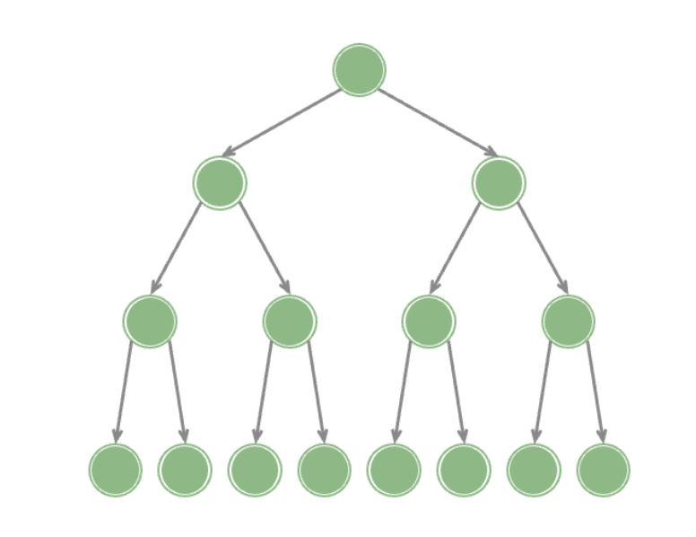

##### 完全二叉树

只有最底层的节点未被填满，且最底层节点尽量靠左填充

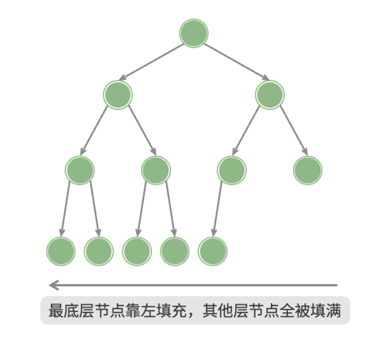

##### 完满二叉树

除了叶节点之外，其余所有节点都有两个子节点

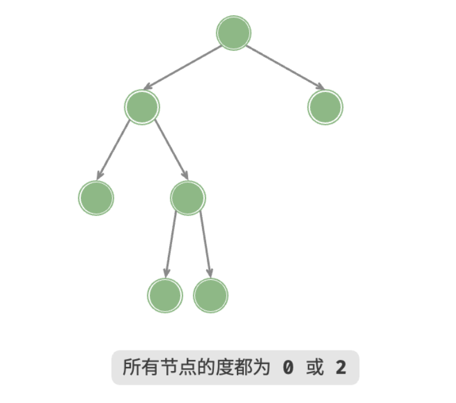

##### 平衡二叉树

任意节点的左子树和右子树的高度之差的绝对值不超过 1 

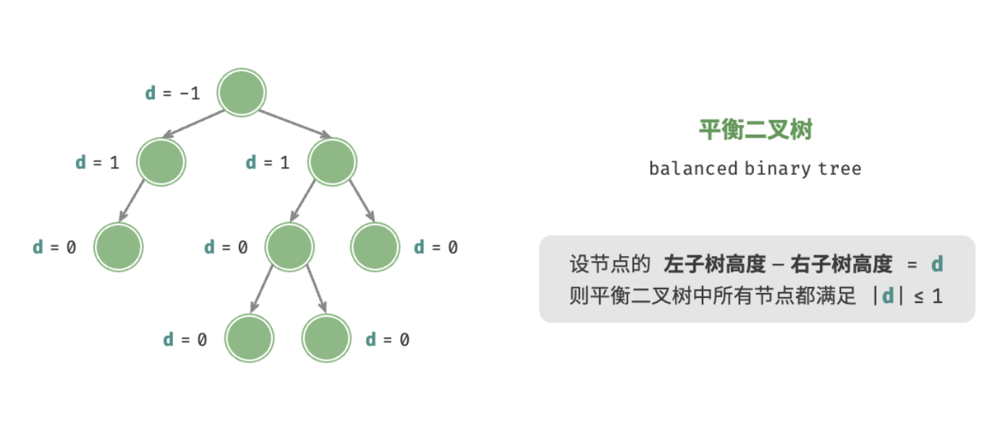

#### 二叉树的特性

- 在第 `i` 层最多有 `2i-1` 个节点。
- 深度为 `k` 的二叉树最多有` 2k-1` 个节点。
- 对于任何一个二叉树，叶子节点数为 n0，度为 2 的节点数为 n2，则 `n0 = n2+1`。

#### 二叉树的存储

- 通过数组存储
- 通过链表存储

##### 链表存储

Golang 示例：

```go
// 二叉树
type TreeNode struct {
    Val int
    Left *TreeNode
    Right *TreeNode
}

// 初始化节点
func NewTreeNode(data int) *TreeNode {
    return &TreeNode{
        Val: data,
        Left: nil,
        Right: nil,
    }
}
```

#### 二叉树的遍历

二叉树的遍历指的是从根节点出发，按照某种次序依次访问二叉树中的所有节点，使得每个节点被访问一次且仅被访问一次。

- 前序遍历：从根节点开始，先遍历左子树，再遍历右子树
- 中序遍历：中序遍历会从左子树最左侧的节点开始，然后从左到右依次遍历左子树，根节点，最后是右子树
- 后序遍历：后序遍历也是从左子树最左侧的节点开始，不过会从左到右先遍历完叶子节点，再遍历父节点，遍历完左子树后，直接从右子树最左侧节点开始，按照和左子树同样的顺序遍历完右子树，最后访问根节点
- 层次遍历：从根节点开始按层次遍历

示例：

```
二叉树：
		 1
 	   /   \
 	 2	    3
    /  \      \
   4    5      6
       / \
      7   8

遍历结果：
 - 前序遍历：1 2 4 5 7 8 3 6
 - 中序遍历：4 2 7 5 8 1 6 3
 - 后序遍历：4 7 8 5 2 6 3 1
 - 层次遍历：1 2 3 4 5 6 7 8
```

代码示例：

```go
package main

import (
    "fmt"
)

// 二叉树
type TreeNode struct {
    Val int
    Left *TreeNode
    Right *TreeNode
}

// 初始化节点
func NewTreeNode(data int) *TreeNode {
    return &TreeNode{
        Val: data,
        Left: nil,
        Right: nil,
    }
}

// 前序遍历
func PreOrderTraverseTreeNode(treeNode *TreeNode) {
	// 节点为空则退出当前递归
	if treeNode == nil {
		return
	}

	// 先打印当前节点值
	fmt.Printf("%v ", treeNode.Val)

	// 然后依次对左子树和右子树做前序遍历
	PreOrderTraverseTreeNode(treeNode.Left)
	PreOrderTraverseTreeNode(treeNode.Right)
}

// 中序遍历
func MidOrderTraverseTreeNode(treeNode *TreeNode) {
	// 节点为空则退出当前递归
	if treeNode == nil {
		return
	}

	// 先从左子树最左侧节点开始遍历
	MidOrderTraverseTreeNode(treeNode.Left)
	// 打印位于中间的根节点
	fmt.Printf("%v ", treeNode.Val)
	// 最后按照和左子树一样的逻辑遍历右子树
	MidOrderTraverseTreeNode(treeNode.Right)
}

// 后序遍历
func PostOrderTraverseTreeNode(treeNode *TreeNode) {
	// 节点为空则退出当前递归
	if treeNode == nil {
		return
	}

	// 先遍历左子树
	PostOrderTraverseTreeNode(treeNode.Left)
	// 再遍历右子树
	PostOrderTraverseTreeNode(treeNode.Right)
	// 最后访问根节点
	fmt.Printf("%v ", treeNode.Val)
}

// 层次遍历
func LevelOrderTraverseTreeNode(treeNode *TreeNode) {
    if nil == treeNode {
        return
    }
    
    tmp := []*TreeNode{treeNode}
    for i := 0; i < len(tmp); i++ {
        current := tmp[i]

		fmt.Printf("%v ", current.Val)

		if nil != current.Left {
            tmp = append(tmp, current.Left)
        }
        if nil != current.Right {
            tmp = append(tmp, current.Right)
        }
    }
}

func main() {
    node1 := NewTreeNode(1) // 根节点
	node2 := NewTreeNode(2)
	node3 := NewTreeNode(3)
	node4 := NewTreeNode(4)
	node5 := NewTreeNode(5)
	node6 := NewTreeNode(6)
	node7 := NewTreeNode(7)
	node8 := NewTreeNode(8)

    node1.Left = node2
	node1.Right = node3
	node2.Left = node4
	node2.Right = node5
	node3.Left = node6
	node4.Left = node7
	node4.Right = node8

	fmt.Print("前序遍历: ")
	PreOrderTraverseTreeNode(node1)
	fmt.Println()

	fmt.Print("中序遍历: ")
	MidOrderTraverseTreeNode(node1)
	fmt.Println()

	fmt.Print("后序遍历: ")
	PostOrderTraverseTreeNode(node1)
	fmt.Println()
    
	fmt.Print("层次遍历: ")
	LevelOrderTraverseTreeNode(node1)
	fmt.Println()
}
```

运行结果：

```
前序遍历: 1 2 4 7 8 5 3 6 
中序遍历: 7 4 8 2 5 1 6 3
后序遍历: 7 8 4 5 2 6 3 1
层次遍历: 1 2 3 4 5 6 7 8
```

#### 二叉搜索树

二叉搜索树需要满足以下条件：

1. 对于根节点，左子树中所有节点的值 < 根节点的值 < 右子树中所有节点的值。
2. 任意节点的左、右子树也是二叉搜索树，即同样满足条件 `1.` 。

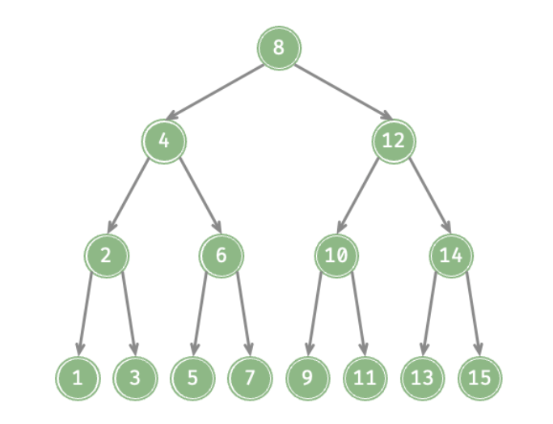

二叉树的中序遍历遵循“左 → 根 → 右”的遍历顺序，而二叉搜索树满足“左子节点 < 根节点 < 右子节点”的大小关系，

因此，可以得出结论：**中序遍历二叉搜索树得到的是升序序列**

#### 平衡二叉搜索树（AVL）

AVL 树既是二叉搜索树，也是平衡二叉树，同时满足这两类二叉树的所有性质。

## 堆

堆（heap）是一种满足特定条件的完全二叉树，主要可分为两种类型

- 小顶堆（min heap）：任意节点的值 ≤ 其子节点的值。
- 大顶堆（max heap）：任意节点的值 ≥ 其子节点的值。

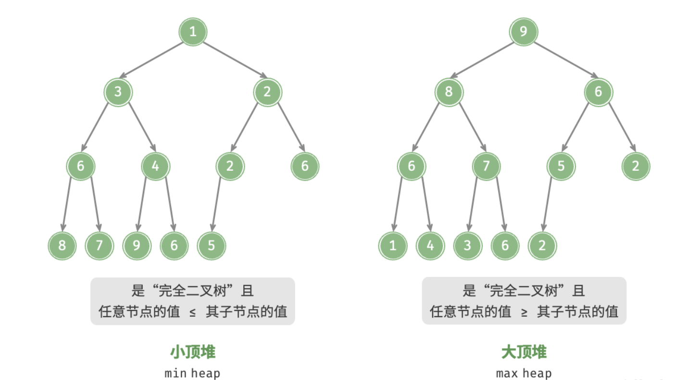

### 特性

- 最底层节点靠左填充，其他层的节点都被填满。
- 我们将二叉树的根节点称为“堆顶”，将底层最靠右的节点称为“堆底”。
- 对于大顶堆（小顶堆），堆顶元素（根节点）的值是最大（最小）的。

### 堆的实现

#### 堆的存储与表示

使用数组表示二叉树时，元素代表节点值，索引代表节点在二叉树中的位置。**节点指针通过索引映射公式来实现**。

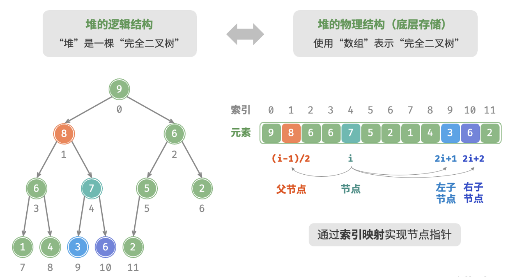

代码实现：

```go

```

#### 访问堆顶元素

```go

```

#### 元素入堆

```go

```

#### 堆顶元素出堆

```go

```

### 例题

- [数组中的第K个最大元素](https://leetcode.cn/problems/kth-largest-element-in-an-array/description/?envType=study-plan-v2&envId=top-100-liked)

## 图

图（graph）是一种非线性数据结构，由顶点（vertex）和边（edge）组成。

下图是一个包含 5 个顶点和 7 条边的图

```
V = {1,2,3,4,5}
E = {(1,2),(1,3),(1,5),(2,3),(2,4),(2,5),(4,5)}
G = {V,E}
```

如果将顶点看作节点，将边看作连接各个节点的引用（指针），我们就可以将图看作一种从链表拓展而来的数据结构

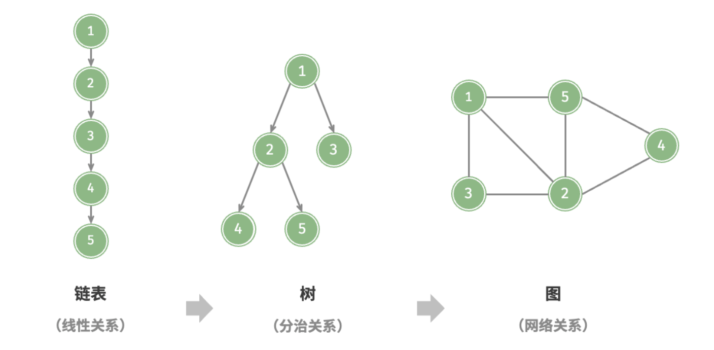

根据边是否具有方向，可分为无向图（undirected graph）和有向图（directed graph）

- 在无向图中，边表示两顶点之间的“双向”连接关系
- 在有向图中，边具有方向性，即 𝐴→𝐵 和 𝐴←𝐵 两个方向的边是相互独立的

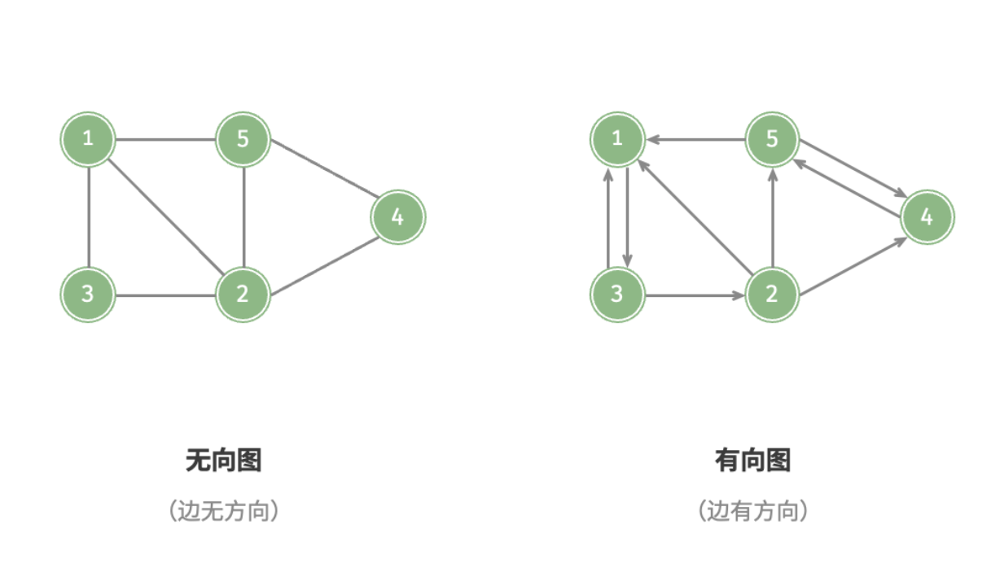

根据所有顶点是否连通，可分为连通图（connected graph）和非连通图（disconnected graph）

- 对于连通图，从某个顶点出发，可以到达其余任意顶点。
- 对于非连通图，从某个顶点出发，至少有一个顶点无法到达。

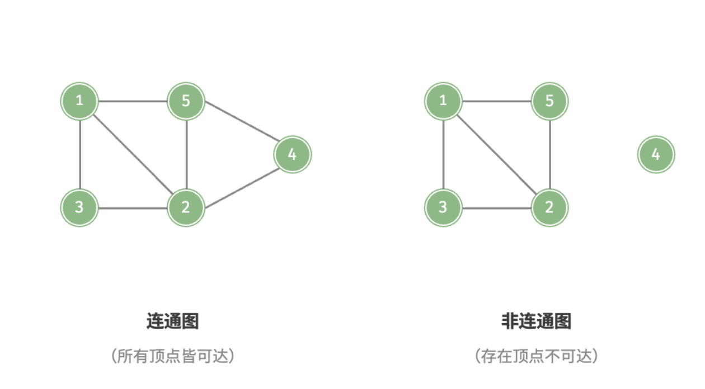

- 邻接（adjacency）：当两顶点之间存在边相连时，称这两顶点“邻接”。
- 路径（path）：从顶点 A 到顶点 B 经过的边构成的序列被称为从 A 到 B 的“路径”。
- 度（degree）：一个顶点拥有的边数。对于有向图，入度（in-degree）表示有多少条边指向该顶点，出度（out-degree）表示有多少条边从该顶点指出。

### 图的表示

图的常用表示方式包括“邻接矩阵”和“邻接表”

#### 邻接矩阵

设图的顶点数量为 𝑛 ，邻接矩阵（adjacency matrix）使用一个 𝑛×𝑛 大小的矩阵来表示图，每一行（列）代表一个顶点，矩阵元素代表边，用 1 或 0 表示两个顶点之间是否存在边。

如图，设邻接矩阵为 𝑀、顶点列表为 𝑉 ，那么矩阵元素 𝑀[𝑖,𝑗]=1 表示顶点 𝑉[𝑖] 到顶点 𝑉[𝑗] 之间存在边，反之 𝑀[𝑖,𝑗]=0 表示两顶点之间无边。

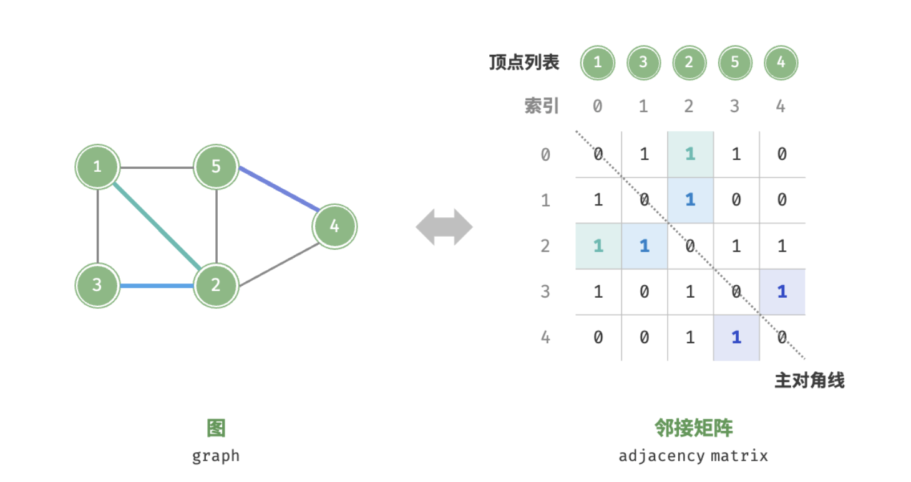

- 顶点不能与自身相连，因此邻接矩阵主对角线元素没有意义。
- 对于无向图，两个方向的边等价，此时邻接矩阵关于主对角线对称。
- 将邻接矩阵的元素从 1 和 0 替换为权重，则可表示有权图。

#### 邻接表

邻接表（adjacency list）使用 𝑛 个链表来表示图，链表节点表示顶点。第 𝑖 个链表对应顶点 𝑖 ，其中存储了该顶点的所有邻接顶点（与该顶点相连的顶点）

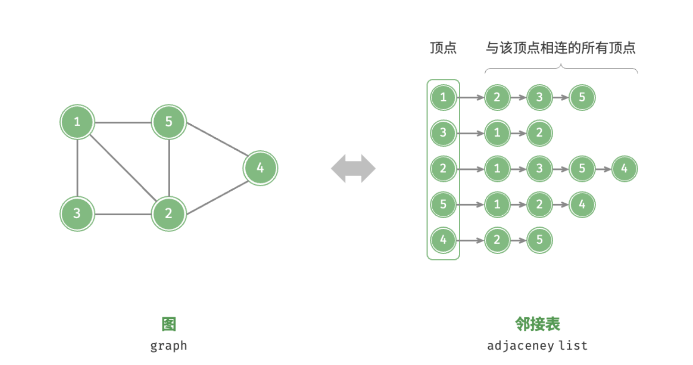

### 基础操作

图的基础操作可分为对“边”的操作和对“顶点”的操作

#### 基于邻接矩阵的实现

- **添加或删除边**：直接在邻接矩阵中修改指定的边即可，使用 𝑂(1) 时间。而由于是无向图，因此需要同时更新两个方向的边。
- **添加顶点**：在邻接矩阵的尾部添加一行一列，并全部填 0 即可，使用 𝑂(𝑛) 时间。
- **删除顶点**：在邻接矩阵中删除一行一列。当删除首行首列时达到最差情况，需要将 (𝑛−1)2 个元素“向左上移动”，从而使用 𝑂(𝑛2) 时间。
- **初始化**：传入 𝑛 个顶点，初始化长度为 𝑛 的顶点列表 `vertices` ，使用 𝑂(𝑛) 时间；初始化 𝑛×𝑛 大小的邻接矩阵 `adjMat` ，使用 𝑂(𝑛2) 时间。


#### 基于邻接表的实现

- **添加边**：在顶点对应链表的末尾添加边即可，使用 𝑂(1) 时间。因为是无向图，所以需要同时添加两个方向的边。
- **删除边**：在顶点对应链表中查找并删除指定边，使用 𝑂(𝑚) 时间。在无向图中，需要同时删除两个方向的边。
- **添加顶点**：在邻接表中添加一个链表，并将新增顶点作为链表头节点，使用 𝑂(1) 时间。
- **删除顶点**：需遍历整个邻接表，删除包含指定顶点的所有边，使用 𝑂(𝑛+𝑚) 时间。
- **初始化**：在邻接表中创建 𝑛 个顶点和 2𝑚 条边，使用 𝑂(𝑛+𝑚) 时间。


### 图的遍历

图的遍历方式分为两种：广度优先遍历和深度优先遍历

#### 广度优先遍历（BFS）


#### 深度优先遍历（DFS）


## 排序算法

#### 冒泡排序

**原理**

两两相邻的数进行比较，如果反序就交换，否则不交换

**复杂度**

- 时间复杂度：O(n^2)
- 空间复杂度：O(1)

**代码实现**

Go：

```go
// 冒泡排序
func bubbleSort(arr []int) []int {
	count := len(arr)
	if 1 >= count {
		return arr
	}
	for i := 0; i < count; i++ {
		for j := 0; j < count-1; j++ {
			// 从小到大
			if arr[j] > arr[j+1] {
				arr[j], arr[j+1] = arr[j+1], arr[j]
			}
			// 从大到小
			// if arr[j] < arr[j+1] {
			// 	arr[j], arr[j+1] = arr[j+1], arr[j]
			// }
		}
	}
	return arr
}
```

PHP：

```php
<?php
/**
  * 快速排序.
  * @param  array $arr 待排序数组
  * @return array
  */
function bubblesort($arr) {
	$len = count($arr);
	//从小到大
	for($i = 1; $i < $len; $i++){
		for ($j = $len-1; $j >= $i; $j--) {
			if ($arr[$j] < $arr[$j-1]) {//如果是从大到小的话，只要在这里的判断改成if($b[$j]>$b[$j-1])就可以了
				 $tmp = $arr[$j];
				 $arr[$j] = $arr[$j-1];
				 $arr[$j-1] = $tmp;
			}
		}
	}
	return $arr;
}
```

#### 快速排序

**原理**

选择一个基准元素，通常选择第一个元素或者最后一个元素。通过一趟扫描，将待排序列分成两部分，一部分比基准元素小，一部分大于等于基准元素。此时基准元素在其排好序后的正确位置，然后再用同样的方法递归地排序划分的两部分。

**复杂度**

- 时间复杂度：O(nlog2n)，最差：O(n^2)
- 空间复杂度：O(n)，最差：O(log2n)

**代码实现**

Go：

```go
// 快速排序
func quickSort(arr []int, left int, right int) {
	if left > right {
		return
	}
	temp := arr[left]
	i := left
	j := right
	for i != j {
		// 哨兵 j 向左移动，查找小于基准数 temp 时停下
		for arr[j] >= temp && i < j {
			j--
		}
		// 哨兵 i 向右移动，查找大于基准数 temp 时停下
		for arr[i] <= temp && i < j {
			i++
		}
		// 交换 i、j 位置
		if i < j {
			arr[i], arr[j] = arr[j], arr[i]
		}
	}
	// 将基准数归位
	arr[left], arr[i] = arr[i], arr[left]
	quickSort(arr, left, i-1)
	quickSort(arr, j+1, right)
}
```

PHP：

```php
<?php
/**
  * 快速排序
  *
  * @param  array $value 待排序数组
  * @param  array $left  左边界
  * @param  array $right 右边界
  * @return array
  */
function quickSort(&$value, $left, $right) {
	// 左右重合，跳出
	if ($left >= $right) {
		return;
	}
	$base = $left;
	do {
		// 最右边开始找第一个小于基准点的值，然后互换位置
		for ($i = $right; $i > $base; --$i) {
			if ($value[$base] > $value[$i]) {
				$tmp = $value[$i];
				$value[$i] = $value[$base];
				$value[$base] = $tmp;
				$base = $i;
				break;
			}
		}
		
		// 最左边开始找第一个大于基准点的值，互换位置
		for ($j = $left; $j < $base; ++$j) {
			if ($value[$base] < $value[$j]) {
				$tmp = $value[$j];
				$value[$j] = $value[$base];
				$value[$base] = $tmp;
				$base = $j;
				break;
			}
		}
	} while ($i > $j);// 直到索引重合
	// 开始递归
	// 以当前索引为分界
	// 开始排序左部分
	quicksort($value, $left, $i - 1);
	quicksort($value, $i + 1, $right);
}

// $value = [1,4,2,7,6,4,2];
// quickSort($value,0,count($value) - 1);
// print_r($value);
```

#### 选择排序

**原理**

每次从待排序的数据元素中选出最小（或最大）的一个元素，存放在序列起始位置，直到全部排序的数据元素排完

**复杂度**

- 时间复杂度：O(n^2)
- 空间复杂度：O(1)

**代码实现**

Go：

```go
// 选择排序
func selectSort(arr []int) []int {
	length := len(arr)
	for i := 0; i < length-1; i++ {
		min := i
		for j := i + 1; j < length; j++ {
			if arr[min] > arr[j] {
				min = j
			}
		}
		arr[i], arr[min] = arr[min], arr[i]
	}
	return arr
}
```

PHP：

```php
<?php
/**
  * 选择排序
  *
  * @param  array $arr 待排序数组
  * @return array
  */
function selectSort($arr) {
	$len = count($arr);
	for ($i = 0; $i < $len - 1; $i++) {
		//假设最小值为$i
		$min = $i;
		for ($j = $i + 1; $j < $len; $j++) { 
			//发现更小的,记录下最小值的位置；并且在下次比较时采用已知的最小值进行比较
			if ($arr[$min] > $arr[$j]) {
				$min = $j;
			}
		}
		//已经确定了当前的最小值的位置，如果发现最小值的位置与当前假设的位置$i不同，则位置互换即可
		if ($min != $i) {
			$tmp = $arr[$min];
       $arr[$min] = $arr[$i];
       $arr[$i] = $tmp;
		}
	}
	return $arr;
}
// $list = array(10,3,5,7,18,11,45,64,74,23,21,6);
// $list = selectSort($list);
// print_r($list);
```

#### 插入排序

**原理**

每次从无序表中取出第一个元素，把他到有序表合适的位置，使有序表依然有序


**复杂度**

时间复杂度：O(n^2)

空间复杂度：O(1)

**代码实现**

```php
/**
  * 插入排序
  *
  * @param  array $arr 待排序数组
  * @return array
  */
function insertSort($arr) {
	$len = count($arr);
	for ($i = 1; $i < $len; $i++) {
		$tmp = $arr[$i];
		for ($j = $i - 1; $j >= 0; $j--) {
			//发现插入的元素要小，交换位置，将后边的元素与前面的元素互换
			if ($tmp < $arr[$j]) {
				$arr[$j+1] = $arr[$j];
                $arr[$j] = $tmp;
			} else {
				//如果碰到不需要移动的元素，由于是已经排序好是数组，则前面的就不需要再次比较了。
                break;
			}
		}
	}
	return $arr;
}
// $list = array(10,3,5,7,18,11,45,64,74,23,21,6);
// $list = insertSort($list);
// print_r($list);
```

#### 希尔排序

**原理**

把待排序的数据根据增量分成几个子序列，对子序列进行插入排序，直到增量为1，直接进行插入排序；增量的排序，一般是数组的长度的一半，再变为原来增量的一半，直到增量为1

**示例**

对`49，38，65，97，76，13，27，49，55，04 `十个数字排序

增量分别为：`ceil(10 / 2) = 5`，`ceil(5 / 2) = 3`，`ceil(3 / 2) = 2`，`ceil(2 / 1) = 1`

```
初始：      49，38，65，97，76，13，27，49，55，04
第一趟：    13，27，49，55，04，49，38，65，97，76
第二趟：    13，04，49，38，27，49，55，65，97，76
第三趟：    13，04，27，38，49，49，55，65，97，76
第四趟：    13，04，27，38，49，49，55，65，76，97
```


**复杂度**

- 时间复杂度：O(nlog2n)，最差：O(n^2)
- 空间复杂度：O(1)

**代码实现**

```php
<?php
/**
  * 希尔排序(对直接插入排序的改进)
  * @param  array $arr 待排序数组
  * @return array
  */
function shellSort(&$arr) {
    $count = count($arr);
    //增量
    $inc = $count;
    do {
        //计算增量
        $inc = ceil($inc / 2);
        for ($i = $inc; $i < $count; $i++) {
        	//设置哨兵
            $temp = $arr[$i];
            //需将$temp插入有序增量子表
            for ($j = $i - $inc; $j >= 0 && $arr[$j + $inc] < $arr[$j]; $j -= $inc) {
                $arr[$j + $inc] = $arr[$j]; //记录后移
            }
            //插入
            $arr[$j + $inc] = $temp;
        }
        //增量为1时停止循环
    } while ($inc > 1);
}
// $arr = array(49,38,65,97,76,13,27,49,55,04);
// shellSort($arr);
// print_r($arr);
```

#### 归并排序

**原理**

归并排序：又称合并排序

归并（Merge）排序法是将两个（或两个以上）有序表合并成一个新的有序表，

即把待排序序列分为若干个有序的子序列，再把有序的子序列合并为整体有序序列。

归并排序的一个缺点是它需要存储器有另一个大小等于数据项数目的数组。如果初始数组几乎占满整个存储器，那么归并排序将不能工作，但是如果有足够的空间，归并排序会是一个很好的选择。

**复杂度**

- 时间复杂度：O(nlog2n)
- 空间复杂度：O(n)

**代码实现**

Golang：

```go
func merge(left []int, right []int) []int {
	var result []int
	for len(left) != 0 && len(right) != 0 {
		if left[0] <= right[0] {
			result = append(result, left[0])
			left = left[1:]
		} else {
			result = append(result, right[0])
			right = right[1:]
		}
	}

	for len(left) != 0 {
		result = append(result, left[0])
		left = left[1:]
	}

	for len(right) != 0 {
		result = append(result, right[0])
		right = right[1:]
	}

	return result
}

// 归并排序
func mergeSort(arr []int) []int {
	length := len(arr)
	if length < 2 {
		return arr
	}

	middle := length / 2
	left := arr[0:middle]
	right := arr[middle:]

	return merge(mergeSort(left), mergeSort(right))
}
```

PHP：

```php
function mergeSort($arr)
{
    $len = count($arr);
    if ($len < 2) {
        return $arr;
    }
    $middle = floor($len / 2);
    $left = array_slice($arr, 0, $middle);
    $right = array_slice($arr, $middle);
    return merge(mergeSort($left), mergeSort($right));
}

function merge($left, $right)
{
    $result = [];

    while (count($left) > 0 && count($right) > 0) {
        if ($left[0] <= $right[0]) {
            $result[] = array_shift($left);
        } else {
            $result[] = array_shift($right);
        }
    }

    while (count($left))
        $result[] = array_shift($left);

    while (count($right))
        $result[] = array_shift($right);

    return $result;
}
```

#### 堆排序

- 时间复杂度：O(nlogn)
- 空间复杂度：O(1)

**代码实现**

```go
// 堆化
func maxHeapify(arr []int, i, heapSize int) {
	l := 2*i + 1
	r := 2*i + 2
	largest := i

	if l < heapSize && arr[l] > arr[largest] {
		largest = l
	}
	if r < heapSize && arr[r] > arr[largest] {
		largest = r
	}
	if largest != i {
		arr[i], arr[largest] = arr[largest], arr[i]
		maxHeapify(arr, largest, heapSize)
	}
}

// 堆排序
func heapSort(arr []int) {
	// 构建大顶堆
	for i := len(arr)/2 - 1; i >= 0; i-- {
		maxHeapify(arr, i, len(arr))
	}
	// 不断进行 将堆顶与堆低元素对换，然后重新堆化 操作
	for i := len(arr) - 1; i > 0; i-- {
		arr[0], arr[i] = arr[i], arr[0]
		maxHeapify(arr, 0, i)
	}
}
```

## 查找算法

#### 二分查找

**原理**

> 先和中间数对比，若和中间不等，且小于中间数，则在左边查找，反之在右侧查找

**复杂度**

- 时间复杂度：O(log2n)
- 空间复杂度：迭代：O(1)，递归：O(log2n)

**代码实现**

PHP：

```php
<?php
 /**
  * 二分查找
  * @param  array $data 查找数组
  * @param  string $search 匹配元素
  * @return string
  */
function binarySearch($data, $search){
    $low = 0;
    $high = count($data) - 1;
    while($low <= $high){
        $mid = floor(($low + $high) / 2);
        if($data[$mid] == $search){
            return $mid;
        }
        if($data[$mid] > $search){
            $high = $mid - 1;
        }
        if($data[$mid] < $search){
            $low = $mid + 1;
        }
    }
    return -1;
}
```

GO：

```go
// 二分查找 - 针对递增数组
func binarySearch(data []int, search int) int {
	low := 0
	high := len(data) - 1
	for low < high {
		mid := (high + low) / 2
		if data[mid] == search {
			return mid
		} else if data[mid] > search {
			high = mid - 1
		} else {
			low = height + 1
		}
	}
	return -1
}
```

#### 顺序查找

**原理**

> 按照顺序查找，暴力

**复杂度**

> 时间复杂度：O(n)
>
> 空间复杂度：O(1)

**代码实现**

```php
<?php
 /**
  * 顺序查找
  * @param  array $data 查找数组
  * @param  string $search 匹配元素
  * @return string
  */
function search($data, $search){
    $len = count($)
    for ($i = 0; $i < $len; $i++) {
        if ($search == $data[$i]) {
            return $i;
        }
    }
    return -1;
}
```

#### 深度优先搜索

二叉树的前、中、后序遍历

#### 广度优先搜索

二叉树的层次遍历

## 动态规划

动态规划是自底向上，递归树是自顶向下

动态规划算法的基本思想是：将待求解的问题分解成若干个相互联系的子问题，先求解子问题，然后从这些子问题的解得到原问题的解；对于重复出现的子问题，只在第一次遇到的时候对它进行求解，并把答案保存起来，让以后再次遇到时直接引用答案，不必重新求解。

#### 特性

动态规划问题的两大特性：

- 最优子结构：原问题的最优解是从子问题的最优解构建得来的
- 无后效性：给定一个确定的状态，它的未来发展只与当前状态有关，而与过去经历的所有状态无关（以爬楼梯问题为例，给定状态 𝑖 ，它会发展出状态 𝑖+1 和状态 𝑖+2 ，分别对应跳 1 步和跳 2 步。在做出这两种选择时，我们无须考虑状态 𝑖 之前的状态，它们对状态 𝑖 的未来没有影响）

#### 适用场景

如果一个问题包含重叠子问题、最优子结构，并满足无后效性，那么它通常适合用动态规划求解。

#### 解题思路

描述决策，定义状态，建立 𝑑𝑝 表，推导状态转移方程，确定边界条件等。

#### 例题

- [爬楼梯](https://leetcode.cn/problems/climbing-stairs/description/?envType=study-plan-v2&envId=top-100-liked)

## 回溯算法

是一种通过穷举来解决问题的方法，它的核心思想是从一个初始状态出发，暴力搜索所有可能的解决方案，当遇到正确的解则将其记录，直到找到解或者尝试了所有可能的选择都无法找到解为止。

#### 优缺点

回溯算法本质上是一种深度优先搜索算法，它尝试所有可能的解决方案直到找到满足条件的解。

这种方法的优点在于能够找到所有可能的解决方案，而且在合理的剪枝操作下，具有很高的效率。

缺点是在处理大规模或者复杂问题时，回溯算法的运行效率问题：

- **时间**：回溯算法通常需要遍历状态空间的所有可能，时间复杂度可以达到指数阶或阶乘阶。
- **空间**：在递归调用中需要保存当前的状态（例如路径、用于剪枝的辅助变量等），当深度很大时，空间需求可能会变得很大。

#### 解题思路

```go
/* 回溯算法模板 */
func backtrack(state *State, choices []Choice, res *[]State) {
    // 判断是否为解
    if isSolution(state) {
        // 记录解
        recordSolution(state, res)
        // 不再继续搜索
        return
    }
    // 遍历所有选择
    for _, choice := range choices {
        // 剪枝：判断选择是否合法
        if isValid(state, choice) {
            // 尝试：做出选择，更新状态
            makeChoice(state, choice)
            backtrack(state, choices, res)
            // 回退：撤销选择，恢复到之前的状态
            undoChoice(state, choice)
        }
    }
}
```

#### 例题

- [全排列](https://leetcode.cn/problems/permutations/description/?envType=study-plan-v2&envId=top-100-liked)
- [子集](https://leetcode.cn/problems/subsets/description/?envType=study-plan-v2&envId=top-100-liked)
- [组合总和](https://leetcode.cn/problems/combination-sum/description/?envType=study-plan-v2&envId=top-100-liked)
- [N皇后](https://leetcode.cn/problems/n-queens/description/)

## 贪心算法

是一种常见的解决优化问题的算法，其基本思想是在问题的每个决策阶段，都选择当前看起来最优的选择，即贪心地做出局部最优的决策，以期获得全局最优解。

**与动态规划的区别**

贪心算法和动态规划都常用于解决优化问题。它们之间存在一些相似之处，比如都依赖最优子结构性质，但工作原理不同。

- 动态规划会根据之前阶段的所有决策来考虑当前决策，并使用过去子问题的解来构建当前子问题的解。
- 贪心算法不会考虑过去的决策，而是一路向前地进行贪心选择，不断缩小问题范围，直至问题被解决。

#### 特性

贪心算法的两个性质：

- **贪心选择性质**：只有当局部最优选择始终可以导致全局最优解时，贪心算法才能保证得到最优解。
- **最优子结构**：原问题的最优解包含子问题的最优解。

#### 适用场景

贪心算法不一定能找到最优解，所以并不适用所有场景，如**零钱兑换**问题就更适合用动态规划来解决。

一般情况下，贪心算法的适用情况分以下两种。

1. **可以保证找到最优解**：贪心算法在这种情况下往往是最优选择，因为它往往比回溯、动态规划更高效。
2. **可以找到近似最优解**：贪心算法在这种情况下也是可用的。对于很多复杂问题来说，寻找全局最优解非常困难，能以较高效率找到次优解也是非常不错的。

#### 解题思路

贪心问题的解决流程大体可分为以下三步。

1. **问题分析**：梳理与理解问题特性，包括状态定义、优化目标和约束条件等。
2. **确定贪心策略**：确定如何在每一步中做出贪心选择。这个策略能够在每一步减小问题的规模，并最终解决整个问题。
3. **正确性证明**：通常需要证明问题具有贪心选择性质和最优子结构。这个步骤可能需要用到数学证明，例如归纳法或反证法等。

#### 例题

- [买卖股票的最佳时机](https://leetcode.cn/problems/best-time-to-buy-and-sell-stock/description/?envType=study-plan-v2&envId=top-100-liked)

## 分治算法

分治通常基于递归实现，包括“分”和“治”两个步骤。

1. **分（划分阶段）**：递归地将原问题分解为两个或多个子问题，直至到达最小子问题时终止。
2. **治（合并阶段）**：从已知解的最小子问题开始，从底至顶地将子问题的解进行合并，从而构建出原问题的解。

#### 适用场景

个问题是否适合使用分治解决，通常可以参考以下几个判断依据。

1. **问题可以分解**：原问题可以分解成规模更小、类似的子问题，以及能够以相同方式递归地进行划分。
2. **子问题是独立的**：子问题之间没有重叠，互不依赖，可以独立解决。
3. **子问题的解可以合并**：原问题的解通过合并子问题的解得来。

## 递归算法

**三要素**

1.  一个问题的解可以分解为几个子问题的解
2.  这个问题与分解之后的子问题，除了数据规模不同，求解思路完全一样
3.  存在递归终止条件

**利弊**

利就是递归代码的表达力很强，写起来非常简洁；而弊就是空间复杂度高、有堆栈溢出的风险、存在重复计算、过多的函数调用会耗时较多等问题 
