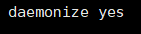
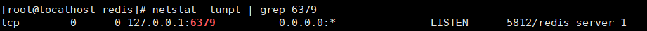

# Redis

Redis 是一种基于内存的数据库，对数据的读写操作都是在内存中完成，因此**读写速度非常快**，常用于**缓存，消息队列、分布式锁等场景**

- https://www.runoob.com/redis/redis-tutorial.html

## 安装配置

### centos 安装

#### 安装

1. 官网下载redis安装包（https://redis.io/）

2. 将安装包上传至服务器

3. 解压安装包

4. 进入解压文件（redis-5.0.4）

5. 使用Make 编译源文件

   ```shell
   make
   ```

6. 安装到指定目录

   ```shell
   make PREFIX=/usr/local/redis install
   ```

7. 在/usr/local/redis下生成bin目录，下面有五个目录，则安装成功

8. 将解压目录下的redis.conf配置文件复制到安转目录/usr/local/redis/下

9. 修改redis.conf，将daemonize no改为daemonize yes

   

#### 使用

##### 启动服务

redis-server redis.conf（带目录）

```shell
/usr/local/redis/bin/redis-server /usr/local/redis/redis.conf
```

##### 查看服务

```shell
netstat -tunpl | grep 6379
```



##### 打开

```shell
./bin/redis-cli			--带路径
```

### MacOS 安装

#### Brew 安装

```sh
$ brew install redis
```

#### 启动服务

```sh
# 启动服务
brew services start redis
# 关闭服务
brew services stop redis
# 重启服务
brew services restart redis

# 查看 redis 服务进程
ps axu | grep redis

# redis默认端口号6379，默认 auth 为空，输入以下命令即可连接
redis-cli -h 127.0.0.1 -p 6379
rsUgtuaDLmtP5sRf
```

#### 设置密码

方式一：设置临时密码

重启服务后密码会失效

```sh
$ config set requirepass 123456
```

方式二：设置永久密码

需要修改配置 `redis.conf`

```sh
# 查看 brew 安装 redis 的配置文件地址
$ brew list redis
/opt/homebrew/Cellar/redis/7.0.11/.bottle/etc/ (2 files)
/opt/homebrew/Cellar/redis/7.0.11/bin/redis-benchmark
/opt/homebrew/Cellar/redis/7.0.11/bin/redis-check-aof
/opt/homebrew/Cellar/redis/7.0.11/bin/redis-check-rdb
/opt/homebrew/Cellar/redis/7.0.11/bin/redis-cli
/opt/homebrew/Cellar/redis/7.0.11/bin/redis-sentinel
/opt/homebrew/Cellar/redis/7.0.11/bin/redis-server
/opt/homebrew/Cellar/redis/7.0.11/homebrew.mxcl.redis.plist
/opt/homebrew/Cellar/redis/7.0.11/homebrew.redis.service

# 进入目录
$ cd /opt/homebrew/Cellar/redis/7.0.11

# 查看 redis 配置文件位置
$ cat  homebrew.mxcl.redis.plist

<?xml version="1.0" encoding="UTF-8"?>
<!DOCTYPE plist PUBLIC "-//Apple//DTD PLIST 1.0//EN" "http://www.apple.com/DTDs/PropertyList-1.0.dtd">
<plist version="1.0">
...
	<array>
		<string>/opt/homebrew/opt/redis/bin/redis-server</string>
		<string>/opt/homebrew/etc/redis.conf</string>
	</array>
...
</plist>

# 编辑 /opt/homebrew/etc/redis.conf
$ vim /opt/homebrew/etc/redis.conf

# 查找 「#requirepass foobared」 进行修改
requirepass 123456

# 重启 redis 服务
$ brew services restart redis
```

查询密码：

```sh
# 查询密码
$ config get requirepass

# 验证密码
127.0.0.1:6379> auth 123456
```

## 常用指令

```sh
# 连接 redis
$ redis-cli -h 127.0.0.1 -p 6379

# 退出
> exit/quit

# 测试连通性
> ping

# 输入密码
> auth password

# 获取所有键
> keys *

# 获取键值
> get key

# 获取key剩余过期时间（秒），返回-1则未设置过期时间
> TTL key
```

## 数据类型

#### String 字符串

String 是最基本的 key-value 结构，key 是唯一标识，value 是具体的值，value其实不仅是字符串， 也可以是数字（整数或浮点数），value 最多可以容纳的数据长度是 `512M`。

常用于：缓存对象、常规计数、分布式锁、共享 session 信息等

| 命令   | 描述                              | 语法         |
| ------ | --------------------------------- | ------------ |
| set    | 设置键值                          | set age 20   |
| get    | 获取key对应键值                   | get age      |
| incr   | 对key值加加                       | incr age     |
| inrrby | 将 key 所储存的值加上给定的增量值 | incrby age 5 |

更多命令见：http://www.runoob.com/redis/redis-strings.html

#### Hash 哈希

Hash 是一个键值对（key - value）集合，其中 value 的形式如： `value=[{field1，value1}，...{fieldN，valueN}]`。Hash 特别适合用于存储对象。

常用于：缓存对象、购物车等

String + Json也是存储对象的一种方式，那么存储对象时，到底用 String + json 还是用 Hash 呢？

- 一般对象用 String + Json 存储，对象中某些频繁变化的属性可以考虑抽出来用 Hash 类型存储。

| 命令         | 描述                                                | 语法                             |
| ------------ | --------------------------------------------------- | -------------------------------- |
| hset         | 设置哈希                                            | hset key field value             |
| hmset        | 同时将多个 field-value (域-值)对设置到哈希表 key 中 | hmset key field1 value1 ...      |
| hsetnx       | 只有在字段 field 不存在时，设置哈希表字段的值       | hsetnx key field value           |
| hget         | 获取指定字段的值                                    | hget key field                   |
| hmget        | 获取所有给定字段的值                                | hmget key field1 value1 ...      |
| hgetall      | 获取在哈希表中指定 key 的所有字段和值               | hgetall key                      |
| hvals        | 获取哈希表中所有值                                  | hvals key                        |
| hdel         | 删除一个或多个哈希表字段                            | hdel key field1 ...              |
| hincrby      | 为哈希表 key 中的指定字段的整数值加上增量 increment | hincrby key field increment      |
| hincrbyfloat | 为哈希表中的字段值加上指定浮点数增量值              | hincrbyfloat key field increment |
| hexists      | 查看哈希表 key 中，指定的字段是否存在               | hexists key field                |
| hkeys        | 获取所有哈希表中的字段                              | hkeys keys                       |
| hlen         | 获取哈希表中字段的数量                              | hlen key                         |

更多命令：https://www.runoob.com/redis/redis-hashes.html

#### List 列表

List 列表是简单的字符串列表，按照插入顺序排序。你可以添加一个元素到列表的头部（左边）或者尾部（右边）;

列表的最大长度为 `2^32 - 1`，也即每个列表支持超过 `40 亿`个元素。

常用于：消息队列

| 命令   | 描述                         | 语法                  |
| ------ | ---------------------------- | --------------------- |
| lpush  | 将一个或多个值插入到列表头部 | lpush key value1 ...  |
| rpush  | 将一个或多个值插入到列表尾部 | rpush key value1 ...  |
| lrange | 获取列表指定范围内的元素     | lrange key start stop |

更多命令：http://www.runoob.com/redis/redis-lists.html

#### Set 集合

Set 是 String 类型的无序集合，集合成员是唯一的，这就意味着集合中不能出现重复的数据；

Set 是通过哈希表实现的，所以添加，删除，查找的复杂度都是 O(1)；

Set 类型除了支持集合内的增删改查，同时还支持多个集合取交集、并集、差集；

集合中最大的成员数为 `2^32 - 1` (4294967295, 每个集合可存储40多亿个成员)。

常用于：聚合计算（并集、交集、差集）场景，比如点赞、共同关注、抽奖活动等

Set 类型和 List 类型的区别如下：

- List 可以存储重复元素，Set 只能存储非重复元素；
- List 是按照元素的先后顺序存储元素的，而 Set 则是无序方式存储元素的。

| 命令     | 描述                     | 语法             |
| -------- | ------------------------ | ---------------- |
| sadd     | 向集合添加一个或多个成员 | sadd member1 ... |
| scard    | 获取集合的成员数         | scard key        |
| smembers | 返回集合中的所有成员     | smembers key     |

更多指令：http://www.runoob.com/redis/redis-sets.html

#### Zset 有序集合

Zset 有序集合和集合一样也是string类型元素的集合，且不允许重复的成员；

不同的是每个元素都会关联一个double类型的分数。redis正是通过分数来为集合中的成员进行从小到大的排序；

有序集合的成员是唯一的，但分数(score)却可以重复。

常用于：排序场景，比如排行榜、电话和姓名排序等

| 命令 | 描述                                                   | 语法                    |
| ---- | ------------------------------------------------------ | ----------------------- |
| zadd | 向有序集合添加一个或多个成员，或者更新已存在成员的分数 | zadd key score1 member1 |
|      |                                                        |                         |

#### 其他类型

Redis 后续版本又支持四种数据类型，它们的应用场景如下：

- BitMap（2.2 版新增）：二值状态统计的场景，比如签到、判断用户登陆状态、连续签到用户总数等；
- HyperLogLog（2.8 版新增）：海量数据基数统计的场景，比如百万级网页 UV 计数等；
- GEO（3.2 版新增）：存储地理位置信息的场景，比如滴滴叫车；
- Stream（5.0 版新增）：消息队列，相比于基于 List 类型实现的消息队列，有这两个特有的特性：自动生成全局唯一消息ID，支持以消费组形式消费数据。

## php-redis

#### Redis连接与认证

```php
//连接参数：ip、端口、连接超时时间，连接成功返回true，否则返回false
$ret = $redis->connect('127.0.0.1', 6379, 30);
//密码认证：成功返回true，否则返回false
$ret = $redis->auth('123456');
```

#### String操作

```php
//设置键值：成功返回true，否则返回false
$redis->set('mystr', 'Welcome!');
//获取键值：成功返回String类型键值，若key不存在或不是String类型则返回false
$ret = $redis->get('mystr');
//从某个key所存储的字符串的指定偏移量开始，替换为另一指定字符串，成功返回替换后新字符串的长度。
$ret = $redis->setRange('mystr', 7, ' to Beijing!');
//获取存储在指定key中字符串的子字符串。
$ret = $redis->getRange('mystr', 0, 6);
//设置新值，返回旧值：若key不存在则设置值，返回false
$ret = $redis->getSet('mystr', 'hi man');
//一次设置多个键值对：成功返回true。
$ret = $redis->mset(['name' => 'jet', 'age' => 18]);
//一次获取多个key的值：返回一个键值对数组，其中不存在的key值为false。
$ret = $redis->mget(['name', 'age']);
//设置指定key的值及其过期时间，单位：秒。
//参数：键名，过期时间，键值。成功返回true。
$ret = $redis->setex('name', 10, 'jetwu');
//以毫秒为单位设置指定key的值和过期时间。成功返回true。
$ret = $redis->psetex('name', 10, 'jetwu');
//key的值不存在时，才为其设置值。key不存在且设置成功返回true，否则返回false。
$ret = $redis->setnx('name', 'boby');
//setnx命令的批量操作。只有在给定所有key都不存在的时候才能设置成功，只要其中一个key存在，所有key都无法设置成功。
$ret = $redis->msetnx(['country' => 'China', 'city' => 'Shenzhen']);
//获取指定key存储的字符串的长度，key不存在返回0，不为字符串返回false。
$ret = $redis->strlen('name');
//将指定key存储的数字值增加1。若key不存在会先初始化为0再增加1，若key存储的不是整数值则返回false。成功返回key新值。
$ret = $redis->incr('age');
//给指定key存储的数字值增加指定增量值。
$ret = $redis->incrBy('age', 10);
//给指定key存储的数字值增加指定浮点数增量。
$ret = $redis->incrByFloat('age', 1.5);
//将指定key存储的数字值减一。
$ret = $redis->decr('age');
//将指定key存储的数字值减去指定减量值。
$ret = $redis->decrBy('age', 10);
//为指定key追加值到原值末尾，若key不存在则相对于set()函数。
$ret = $redis->append('mystr', 'haha');
```

#### Hash操作

```php
//为hash表中的字段赋值。成功返回1，失败返回0。若hash表不存在会先创建表再赋值，若字段已存在会覆盖旧值。
$ret = $redis->hSet('user', 'realname', 'jetwu');
//获取hash表中指定字段的值。若hash表不存在则返回false。
$ret = $redis->hGet('user', 'realname');
//查看hash表的某个字段是否存在，存在返回true，否则返回false。
$ret = $redis->hExists('user', 'realname');
//删除hash表的一个字段，不支持删除多个字段。成功返回1，否则返回0。
$ret = $redis->hDel('user', 'realname');
//同时设置某个hash表的多个字段值。成功返回true。
$ret = $redis->hMset('user', ['name' => 'jet', 'age' => 18]);
//同时获取某个hash表的多个字段值。其中不存在的字段值为false。
$ret = $redis->hMget('user', ['name', 'age']);
//获取某个hash表所有的字段和值。
$ret = $redis->hGetAll('user');
//获取某个hash表所有字段名。hash表不存在时返回空数组，key不为hash表时返回false。
$ret = $redis->hKeys('user');
//获取某个hash表所有字段值。
$ret = $redis->hVals('user');
//为hash表中不存在的字段赋值。若hash表不存在则先创建，若字段已存在则不做任何操作。设置成功返回true，否则返回false。
$ret = $redis->hSetNx('user', 'realname', 'jetwu');
//获取某个hash表的字段数量。若hash表不存在返回0，若key不为hash表则返回false。
$ret = $redis->hLen('user');
//为hash表中的指定字段加上指定增量值，若增量值为负数则相当于减法操作。若hash表不存在则先创建，若字段不存在则先初始化值为0再进行操作，若字段值为字符串则返回false。设置成功返回字段新值。
$ret = $redis->hIncrBy('user', 'age', 10);
//为hash表中的指定字段加上指定浮点数增量值。
$ret = $redis->hIncrBy('user', 'age', 1.5);
```

#### List操作

```php
//从list头部插入一个值。
$ret = $redis->lPush('city', 'guangzhou');
//从list尾部插入一个值。
$ret = $redis->rPush('city', 'guangzhou');
//获取列表指定区间中的元素。0表示列表第一个元素，-1表示最后一个元素，-2表示倒数第二个元素。
$ret = $redis->lrange('city', 0, -1);//查看队列所有元素
//将一个插入已存在的列表头部，列表不存在时操作无效。
$ret = $redis->lPushx('city', 'hangzhou');
//将一个或多个值插入已存在的列表尾部，列表不存在时操作无效。
$ret = $redis->rPushx('city', 'hangzhou');
//移除并返回列表的第一个元素，若key不存在或不是列表则返回false。
$ret = $redis->lPop('city');
//移除并返回列表的最后一个元素，若key不存在或不是列表则返回false。
$ret = $redis->rPop('city');
//移除并获取列表的第一个元素。如果列表没有元素则会阻塞列表直到等待超时或发现可弹出元素为止。
//参数：key，超时时间（单位：秒）
//返回值：[0=>key,1=>value]，超时返回[]
$ret = $redis->blPop('city', 10);
//移除并获取列表的最后一个元素。如果列表没有元素则会阻塞列表直到等待超时或发现可弹出元素为止。
//参数：key，超时时间（单位：秒）
//返回值：[0=>key,1=>value]，超时返回[]
$ret = $redis->brPop('city', 10);
//移除列表中最后一个元素，将其插入另一个列表头部，并返回这个元素。若源列表没有元素则返回false。
$ret = $redis->rpoplpush('city', 'city2');
//移除列表中最后一个元素，将其插入另一个列表头部，并返回这个元素。如果列表没有元素则会阻塞列表直到等待超时或发现可弹出元素为止。
//参数：源列表，目标列表，超时时间（单位：秒）
//超时返回false
$ret = $redis->brpoplpush('city', 'city2', 10);
//返回列表长度。
$ret = $redis->lLen('city');
//通过索引获取列表中的元素。若索引超出列表范围则返回false。
$ret = $redis->lindex('city', 0);
//通过索引设置列表中元素的值。若是索引超出范围，或对一个空列表进行lset操作，则返回false。
$ret = $redis->lSet('city', 2, 'changsha');
//在列表中指定元素前或后面插入元素。若指定元素不在列表中，或列表不存在时，不执行任何操作。
//参数：列表key，Redis::AFTER或Redis::BEFORE，基准元素，插入元素
//返回值：插入成功返回插入后列表元素个数，若基准元素不存在返回-1，若key不存在返回0，若key不是列表返回false。
$ret = $redis->lInsert('city', Redis::AFTER, 'changsha', 'nanjing');
//根据第三个参数count的值，移除列表中与参数value相等的元素。
//count > 0 : 从表头开始向表尾搜索，移除与value相等的元素，数量为count。
//count < 0 : 从表尾开始向表头搜索，移除与value相等的元素，数量为count的绝对值。
//count = 0 : 移除表中所有与value相等的值。
//返回实际删除元素个数
$ret = $redis->lrem('city', 'guangzhou', -2);
//对一个列表进行修剪，只保留指定区间的元素，其他元素都删除。成功返回true。
$ret = $redis->ltrim('city', 1, 4);
```

#### Set操作

```php
//将一个元素加入集合，已经存在集合中的元素则忽略。若集合不存在则先创建，若key不是集合类型则返回false，若元素已存在返回0，插入成功返回1。
$ret = $redis->sAdd('myset', 'hello');
//返回集合中所有成员。
$ret = $redis->sMembers('myset');
//判断指定元素是否是指定集合的成员，是返回true，否则返回false。
$ret = $redis->sismember('myset', 'hello');
//返回集合中元素的数量。
$ret = $redis->scard('myset');
//移除并返回集合中的一个随机元素。
$ret = $redis->sPop('myset');
//返回集合中的一个或多个随机成员元素，返回元素的数量和情况由函数的第二个参数count决定：
//如果count为正数，且小于集合基数，那么命令返回一个包含count个元素的数组，数组中的元素各不相同。
//如果count大于等于集合基数，那么返回整个集合。
//如果count为负数，那么命令返回一个数组，数组中的元素可能会重复出现多次，而数组的长度为count的绝对值。
$ret = $redis->sRandMember('myset', 2);
//移除集合中指定的一个元素，忽略不存在的元素。删除成功返回1，否则返回0。
$ret = $redis->srem('myset', 'hello');
//迭代集合中的元素。
//参数：key，迭代器变量，匹配模式，每次返回元素数量（默认为10个）
$ret = $redis->sscan('myset', $it, 'a*', 5);
//将指定成员从一个源集合移动到一个目的集合。若源集合不存在或不包含指定元素则不做任何操作，返回false。
//参数：源集合，目标集合，移动元素
$ret = $redis->sMove('myset', 'myset2', 'aaa');
//返回所有给定集合之间的差集，不存在的集合视为空集。
$ret = $redis->sDiff('myset', 'myset2', 'myset3');
//将所有给定集合之间的差集存储在指定的目的集合中。若目的集合已存在则覆盖它。返回差集元素个数。
//参数：第一个参数为目标集合，存储差集。
$ret = $redis->sDiffStore('myset3', 'myset', 'myset2');
//返回所有给定集合的交集，不存在的集合视为空集。
$ret = $redis->sInter('myset', 'myset2', 'myset3');
//将所有给定集合的交集存储在指定的目的集合中。若目的集合已存在则覆盖它。返回交集元素个数。
//参数：第一个参数为目标集合，存储交集。
$ret = $redis->sInterStore('myset4', 'myset', 'myset2', 'myset3');
//返回所有给定集合的并集，不存在的集合视为空集。
$ret = $redis->sUnion('myset', 'myset2', 'myset3');
//将所有给定集合的并集存储在指定的目的集合中。若目的集合已存在则覆盖它。返回并集元素个数。
//参数：第一个参数为目标集合，存储并集。
$ret = $redis->sUnionStore('myset4', 'myset', 'myset2', 'myset3');
```

#### Zset操作

```php
//将一个或多个成员元素及其分数值加入到有序集当中。如果某个成员已经是有序集的成员，则更新这个成员的分数值，并通过重新插入这个成员元素，来保证该成员在正确的位置上。分数值可以是整数值或双精度浮点数。
$ret = $redis->zAdd('scores', 98, 'English', 90, 'physics');
//返回有序集中指定区间内的成员。成员按分数值递增排序，分数值相同的则按字典序来排序。
//参数：第四个参数表示是否返回各个元素的分数值，默认为false。
$ret = $redis->zRange('scores', 0, -1, true);//查看Zset所有成员以及它们各自的分数值
//返回有序集中指定区间内的成员。成员按分数值递减排序，分数值相同的则按字典序的逆序来排序。
$ret = $redis->zReverseRange('scores', 0, -1, true);
//返回有序集中指定分数区间的成员列表，按分数值递增排序，分数值相同的则按字典序来排序。默认使用闭区间。
$ret = $redis->zRangeByScore('scores', 90, 100, ['withscores'=>true]);
//返回有序集中指定分数区间的成员列表，按分数值递减排序，分数值相同的则按字典序的逆序来排序。注意，区间表示的时候大值在前，小值在后，默认使用闭区间。
$ret = $redis->zRevRangeByScore('scores', 100, 90, ['withscores'=>true]);
//迭代有序集合中的元素。
//返回值：[元素名=>分数值,,..]
$ret = $redis->zscan('scores', $it, '', 10);
//返回指定有序集的元素数量。
$ret = $redis->zCard('scores');
//返回有序集中指定分数区间的成员数量。
$ret = $redis->zCount('scores', 90, 100);
//返回有序集中指定成员的分数值。若成员不存在则返回false。
$ret = $redis->zScore('scores', 'math');
//返回有序集中指定成员的排名，按分数值递增排序。分数值最小者排名为0。
$ret = $redis->zRank('scores', 'chemistry');
//返回有序集中指定成员的排名，按分数值递减排序。分数值最大者排名为0。
$ret = $redis->zRevRank('scores', 'chemistry');
//移除有序集中的一个或多个成员，忽略不存在的成员。返回删除的元素个数。
$ret = $redis->zRem('scores', 'chemistry', 'English');
//移除有序集中指定排名区间的所有成员。
$ret = $redis->zRemRangeByRank('scores', 0, 2);
//移除有序集中指定分数值区间的所有成员。
$ret = $redis->zRemRangeByScore('scores', 80, 90);
//对有序集中指定成员的分数值增加指定增量值。若为负数则做减法，若有序集不存在则先创建，若有序集中没有对应成员则先添加，最后再操作。
$ret = $redis->zIncrBy('scores', 2, 'Chinese');
//计算给定一个或多个有序集的交集，并将其存储到一个目的有序集中。结果集中某个成员的分数值是所有给定集下该成员分数值之和。
$ret = $redis->zinterstore('zset3', 'zset2', 'zset1');
//计算给定一个或多个有序集的并集，并将其存储到一个目的有序集中。结果集中某个成员的分数值是所有给定集下该成员分数值之和。
$ret = $redis->zunionstore('zset3', 'zset2', 'zset1');
```